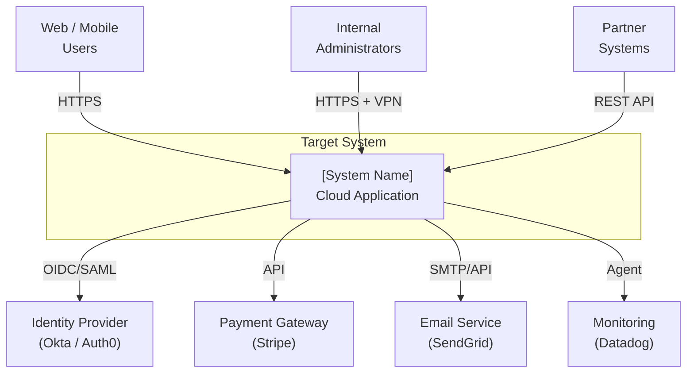
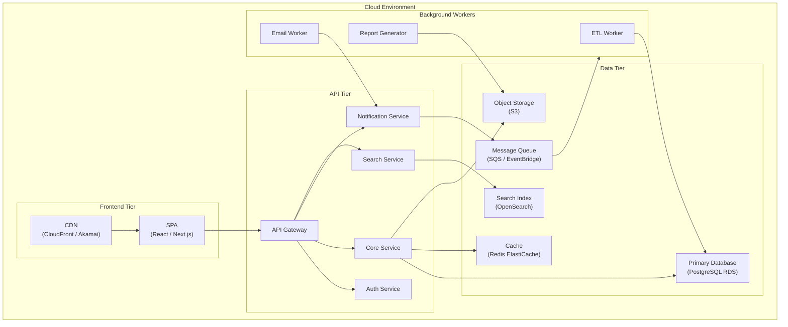
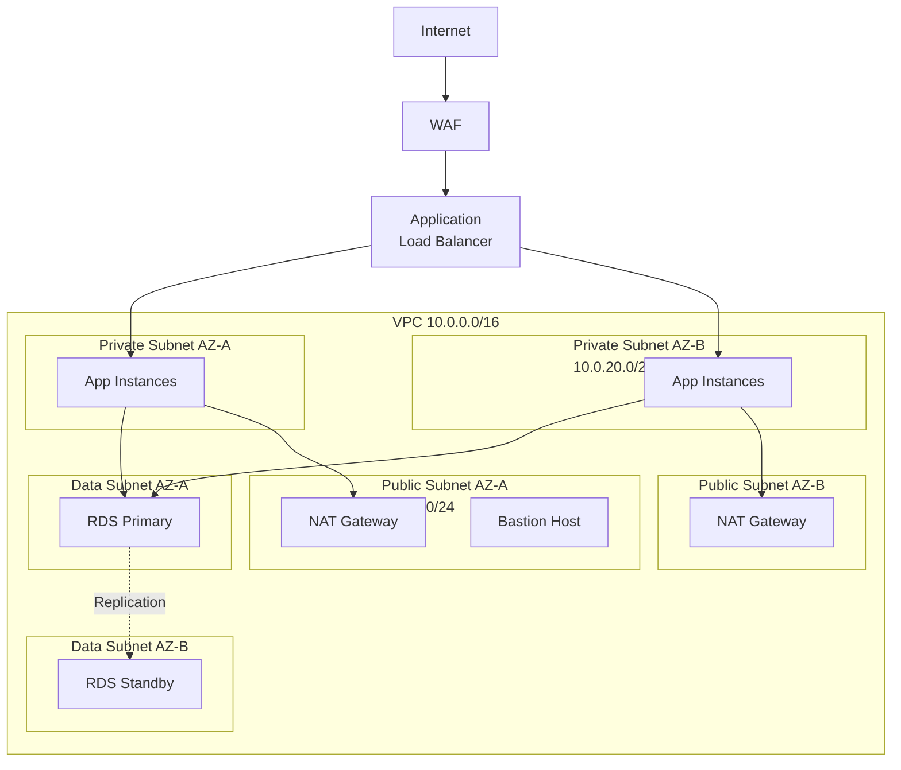
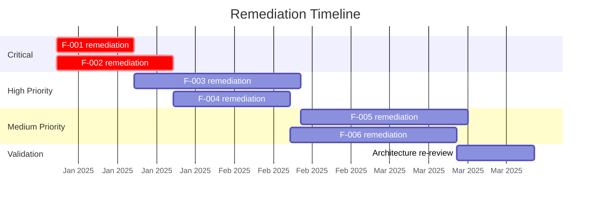

# Cloud Architecture Review

## Document Control

| Field                 | Value                               |
| --------------------- | ----------------------------------- |
| **Document ID**       | CAR-001                             |
| **Version**           | 1.0                                 |
| **Classification**    | Confidential                        |
| **Author**            | `[Author Name]`                     |
| **Reviewer**          | `[Architecture Reviewer]`           |
| **Approver**          | `[Approver Name]`                   |
| **Created**           | `YYYY-MM-DD`                        |
| **Last Updated**      | `YYYY-MM-DD`                        |
| **Cloud Provider(s)** | `[AWS / Azure / GCP / Multi-Cloud]` |
| **Status**            | Draft / In Review / Approved        |

---

## Executive Summary

This document provides a comprehensive architecture review of the `[System/Application Name]` cloud deployment. It evaluates the current architecture against the Well-Architected Framework pillars and provides actionable recommendations for improvement.

---

## System Context (C4 Level 1)

---

## Container Diagram (C4 Level 2)

---

## Well-Architected Framework Assessment

### Pillar Scores

| Pillar                 | Score (1-5) | Risk Level | Priority Findings |
| ---------------------- | ----------- | ---------- | ----------------- |
| Operational Excellence | `___` / 5   | `[H/M/L]`  | `[Summary]`       |
| Security               | `___` / 5   | `[H/M/L]`  | `[Summary]`       |
| Reliability            | `___` / 5   | `[H/M/L]`  | `[Summary]`       |
| Performance Efficiency | `___` / 5   | `[H/M/L]`  | `[Summary]`       |
| Cost Optimization      | `___` / 5   | `[H/M/L]`  | `[Summary]`       |
| Sustainability         | `___` / 5   | `[H/M/L]`  | `[Summary]`       |

---

### Pillar 1: Operational Excellence

| Check                     | Status                | Finding     | Recommendation     |
| ------------------------- | --------------------- | ----------- | ------------------ |
| Infrastructure as Code    | `[Pass/Fail/Partial]` | `[Finding]` | `[Recommendation]` |
| CI/CD pipeline            | `[Pass/Fail/Partial]` | `[Finding]` | `[Recommendation]` |
| Monitoring & alerting     | `[Pass/Fail/Partial]` | `[Finding]` | `[Recommendation]` |
| Runbooks documented       | `[Pass/Fail/Partial]` | `[Finding]` | `[Recommendation]` |
| Incident response process | `[Pass/Fail/Partial]` | `[Finding]` | `[Recommendation]` |
| Change management         | `[Pass/Fail/Partial]` | `[Finding]` | `[Recommendation]` |

### Pillar 2: Security

| Check                 | Status                | Finding     | Recommendation     |
| --------------------- | --------------------- | ----------- | ------------------ |
| Network segmentation  | `[Pass/Fail/Partial]` | `[Finding]` | `[Recommendation]` |
| Encryption at rest    | `[Pass/Fail/Partial]` | `[Finding]` | `[Recommendation]` |
| Encryption in transit | `[Pass/Fail/Partial]` | `[Finding]` | `[Recommendation]` |
| IAM least privilege   | `[Pass/Fail/Partial]` | `[Finding]` | `[Recommendation]` |
| Secret management     | `[Pass/Fail/Partial]` | `[Finding]` | `[Recommendation]` |
| WAF / DDoS protection | `[Pass/Fail/Partial]` | `[Finding]` | `[Recommendation]` |

### Pillar 3: Reliability

| Check                    | Status                | Finding     | Recommendation     |
| ------------------------ | --------------------- | ----------- | ------------------ |
| Multi-AZ deployment      | `[Pass/Fail/Partial]` | `[Finding]` | `[Recommendation]` |
| Auto-scaling configured  | `[Pass/Fail/Partial]` | `[Finding]` | `[Recommendation]` |
| Backup & recovery tested | `[Pass/Fail/Partial]` | `[Finding]` | `[Recommendation]` |
| Health checks            | `[Pass/Fail/Partial]` | `[Finding]` | `[Recommendation]` |
| Circuit breakers         | `[Pass/Fail/Partial]` | `[Finding]` | `[Recommendation]` |
| Chaos testing            | `[Pass/Fail/Partial]` | `[Finding]` | `[Recommendation]` |

### Pillar 4: Performance Efficiency

| Check                 | Status                | Finding     | Recommendation     |
| --------------------- | --------------------- | ----------- | ------------------ |
| Right-sized compute   | `[Pass/Fail/Partial]` | `[Finding]` | `[Recommendation]` |
| Caching strategy      | `[Pass/Fail/Partial]` | `[Finding]` | `[Recommendation]` |
| CDN utilization       | `[Pass/Fail/Partial]` | `[Finding]` | `[Recommendation]` |
| Database optimization | `[Pass/Fail/Partial]` | `[Finding]` | `[Recommendation]` |
| Async processing      | `[Pass/Fail/Partial]` | `[Finding]` | `[Recommendation]` |
| Load testing          | `[Pass/Fail/Partial]` | `[Finding]` | `[Recommendation]` |

### Pillar 5: Cost Optimization

| Check                   | Status                | Finding     | Recommendation     |
| ----------------------- | --------------------- | ----------- | ------------------ |
| Reserved/savings plans  | `[Pass/Fail/Partial]` | `[Finding]` | `[Recommendation]` |
| Idle resource detection | `[Pass/Fail/Partial]` | `[Finding]` | `[Recommendation]` |
| Cost allocation tags    | `[Pass/Fail/Partial]` | `[Finding]` | `[Recommendation]` |
| Right-sizing analysis   | `[Pass/Fail/Partial]` | `[Finding]` | `[Recommendation]` |
| Lifecycle policies      | `[Pass/Fail/Partial]` | `[Finding]` | `[Recommendation]` |
| Spot/preemptible usage  | `[Pass/Fail/Partial]` | `[Finding]` | `[Recommendation]` |

---

## Deployment Architecture

### Network Topology

---

## Resource Inventory

| Resource    | Service     | Size/Config       | Region     | Monthly Cost | Tag Compliance |
| ----------- | ----------- | ----------------- | ---------- | ------------ | -------------- |
| Web Servers | EC2 / ECS   | `[Instance type]` | `[Region]` | `$___`       | `[Yes/No]`     |
| Database    | RDS         | `[Instance type]` | `[Region]` | `$___`       | `[Yes/No]`     |
| Cache       | ElastiCache | `[Node type]`     | `[Region]` | `$___`       | `[Yes/No]`     |
| Storage     | S3          | `[GB]`            | `[Region]` | `$___`       | `[Yes/No]`     |
| CDN         | CloudFront  | `[TB/month]`      | Global     | `$___`       | `[Yes/No]`     |
| Queue       | SQS         | `[Messages/day]`  | `[Region]` | `$___`       | `[Yes/No]`     |
| Search      | OpenSearch  | `[Instance type]` | `[Region]` | `$___`       | `[Yes/No]`     |

---

## Findings & Recommendations

### Critical Findings

| ID    | Finding     | Pillar     | Risk     | Effort    | Recommendation     |
| ----- | ----------- | ---------- | -------- | --------- | ------------------ |
| F-001 | `[Finding]` | `[Pillar]` | Critical | `[H/M/L]` | `[Recommendation]` |
| F-002 | `[Finding]` | `[Pillar]` | Critical | `[H/M/L]` | `[Recommendation]` |

### High-Priority Findings

| ID    | Finding     | Pillar     | Risk | Effort    | Recommendation     |
| ----- | ----------- | ---------- | ---- | --------- | ------------------ |
| F-003 | `[Finding]` | `[Pillar]` | High | `[H/M/L]` | `[Recommendation]` |
| F-004 | `[Finding]` | `[Pillar]` | High | `[H/M/L]` | `[Recommendation]` |

### Medium-Priority Findings

| ID    | Finding     | Pillar     | Risk   | Effort    | Recommendation     |
| ----- | ----------- | ---------- | ------ | --------- | ------------------ |
| F-005 | `[Finding]` | `[Pillar]` | Medium | `[H/M/L]` | `[Recommendation]` |
| F-006 | `[Finding]` | `[Pillar]` | Medium | `[H/M/L]` | `[Recommendation]` |

---

## Remediation Roadmap

---

## Approval & Sign-Off

| Role                 | Name              | Signature         | Date         |
| -------------------- | ----------------- | ----------------- | ------------ |
| Cloud Architect      | `_______________` | `_______________` | `YYYY-MM-DD` |
| Security Architect   | `_______________` | `_______________` | `YYYY-MM-DD` |
| Engineering Lead     | `_______________` | `_______________` | `YYYY-MM-DD` |
| CTO / VP Engineering | `_______________` | `_______________` | `YYYY-MM-DD` |

---

## Revision History

| Version | Date         | Author     | Changes         |
| ------- | ------------ | ---------- | --------------- |
| 0.1     | `YYYY-MM-DD` | `[Author]` | Initial review  |
| 0.2     | `YYYY-MM-DD` | `[Author]` | Added findings  |
| 1.0     | `YYYY-MM-DD` | `[Author]` | Approved review |
