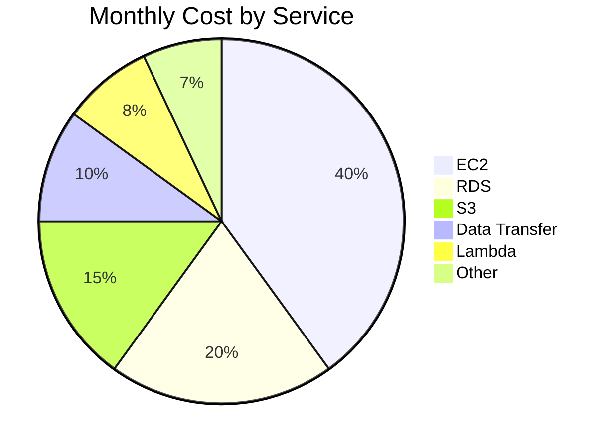
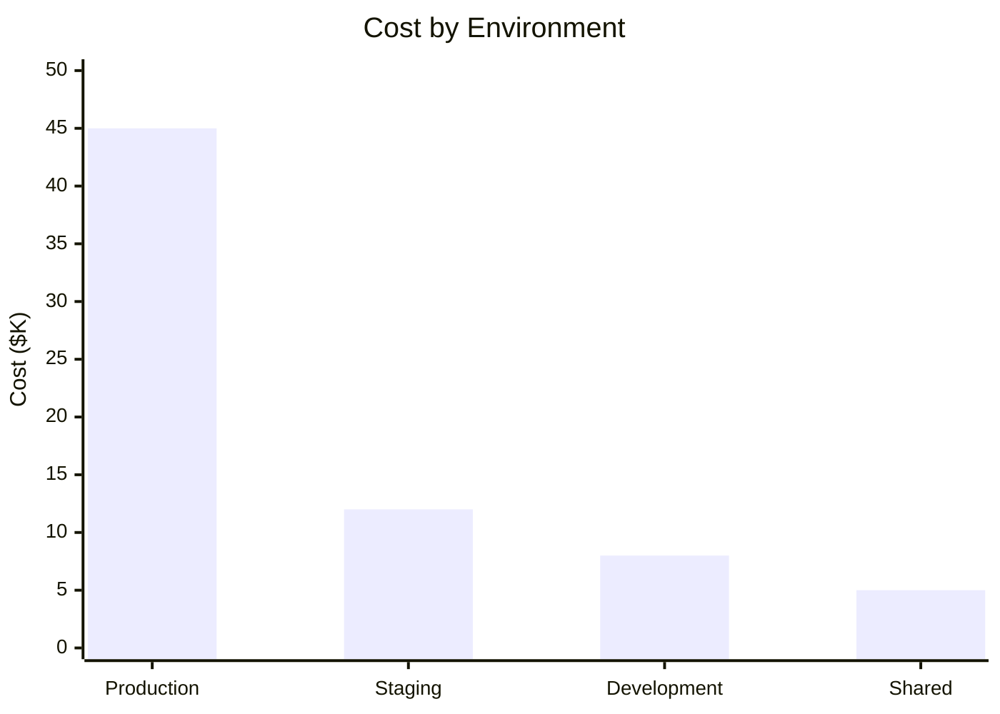
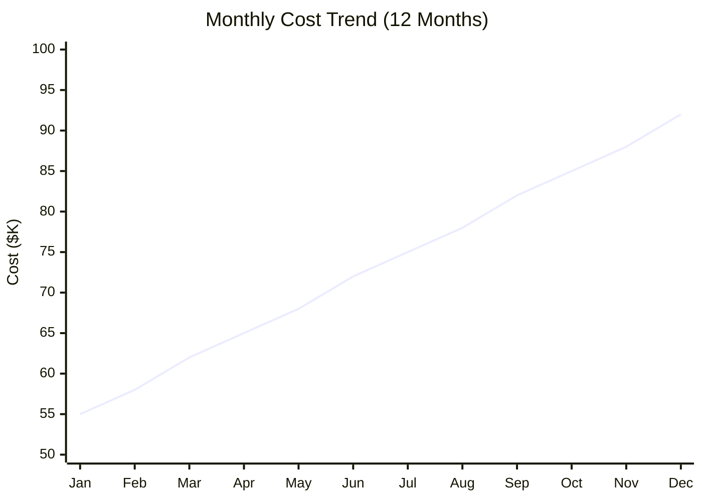

# Cloud Cost Analysis

<!-- Financial analysis and optimization of cloud spending -->

---

## Document Control

| Field              | Value             |
| ------------------ | ----------------- |
| **Analysis ID**    | COST-[YYYY]-[NNN] |
| **Version**        | [X.Y.Z]           |
| **Date**           | [YYYY-MM-DD]      |
| **Analyst**        | [Name, Role]      |
| **Reviewer**       | [Name, Role]      |
| **Cloud Provider** | AWS / Azure / GCP |
| **Billing Period** | [Start] to [End]  |
| **Status**         | Draft / Final     |

---

## Executive Summary

### Current State

| Metric               | Value | Change       |
| -------------------- | ----- | ------------ |
| **Monthly Spend**    | $[N]  | [+/- X%]     |
| **Daily Average**    | $[N]  | [+/- X%]     |
| **Projected Annual** | $[N]  | [+/- X%]     |
| **Budget Variance**  | [X%]  | [Over/Under] |

### Cost Distribution



### Key Findings

1. **Optimization Opportunity:** $[N]/month potential savings identified
2. **Anomaly:** [Description of unusual cost pattern]
3. **Trend:** [Description of spending trend]

---

## Cost Breakdown

### By Service

| Service       | Monthly Cost | % of Total | Trend |
| ------------- | ------------ | ---------- | ----- |
| EC2           | $[N]         | [X]%       | ↑/↓/→ |
| RDS           | $[N]         | [X]%       | ↑/↓/→ |
| S3            | $[N]         | [X]%       | ↑/↓/→ |
| ELB           | $[N]         | [X]%       | ↑/↓/→ |
| CloudWatch    | $[N]         | [X]%       | ↑/↓/→ |
| Data Transfer | $[N]         | [X]%       | ↑/↓/→ |
| **Total**     | **$[N]**     | **100%**   |       |

### By Environment



| Environment | Monthly Cost | % of Total |
| ----------- | ------------ | ---------- |
| Production  | $[N]         | [X]%       |
| Staging     | $[N]         | [X]%       |
| Development | $[N]         | [X]%       |
| Shared      | $[N]         | [X]%       |

### By Team

| Team        | Monthly Cost | % of Total |
| ----------- | ------------ | ---------- |
| Platform    | $[N]         | [X]%       |
| Engineering | $[N]         | [X]%       |
| Data        | $[N]         | [X]%       |
| Security    | $[N]         | [X]%       |

---

## Trend Analysis

### Monthly Trend



### Growth Rate

$$\text{Monthly Growth Rate} = \frac{\text{Current Month} - \text{Previous Month}}{\text{Previous Month}} \times 100$$

| Month     | Cost | Growth Rate |
| --------- | ---- | ----------- |
| [Month-2] | $[N] | [X]%        |
| [Month-1] | $[N] | [X]%        |
| [Current] | $[N] | [X]%        |

### Forecast

| Period       | Projected Cost | Confidence |
| ------------ | -------------- | ---------- |
| Next Month   | $[N]           | High       |
| Next Quarter | $[N]           | Medium     |
| Next Year    | $[N]           | Low        |

---

## Cost Optimization

### Identified Opportunities

| Opportunity        | Potential Savings | Effort | Priority |
| ------------------ | ----------------- | ------ | -------- |
| Reserved Instances | $[N]/mo           | Low    | P1       |
| Spot Instances     | $[N]/mo           | Medium | P2       |
| Storage Lifecycle  | $[N]/mo           | Low    | P1       |
| Right-sizing       | $[N]/mo           | Medium | P2       |
| Unused Resources   | $[N]/mo           | Low    | P1       |

### Reserved Instance Analysis

| Instance Type | On-Demand | Reserved (1yr) | Savings |
| ------------- | --------- | -------------- | ------- |
| m5.large      | $0.096/hr | $0.057/hr      | 40%     |
| c5.xlarge     | $0.17/hr  | $0.102/hr      | 40%     |
| r5.2xlarge    | $0.504/hr | $0.302/hr      | 40%     |

**Total RI Savings Potential:** $[N]/month

### Storage Optimization

| Bucket     | Current Class | Recommended         | Savings |
| ---------- | ------------- | ------------------- | ------- |
| [Bucket 1] | Standard      | Intelligent-Tiering | 30%     |
| [Bucket 2] | Standard      | Glacier (old data)  | 60%     |

---

## Anomaly Detection

### Cost Anomalies

| Date   | Service   | Expected | Actual | Variance |
| ------ | --------- | -------- | ------ | -------- |
| [Date] | [Service] | $[N]     | $[N]   | [X]%     |

### Root Cause Analysis

| Anomaly       | Cause        | Resolution     |
| ------------- | ------------ | -------------- |
| [Description] | [Root cause] | [Action taken] |

---

## Unit Economics

### Cost Per Transaction

$$\text{Cost Per Transaction} = \frac{\text{Total Infrastructure Cost}}{\text{Number of Transactions}}$$

| Metric             | Value | Target |
| ------------------ | ----- | ------ |
| Cost per API call  | $[N]  | $< [N] |
| Cost per user      | $[N]  | $< [N] |
| Cost per GB stored | $[N]  | $< [N] |

### Efficiency Metrics

| Metric              | Current | Industry Benchmark |
| ------------------- | ------- | ------------------ |
| CPU Utilization     | [X]%    | 60-80%             |
| Memory Utilization  | [X]%    | 70-85%             |
| Storage Utilization | [X]%    | 70-80%             |

---

## Budget Management

### Budget vs Actual

```mermaid
xychart-beta
    title "Budget vs Actual Spending"
    x-axis [Jan, Feb, Mar, Apr, May, Jun]
    y-axis "Cost ($K)" 0 --> 100
    bar [Budget] : [50, 52, 55, 58, 60, 62]
    bar [Actual] : [52, 55, 58, 62, 65, 68]
```

| Month   | Budget | Actual | Variance | Status   |
| ------- | ------ | ------ | -------- | -------- |
| [Month] | $[N]   | $[N]   | [X]%     | ✅/⚠️/❌ |

### Alerts

| Threshold      | Action         | Status |
| -------------- | -------------- | ------ |
| 80% of budget  | Warning email  | ⬜     |
| 100% of budget | Alert manager  | ⬜     |
| 120% of budget | Escalate to VP | ⬜     |

---

## Recommendations

### Immediate (This Month)

1. **Purchase Reserved Instances:** Save $[N]/month
2. **Delete unused resources:** Save $[N]/month
3. **Enable S3 lifecycle policies:** Save $[N]/month

### Short-term (Next Quarter)

1. **Implement auto-scaling:** Optimize compute costs
2. **Review data transfer:** Reduce egress charges
3. **Right-size instances:** Match capacity to demand

### Long-term (Next Year)

1. **Evaluate Savings Plans:** Alternative to RIs
2. **Consider Spot Instances:** For fault-tolerant workloads
3. **Multi-cloud strategy:** Compare pricing

---

## Appendices

### A. Detailed Cost Report

[Raw cost data export]

### B. Resource Inventory

[Complete resource list with costs]

### C. Tagging Strategy

| Tag         | Purpose         | Compliance |
| ----------- | --------------- | ---------- |
| Environment | Cost allocation | 95%        |
| Team        | Chargeback      | 90%        |
| Project     | Budget tracking | 85%        |

---

_Last updated: [Date]_

---

## See Also

- [Infrastructure Diagram](./infrastructure_diagram.md) — Architecture documentation
- [Capacity Plan](../engineering/capacity_plan.md) — Resource planning
- [Migration Plan](./migration_plan.md) — Cloud migration costs
