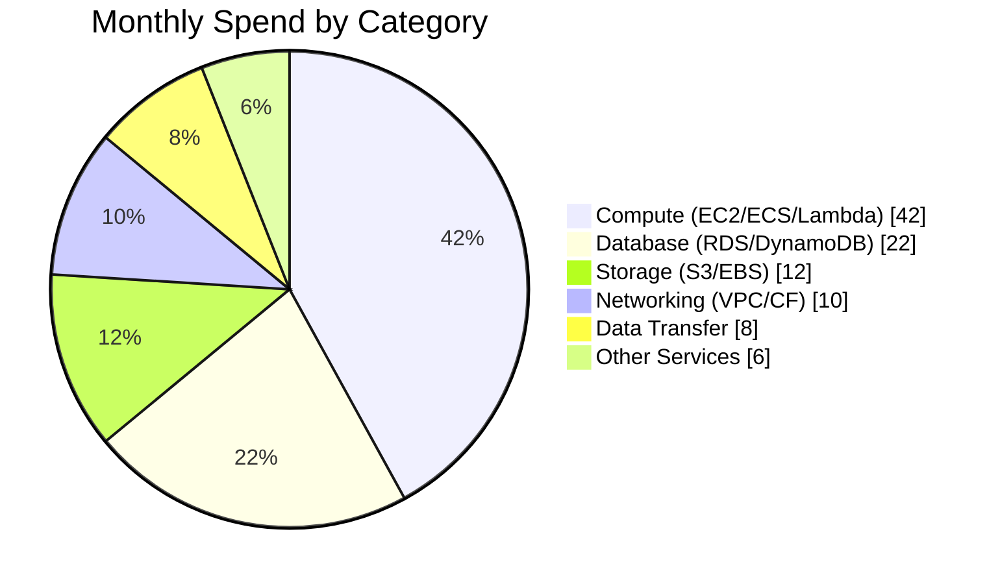
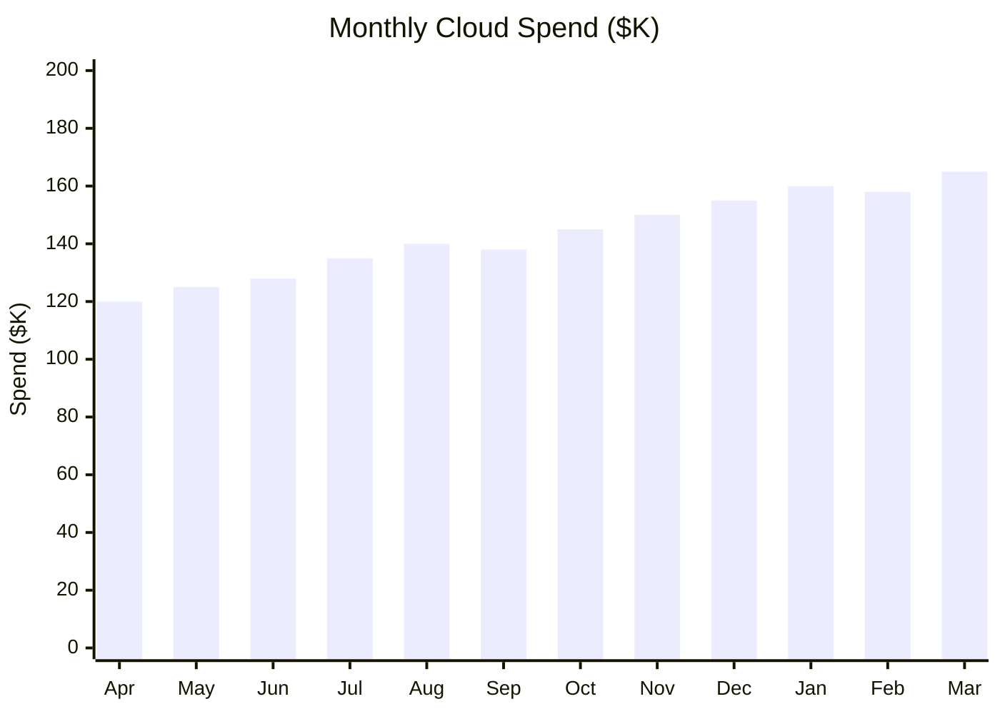
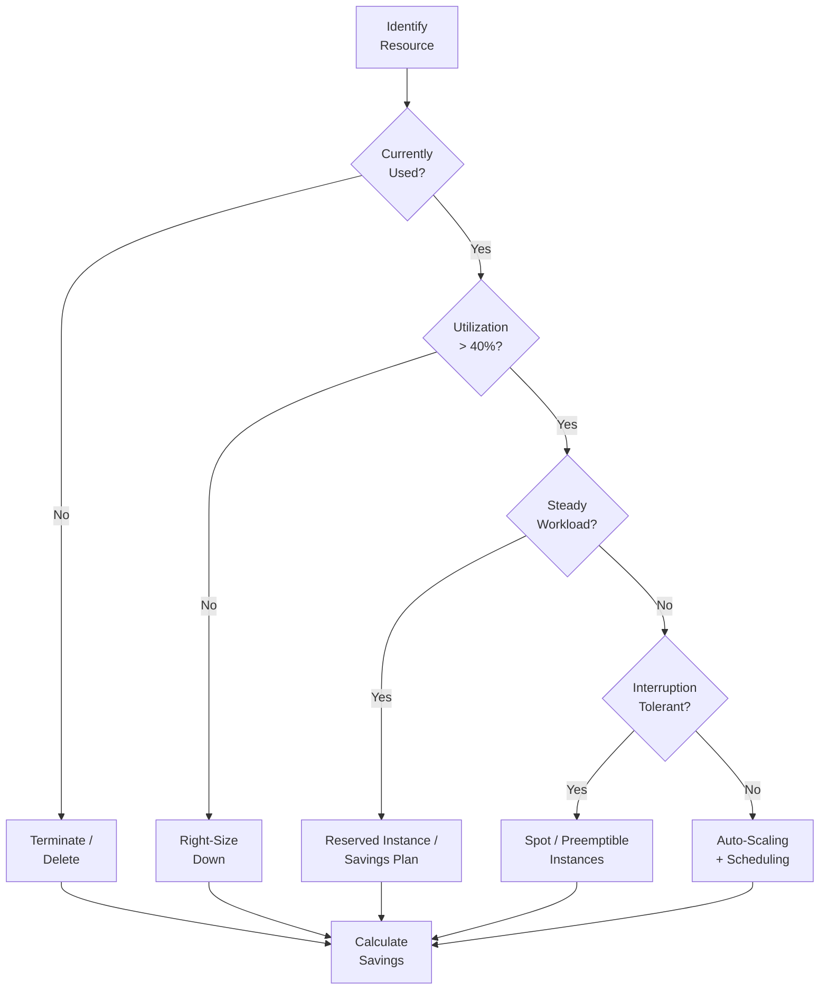
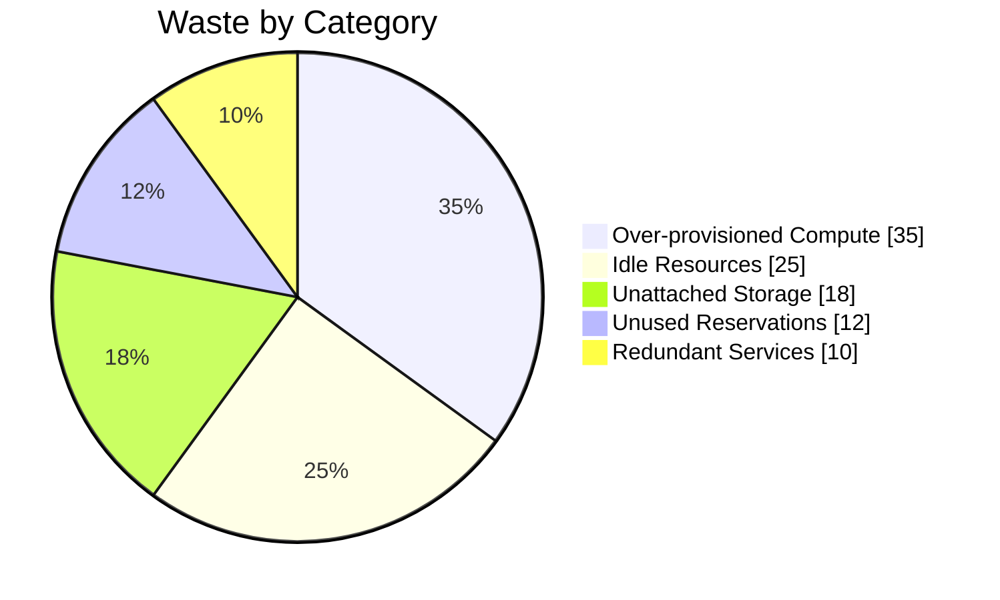
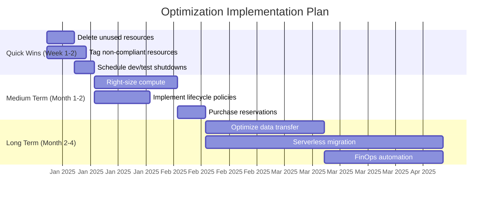

# Cost Optimization Analysis

## Document Control

| Field               | Value                        |
| ------------------- | ---------------------------- |
| **Document ID**     | COA-001                      |
| **Version**         | 1.0                          |
| **Classification**  | Internal                     |
| **Author**          | `[Author Name]`              |
| **Reviewer**        | `[FinOps Reviewer]`          |
| **Approver**        | `[Approver Name]`            |
| **Created**         | `YYYY-MM-DD`                 |
| **Last Updated**    | `YYYY-MM-DD`                 |
| **Analysis Period** | `YYYY-MM-DD` to `YYYY-MM-DD` |
| **Status**          | Draft / In Review / Approved |

---

## Executive Summary

This FinOps analysis evaluates cloud spending for `[Organization/Account Name]` over the reporting period. Total cloud spend was **$`___`** against a budget of **$`___`**, representing a **`___`%** variance. This report identifies **$`___`** in potential monthly savings through optimization recommendations.

### Spend Summary

| Metric                  | Value               |
| ----------------------- | ------------------- |
| **Total Monthly Spend** | $`___`              |
| **Budget**              | $`___`              |
| **Variance**            | `___`% (over/under) |
| **YoY Growth**          | `___`%              |
| **Cost per Customer**   | $`___`              |
| **Identified Savings**  | $`___`/month        |

---

## Cost Breakdown

### Spend by Service Category

### Spend by Environment

| Environment     | Monthly Cost | % of Total | Budget     | Variance   |
| --------------- | ------------ | ---------- | ---------- | ---------- |
| Production      | $`___`       | `___`%     | $`___`     | `___`%     |
| Staging         | $`___`       | `___`%     | $`___`     | `___`%     |
| Development     | $`___`       | `___`%     | $`___`     | `___`%     |
| Shared Services | $`___`       | `___`%     | $`___`     | `___`%     |
| DR / Backup     | $`___`       | `___`%     | $`___`     | `___`%     |
| **Total**       | **$`___`**   | **100%**   | **$`___`** | **`___`%** |

### Spend by Team/Business Unit

| Team                 | Monthly Cost | % of Total | Cost Trend       | Owner    |
| -------------------- | ------------ | ---------- | ---------------- | -------- |
| Platform Engineering | $`___`       | `___`%     | `[Up/Down/Flat]` | `[Name]` |
| Product - Core       | $`___`       | `___`%     | `[Up/Down/Flat]` | `[Name]` |
| Product - Growth     | $`___`       | `___`%     | `[Up/Down/Flat]` | `[Name]` |
| Data Engineering     | $`___`       | `___`%     | `[Up/Down/Flat]` | `[Name]` |
| Machine Learning     | $`___`       | `___`%     | `[Up/Down/Flat]` | `[Name]` |

---

## Cost Trend Analysis

### Monthly Spend Trend (12-Month)

### Unit Economics Trend

| Month       | Total Spend | Active Users | Cost/User | Revenue/User | Margin |
| ----------- | ----------- | ------------ | --------- | ------------ | ------ |
| `[Month-3]` | $`___`      | `___`        | $`___`    | $`___`       | `___`% |
| `[Month-2]` | $`___`      | `___`        | $`___`    | $`___`       | `___`% |
| `[Month-1]` | $`___`      | `___`        | $`___`    | $`___`       | `___`% |
| `[Current]` | $`___`      | `___`        | $`___`    | $`___`       | `___`% |

---

## Optimization Opportunities

### Opportunity Summary

| ID      | Category     | Opportunity                                | Monthly Savings | Effort | Risk   | Priority |
| ------- | ------------ | ------------------------------------------ | --------------- | ------ | ------ | -------- |
| OPT-001 | Compute      | Right-size over-provisioned instances      | $`___`          | Low    | Low    | High     |
| OPT-002 | Compute      | Convert On-Demand to Reserved/Savings Plan | $`___`          | Low    | Low    | High     |
| OPT-003 | Compute      | Adopt Spot instances for batch workloads   | $`___`          | Medium | Medium | Medium   |
| OPT-004 | Storage      | Implement S3 lifecycle policies            | $`___`          | Low    | Low    | High     |
| OPT-005 | Storage      | Delete unused EBS volumes/snapshots        | $`___`          | Low    | Low    | High     |
| OPT-006 | Database     | Right-size RDS instances                   | $`___`          | Medium | Medium | Medium   |
| OPT-007 | Network      | Optimize data transfer patterns            | $`___`          | High   | Low    | Medium   |
| OPT-008 | Compute      | Consolidate idle dev/test environments     | $`___`          | Low    | Low    | High     |
| OPT-009 | Licensing    | Review and reduce unused licenses          | $`___`          | Low    | Low    | Medium   |
| OPT-010 | Architecture | Migrate to serverless where appropriate    | $`___`          | High   | Medium | Low      |

### Optimization Decision Flow

---

## Reservation & Commitment Analysis

### Current Commitments

| Commitment Type      | Term   | Monthly Commitment | Coverage   | Utilization | Savings vs OD |
| -------------------- | ------ | ------------------ | ---------- | ----------- | ------------- |
| EC2 Savings Plan     | 1-year | $`___`             | `___`%     | `___`%      | `___`%        |
| RDS Reserved         | 1-year | $`___`             | `___`%     | `___`%      | `___`%        |
| ElastiCache Reserved | 1-year | $`___`             | `___`%     | `___`%      | `___`%        |
| **Total**            | -      | **$`___`**         | **`___`%** | **`___`%**  | **`___`%**    |

### Recommended New Commitments

| Service | Instance Family | Quantity | Term        | Monthly Cost | Savings   | Payback      |
| ------- | --------------- | -------- | ----------- | ------------ | --------- | ------------ |
| EC2     | `[Family]`      | `___`    | `[1yr/3yr]` | $`___`       | $`___`/mo | `___` months |
| RDS     | `[Family]`      | `___`    | `[1yr/3yr]` | $`___`       | $`___`/mo | `___` months |

---

## Waste Identification

### Idle & Unused Resources

| Resource Type | Resource ID | Region     | Running Since | Monthly Cost | Action     |
| ------------- | ----------- | ---------- | ------------- | ------------ | ---------- |
| EC2 Instance  | `[ID]`      | `[Region]` | `YYYY-MM-DD`  | $`___`       | Terminate  |
| EBS Volume    | `[ID]`      | `[Region]` | `YYYY-MM-DD`  | $`___`       | Delete     |
| Elastic IP    | `[ID]`      | `[Region]` | `YYYY-MM-DD`  | $`___`       | Release    |
| RDS Instance  | `[ID]`      | `[Region]` | `YYYY-MM-DD`  | $`___`       | Right-size |
| Load Balancer | `[ID]`      | `[Region]` | `YYYY-MM-DD`  | $`___`       | Remove     |

### Waste Distribution

---

## Tagging Compliance

### Tag Coverage

| Required Tag  | Coverage | Non-Compliant Resources | Cost Untagged |
| ------------- | -------- | ----------------------- | ------------- |
| `Environment` | `___`%   | `___`                   | $`___`        |
| `Team`        | `___`%   | `___`                   | $`___`        |
| `Project`     | `___`%   | `___`                   | $`___`        |
| `CostCenter`  | `___`%   | `___`                   | $`___`        |
| `Owner`       | `___`%   | `___`                   | $`___`        |

---

## Implementation Roadmap

---

## FinOps Maturity Assessment

| Capability               | Current Level      | Target Level       | Gap             |
| ------------------------ | ------------------ | ------------------ | --------------- |
| Cost visibility          | `[Crawl/Walk/Run]` | `[Crawl/Walk/Run]` | `[Description]` |
| Cost allocation          | `[Crawl/Walk/Run]` | `[Crawl/Walk/Run]` | `[Description]` |
| Budgeting & forecasting  | `[Crawl/Walk/Run]` | `[Crawl/Walk/Run]` | `[Description]` |
| Rate optimization        | `[Crawl/Walk/Run]` | `[Crawl/Walk/Run]` | `[Description]` |
| Usage optimization       | `[Crawl/Walk/Run]` | `[Crawl/Walk/Run]` | `[Description]` |
| Organizational alignment | `[Crawl/Walk/Run]` | `[Crawl/Walk/Run]` | `[Description]` |

---

## Approval & Sign-Off

| Role             | Name              | Signature         | Date         |
| ---------------- | ----------------- | ----------------- | ------------ |
| FinOps Lead      | `_______________` | `_______________` | `YYYY-MM-DD` |
| Engineering Lead | `_______________` | `_______________` | `YYYY-MM-DD` |
| Finance / CFO    | `_______________` | `_______________` | `YYYY-MM-DD` |

---

## Revision History

| Version | Date         | Author     | Changes                            |
| ------- | ------------ | ---------- | ---------------------------------- |
| 0.1     | `YYYY-MM-DD` | `[Author]` | Initial analysis                   |
| 0.2     | `YYYY-MM-DD` | `[Author]` | Added optimization recommendations |
| 1.0     | `YYYY-MM-DD` | `[Author]` | Approved for distribution          |
