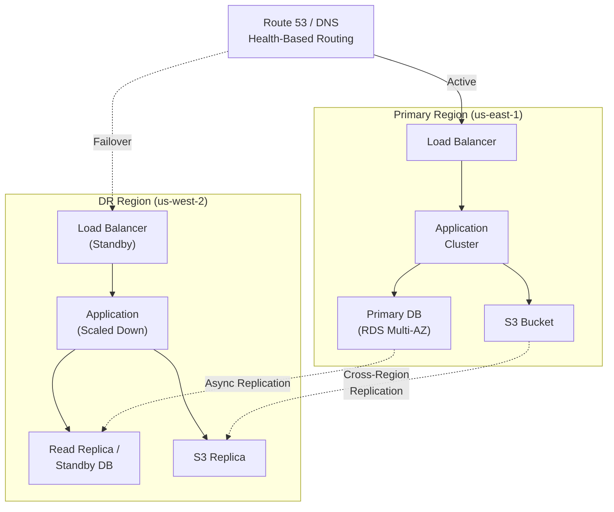
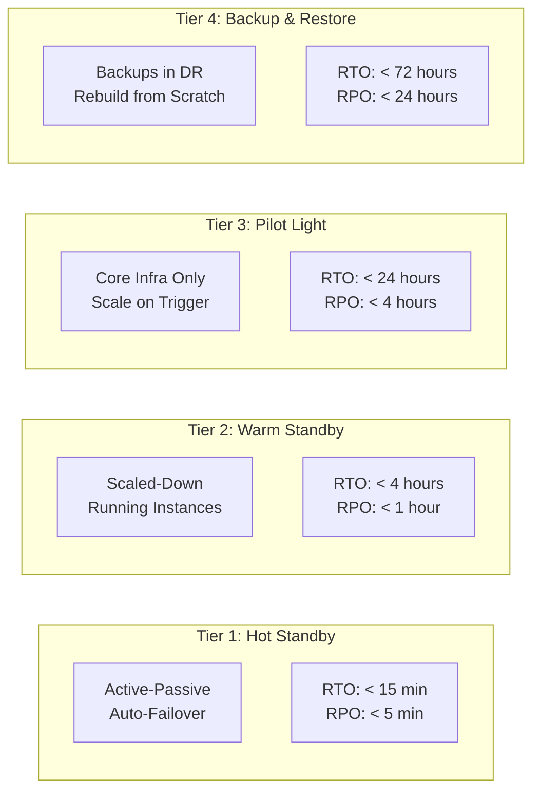
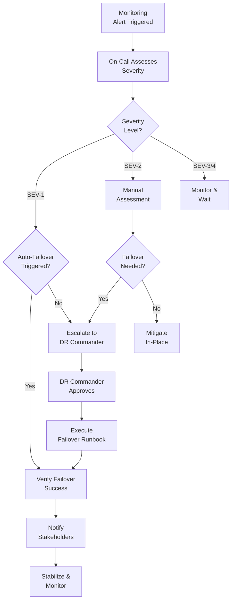

# Disaster Recovery Plan

## Document Control

| Field              | Value                        |
| ------------------ | ---------------------------- |
| **Document ID**    | DRP-001                      |
| **Version**        | 1.0                          |
| **Classification** | Confidential                 |
| **Author**         | `[Author Name]`              |
| **Reviewer**       | `[Reviewer Name]`            |
| **Approver**       | `[Approver Name]`            |
| **Created**        | `YYYY-MM-DD`                 |
| **Last Updated**   | `YYYY-MM-DD`                 |
| **Next DR Test**   | `YYYY-MM-DD`                 |
| **Status**         | Draft / In Review / Approved |

---

## Executive Summary

This Disaster Recovery Plan defines the strategies, procedures, and timelines for recovering critical IT services following a disruptive event. It covers Recovery Time Objectives (RTO), Recovery Point Objectives (RPO), failover procedures, and testing requirements for `[Organization/System Name]`.

---

## Business Impact Analysis

### Service Criticality Tiers

| Tier       | Classification       | Max Downtime | Services          |
| ---------- | -------------------- | ------------ | ----------------- |
| **Tier 1** | Mission Critical     | < 1 hour     | `[List services]` |
| **Tier 2** | Business Critical    | < 4 hours    | `[List services]` |
| **Tier 3** | Business Operational | < 24 hours   | `[List services]` |
| **Tier 4** | Administrative       | < 72 hours   | `[List services]` |

### RTO/RPO Matrix

| Service               | Tier | RTO      | RPO      | Current RTO | Current RPO | Gap     |
| --------------------- | ---- | -------- | -------- | ----------- | ----------- | ------- |
| Production API        | 1    | 15 min   | 5 min    | `___`       | `___`       | `[Y/N]` |
| Customer Database     | 1    | 30 min   | 1 min    | `___`       | `___`       | `[Y/N]` |
| Payment Processing    | 1    | 15 min   | 0 min    | `___`       | `___`       | `[Y/N]` |
| Email Service         | 2    | 2 hours  | 1 hour   | `___`       | `___`       | `[Y/N]` |
| Analytics Platform    | 2    | 4 hours  | 1 hour   | `___`       | `___`       | `[Y/N]` |
| Internal Tools        | 3    | 12 hours | 4 hours  | `___`       | `___`       | `[Y/N]` |
| Dev/Test Environments | 4    | 48 hours | 24 hours | `___`       | `___`       | `[Y/N]` |

---

## DR Architecture

### Multi-Region Failover Architecture

### Recovery Strategy per Tier

---

## Disaster Scenarios

### Scenario Classification

| Scenario               | Likelihood | Impact   | DR Strategy                 | Estimated Recovery |
| ---------------------- | ---------- | -------- | --------------------------- | ------------------ |
| Single AZ failure      | Medium     | Medium   | Multi-AZ auto-failover      | < 5 minutes        |
| Full region outage     | Low        | Critical | Cross-region failover       | < 30 minutes       |
| Database corruption    | Low        | Critical | Point-in-time recovery      | < 1 hour           |
| Ransomware attack      | Medium     | Critical | Isolated backup restore     | < 4 hours          |
| DNS/Network failure    | Low        | High     | DNS failover + CDN          | < 15 minutes       |
| Cloud provider outage  | Very Low   | Critical | Multi-cloud (if applicable) | < 2 hours          |
| Data center fire/flood | Very Low   | Critical | Cross-region failover       | < 1 hour           |

---

## Recovery Procedures

### Failover Decision Flow

### Failover Runbook Summary

| Step | Action                 | Owner             | Duration | Verification       |
| ---- | ---------------------- | ----------------- | -------- | ------------------ |
| 1    | Confirm incident scope | On-Call Engineer  | 5 min    | Alert correlation  |
| 2    | Notify DR Commander    | On-Call Engineer  | 2 min    | Acknowledgment     |
| 3    | Activate DR war room   | DR Commander      | 5 min    | All parties joined |
| 4    | Execute DNS failover   | Platform Engineer | 5 min    | Health check green |
| 5    | Promote DB replica     | DBA               | 10 min   | Write test passes  |
| 6    | Scale DR compute       | Platform Engineer | 10 min   | Capacity verified  |
| 7    | Validate application   | QA / Dev Lead     | 15 min   | Smoke tests pass   |
| 8    | Update status page     | Comms Lead        | 5 min    | Page updated       |
| 9    | Monitor DR environment | All               | Ongoing  | Dashboards green   |

---

## Recovery Timeline

```mermaid
gantt
    accTitle: DR Recovery Timeline
    accDescr: Minute-by-minute timeline for Tier 1 failover execution

    title Tier 1 Failover Timeline
    dateFormat HH:mm
    axisFormat %H:%M

    section Detection
        Monitoring detects failure     :a1, 00:00, 2m
        Alert fires to on-call         :a2, after a1, 1m

    section Assessment
        On-call investigates           :b1, after a2, 5m
        DR Commander notified          :b2, after b1, 2m

    section Failover
        DNS failover initiated         :crit, c1, after b2, 3m
        DB replica promoted            :crit, c2, after c1, 5m
        Compute scaled up              :c3, after c1, 8m

    section Validation
        Smoke tests executed           :d1, after c2, 5m
        Full health check              :d2, after d1, 5m

    section Communication
        Status page updated            :e1, after b2, 2m
        Stakeholder notification       :e2, after d2, 3m
```

---

## Backup Strategy

### Backup Inventory

| Data Store        | Backup Type              | Frequency    | Retention  | Storage Location | Encryption |
| ----------------- | ------------------------ | ------------ | ---------- | ---------------- | ---------- |
| Production DB     | Automated snapshot       | Every 1 hour | 30 days    | DR region S3     | AES-256    |
| Production DB     | Transaction log          | Continuous   | 7 days     | DR region S3     | AES-256    |
| File Storage (S3) | Cross-region replication | Real-time    | Indefinite | DR region S3     | AES-256    |
| Configuration     | Git + encrypted backup   | On change    | 90 days    | Multiple regions | AES-256    |
| Secrets/Keys      | Vault replication        | Real-time    | N/A        | DR region Vault  | HSM        |
| Application State | Redis snapshot           | Every 15 min | 7 days     | DR region S3     | AES-256    |

### Backup Verification

| Test                     | Frequency   | Last Tested  | Result        | Next Test    |
| ------------------------ | ----------- | ------------ | ------------- | ------------ |
| DB restore from snapshot | Monthly     | `YYYY-MM-DD` | `[Pass/Fail]` | `YYYY-MM-DD` |
| Point-in-time recovery   | Quarterly   | `YYYY-MM-DD` | `[Pass/Fail]` | `YYYY-MM-DD` |
| Full DR failover test    | Semi-annual | `YYYY-MM-DD` | `[Pass/Fail]` | `YYYY-MM-DD` |
| Backup integrity check   | Weekly      | `YYYY-MM-DD` | `[Pass/Fail]` | `YYYY-MM-DD` |

---

## Communication Plan

### Notification Matrix

| Audience             | Channel               | SLA       | Template        | Owner        |
| -------------------- | --------------------- | --------- | --------------- | ------------ |
| Engineering Team     | Slack #incident       | Immediate | Incident alert  | On-Call      |
| Executive Leadership | Email + Slack         | < 15 min  | Exec summary    | DR Commander |
| Customer Support     | Slack #support-alerts | < 10 min  | CS briefing     | Comms Lead   |
| Customers            | Status page + email   | < 30 min  | Customer notice | Comms Lead   |
| Partners / Vendors   | Email                 | < 1 hour  | Partner notice  | Account Mgr  |

---

## DR Testing Schedule

| Test Type          | Scope                    | Frequency   | Duration  | Participants |
| ------------------ | ------------------------ | ----------- | --------- | ------------ |
| Tabletop Exercise  | Full DR plan             | Quarterly   | 2 hours   | All DR roles |
| Component Failover | Individual services      | Monthly     | 1 hour    | Engineering  |
| Full DR Failover   | Complete region failover | Semi-annual | 4 hours   | All teams    |
| Chaos Engineering  | Randomized failures      | Weekly      | Automated | Engineering  |
| Backup Restore     | Data recovery            | Monthly     | 2 hours   | DBA + Eng    |

---

## Roles & Responsibilities

| Role                | Primary  | Backup   | Contact     |
| ------------------- | -------- | -------- | ----------- |
| DR Commander        | `[Name]` | `[Name]` | `[Contact]` |
| Platform Lead       | `[Name]` | `[Name]` | `[Contact]` |
| DBA Lead            | `[Name]` | `[Name]` | `[Contact]` |
| Application Lead    | `[Name]` | `[Name]` | `[Contact]` |
| Communications Lead | `[Name]` | `[Name]` | `[Contact]` |
| Security Lead       | `[Name]` | `[Name]` | `[Contact]` |

---

## Approval & Sign-Off

| Role           | Name              | Signature         | Date         |
| -------------- | ----------------- | ----------------- | ------------ |
| VP Engineering | `_______________` | `_______________` | `YYYY-MM-DD` |
| CISO           | `_______________` | `_______________` | `YYYY-MM-DD` |
| DR Commander   | `_______________` | `_______________` | `YYYY-MM-DD` |
| CTO            | `_______________` | `_______________` | `YYYY-MM-DD` |

---

## Revision History

| Version | Date         | Author     | Changes                  |
| ------- | ------------ | ---------- | ------------------------ |
| 0.1     | `YYYY-MM-DD` | `[Author]` | Initial DR plan          |
| 0.2     | `YYYY-MM-DD` | `[Author]` | Added recovery timelines |
| 1.0     | `YYYY-MM-DD` | `[Author]` | Approved for release     |
