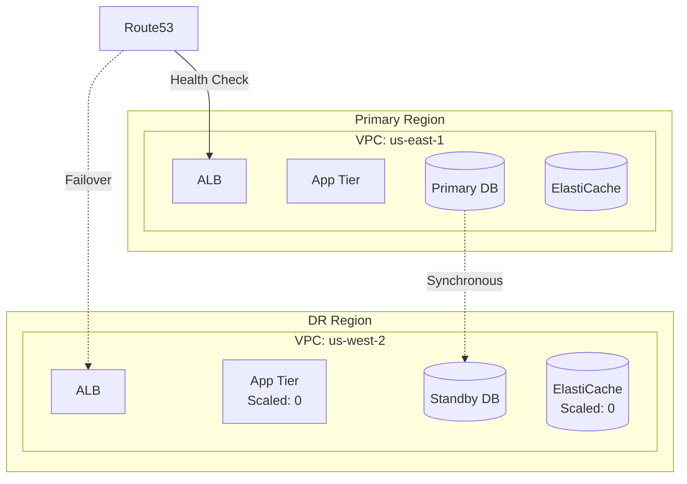
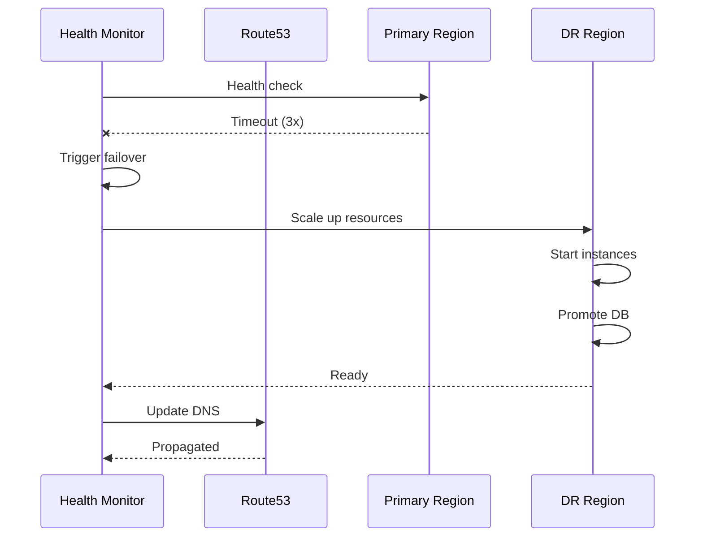
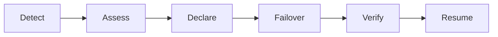

# Disaster Recovery Plan

<!-- Business continuity and disaster recovery documentation -->

---

## Document Control

| Field              | Value            |
| ------------------ | ---------------- |
| **Plan ID**        | DR-[YYYY]-[NNN]  |
| **Version**        | [X.Y.Z]          |
| **Date**           | [YYYY-MM-DD]     |
| **Author**         | [Name, Role]     |
| **DR Coordinator** | [Name, Role]     |
| **Review Cycle**   | Quarterly        |
| **Last Tested**    | [Date]           |
| **Status**         | Draft / Approved |

> [!IMPORTANT]
> This plan must be tested quarterly and updated after any significant infrastructure changes.

---

## Executive Summary

### Recovery Objectives

| Metric                                        | Target  | Current Capability |
| --------------------------------------------- | ------- | ------------------ |
| **RTO** (Recovery Time Objective)             | 4 hours | [X] hours          |
| **RPO** (Recovery Point Objective)            | 1 hour  | [X] minutes        |
| **MTPD** (Max Tolerable Period of Disruption) | 8 hours | [X] hours          |

### DR Strategy

| Tier   | Systems      | RTO      | RPO      | Strategy      |
| ------ | ------------ | -------- | -------- | ------------- |
| Tier 1 | Critical     | 1 hour   | 5 min    | Active-Active |
| Tier 2 | Important    | 4 hours  | 1 hour   | Pilot Light   |
| Tier 3 | Standard     | 24 hours | 24 hours | Warm Standby  |
| Tier 4 | Low Priority | 72 hours | 48 hours | Cold Standby  |

---

## DR Architecture

### Multi-Region Design



### Data Replication

| Data Store     | Replication   | RPO    | Method               |
| -------------- | ------------- | ------ | -------------------- |
| RDS PostgreSQL | Cross-region  | 5 min  | Physical replication |
| S3             | Cross-region  | 0      | S3 CRR               |
| DynamoDB       | Global tables | 0      | Active-active        |
| ElastiCache    | Snapshot      | 1 hour | Automated backup     |

---

## Recovery Procedures

### Automated Failover



### Manual Failover Procedure

| Step | Action              | Duration | Owner  |
| ---- | ------------------- | -------- | ------ |
| 1    | Assess incident     | 15 min   | [Name] |
| 2    | Declare disaster    | 5 min    | [Name] |
| 3    | Notify stakeholders | 10 min   | [Name] |
| 4    | Scale DR resources  | 30 min   | [Name] |
| 5    | Promote DR database | 15 min   | [Name] |
| 6    | Update DNS          | 5 min    | [Name] |
| 7    | Verify services     | 30 min   | [Name] |
| 8    | Resume operations   | -        | [Name] |

### Database Failover

```sql
-- Promote read replica to primary
aws rds promote-read-replica \
    --db-instance-identifier dr-database

-- Update application connection strings
DATABASE_URL=postgresql://dr-db.cluster-xxx.us-west-2.rds.amazonaws.com
```

---

## Recovery Workflows

### Scenario 1: Regional Outage



**Recovery Steps:**

1. Confirm primary region is unavailable
2. Declare disaster and activate DR team
3. Execute automated or manual failover
4. Verify DR region is serving traffic
5. Monitor for issues

### Scenario 2: Database Failure

**Recovery Steps:**

1. Attempt to restart database
2. If restart fails, promote read replica
3. Update application connections
4. Verify data integrity

### Scenario 3: Data Corruption

**Recovery Steps:**

1. Stop all writes
2. Identify last known good backup
3. Restore from backup
4. Verify data integrity
5. Resume operations

---

## Testing Schedule

### Test Types

| Test Type  | Frequency     | Scope             | Duration |
| ---------- | ------------- | ----------------- | -------- |
| Tabletop   | Quarterly     | Discussion        | 2 hours  |
| Functional | Monthly       | DR systems        | 4 hours  |
| Full DR    | Semi-annually | Complete failover | 8 hours  |

### Test Results

| Date   | Test Type  | Result | Issues | Action Items |
| ------ | ---------- | ------ | ------ | ------------ |
| [Date] | Tabletop   | ✅/❌  | [List] | [Items]      |
| [Date] | Functional | ✅/❌  | [List] | [Items]      |

---

## Communication Plan

### Internal Communication

| Audience   | Timing    | Method      | Message         |
| ---------- | --------- | ----------- | --------------- |
| DR Team    | Immediate | Phone/Slack | Incident alert  |
| Leadership | 30 min    | Email/Call  | Status update   |
| All Staff  | 1 hour    | Email       | Business impact |

### External Communication

| Audience   | Timing      | Method        | Owner       |
| ---------- | ----------- | ------------- | ----------- |
| Customers  | 1 hour      | Status page   | Support     |
| Partners   | 2 hours     | Email         | Account Mgr |
| Regulators | As required | Formal notice | Legal       |

---

## Recovery Validation

### Validation Checklist

- [ ] All services responding
- [ ] Database connections working
- [ ] Data integrity verified
- [ ] Performance acceptable
- [ ] Security controls active
- [ ] Monitoring operational
- [ ] Backups running

### Recovery Metrics

| Metric        | Target    | Actual |
| ------------- | --------- | ------ |
| Failover time | < 1 hour  | [Time] |
| Data loss     | < 1 hour  | [Time] |
| Full recovery | < 4 hours | [Time] |

---

## Return to Normal

### Failback Procedure

| Step | Action                 | Duration |
| ---- | ---------------------- | -------- |
| 1    | Prepare primary region | 1 hour   |
| 2    | Sync data from DR      | 2 hours  |
| 3    | Verify primary health  | 30 min   |
| 4    | Switch traffic back    | 15 min   |
| 5    | Monitor primary        | 2 hours  |
| 6    | Scale down DR          | 15 min   |

---

## Appendices

### A. Contact Directory

[Complete contact list for DR team]

### B. System Inventory

[Critical systems and dependencies]

### C. Runbooks

[Detailed recovery procedures]

---

_Last updated: [Date]_

---

## See Also

- [Infrastructure Diagram](./infrastructure_diagram.md) — Architecture documentation
- [Incident Response](../security/incident_response.md) — Security incident handling
- [Post-Mortem](../engineering/post_mortem.md) — Incident analysis
