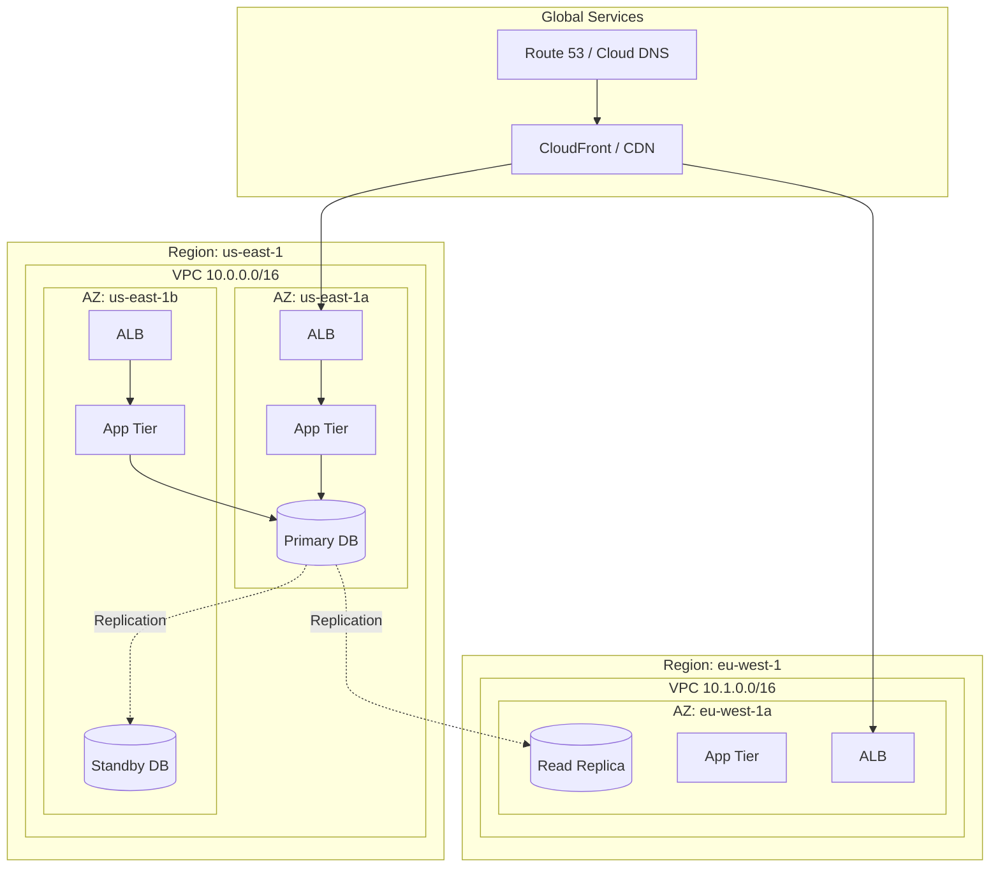
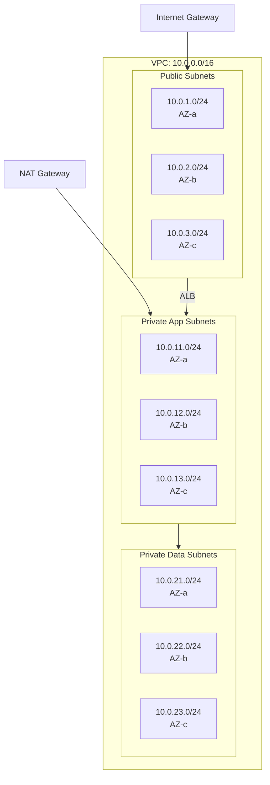
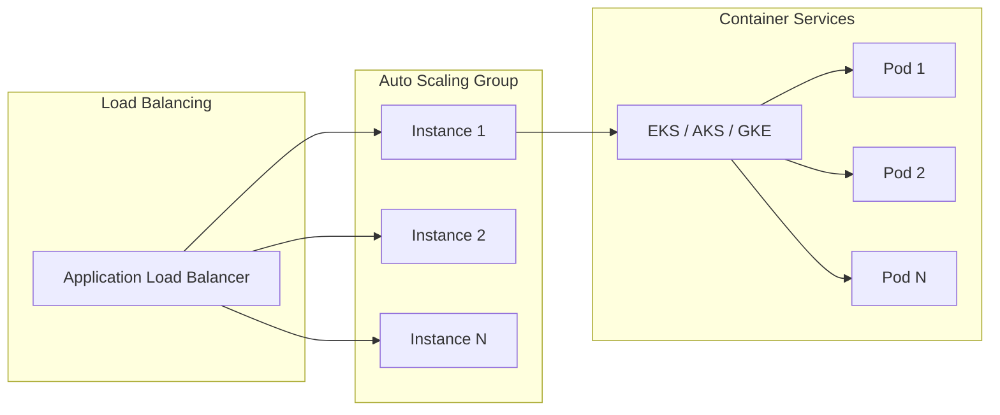
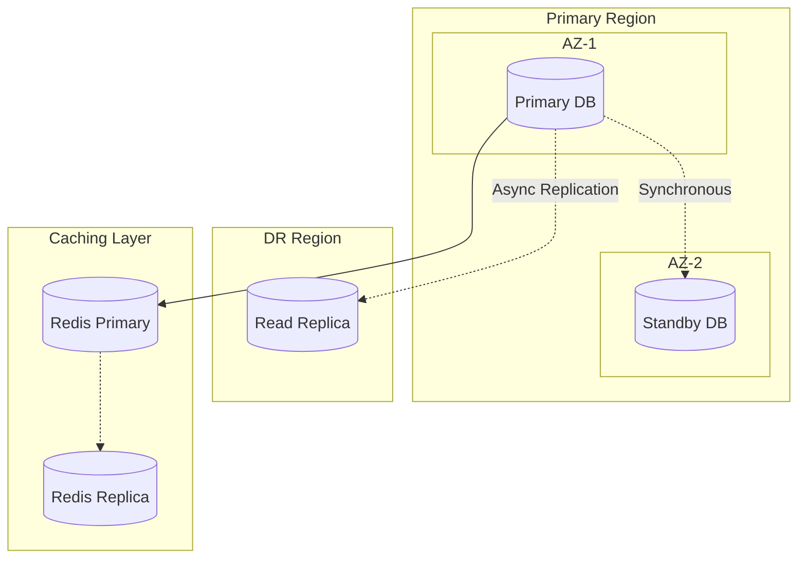
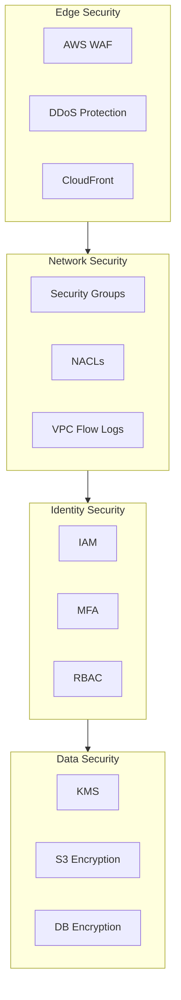
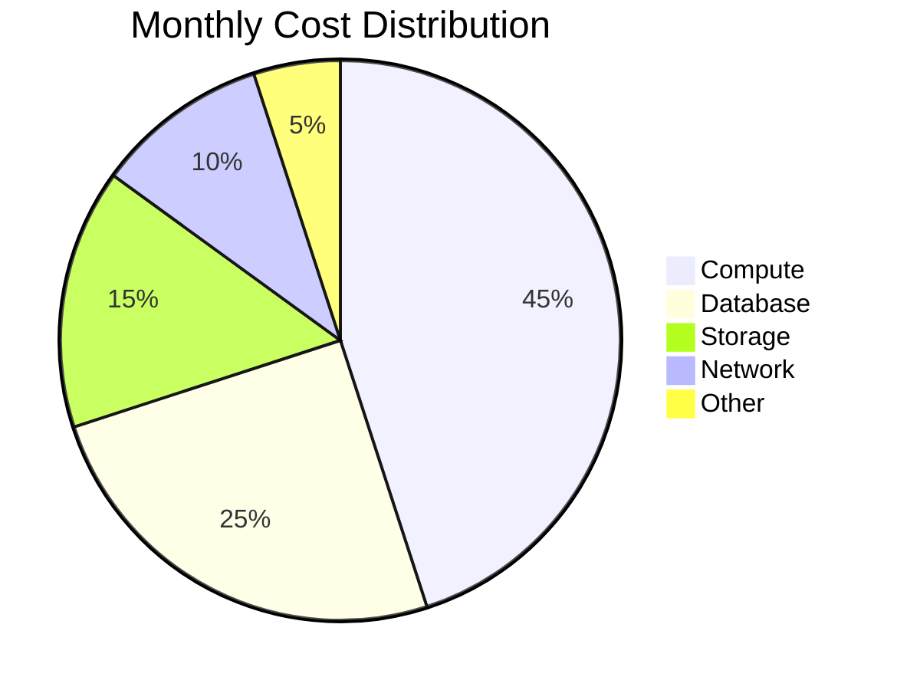
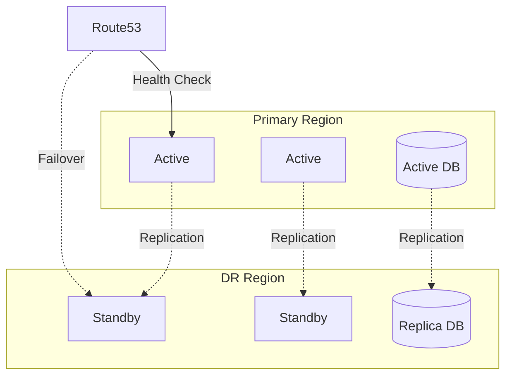

# Infrastructure Architecture

<!-- Cloud infrastructure documentation with Mermaid diagrams -->

---

## Document Control

| Field              | Value                      |
| ------------------ | -------------------------- |
| **Document ID**    | INF-[YYYY]-[NNN]           |
| **Version**        | [X.Y.Z]                    |
| **Date**           | [YYYY-MM-DD]               |
| **Author**         | [Name, Role]               |
| **Reviewer**       | [Name, Role]               |
| **Cloud Provider** | AWS / Azure / GCP / Multi  |
| **Environment**    | Production / Staging / Dev |
| **Status**         | Draft / Approved           |

---

## Executive Summary

### Infrastructure Overview

| Attribute              | Value      |
| ---------------------- | ---------- |
| **Cloud Provider**     | [Provider] |
| **Regions**            | [N]        |
| **Availability Zones** | [N]        |
| **VPCs/Networks**      | [N]        |
| **Compute Instances**  | [N]        |
| **Databases**          | [N]        |
| **Monthly Cost**       | $[N]       |

### Architecture Principles

1. **High Availability:** Multi-AZ deployment
2. **Scalability:** Auto-scaling enabled
3. **Security:** Defense in depth
4. **Cost Optimization:** Right-sized resources
5. **Observability:** Full monitoring coverage

---

## High-Level Architecture

### Multi-Region Deployment

---

## Network Architecture

### VPC/Network Design

### Network Flow

| Source   | Destination | Protocol   | Port | Purpose          |
| -------- | ----------- | ---------- | ---- | ---------------- |
| Internet | ALB         | HTTPS      | 443  | User traffic     |
| ALB      | App Tier    | HTTP       | 8080 | Internal routing |
| App Tier | Database    | PostgreSQL | 5432 | Data access      |
| App Tier | Cache       | Redis      | 6379 | Session storage  |

---

## Compute Architecture

### Application Tier

### Compute Specifications

| Tier   | Instance Type | Count | vCPU | Memory | Storage |
| ------ | ------------- | ----- | ---- | ------ | ------- |
| Web    | t3.medium     | 2-6   | 2    | 4 GB   | 20 GB   |
| App    | c5.xlarge     | 3-10  | 4    | 8 GB   | 50 GB   |
| Worker | c5.2xlarge    | 2-5   | 8    | 16 GB  | 100 GB  |

---

## Data Architecture

### Database Architecture

### Data Storage

| Service        | Type    | Size   | Replication  | Backup    |
| -------------- | ------- | ------ | ------------ | --------- |
| RDS PostgreSQL | Primary | 500 GB | Multi-AZ     | Daily     |
| ElastiCache    | Redis   | 16 GB  | Cluster      | None      |
| S3             | Object  | 10 TB  | Cross-region | Versioned |
| EFS            | File    | 100 GB | Multi-AZ     | Daily     |

---

## Security Architecture

### Defense in Depth

### Security Groups

| Group    | Inbound            | Outbound   |
| -------- | ------------------ | ---------- |
| ALB      | 443 from 0.0.0.0/0 | All to VPC |
| App      | 8080 from ALB      | All to VPC |
| Database | 5432 from App      | None       |
| Bastion  | 22 from VPN        | All to VPC |

---

## Monitoring Architecture

### Observability Stack

```mermaid
flowchart LR
    accTitle: Monitoring Architecture
    accDescr: Full observability coverage

    subgraph Sources["Data Sources"]
        LOGS[Application Logs]
        METRICS[CloudWatch Metrics]
        TRACES[X-Ray Traces]
    end

    subgraph Collection["Collection"]
        CW[CloudWatch]
        XRAY[X-Ray]
    end

    subgraph Analysis["Analysis"]
        DASH[Dashboards]
        ALERTS[Alerts]
        INSIGHTS[Insights]
    end

    subgraph Action["Action"]
        PAGER[PagerDuty]
        SLACK[Slack]
        AUTO[Auto-Remediation]
    end

    Sources --> Collection --> Analysis --> Action
```

---

## Cost Architecture

### Resource Optimization

| Service       | Monthly Cost | Optimization       |
| ------------- | ------------ | ------------------ |
| EC2           | $8,000       | Reserved instances |
| RDS           | $4,500       | Reserved instances |
| S3            | $1,500       | Lifecycle policies |
| Data Transfer | $1,000       | CDN optimization   |

---

## Disaster Recovery

### DR Architecture

| Component   | RTO     | RPO   | Strategy                 |
| ----------- | ------- | ----- | ------------------------ |
| Application | 1 hour  | 0     | Multi-AZ                 |
| Database    | 4 hours | 5 min | Cross-region replica     |
| Storage     | 0       | 0     | Cross-region replication |

---

## Appendices

### A. Resource Naming Convention

| Resource | Pattern            | Example            |
| -------- | ------------------ | ------------------ |
| VPC      | vpc-{env}-{region} | vpc-prod-us-east-1 |
| Subnet   | subnet-{type}-{az} | subnet-app-1a      |
| Instance | {app}-{env}-{n}    | api-prod-01        |

### B. IP Address Allocation

| Range       | Purpose        |
| ----------- | -------------- |
| 10.0.0.0/16 | Production VPC |
| 10.1.0.0/16 | Staging VPC    |
| 10.2.0.0/16 | Dev VPC        |

---

_Last updated: [Date]_

---

## See Also

- [Cost Analysis](./cost_analysis.md) — Financial documentation
- [Migration Plan](./migration_plan.md) — Cloud migration
- [DR Plan](./dr_plan.md) — Disaster recovery
