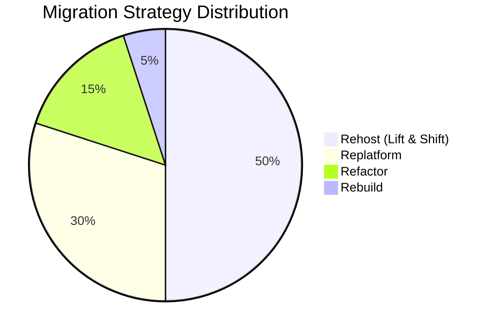
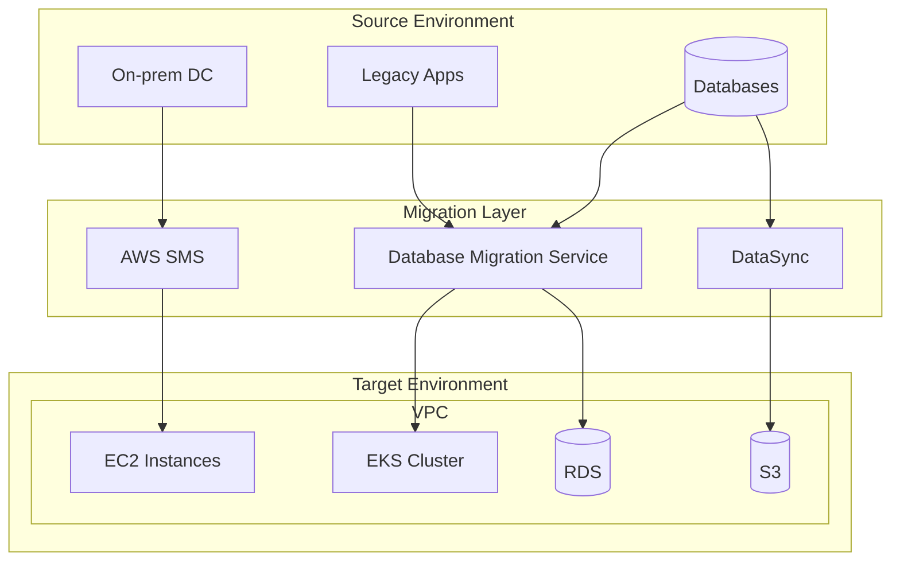
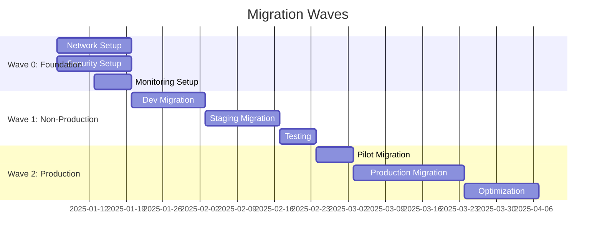
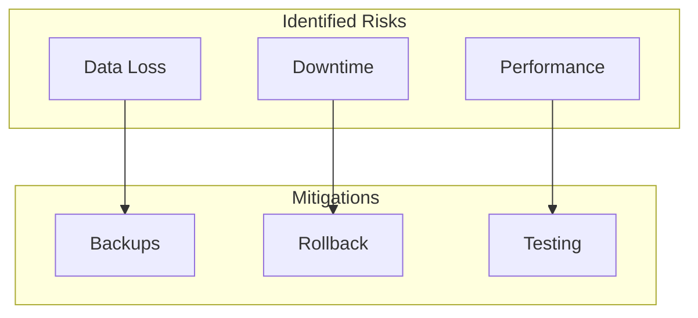

# Cloud Migration Plan

<!-- Cloud migration strategy and execution plan -->

---

## Document Control

| Field                  | Value                                   |
| ---------------------- | --------------------------------------- |
| **Plan ID**            | MIG-[YYYY]-[NNN]                        |
| **Version**            | [X.Y.Z]                                 |
| **Date**               | [YYYY-MM-DD]                            |
| **Author**             | [Name, Role]                            |
| **Migration Lead**     | [Name, Role]                            |
| **Source Environment** | On-premises / Data Center / Other Cloud |
| **Target Environment** | AWS / Azure / GCP                       |
| **Status**             | Planning / In Progress / Complete       |

---

## Executive Summary

### Migration Overview

| Attribute        | Value            |
| ---------------- | ---------------- |
| **Applications** | [N]              |
| **Servers**      | [N]              |
| **Databases**    | [N]              |
| **Storage**      | [N] TB           |
| **Timeline**     | [Start] to [End] |
| **Budget**       | $[N]             |

### Migration Strategy

### Key Milestones

| Milestone             | Target Date | Status |
| --------------------- | ----------- | ------ |
| Assessment Complete   | [Date]      | ⬜     |
| Pilot Migration       | [Date]      | ⬜     |
| Production Migration  | [Date]      | ⬜     |
| Optimization Complete | [Date]      | ⬜     |

---

## Migration Strategy

### 6 R's Framework

| Strategy       | Applications | Effort    | Risk   | Timeline  |
| -------------- | ------------ | --------- | ------ | --------- |
| **Rehost**     | [N]          | Low       | Low    | Fast      |
| **Replatform** | [N]          | Medium    | Low    | Medium    |
| **Refactor**   | [N]          | High      | Medium | Slow      |
| **Rebuild**    | [N]          | Very High | High   | Very Slow |
| **Replace**    | [N]          | Medium    | Medium | Medium    |
| **Retain**     | [N]          | N/A       | N/A    | N/A       |

### Application Assessment

| Application | Current    | Strategy   | Priority | Effort   |
| ----------- | ---------- | ---------- | -------- | -------- |
| [App 1]     | On-prem VM | Rehost     | P1       | 2 weeks  |
| [App 2]     | Legacy DB  | Replatform | P2       | 4 weeks  |
| [App 3]     | Monolith   | Refactor   | P3       | 12 weeks |

---

## Migration Architecture

### Target Architecture

### Network Connectivity

| Connection     | Type           | Bandwidth | Purpose           |
| -------------- | -------------- | --------- | ----------------- |
| On-prem to AWS | Direct Connect | 10 Gbps   | Migration traffic |
| On-prem to AWS | VPN            | 1 Gbps    | Fallback          |

---

## Migration Waves

### Wave Planning

### Wave Details

#### Wave 0: Foundation

| Task            | Owner    | Duration | Dependencies |
| --------------- | -------- | -------- | ------------ |
| VPC Setup       | Network  | 3 days   | None         |
| Security Groups | Security | 2 days   | VPC          |
| IAM Setup       | Security | 3 days   | None         |
| Monitoring      | DevOps   | 5 days   | VPC          |

#### Wave 1: Non-Production

| Application | Method  | Downtime | Rollback |
| ----------- | ------- | -------- | -------- |
| [App 1]     | AWS SMS | 2 hours  | 30 min   |
| [App 2]     | DMS     | 4 hours  | 1 hour   |

#### Wave 2: Production

| Application | Method     | Downtime | Rollback |
| ----------- | ---------- | -------- | -------- |
| [App 1]     | AWS SMS    | 4 hours  | 1 hour   |
| [App 2]     | Blue/Green | 15 min   | 5 min    |

---

## Technical Approach

### Server Migration

| Server     | Method       | Tool       | Downtime |
| ---------- | ------------ | ---------- | -------- |
| [Server 1] | Lift & Shift | AWS SMS    | 2 hours  |
| [Server 2] | Containerize | Docker/EKS | 1 hour   |

### Database Migration

| Database | Source | Target     | Method | Downtime |
| -------- | ------ | ---------- | ------ | -------- |
| [DB 1]   | Oracle | RDS Oracle | DMS    | 4 hours  |
| [DB 2]   | MySQL  | Aurora     | DMS    | 2 hours  |

### Data Migration

| Dataset  | Size   | Method       | Duration |
| -------- | ------ | ------------ | -------- |
| [Data 1] | 5 TB   | AWS DataSync | 2 days   |
| [Data 2] | 500 GB | S3 Transfer  | 8 hours  |

---

## Risk Management

### Risk Register

| Risk                    | Likelihood | Impact   | Mitigation       |
| ----------------------- | ---------- | -------- | ---------------- |
| Data loss               | Low        | Critical | Multiple backups |
| Extended downtime       | Medium     | High     | Rollback plan    |
| Performance degradation | Medium     | Medium   | Load testing     |
| Cost overrun            | Medium     | Medium   | Budget buffer    |

### Mitigation Strategies

---

## Cutover Plan

### Pre-Cutover Checklist

- [ ] All data migrated
- [ ] Applications tested
- [ ] Security validated
- [ ] Performance acceptable
- [ ] Monitoring configured
- [ ] Rollback tested

### Cutover Procedure

| Step | Action                   | Duration | Owner  |
| ---- | ------------------------ | -------- | ------ |
| 1    | Stop source applications | 15 min   | [Name] |
| 2    | Final data sync          | 30 min   | [Name] |
| 3    | Update DNS               | 5 min    | [Name] |
| 4    | Verify traffic           | 15 min   | [Name] |
| 5    | Monitor for issues       | 2 hours  | [Name] |

### Rollback Procedure

| Step | Action              | Duration |
| ---- | ------------------- | -------- |
| 1    | Revert DNS          | 5 min    |
| 2    | Restart source      | 15 min   |
| 3    | Verify source       | 15 min   |
| 4    | Notify stakeholders | 5 min    |

---

## Cost Analysis

### Migration Costs

| Category              | Cost     |
| --------------------- | -------- |
| Tools & Services      | $[N]     |
| Professional Services | $[N]     |
| Training              | $[N]     |
| Contingency (20%)     | $[N]     |
| **Total**             | **$[N]** |

### Ongoing Savings

| Category          | Monthly Savings |
| ----------------- | --------------- |
| Data center       | $[N]            |
| Hardware refresh  | $[N]            |
| Operations        | $[N]            |
| **Total Monthly** | **$[N]**        |

**ROI Calculation:**

$$\text{ROI} = \frac{\text{Annual Savings} - \text{Migration Cost}}{\text{Migration Cost}} \times 100 = [X]%$$

---

## Success Criteria

| Criteria       | Target         | Measurement       |
| -------------- | -------------- | ----------------- |
| Downtime       | < 4 hours      | Actual duration   |
| Data integrity | 100%           | Validation checks |
| Performance    | < +20% latency | Benchmark tests   |
| Cost           | < Budget       | Actual spend      |

---

## Appendices

### A. Application Inventory

[Complete list of applications to migrate]

### B. Runbooks

[Step-by-step migration procedures]

### C. Test Plans

[Migration testing scenarios]

---

_Last updated: [Date]_

---

## See Also

- [Infrastructure Diagram](./infrastructure_diagram.md) — Target architecture
- [Cost Analysis](./cost_analysis.md) — Financial planning
- [DR Plan](./dr_plan.md) — Business continuity
