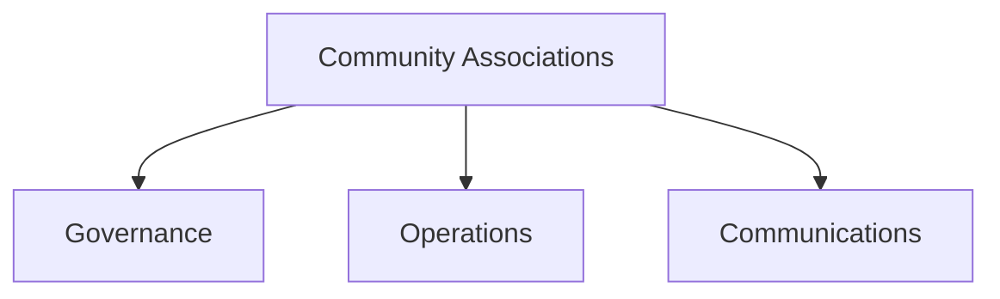

# Community Associations

HOA and community association management templates.

## Templates

| Template                                                                                               | Description                   |
| ------------------------------------------------------------------------------------------------------ | ----------------------------- |
| [reference/](reference/)                                                                               | Main HOA template library     |
| [reference/governance/ccrs_hoa.md](reference/governance/ccrs_hoa.md)                                   | HOA declaration baseline      |
| [reference/meetings/notice_annual_meeting.md](reference/meetings/notice_annual_meeting.md)             | Annual meeting notice         |
| [reference/communications/violation_appeal_form.md](reference/communications/violation_appeal_form.md) | Violation appeal process      |
| [reference/legal/collection_policy.md](reference/legal/collection_policy.md)                           | Assessments collection policy |

## Structure

See [Parent](../SKILL.md) for all categories.
