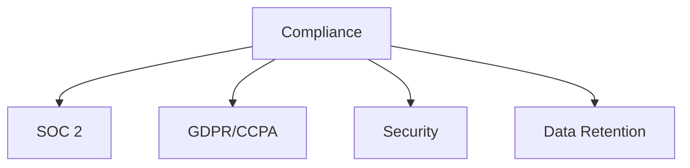

# Compliance

Compliance and regulatory documentation templates.

## Templates

| Template                                               | Description        |
| ------------------------------------------------------ | ------------------ |
| [soc_2_audit.md](soc_2_audit.md)                       | SOC 2 compliance   |
| [gdpr_ccpa_compliance.md](gdpr_ccpa_compliance.md)     | Privacy compliance |
| [security_policy.md](security_policy.md)               | Security policies  |
| [data_retention_policy.md](data_retention_policy.md)   | Data retention     |
| [incident_response_plan.md](incident_response_plan.md) | Incident response  |

## Structure

See [Parent](../SKILL.md) for all categories.
