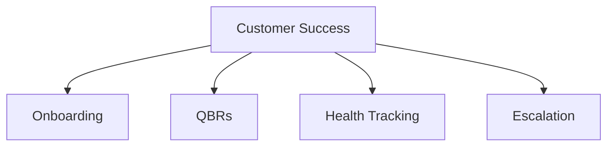

# Customer Success

Customer success, onboarding, and retention templates.

## Templates

| Template                                                     | Description          |
| ------------------------------------------------------------ | -------------------- |
| [customer_onboarding.md](customer_onboarding.md)             | Onboarding playbooks |
| [quarterly_business_review.md](quarterly_business_review.md) | QBR templates        |
| [customer_health_scorecard.md](customer_health_scorecard.md) | Health tracking      |
| [escalation_procedure.md](escalation_procedure.md)           | Escalation workflows |
| [success_plan_template.md](success_plan_template.md)         | Success planning     |

## Structure

See [Parent](../SKILL.md) for all categories.
