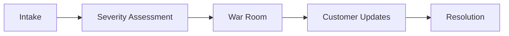
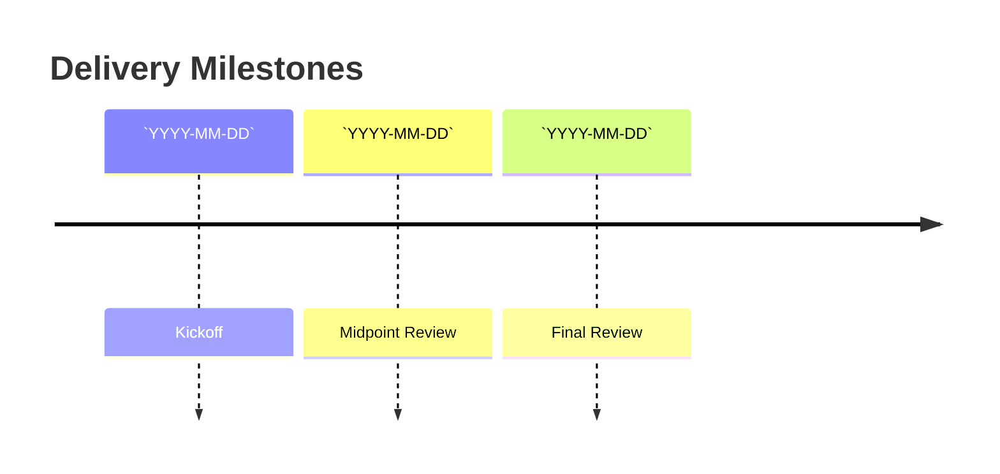

# Customer Escalation Template

---

## Document Control

| Field | Value |
| ----- | ----- |
| **Document Title** | Customer Escalation Template |
| **Category** | Customer Success |
| **Version** | 1.0 |
| **Status** | Draft |
| **Owner** | `[Owner Name]` |
| **Contributors** | `[Team / Stakeholders]` |
| **Last Updated** | `YYYY-MM-DD` |
| **Review Cadence** | Monthly / Quarterly |
| **Confidentiality** | Internal / Confidential |

---

## Purpose

Standardize escalation response for high-severity customer issues.

---

## Tiered Versions

### Simple

- Scope: single team, single cycle.
- Artifact: concise summary and action list.
- Cadence: lightweight weekly review.

### Intermediate

- Scope: multi-team with dependencies.
- Artifact: detailed tables, owners, and timelines.
- Cadence: bi-weekly governance review.

### Advanced

- Scope: cross-functional and executive visibility.
- Artifact: scenario analysis, risk controls, and audit trail.
- Cadence: formal monthly business review.

---

## Process Flow

---

## Core Metric Formula

$$
\\text{Time to Mitigate} = t_{mitigation} - t_{escalation}
$$

---

## Template Sections

### Context

- Business objective: `[Objective]`
- Time horizon: `[Start Date]` to `[End Date]`
- Stakeholders: `[Primary Stakeholders]`
- Constraints: `[Budget / Legal / Technical Constraints]`

### Work Plan Table

| Workstream | Owner | Start | End | Success Metric | Status |
| ---------- | ----- | ----- | --- | -------------- | ------ |
| `[Workstream 1]` | `[Owner]` | `YYYY-MM-DD` | `YYYY-MM-DD` | `[Metric]` | Not Started / In Progress / Done |
| `[Workstream 2]` | `[Owner]` | `YYYY-MM-DD` | `YYYY-MM-DD` | `[Metric]` | Not Started / In Progress / Done |
| `[Workstream 3]` | `[Owner]` | `YYYY-MM-DD` | `YYYY-MM-DD` | `[Metric]` | Not Started / In Progress / Done |

### Risks and Mitigations

| Risk | Probability (1-5) | Impact (1-5) | Mitigation | Owner |
| ---- | ----------------- | ------------ | ---------- | ----- |
| `[Risk 1]` | `[X]` | `[X]` | `[Mitigation]` | `[Owner]` |
| `[Risk 2]` | `[X]` | `[X]` | `[Mitigation]` | `[Owner]` |

### Milestones

### Decisions and Notes

- Decision 1: `[Decision and rationale]`
- Decision 2: `[Decision and rationale]`
- Open question: `[Question]`

---

## Revision History

| Version | Date | Author | Change |
| ------- | ---- | ------ | ------ |
| 1.0 | `YYYY-MM-DD` | `[Author]` | Initial draft |
