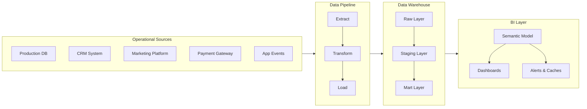
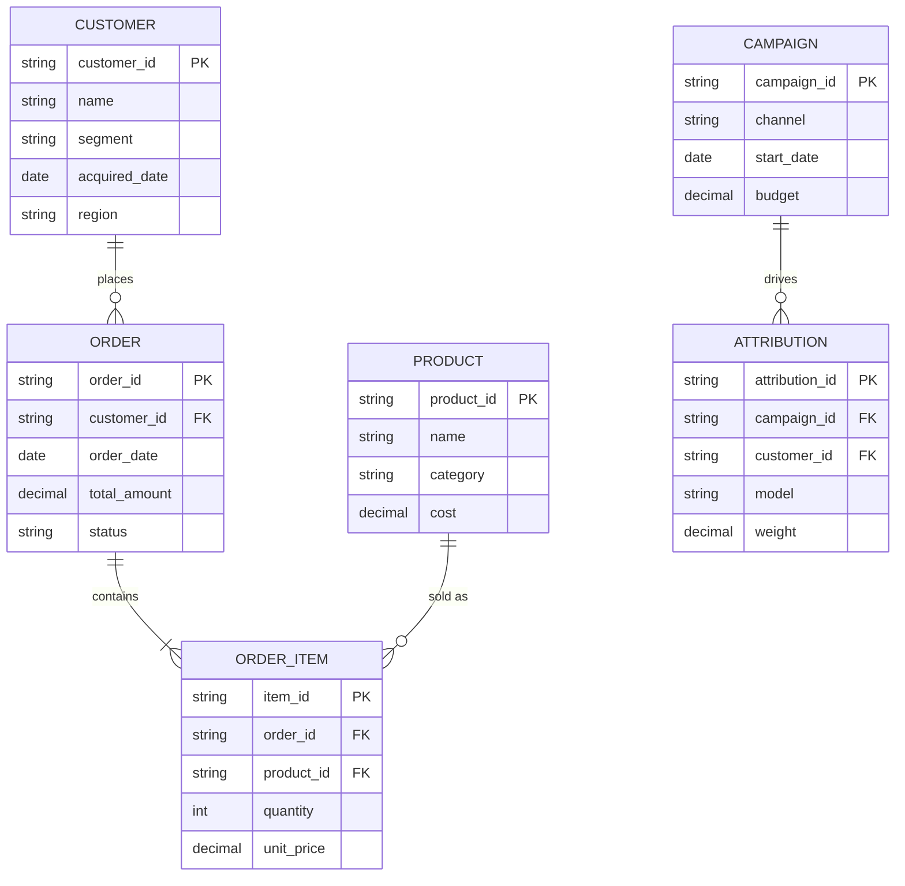
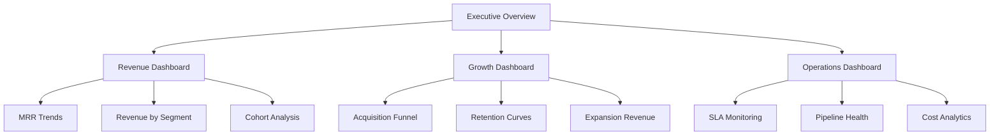
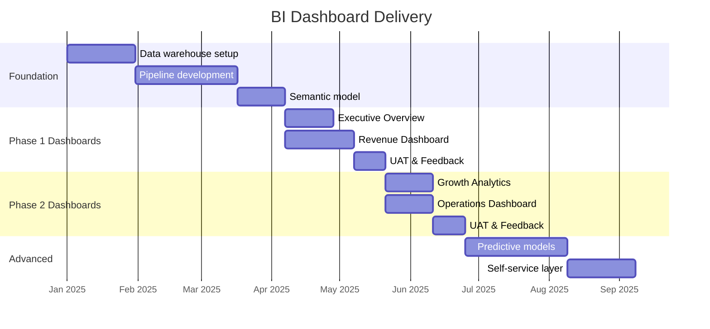

# Data Analytics Requirements

## Document Control

| Field              | Value                        |
| ------------------ | ---------------------------- |
| **Document ID**    | DAR-001                      |
| **Version**        | 1.0                          |
| **Classification** | Internal                     |
| **Author**         | `[Author Name]`              |
| **Reviewer**       | `[Reviewer Name]`            |
| **Approver**       | `[Approver Name]`            |
| **Created**        | `YYYY-MM-DD`                 |
| **Last Updated**   | `YYYY-MM-DD`                 |
| **Next Review**    | `YYYY-MM-DD`                 |
| **Status**         | Draft / In Review / Approved |

---

## Executive Summary

This document specifies business intelligence dashboard requirements, data source integrations, KPI definitions, and visualization standards for the `[Project Name]` analytics initiative. It serves as the authoritative specification for BI development teams.

---

## Stakeholder Analysis

| Stakeholder | Role              | Dashboard Access     | Primary KPIs          |
| ----------- | ----------------- | -------------------- | --------------------- |
| `[Name]`    | Executive Sponsor | Full                 | Revenue, Growth       |
| `[Name]`    | Product Manager   | Product Dashboards   | Engagement, Retention |
| `[Name]`    | Marketing Lead    | Marketing Dashboards | CAC, Conversion       |
| `[Name]`    | Finance Lead      | Finance Dashboards   | Margin, Burn Rate     |
| `[Name]`    | Operations Lead   | Ops Dashboards       | SLA, Throughput       |

---

## Analytics Architecture

### Data Flow Architecture

### Semantic Model

---

## KPI Definitions

### Tier 1: Executive KPIs

| KPI                       | Definition                           | Formula                                                     | Target   | Frequency |
| ------------------------- | ------------------------------------ | ----------------------------------------------------------- | -------- | --------- |
| Monthly Recurring Revenue | Total subscription revenue           | `SUM(active_subscriptions.mrr)`                             | `$___M`  | Daily     |
| Customer Acquisition Cost | Cost to acquire one customer         | `total_marketing_spend / new_customers`                     | `< $___` | Monthly   |
| Customer Lifetime Value   | Predicted total revenue per customer | `avg_revenue_per_month * avg_lifespan_months`               | `> $___` | Monthly   |
| Net Revenue Retention     | Revenue retained + expansion         | `(start_mrr + expansion - contraction - churn) / start_mrr` | `> 110%` | Monthly   |
| Gross Margin              | Revenue after COGS                   | `(revenue - cogs) / revenue`                                | `> ___%` | Monthly   |

### Tier 2: Operational KPIs

| KPI                | Definition                   | Formula                                     | Target    | Frequency |
| ------------------ | ---------------------------- | ------------------------------------------- | --------- | --------- |
| DAU/MAU Ratio      | Daily vs monthly engagement  | `daily_active_users / monthly_active_users` | `> 0.4`   | Daily     |
| Conversion Rate    | Visitors to paying customers | `paying_customers / total_visitors`         | `> ___%`  | Daily     |
| Churn Rate         | Customers lost per period    | `churned_customers / start_customers`       | `< ___%`  | Monthly   |
| Support Ticket SLA | Tickets resolved in SLA      | `tickets_in_sla / total_tickets`            | `> 95%`   | Daily     |
| Pipeline Uptime    | Data pipeline availability   | `successful_runs / total_runs`              | `> 99.5%` | Hourly    |

---

## Dashboard Specifications

### Dashboard Inventory

### Dashboard: Executive Overview

| Component         | Type           | Data Source                  | Refresh Rate |
| ----------------- | -------------- | ---------------------------- | ------------ |
| MRR Trend         | Line chart     | `mart.finance.mrr_daily`     | Daily        |
| Revenue by Region | Choropleth map | `mart.finance.revenue_geo`   | Daily        |
| Key Metrics Cards | Scorecard      | `mart.executive.kpi_summary` | Hourly       |
| Conversion Funnel | Funnel chart   | `mart.growth.funnel_daily`   | Daily        |
| Alert Feed        | Table          | `mart.ops.active_alerts`     | Real-time    |

### Dashboard: Revenue Deep-Dive

| Component        | Type              | Data Source                     | Refresh Rate |
| ---------------- | ----------------- | ------------------------------- | ------------ |
| MRR Waterfall    | Waterfall chart   | `mart.finance.mrr_waterfall`    | Daily        |
| Cohort Heatmap   | Heatmap           | `mart.finance.cohort_retention` | Weekly       |
| ARPU by Plan     | Bar chart         | `mart.finance.arpu_plan`        | Daily        |
| Revenue Forecast | Line + confidence | `mart.finance.forecast_30d`     | Daily        |
| Churn Breakdown  | Stacked bar       | `mart.finance.churn_reasons`    | Monthly      |

---

## Data Source Inventory

| Source                | Type     | Owner       | Refresh       | Latency SLA | Volume |
| --------------------- | -------- | ----------- | ------------- | ----------- | ------ |
| Production PostgreSQL | Database | Engineering | Real-time CDC | < 5 min     | ~50GB  |
| Salesforce CRM        | API      | Sales Ops   | Hourly batch  | < 1 hour    | ~5GB   |
| Google Analytics      | API      | Marketing   | Daily batch   | < 24 hours  | ~2GB   |
| Stripe Payments       | Webhook  | Finance     | Real-time     | < 1 min     | ~10GB  |
| Segment Events        | Stream   | Product     | Real-time     | < 2 min     | ~100GB |

---

## Access Control Matrix

| Dashboard          | Public | Analyst | Manager | Director | Executive |
| ------------------ | ------ | ------- | ------- | -------- | --------- |
| Executive Overview | -      | -       | View    | View     | Full      |
| Revenue Deep-Dive  | -      | View    | View    | Full     | Full      |
| Growth Analytics   | -      | Full    | Full    | Full     | Full      |
| Operations         | -      | View    | Full    | Full     | Full      |
| Raw Data Explorer  | -      | Full    | Full    | Full     | -         |

---

## Filter & Interaction Requirements

| Filter            | Type         | Applies To      | Default         |
| ----------------- | ------------ | --------------- | --------------- |
| Date Range        | Date picker  | All dashboards  | Last 30 days    |
| Region            | Multi-select | Revenue, Growth | All regions     |
| Product Line      | Dropdown     | Revenue, Ops    | All products    |
| Customer Segment  | Multi-select | Revenue, Growth | All segments    |
| Comparison Period | Toggle       | All dashboards  | Previous period |

---

## Performance Requirements

| Metric                   | Requirement                   |
| ------------------------ | ----------------------------- |
| Dashboard load time      | < 3 seconds (P95)             |
| Filter response time     | < 1 second                    |
| Data freshness indicator | Visible on all dashboards     |
| Concurrent users         | Support 200+ simultaneous     |
| Export capability        | CSV, PDF, scheduled email     |
| Mobile responsiveness    | Tablets and phones            |
| Caching strategy         | 15-minute TTL for hourly data |

---

## Delivery Timeline

---

## Approval & Sign-Off

| Role             | Name              | Signature         | Date         |
| ---------------- | ----------------- | ----------------- | ------------ |
| Business Sponsor | `_______________` | `_______________` | `YYYY-MM-DD` |
| Analytics Lead   | `_______________` | `_______________` | `YYYY-MM-DD` |
| Data Engineering | `_______________` | `_______________` | `YYYY-MM-DD` |
| BI Development   | `_______________` | `_______________` | `YYYY-MM-DD` |

---

## Revision History

| Version | Date         | Author     | Changes                  |
| ------- | ------------ | ---------- | ------------------------ |
| 0.1     | `YYYY-MM-DD` | `[Author]` | Initial requirements     |
| 0.2     | `YYYY-MM-DD` | `[Author]` | Added KPI definitions    |
| 1.0     | `YYYY-MM-DD` | `[Author]` | Approved for development |
