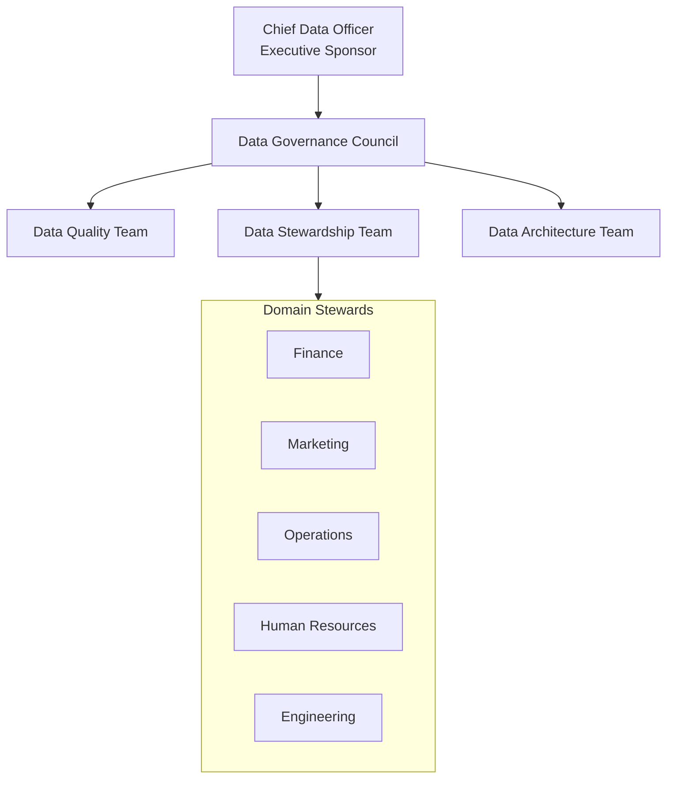
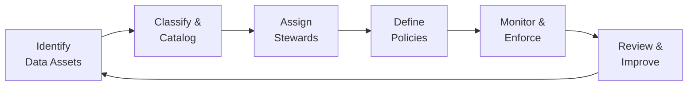
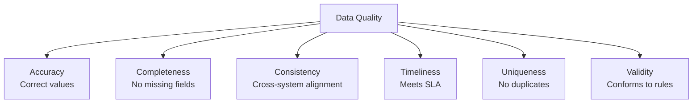
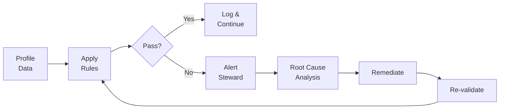
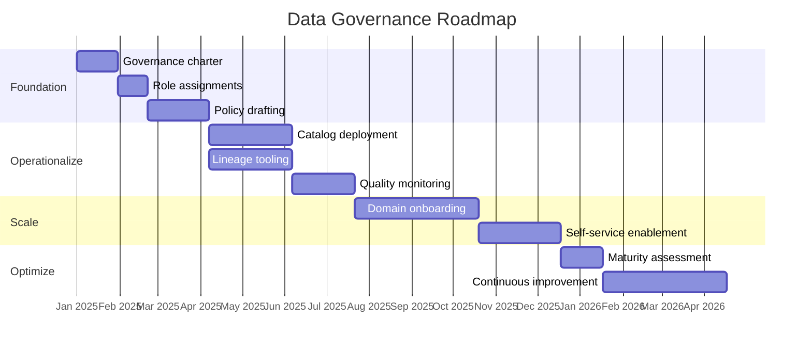

# Data Governance Framework

## Document Control

| Field              | Value                        |
| ------------------ | ---------------------------- |
| **Document ID**    | DGF-001                      |
| **Version**        | 1.0                          |
| **Classification** | Internal                     |
| **Author**         | `[Author Name]`              |
| **Reviewer**       | `[Reviewer Name]`            |
| **Approver**       | `[Approver Name]`            |
| **Created**        | `YYYY-MM-DD`                 |
| **Last Updated**   | `YYYY-MM-DD`                 |
| **Next Review**    | `YYYY-MM-DD`                 |
| **Status**         | Draft / In Review / Approved |

---

## Executive Summary

This framework establishes the organizational standards, processes, and accountability structures for managing data as a strategic enterprise asset. It defines data stewardship roles, lineage tracking requirements, and quality assurance procedures.

---

## Governance Structure

### Organizational Hierarchy

### RACI Matrix

| Activity          | CDO | Governance Council | Stewards | Data Engineers | Consumers |
| ----------------- | --- | ------------------ | -------- | -------------- | --------- |
| Define policies   | A   | R                  | C        | I              | I         |
| Classify data     | I   | A                  | R        | C              | I         |
| Monitor quality   | I   | A                  | C        | R              | I         |
| Approve access    | A   | R                  | C        | I              | I         |
| Track lineage     | I   | C                  | A        | R              | I         |
| Report compliance | R   | A                  | C        | C              | I         |

> **Legend**: R = Responsible, A = Accountable, C = Consulted, I = Informed

---

## Data Stewardship

### Stewardship Roles

| Role                    | Scope           | Responsibilities                          |
| ----------------------- | --------------- | ----------------------------------------- |
| **Executive Steward**   | Enterprise      | Strategic direction, budget, escalation   |
| **Domain Steward**      | Business Domain | Domain definitions, quality rules, access |
| **Technical Steward**   | Systems         | Schema management, lineage, pipelines     |
| **Operational Steward** | Day-to-Day      | Issue triage, user support, monitoring    |

### Stewardship Lifecycle

---

## Data Lineage

### Lineage Architecture

```mermaid
flowchart LR
    accTitle: Data Lineage Architecture
    accDescr: End-to-end data flow from source systems through transformations to consumption

    subgraph Sources["Source Systems"]
        S1["CRM"]
        S2["ERP"]
        S3["Web Analytics"]
        S4["IoT Sensors"]
    end

    subgraph Ingestion["Ingestion Layer"]
        I1["Batch ETL"]
        I2["Stream Processing"]
    end

    subgraph Storage["Storage Layer"]
        RAW["Raw Zone"]
        STG["Staging Zone"]
        CUR["Curated Zone"]
    end

    subgraph Consumption["Consumption Layer"]
        BI["BI Dashboards"]
        ML["ML Models"]
        API["Data APIs"]
        RPT["Reports"]
    end

    Sources --> Ingestion
    Ingestion --> RAW
    RAW --> STG
    STG --> CUR
    CUR --> Consumption
```

### Lineage Metadata Requirements

| Attribute             | Description                     | Required |
| --------------------- | ------------------------------- | -------- |
| Source System         | Origin of the data              | Yes      |
| Extraction Method     | How data was extracted          | Yes      |
| Transformation Rules  | Logic applied during processing | Yes      |
| Load Timestamp        | When data was loaded            | Yes      |
| Schema Version        | Version of the schema at load   | Yes      |
| Owner                 | Responsible steward             | Yes      |
| Freshness SLA         | Expected update frequency       | Yes      |
| Impact Classification | Business criticality (P1-P4)    | Yes      |

---

## Data Quality

### Quality Dimensions

### Quality Scoring Matrix

| Dimension    | Weight | Measurement Method            | Target  | Current |
| ------------ | ------ | ----------------------------- | ------- | ------- |
| Accuracy     | 25%    | Sampling + validation rules   | > 99%   | `___%`  |
| Completeness | 20%    | Null/empty field analysis     | > 98%   | `___%`  |
| Consistency  | 20%    | Cross-reference checks        | > 97%   | `___%`  |
| Timeliness   | 15%    | SLA compliance monitoring     | > 99%   | `___%`  |
| Uniqueness   | 10%    | Duplicate detection scans     | > 99.5% | `___%`  |
| Validity     | 10%    | Schema + business rule checks | > 98%   | `___%`  |

### Quality Monitoring Process

---

## Data Classification

### Classification Tiers

| Tier | Label            | Description             | Handling Requirements             |
| ---- | ---------------- | ----------------------- | --------------------------------- |
| 1    | **Public**       | Freely available        | No restrictions                   |
| 2    | **Internal**     | Internal use only       | Access controls required          |
| 3    | **Confidential** | Sensitive business data | Encryption + logging              |
| 4    | **Restricted**   | PII, PHI, financial     | Full encryption, MFA, audit trail |

---

## Compliance & Regulatory Mapping

| Regulation | Data Types Affected   | Requirements                       | Status     |
| ---------- | --------------------- | ---------------------------------- | ---------- |
| GDPR       | EU personal data      | Consent, erasure, portability      | `[Status]` |
| CCPA       | CA consumer data      | Disclosure, opt-out, deletion      | `[Status]` |
| HIPAA      | Protected health info | Encryption, access controls, BAAs  | `[Status]` |
| SOX        | Financial records     | Audit trails, retention            | `[Status]` |
| PCI DSS    | Payment card data     | Encryption, segmentation, scanning | `[Status]` |

---

## Policy Inventory

| Policy ID | Policy Name                | Owner    | Review Cycle | Last Review  |
| --------- | -------------------------- | -------- | ------------ | ------------ |
| POL-001   | Data Classification Policy | CDO      | Annual       | `YYYY-MM-DD` |
| POL-002   | Data Retention Policy      | Legal    | Annual       | `YYYY-MM-DD` |
| POL-003   | Data Access Policy         | Security | Semi-annual  | `YYYY-MM-DD` |
| POL-004   | Data Quality Policy        | DQ Lead  | Quarterly    | `YYYY-MM-DD` |
| POL-005   | Data Sharing Policy        | CDO      | Annual       | `YYYY-MM-DD` |

---

## Implementation Roadmap

---

## Approval & Sign-Off

| Role                 | Name              | Signature         | Date         |
| -------------------- | ----------------- | ----------------- | ------------ |
| Executive Sponsor    | `_______________` | `_______________` | `YYYY-MM-DD` |
| Data Governance Lead | `_______________` | `_______________` | `YYYY-MM-DD` |
| Legal/Compliance     | `_______________` | `_______________` | `YYYY-MM-DD` |
| IT/Engineering Lead  | `_______________` | `_______________` | `YYYY-MM-DD` |

---

## Revision History

| Version | Date         | Author     | Changes                    |
| ------- | ------------ | ---------- | -------------------------- |
| 0.1     | `YYYY-MM-DD` | `[Author]` | Initial draft              |
| 0.2     | `YYYY-MM-DD` | `[Author]` | Added lineage requirements |
| 1.0     | `YYYY-MM-DD` | `[Author]` | Approved for release       |
