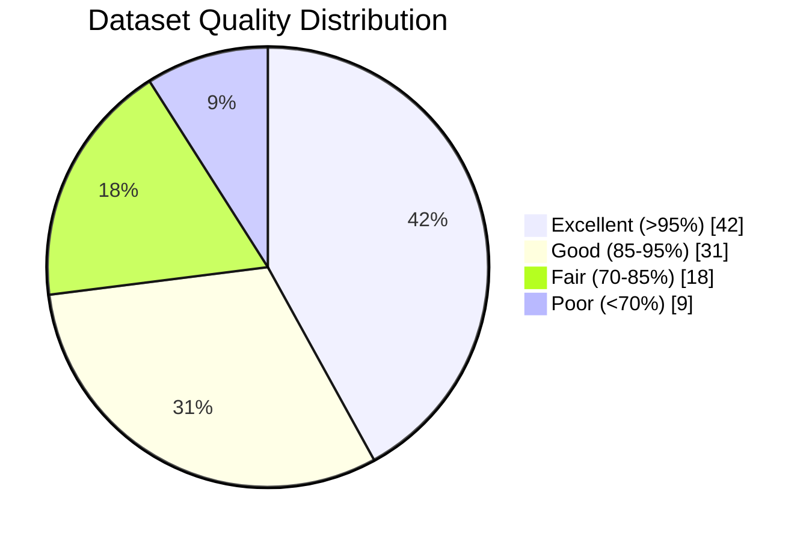
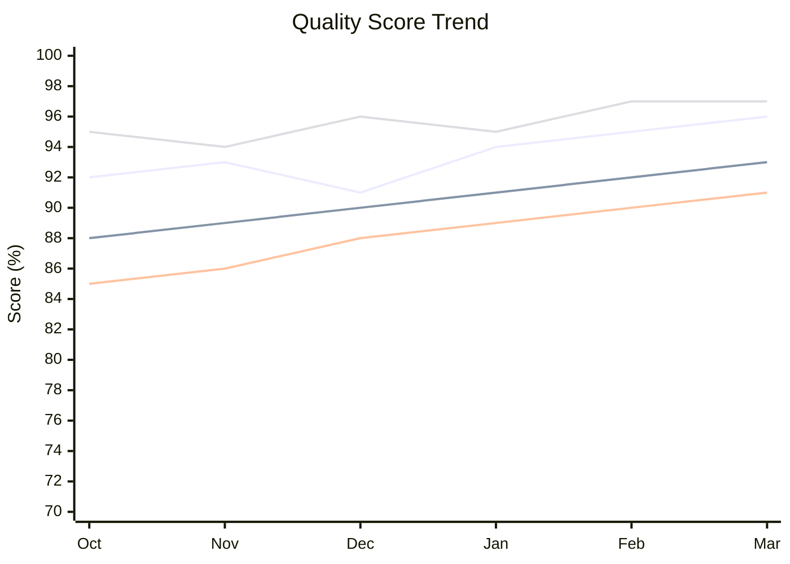
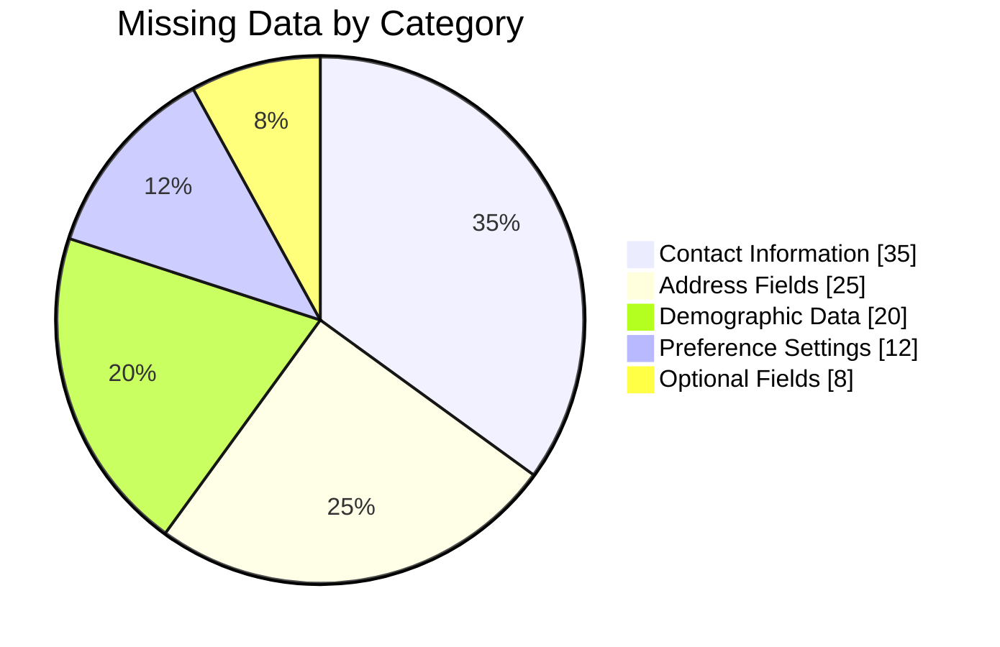
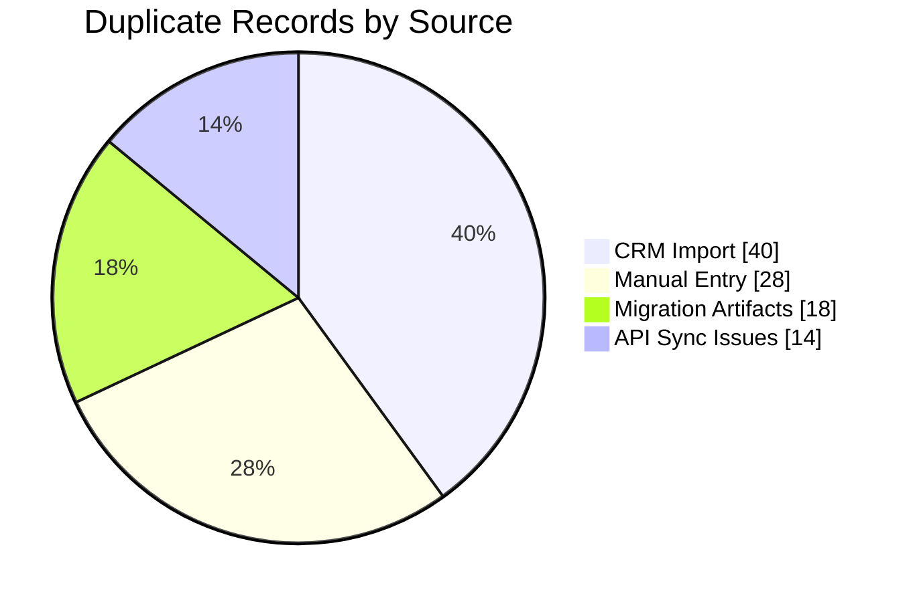
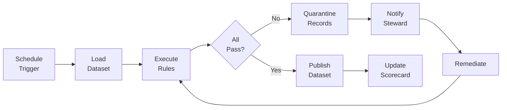
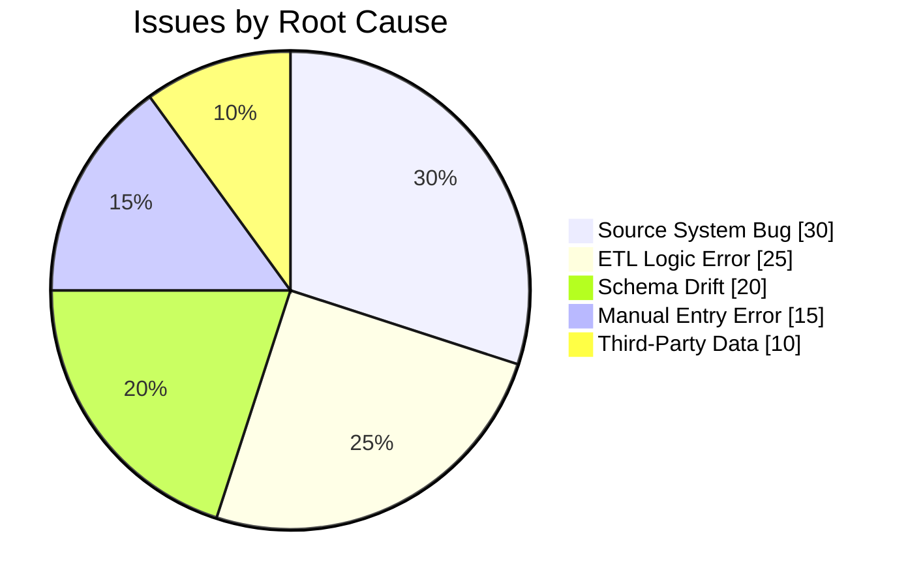

# Data Quality Report

## Document Control

| Field                | Value                        |
| -------------------- | ---------------------------- |
| **Document ID**      | DQR-001                      |
| **Version**          | 1.0                          |
| **Classification**   | Internal                     |
| **Author**           | `[Author Name]`              |
| **Reviewer**         | `[Reviewer Name]`            |
| **Approver**         | `[Approver Name]`            |
| **Reporting Period** | `YYYY-MM-DD` to `YYYY-MM-DD` |
| **Created**          | `YYYY-MM-DD`                 |
| **Status**           | Draft / Final                |

---

## Executive Summary

This report presents the current state of data quality across enterprise data assets for the reporting period. Overall data health score is **`___%`** against a target of **95%**. Key findings and recommended actions are summarized below.

### Health Score Summary

| Domain           | Score  | Target | Status                            |
| ---------------- | ------ | ------ | --------------------------------- |
| Customer Data    | `___%` | 95%    | `[On Track / At Risk / Critical]` |
| Financial Data   | `___%` | 98%    | `[On Track / At Risk / Critical]` |
| Product Data     | `___%` | 95%    | `[On Track / At Risk / Critical]` |
| Operational Data | `___%` | 93%    | `[On Track / At Risk / Critical]` |
| Marketing Data   | `___%` | 90%    | `[On Track / At Risk / Critical]` |

---

## Overall Data Health

### Quality Score Distribution

### Quality Trend (6-Month)

---

## Quality by Dimension

### Accuracy

| Dataset             | Records Checked | Accurate | Inaccurate | Score  | Trend     |
| ------------------- | --------------- | -------- | ---------- | ------ | --------- |
| Customer Profiles   | `___`           | `___`    | `___`      | `___%` | `[arrow]` |
| Transaction Records | `___`           | `___`    | `___`      | `___%` | `[arrow]` |
| Product Catalog     | `___`           | `___`    | `___`      | `___%` | `[arrow]` |
| Employee Records    | `___`           | `___`    | `___`      | `___%` | `[arrow]` |

### Completeness

| Dataset             | Total Fields | Populated | Missing | Score  | Trend     |
| ------------------- | ------------ | --------- | ------- | ------ | --------- |
| Customer Profiles   | `___`        | `___`     | `___`   | `___%` | `[arrow]` |
| Transaction Records | `___`        | `___`     | `___`   | `___%` | `[arrow]` |
| Product Catalog     | `___`        | `___`     | `___`   | `___%` | `[arrow]` |
| Employee Records    | `___`        | `___`     | `___`   | `___%` | `[arrow]` |

### Completeness Breakdown

### Consistency

| Cross-System Check | System A | System B | Matches | Mismatches | Score  |
| ------------------ | -------- | -------- | ------- | ---------- | ------ |
| Customer ID        | CRM      | Billing  | `___`   | `___`      | `___%` |
| Product Price      | Catalog  | POS      | `___`   | `___`      | `___%` |
| Employee Status    | HR       | Payroll  | `___`   | `___`      | `___%` |
| Order Total        | Orders   | Finance  | `___`   | `___`      | `___%` |

### Timeliness

| Pipeline          | SLA         | Avg Delivery | SLA Breaches | Score  |
| ----------------- | ----------- | ------------ | ------------ | ------ |
| Customer Sync     | 15 min      | `___ min`    | `___`        | `___%` |
| Transaction Load  | 1 hour      | `___ min`    | `___`        | `___%` |
| Daily Aggregation | 6:00 AM     | `___`        | `___`        | `___%` |
| Weekly Reports    | Monday 9 AM | `___`        | `___`        | `___%` |

### Uniqueness

| Dataset         | Total Records | Unique Records | Duplicates | Score  |
| --------------- | ------------- | -------------- | ---------- | ------ |
| Customer Master | `___`         | `___`          | `___`      | `___%` |
| Product SKUs    | `___`         | `___`          | `___`      | `___%` |
| Contact List    | `___`         | `___`          | `___`      | `___%` |
| Transaction Log | `___`         | `___`          | `___`      | `___%` |

### Duplicate Distribution

---

## Data Quality Rules

### Rule Execution Summary

| Rule Category         | Total Rules | Passed | Failed | Error | Pass Rate |
| --------------------- | ----------- | ------ | ------ | ----- | --------- |
| Schema Validation     | `___`       | `___`  | `___`  | `___` | `___%`    |
| Business Logic        | `___`       | `___`  | `___`  | `___` | `___%`    |
| Referential Integrity | `___`       | `___`  | `___`  | `___` | `___%`    |
| Range/Format Checks   | `___`       | `___`  | `___`  | `___` | `___%`    |
| Freshness Checks      | `___`       | `___`  | `___`  | `___` | `___%`    |

### Quality Rule Processing

---

## Top Issues

### Critical Issues (Requiring Immediate Action)

| ID     | Issue           | Domain     | Impact     | Root Cause | Owner     | Due Date     |
| ------ | --------------- | ---------- | ---------- | ---------- | --------- | ------------ |
| DQ-001 | `[Description]` | `[Domain]` | `[Impact]` | `[Cause]`  | `[Owner]` | `YYYY-MM-DD` |
| DQ-002 | `[Description]` | `[Domain]` | `[Impact]` | `[Cause]`  | `[Owner]` | `YYYY-MM-DD` |
| DQ-003 | `[Description]` | `[Domain]` | `[Impact]` | `[Cause]`  | `[Owner]` | `YYYY-MM-DD` |

### Issue Category Distribution

---

## Remediation Tracker

| Issue ID | Description     | Status      | Owner     | Target Date  | Progress |
| -------- | --------------- | ----------- | --------- | ------------ | -------- |
| DQ-001   | `[Description]` | Open        | `[Owner]` | `YYYY-MM-DD` | 0%       |
| DQ-002   | `[Description]` | In Progress | `[Owner]` | `YYYY-MM-DD` | 50%      |
| DQ-003   | `[Description]` | Resolved    | `[Owner]` | `YYYY-MM-DD` | 100%     |

---

## Recommendations

### Immediate Actions (0-30 Days)

1. `[Action item with specific owner and deadline]`
2. `[Action item with specific owner and deadline]`
3. `[Action item with specific owner and deadline]`

### Medium-Term Improvements (30-90 Days)

1. `[Action item with specific owner and deadline]`
2. `[Action item with specific owner and deadline]`

### Long-Term Initiatives (90+ Days)

1. `[Action item with specific owner and deadline]`
2. `[Action item with specific owner and deadline]`

---

## Appendix: Monitoring Dashboard Specifications

| Metric           | Visualization | Refresh   | Alert Threshold |
| ---------------- | ------------- | --------- | --------------- |
| Overall DQ Score | Gauge chart   | Hourly    | < 90%           |
| Rule Pass Rate   | Time series   | Hourly    | < 95%           |
| Duplicate Rate   | Trend line    | Daily     | > 2%            |
| SLA Compliance   | Heatmap       | Real-time | < 99%           |
| Issue Backlog    | Stacked bar   | Daily     | > 10 open       |

---

## Approval & Sign-Off

| Role                  | Name              | Signature         | Date         |
| --------------------- | ----------------- | ----------------- | ------------ |
| Data Quality Lead     | `_______________` | `_______________` | `YYYY-MM-DD` |
| Domain Steward        | `_______________` | `_______________` | `YYYY-MM-DD` |
| Data Engineering Lead | `_______________` | `_______________` | `YYYY-MM-DD` |

---

## Revision History

| Version | Date         | Author     | Changes       |
| ------- | ------------ | ---------- | ------------- |
| 0.1     | `YYYY-MM-DD` | `[Author]` | Initial draft |
| 1.0     | `YYYY-MM-DD` | `[Author]` | Final report  |
