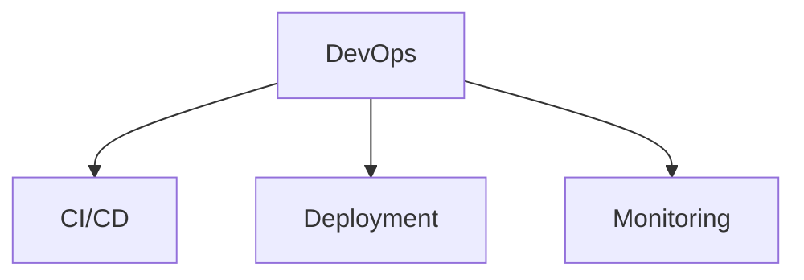

# DevOps

DevOps, CI/CD, and infrastructure templates.

## Templates

| Template                                         | Description         |
| ------------------------------------------------ | ------------------- |
| [cicd_pipeline.md](cicd_pipeline.md)             | CI/CD configuration |
| [deployment_strategy.md](deployment_strategy.md) | Deployment planning |
| [monitoring_runbook.md](monitoring_runbook.md)   | Monitoring guides   |

## Structure

See [Parent](../SKILL.md) for all categories.
