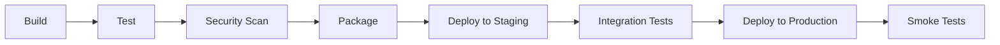
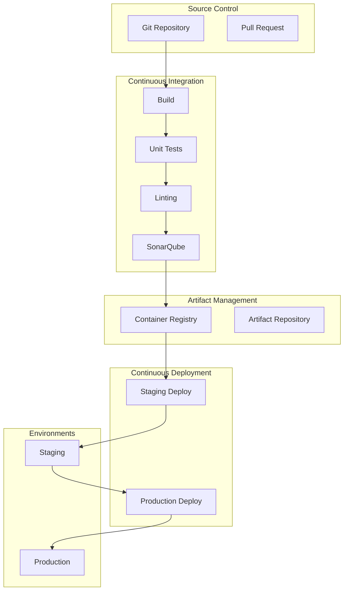
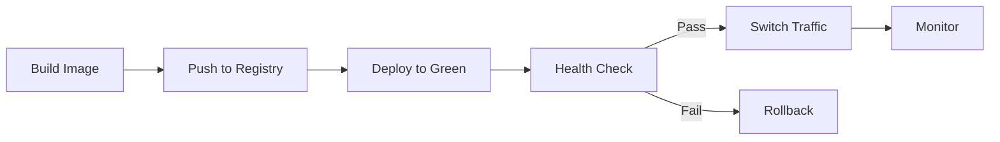
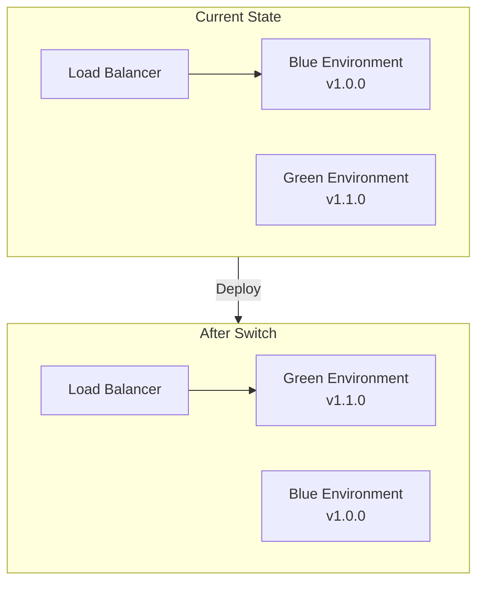
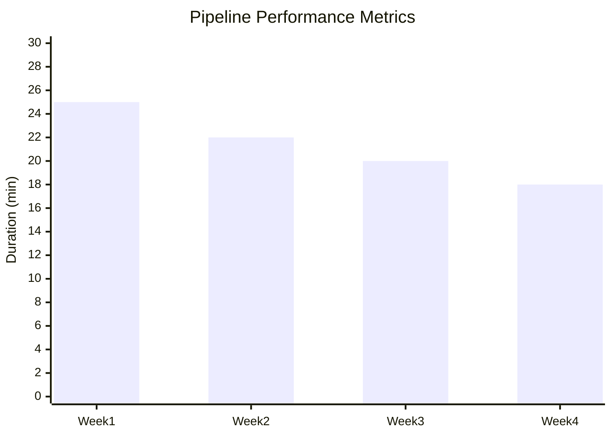

# CI/CD Pipeline Documentation

<!-- CI/CD pipeline design, configuration, and operational procedures -->

---

## Document Control

| Field              | Value                                               |
| ------------------ | --------------------------------------------------- |
| **Pipeline ID**    | PIPE-[YYYY]-[NNN]                                   |
| **Version**        | [X.Y.Z]                                             |
| **Date**           | [YYYY-MM-DD]                                        |
| **Author**         | [Name, Role]                                        |
| **Pipeline Owner** | [Name, Role]                                        |
| **Platform**       | GitHub Actions / GitLab CI / Jenkins / Azure DevOps |
| **Status**         | Draft / Active / Deprecated                         |

---

## Executive Summary

### Pipeline Overview

| Attribute           | Value                         |
| ------------------- | ----------------------------- |
| **Repository**      | [URL]                         |
| **Primary Branch**  | main / master                 |
| **Trigger**         | Push / PR / Schedule / Manual |
| **Build Frequency** | [N] per day                   |
| **Success Rate**    | [X]%                          |
| **Avg Duration**    | [N] minutes                   |

### Pipeline Stages



---

## Pipeline Architecture

### Workflow Diagram



---

## Pipeline Configuration

### Stage: Build

```yaml
# Example GitHub Actions workflow
name: CI/CD Pipeline

on:
  push:
    branches: [main]
  pull_request:
    branches: [main]

jobs:
  build:
    runs-on: ubuntu-latest
    steps:
      - uses: actions/checkout@v4

      - name: Setup Node.js
        uses: actions/setup-node@v4
        with:
          node-version: "20"

      - name: Install dependencies
        run: npm ci

      - name: Build
        run: npm run build

      - name: Upload artifacts
        uses: actions/upload-artifact@v4
        with:
          name: build-output
          path: dist/
```

### Stage: Test

| Test Type   | Command                    | Coverage Threshold |
| ----------- | -------------------------- | ------------------ |
| Unit Tests  | `npm test`                 | > 80%              |
| Integration | `npm run test:integration` | > 70%              |
| E2E         | `npm run test:e2e`         | > 60%              |

**Coverage Formula:**

$$\text{Coverage} = \frac{\text{Lines Covered}}{\text{Total Lines}} \times 100$$

### Stage: Security Scan

| Scanner   | Purpose                    | Severity Threshold |
| --------- | -------------------------- | ------------------ |
| Snyk      | Dependency vulnerabilities | High               |
| SonarQube | Code quality & security    | Major              |
| Trivy     | Container vulnerabilities  | Critical           |
| OWASP ZAP | Web app vulnerabilities    | High               |

### Stage: Deploy



---

## Environment Configuration

### Environment Matrix

| Environment | Branch     | Auto-Deploy | Approval Required |
| ----------- | ---------- | ----------- | ----------------- |
| Development | feature/\* | Yes         | No                |
| Staging     | main       | Yes         | No                |
| Production  | main       | No          | Yes               |

### Environment Variables

| Variable    | Dev         | Staging         | Production |
| ----------- | ----------- | --------------- | ---------- |
| `API_URL`   | dev.api.com | staging.api.com | api.com    |
| `DB_HOST`   | dev-db      | staging-db      | prod-db    |
| `LOG_LEVEL` | debug       | info            | warn       |

### Secrets Management

| Secret               | Location            | Rotation |
| -------------------- | ------------------- | -------- |
| Database credentials | AWS Secrets Manager | 90 days  |
| API keys             | HashiCorp Vault     | 180 days |
| TLS certificates     | cert-manager        | 365 days |

---

## Deployment Strategies

### Blue-Green Deployment



### Canary Deployment

| Phase | Traffic % | Duration | Criteria           |
| ----- | --------- | -------- | ------------------ |
| 1     | 5%        | 15 min   | Error rate < 1%    |
| 2     | 25%       | 30 min   | Error rate < 0.5%  |
| 3     | 50%       | 30 min   | Latency < baseline |
| 4     | 100%      | -        | Full rollout       |

---

## Quality Gates

### Pre-Deployment Checks

| Gate        | Check           | Threshold  | Action |
| ----------- | --------------- | ---------- | ------ |
| Build       | Compilation     | 0 errors   | Block  |
| Tests       | Unit test pass  | > 90%      | Block  |
| Coverage    | Code coverage   | > 80%      | Warn   |
| Security    | Vulnerabilities | 0 critical | Block  |
| Performance | Benchmark       | < baseline | Warn   |

### Post-Deployment Verification

| Check                | Method          | Frequency  |
| -------------------- | --------------- | ---------- |
| Health check         | HTTP endpoint   | Every 30s  |
| Smoke tests          | Automated suite | Once       |
| Synthetic monitoring | Pingdom         | Continuous |
| Error rate           | APM             | Continuous |

---

## Rollback Procedures

### Automatic Rollback Triggers

| Condition            | Threshold     | Action   |
| -------------------- | ------------- | -------- |
| Error rate           | > 5%          | Rollback |
| Latency p99          | > 2x baseline | Rollback |
| Failed health checks | 3 consecutive | Rollback |

### Manual Rollback

```bash
# Rollback to previous version
kubectl rollout undo deployment/my-app

# Verify rollback
kubectl rollout status deployment/my-app

# Check pod status
kubectl get pods -l app=my-app
```

---

## Monitoring & Observability

### Pipeline Metrics



| Metric               | Target   | Current |
| -------------------- | -------- | ------- |
| Lead time            | < 1 hour | [N] min |
| Deployment frequency | Daily    | [N]/day |
| Change failure rate  | < 15%    | [X]%    |
| MTTR                 | < 1 hour | [N] min |

### DORA Metrics

| Metric               | Elite        | High     | Medium    | Current  |
| -------------------- | ------------ | -------- | --------- | -------- |
| Deployment Frequency | Multiple/day | Weekly   | Monthly   | [Status] |
| Lead Time            | < 1 hour     | < 1 week | < 1 month | [Status] |
| MTTR                 | < 1 hour     | < 1 day  | < 1 week  | [Status] |
| Change Failure Rate  | < 5%         | < 15%    | < 30%     | [Status] |

---

## Security

### Pipeline Security

| Control             | Implementation           |
| ------------------- | ------------------------ |
| Secrets scanning    | Detect secrets in code   |
| SAST                | Static analysis          |
| DAST                | Dynamic testing          |
| Container scanning  | Image vulnerability scan |
| Dependency scanning | Known vulnerabilities    |

### Access Control

| Resource            | Access        | Approval    |
| ------------------- | ------------- | ----------- |
| Production pipeline | Platform team | Manager     |
| Secrets             | Pipeline only | Security    |
| Deployment approval | Tech lead     | Auto/Manual |

---

## Troubleshooting

### Common Issues

| Issue          | Cause               | Solution            |
| -------------- | ------------------- | ------------------- |
| Build fails    | Dependency conflict | Lock file update    |
| Tests timeout  | Resource contention | Parallel reduction  |
| Deploy fails   | Health check        | Check logs          |
| Rollback fails | State mismatch      | Manual intervention |

### Debug Commands

```bash
# View pipeline logs
gitHub actions logs --run-id <id>

# Check deployment status
kubectl describe deployment my-app

# View recent events
kubectl get events --sort-by=.lastTimestamp
```

---

## Appendices

### A. Full Pipeline YAML

[Complete pipeline configuration]

### B. Environment Setup

[Environment configuration guide]

### C. Runbooks

[Operational procedures]

---

_Last updated: [Date]_

---

## See Also

- [Deployment Strategy](./deployment_strategy.md) — Deployment patterns
- [Monitoring Runbook](./monitoring_runbook.md) — Operational monitoring
- [Post-Mortem](../engineering/post_mortem.md) — Incident analysis
