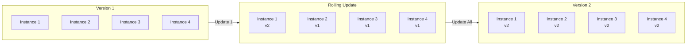
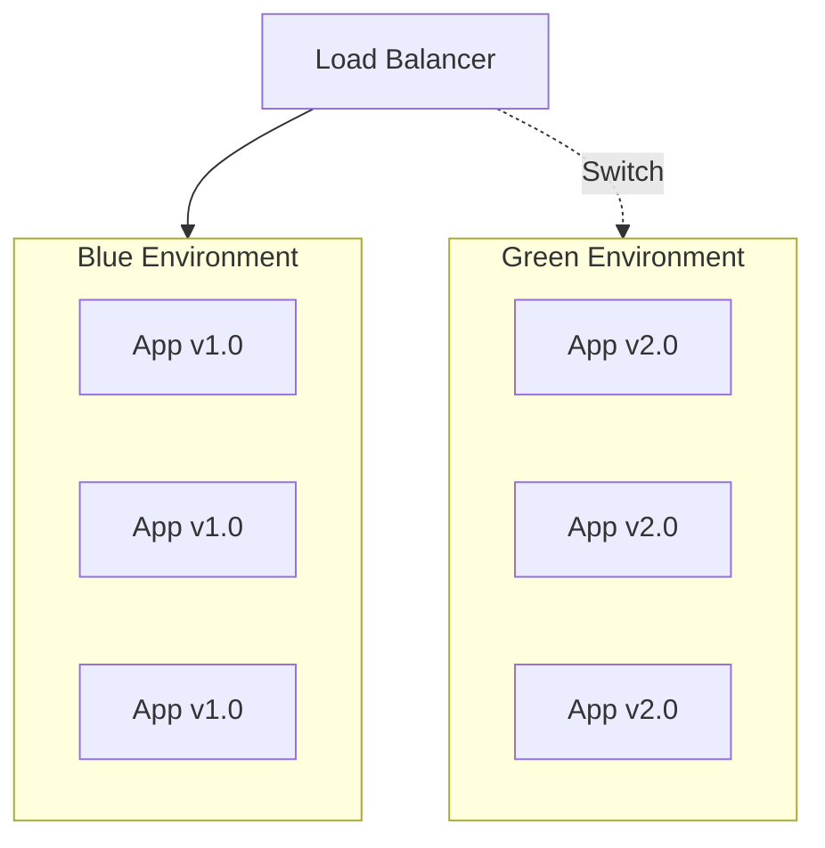
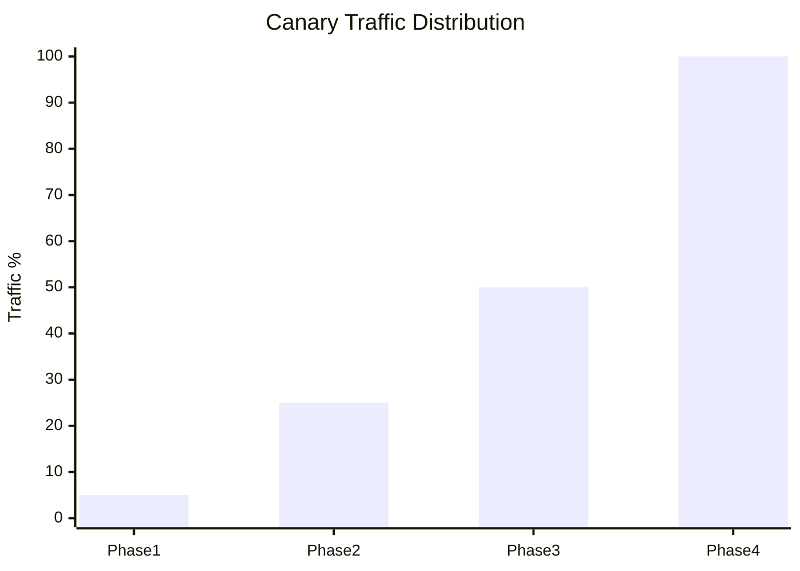
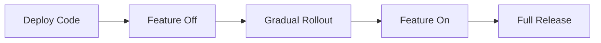
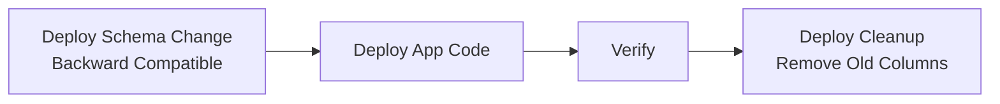
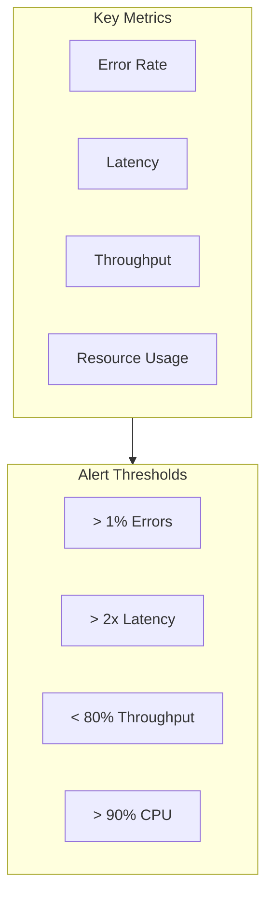

# Deployment Strategy

<!-- Deployment patterns and operational procedures -->

---

## Document Control

| Field           | Value            |
| --------------- | ---------------- |
| **Strategy ID** | DEP-[YYYY]-[NNN] |
| **Version**     | [X.Y.Z]          |
| **Date**        | [YYYY-MM-DD]     |
| **Author**      | [Name, Role]     |
| **Approver**    | [Name, Role]     |
| **Status**      | Draft / Approved |

---

## Executive Summary

### Deployment Overview

| Attribute                | Value            |
| ------------------------ | ---------------- |
| **Deployment Frequency** | [N] per day/week |
| **Success Rate**         | [X]%             |
| **Avg Rollback Rate**    | [X]%             |
| **Lead Time**            | [N] hours        |

### Strategy Selection Matrix

| Strategy    | Risk   | Complexity | Use Case           |
| ----------- | ------ | ---------- | ------------------ |
| Rolling     | Low    | Low        | Standard updates   |
| Blue-Green  | Medium | Medium     | Critical systems   |
| Canary      | Medium | High       | Risky changes      |
| A/B Testing | Medium | High       | Feature validation |
| Recreate    | High   | Low        | Development        |

---

## Deployment Patterns

### Rolling Deployment



**Configuration:**

- Max surge: 25%
- Max unavailable: 25%
- Health check grace period: 60s

### Blue-Green Deployment



**Process:**

1. Deploy v2.0 to Green environment
2. Run smoke tests on Green
3. Switch load balancer to Green
4. Monitor for issues
5. Keep Blue for rollback

### Canary Deployment



| Phase | Canary % | Duration | Success Criteria   |
| ----- | -------- | -------- | ------------------ |
| 1     | 5%       | 15 min   | Error rate < 1%    |
| 2     | 25%      | 30 min   | Error rate < 0.5%  |
| 3     | 50%      | 30 min   | Latency < baseline |
| 4     | 100%     | -        | Full rollout       |

**Rollback Trigger:**

- Error rate > 2%
- Latency p99 > 2x baseline
- Any critical alert

### Feature Flags



| Flag           | Default | Rollout      | Owner       |
| -------------- | ------- | ------------ | ----------- |
| `new_checkout` | false   | 10%/day      | Product     |
| `beta_feature` | false   | User segment | Engineering |

---

## Pre-Deployment Checklist

### Technical Checks

- [ ] All tests passing
- [ ] Code review approved
- [ ] Security scan clean
- [ ] Performance benchmarks acceptable
- [ ] Database migrations tested
- [ ] Rollback plan documented

### Business Checks

- [ ] Feature flags configured
- [ ] Monitoring dashboards ready
- [ ] Support team notified
- [ ] Documentation updated
- [ ] Change log prepared

---

## Deployment Procedure

### Standard Deployment

| Step | Action                | Duration | Verification        |
| ---- | --------------------- | -------- | ------------------- |
| 1    | Announce deployment   | 5 min    | Slack notification  |
| 2    | Run pre-deploy checks | 10 min   | All green           |
| 3    | Execute deployment    | 15 min   | Progress monitoring |
| 4    | Run smoke tests       | 10 min   | All pass            |
| 5    | Monitor metrics       | 30 min   | No anomalies        |
| 6    | Announce completion   | 5 min    | Slack notification  |

### Database Migrations



**Rules:**

1. Never delete columns in same deploy
2. Add new columns first
3. Deploy code to use new columns
4. Remove old columns later

---

## Health Checks

### Readiness Probe

```yaml
readinessProbe:
  httpGet:
    path: /health/ready
    port: 8080
  initialDelaySeconds: 10
  periodSeconds: 5
  failureThreshold: 3
```

### Liveness Probe

```yaml
livenessProbe:
  httpGet:
    path: /health/live
    port: 8080
  initialDelaySeconds: 30
  periodSeconds: 10
  failureThreshold: 3
```

### Startup Probe

```yaml
startupProbe:
  httpGet:
    path: /health/startup
    port: 8080
  initialDelaySeconds: 10
  periodSeconds: 5
  failureThreshold: 30
```

---

## Rollback Procedures

### Automatic Rollback

| Trigger              | Threshold     | Action    |
| -------------------- | ------------- | --------- |
| Error rate           | > 5%          | Immediate |
| Latency p99          | > 2x baseline | 5 min     |
| Failed health checks | 3 consecutive | Immediate |

### Manual Rollback

```bash
# Kubernetes rollback
kubectl rollout undo deployment/my-app

# Verify rollback
kubectl rollout history deployment/my-app

# Check status
kubectl get pods -l app=my-app
```

### Database Rollback

| Scenario                | Rollback Strategy          |
| ----------------------- | -------------------------- |
| Schema migration failed | Restore from backup        |
| Data corruption         | Point-in-time recovery     |
| Performance issue       | Revert to previous version |

---

## Monitoring

### Deployment Metrics

| Metric              | Target   | Alert    |
| ------------------- | -------- | -------- |
| Deployment duration | < 15 min | > 30 min |
| Success rate        | > 95%    | < 90%    |
| Rollback rate       | < 5%     | > 10%    |

### Real-time Monitoring



---

## Security

### Deployment Security

| Control          | Implementation         |
| ---------------- | ---------------------- |
| Signed artifacts | Cosign signatures      |
| Immutable tags   | Never reuse tags       |
| Least privilege  | Service accounts       |
| Audit logging    | All deployments logged |

### Approval Matrix

| Environment | Approver  | Auto-Deploy |
| ----------- | --------- | ----------- |
| Development | None      | Yes         |
| Staging     | Tech Lead | Yes         |
| Production  | Manager   | No          |

---

## Troubleshooting

### Common Issues

| Symptom             | Cause            | Solution       |
| ------------------- | ---------------- | -------------- |
| Pods not starting   | Resource limits  | Check quotas   |
| Health checks fail  | App not ready    | Increase delay |
| Traffic not routing | Service selector | Check labels   |
| Rollback fails      | Revision missing | Manual restore |

### Debug Commands

```bash
# Check deployment status
kubectl describe deployment my-app

# View pod logs
kubectl logs -l app=my-app --tail=100

# Check events
kubectl get events --field-selector type=Warning

# Port forward for debugging
kubectl port-forward pod/my-app-xxx 8080:8080
```

---

## Appendices

### A. Deployment Runbooks

[Step-by-step procedures]

### B. Incident Response

[Deployment failure procedures]

### C. Tool Configuration

[Tool-specific settings]

---

_Last updated: [Date]_

---

## See Also

- [CI/CD Pipeline](./cicd_pipeline.md) — Pipeline configuration
- [Monitoring Runbook](./monitoring_runbook.md) — Operational monitoring
- [Post-Mortem](../engineering/post_mortem.md) — Incident analysis
