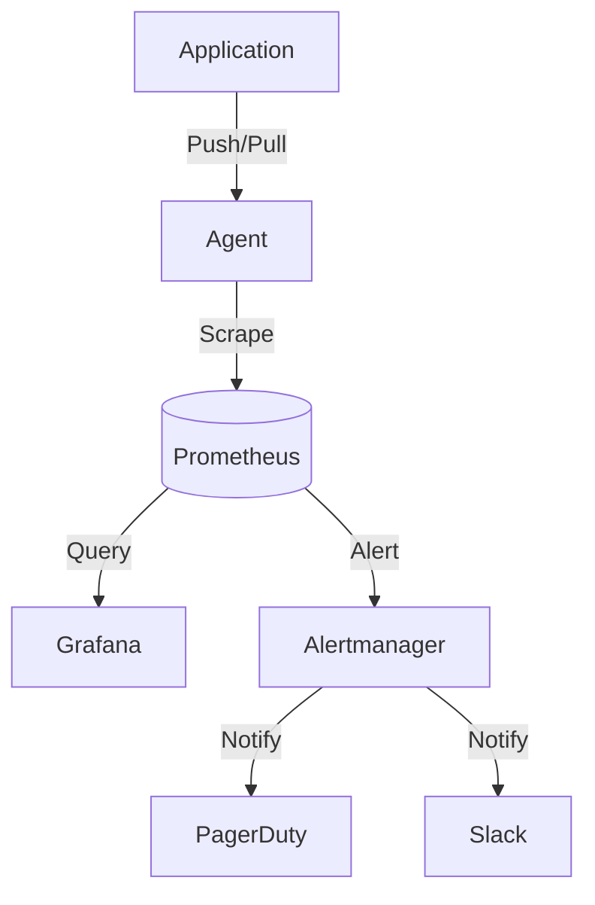
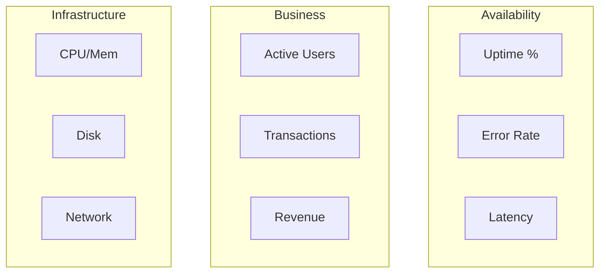
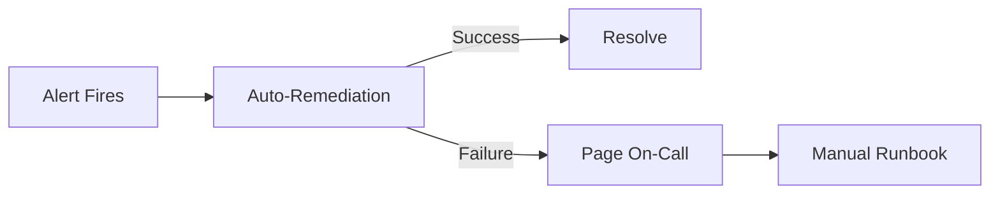

# Monitoring Runbook

<!-- Operational monitoring and alerting procedures -->

---

## Document Control

| Field            | Value           |
| ---------------- | --------------- |
| **Runbook ID**   | RB-[YYYY]-[NNN] |
| **Version**      | [X.Y.Z]         |
| **Date**         | [YYYY-MM-DD]    |
| **Author**       | [Name, Role]    |
| **Owner**        | [Name, Role]    |
| **Review Cycle** | Quarterly       |
| **Status**       | Draft / Active  |

---

## Executive Summary

### Monitoring Scope

| Category       | Coverage       | Tools                |
| -------------- | -------------- | -------------------- |
| Infrastructure | 100%           | Datadog / Prometheus |
| Applications   | 100%           | APM / Custom metrics |
| Business       | Key flows      | Custom dashboards    |
| Security       | Critical paths | SIEM                 |

### Alert Overview

| Severity      | Count | Response Time |
| ------------- | ----- | ------------- |
| Critical (P1) | [N]   | 5 minutes     |
| High (P2)     | [N]   | 15 minutes    |
| Medium (P3)   | [N]   | 1 hour        |
| Low (P4)      | [N]   | 4 hours       |

---

## Monitoring Architecture

### Observability Stack

```mermaid
flowchart LR
    accTitle: Monitoring Architecture
    accDescr: End-to-end observability

    subgraph Sources["Data Sources"]
        S1[Application Logs]
        S2[Metrics]
        S3[Traces]
        S4[Events]
    end

    subgraph Collection["Collection"]
        C1[Prometheus]
        C2[Grafana]
        C3[Jaeger]
        C4[ELK]
    end

    subgraph Analysis["Analysis"]
        A1[Dashboards]
        A2[Alerts]
        A3[Correlations]
    end

    subgraph Action["Action"]
        AC1[PagerDuty]
        AC2[Slack]
        AC3[Auto-Remediation]
    end

    Sources --> Collection --> Analysis --> Action
```



### Data Flow



---

## Metrics

### Infrastructure Metrics

| Metric       | Query                   | Threshold | Severity |
| ------------ | ----------------------- | --------- | -------- |
| CPU Usage    | `cpu_usage_percent`     | > 80%     | Warning  |
| Memory Usage | `memory_usage_percent`  | > 85%     | Warning  |
| Disk Usage   | `disk_usage_percent`    | > 90%     | Critical |
| Network I/O  | `network_bytes_per_sec` | > 1Gbps   | Warning  |

### Application Metrics

| Metric       | Type      | Target   | Alert     |
| ------------ | --------- | -------- | --------- |
| Request rate | Counter   | Baseline | Deviation |
| Error rate   | Gauge     | < 0.1%   | > 1%      |
| Latency p50  | Histogram | < 100ms  | > 200ms   |
| Latency p99  | Histogram | < 500ms  | > 1s      |

### Business Metrics

| Metric              | Description  | Target     |
| ------------------- | ------------ | ---------- |
| Checkout completion | % successful | > 95%      |
| User signups        | Daily count  | > baseline |
| Revenue             | Hourly       | > baseline |

---

## Alerting

### Alert Rules

```yaml
# Example Prometheus alert rule
groups:
  - name: service_alerts
    rules:
      - alert: HighErrorRate
        expr: |
          (
            sum(rate(http_requests_total{status=~"5.."}[5m]))
            /
            sum(rate(http_requests_total[5m]))
          ) > 0.01
        for: 5m
        labels:
          severity: critical
        annotations:
          summary: "High error rate detected"
          description: "Error rate is {{ $value }}%"
```

### Alert Routing

| Severity | Channel           | Escalation        |
| -------- | ----------------- | ----------------- |
| Critical | PagerDuty + Slack | 5 min → Manager   |
| High     | Slack + Email     | 15 min → Lead     |
| Medium   | Slack             | 1 hour → Team     |
| Low      | Email             | Next business day |

### Alert Fatigue Prevention

| Technique  | Implementation            |
| ---------- | ------------------------- |
| Grouping   | Related alerts grouped    |
| Inhibition | Suppress dependent alerts |
| Silencing  | Maintenance windows       |
| Throttling | Rate limit notifications  |

---

## Dashboards

### Executive Dashboard



### Technical Dashboard

| Panel               | Query                                       | Refresh |
| ------------------- | ------------------------------------------- | ------- |
| Request rate        | `sum(rate(http_requests[5m]))`              | 10s     |
| Error breakdown     | `sum by (status) (rate(http_requests[5m]))` | 30s     |
| Latency percentiles | `histogram_quantile(0.99, ...)`             | 10s     |
| Resource usage      | `100 - (avg by (instance) ...)`             | 30s     |

---

## Incident Response

### Alert Response Procedure

| Step | Action             | Time    |
| ---- | ------------------ | ------- |
| 1    | Acknowledge alert  | < 5 min |
| 2    | Assess severity    | 5 min   |
| 3    | Check dashboard    | 5 min   |
| 4    | Execute runbook    | 10 min  |
| 5    | Escalate if needed | 15 min  |

### Common Alert Responses

#### Alert: High CPU Usage

**Symptom:** CPU > 80% for 5 minutes

**Diagnosis:**

```bash
# Check top processes
top -o %CPU

# Check process details
ps aux --sort=-%cpu | head -20

# Check for runaway processes
pidstat 1 5
```

**Resolution:**

1. Identify high CPU process
2. Check if expected (batch job)
3. If unexpected, restart process
4. If persistent, scale up

#### Alert: High Error Rate

**Symptom:** Error rate > 1%

**Diagnosis:**

```bash
# Check error logs
kubectl logs -l app=my-app | grep ERROR

# Check recent deployments
kubectl rollout history deployment/my-app

# Check dependency health
curl -s http://dependency/health
```

**Resolution:**

1. Check for recent deployments
2. Review error logs
3. Check downstream dependencies
4. Consider rollback if deployment-related

#### Alert: Disk Full

**Symptom:** Disk usage > 90%

**Diagnosis:**

```bash
# Check disk usage
df -h

# Find large files
du -h /var/log | sort -rh | head -20

# Check inode usage
df -i
```

**Resolution:**

1. Clean up logs
2. Archive old data
3. Expand volume if needed
4. Review retention policies

---

## Log Analysis

### Log Query Examples

```bash
# Search for errors
grep -i "error" /var/log/app.log

# Filter by time range
awk '/2024-01-15 10:00/,/2024-01-15 11:00/' app.log

# Count by error type
grep "ERROR" app.log | cut -d' ' -f5 | sort | uniq -c | sort -rn

# Follow real-time logs
tail -f /var/log/app.log | grep ERROR
```

### Log Correlation

| Source        | Field      | Correlation              |
| ------------- | ---------- | ------------------------ |
| Application   | request_id | Trace across services    |
| Load balancer | trace_id   | Track request flow       |
| Database      | session_id | Link queries to requests |

---

## Performance Analysis

### Latency Analysis

$$\text{Latency} = T_{response} - T_{request}$$

| Percentile | Target  | Alert   |
| ---------- | ------- | ------- |
| p50        | < 100ms | > 200ms |
| p95        | < 500ms | > 1s    |
| p99        | < 1s    | > 2s    |

### Throughput Analysis

```mermaid
xychart-beta
    title "Request Throughput"
    x-axis [00:00, 04:00, 08:00, 12:00, 16:00, 20:00]
    y-axis "Requests/sec" 0 --> 1000
    line [100, 50, 400, 800, 750, 300]
```

---

## Capacity Planning

### Resource Forecasting

| Resource | Current | Trend | Forecast (30d) |
| -------- | ------- | ----- | -------------- |
| CPU      | 60%     | ↑     | 75%            |
| Memory   | 70%     | →     | 72%            |
| Disk     | 80%     | ↑     | 90%            |

### Scaling Triggers

| Metric   | Scale Up     | Scale Down    |
| -------- | ------------ | ------------- |
| CPU      | > 70% for 5m | < 30% for 10m |
| Memory   | > 80% for 5m | < 40% for 10m |
| Requests | > 1000/s     | < 100/s       |

---

## Automation

### Auto-Remediation

| Scenario     | Trigger           | Action           |
| ------------ | ----------------- | ---------------- |
| Service down | Health check fail | Restart service  |
| Disk full    | > 90%             | Clean logs       |
| High memory  | > 90%             | Restart pod      |
| Stuck job    | > 1 hour          | Kill and restart |

### Runbook Automation



---

## Appendices

### A. Metric Reference

[Complete metric catalog]

### B. Dashboard URLs

[Links to all dashboards]

### C. Tool Access

[Credentials and access procedures]

---

_Last updated: [Date]_

---

## See Also

- [CI/CD Pipeline](./cicd_pipeline.md) — Deployment monitoring
- [Deployment Strategy](./deployment_strategy.md) — Deployment patterns
- [Incident Response](../security/incident_response.md) — Security incidents
