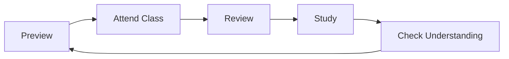

# Study Skills for Middle School

## The Study Cycle

## Active Study Strategies

### Strategy 1: {{STRATEGY_1}}
- **How**: {{METHOD_1}}
- **Best for**: {{SUBJECT_1}}

### Strategy 2: {{STRATEGY_2}}
- **How**: {{METHOD_2}}
- **Best for**: {{SUBJECT_2}}

### Strategy 3: {{STRATEGY_3}}
- **How**: {{METHOD_3}}
- **Best for**: {{SUBJECT_3}}

## Study Schedule Template

| Time | Monday | Tuesday | Wednesday | Thursday | Friday |
|------|--------|---------|-----------|----------|--------|
| {{TIME_1}} | {{MON_1}} | {{TUE_1}} | {{WED_1}} | {{THU_1}} | {{FRI_1}} |
| {{TIME_2}} | {{MON_2}} | {{TUE_2}} | {{WED_2}} | {{THU_2}} | {{FRI_2}} |

## Memory Techniques

1. **Chunking**: Break {{LARGE_TOPIC}} into {{CHUNKS}}
2. **Mnemonics**: Create {{MNEMONIC_EXAMPLE}}
3. **Spaced Repetition**: Review on days {{DAY_1}}, {{DAY_2}}, {{DAY_3}}

