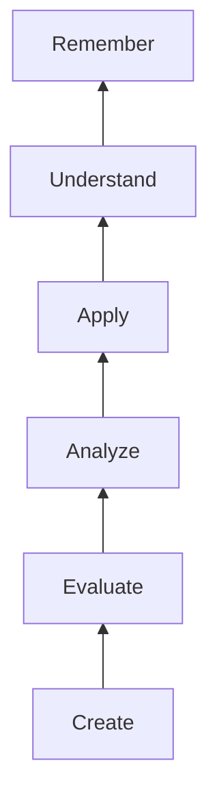

# Critical Thinking Framework

## Bloom's Taxonomy

## Analysis Questions

### For Texts
1. What is the author's main argument? {{MAIN_ARG}}
2. What evidence supports this? {{EVIDENCE}}
3. What assumptions does the author make? {{ASSUMPTIONS}}
4. What is the tone? {{TONE}}

### For Data
1. What do these numbers show? {{DATA_SHOWS}}
2. What patterns exist? {{PATTERNS}}
3. What conclusions can we draw? {{CONCLUSIONS}}
4. What limitations exist? {{LIMITATIONS}}

## Evaluation Criteria

| Criterion | Question to Ask | Rating |
|-----------|----------------|--------|
| Credibility | Is the source trustworthy? | {{RATING_1}} |
| Accuracy | Is the information correct? | {{RATING_2}} |
| Relevance | Does it matter to my purpose? | {{RATING_3}} |
| Bias | Is there a hidden agenda? | {{RATING_4}} |

## Synthesis Activity

Combine ideas from {{SOURCE_1}} and {{SOURCE_2}}:

New insight: {{SYNTHESIS}}

