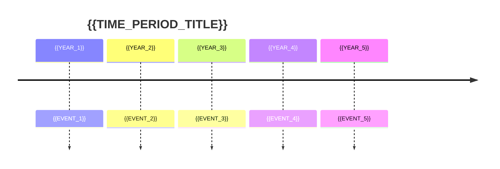

# Historical Timeline Project

**Student:** {{STUDENT_NAME}}  
**Time Period:** {{TIME_PERIOD}}  
**Due Date:** {{DUE_DATE}}

## Timeline Overview

## Event Cards

### Event 1: {{EVENT_NAME_1}}
- **Date:** {{DATE_1}}
- **Description:** {{DESC_1}}
- **Significance:** {{SIGNIF_1}}
- **Image:** {{IMAGE_1}}

### Event 2: {{EVENT_NAME_2}}
- **Date:** {{DATE_2}}
- **Description:** {{DESC_2}}
- **Significance:** {{SIGNIF_2}}
- **Image:** {{IMAGE_2}}

### Event 3: {{EVENT_NAME_3}}
- **Date:** {{DATE_3}}
- **Description:** {{DESC_3}}
- **Significance:** {{SIGNIF_3}}
- **Image:** {{IMAGE_3}}

## Reflection Questions

1. What patterns do you notice? {{PATTERN}}
2. Which event had the biggest impact? {{BIGGEST_IMPACT}}
3. How does this relate to today? {{RELATION}}

## Rubric

| Criteria | Excellent (4) | Proficient (3) | Developing (2) | Beginning (1) |
|----------|--------------|----------------|----------------|-------------|
| Accuracy | {{ACC_4}} | {{ACC_3}} | {{ACC_2}} | {{ACC_1}} |
| Detail | {{DET_4}} | {{DET_3}} | {{DET_2}} | {{DET_1}} |
| Visuals | {{VIS_4}} | {{VIS_3}} | {{VIS_2}} | {{VIS_1}} |

