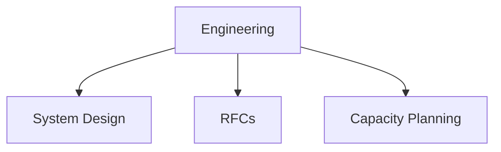

# Engineering

Engineering and technical documentation templates.

## Templates

| Template                                               | Description        |
| ------------------------------------------------------ | ------------------ |
| [system_design_document.md](system_design_document.md) | System design docs |
| [rfc_document.md](rfc_document.md)                     | RFC templates      |
| [capacity_plan.md](capacity_plan.md)                   | Capacity planning  |
| [post_mortem.md](post_mortem.md)                       | Incident analysis  |

## Structure

See [Parent](../SKILL.md) for all categories.
