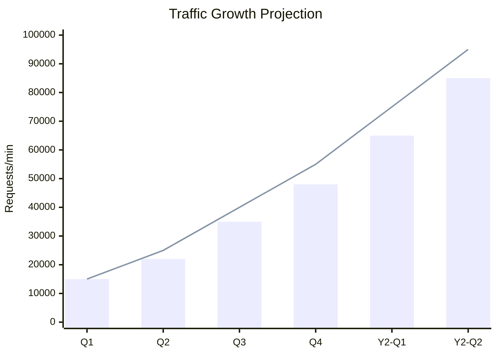
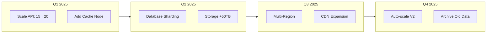
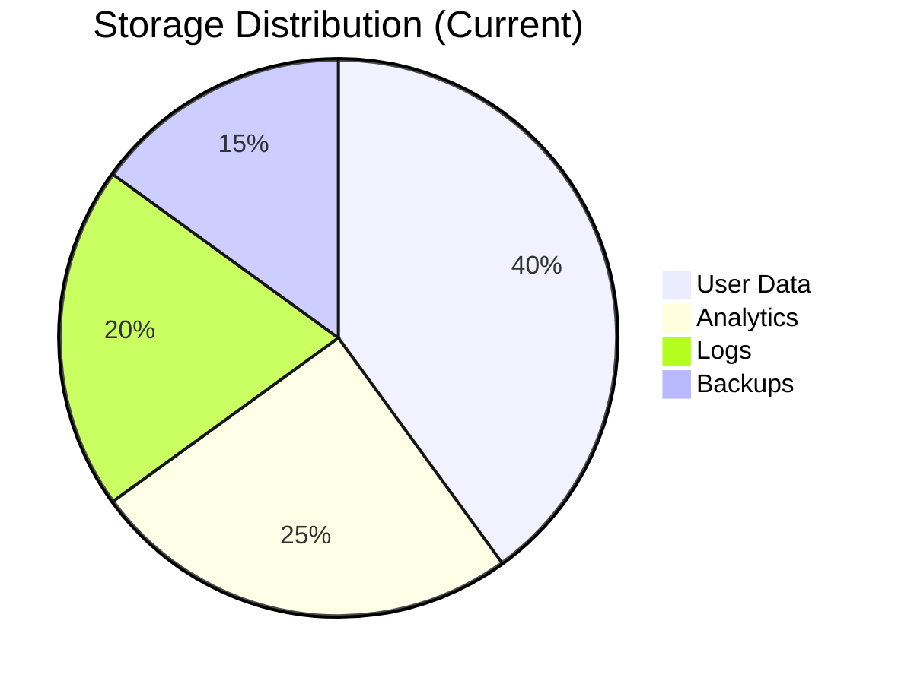
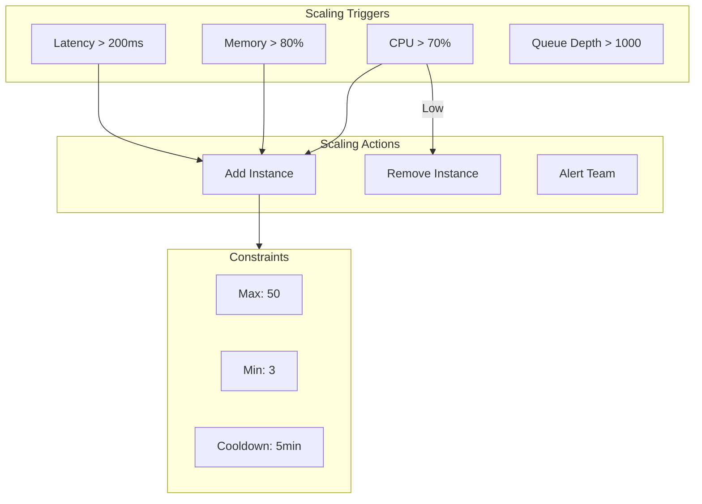

# Capacity Plan

<!-- Resource planning and forecasting documentation -->

---

## Document Control

| Field           | Value            |
| --------------- | ---------------- |
| **Document ID** | CAP-[YYYY]-[NNN] |
| **Version**     | [X.Y.Z]          |
| **Date**        | [YYYY-MM-DD]     |
| **Author**      | [Name, Role]     |
| **Reviewer**    | [Name, Role]     |
| **Next Review** | [YYYY-MM-DD]     |
| **Status**      | Draft / Approved |

> [!NOTE]
> This plan should be reviewed quarterly and updated before major releases or growth phases.

---

## Executive Summary

### Current State

- **Total Users:** [N] active, [N] registered
- **Peak Traffic:** [N] requests/minute
- **Data Volume:** [N] TB stored, [N] GB/day growth
- **Infrastructure Cost:** $[N]/month

### Growth Projections

### Key Recommendations

1. [Recommendation 1 with timeline]
2. [Recommendation 2 with timeline]
3. [Recommendation 3 with timeline]

---

## Baseline Metrics

### Current Capacity

| Service  | Current               | Peak       | Utilization | Headroom |
| -------- | --------------------- | ---------- | ----------- | -------- |
| Web Tier | 10 instances          | 8          | 80%         | 20%      |
| API Tier | 15 instances          | 12         | 80%         | 20%      |
| Database | 1 primary, 2 replicas | 75% CPU    | 75%         | 25%      |
| Cache    | 3 nodes               | 60% memory | 60%         | 40%      |
| Storage  | 50 TB                 | 45 TB      | 90%         | 10%      |

### Performance Baseline

| Metric       | Current | Target  | Status |
| ------------ | ------- | ------- | ------ |
| P50 Latency  | 45ms    | < 100ms | ✅     |
| P99 Latency  | 180ms   | < 500ms | ✅     |
| Error Rate   | 0.05%   | < 0.1%  | ✅     |
| Availability | 99.95%  | 99.99%  | ⚠️     |

---

## Demand Forecasting

### Traffic Projections

**Formula for growth calculation:**

$$\text{Future Capacity} = \text{Current} \times (1 + r)^t \times \text{Safety Factor}$$

Where:

- $r$ = growth rate per period
- $t$ = number of periods
- Safety Factor = 1.3 (30% buffer)

### Quarterly Projections

| Quarter | Users | Requests/min | Storage (TB) | Compute Units |
| ------- | ----- | ------------ | ------------ | ------------- |
| Current | 100K  | 15K          | 50           | 100           |
| Q1      | 150K  | 22K          | 65           | 140           |
| Q2      | 220K  | 35K          | 85           | 200           |
| Q3      | 350K  | 48K          | 110          | 280           |
| Q4      | 480K  | 65K          | 145          | 380           |
| Y2-Q1   | 650K  | 85K          | 190          | 500           |

---

## Resource Planning

### Compute Requirements

| Service         | Current | Q1      | Q2      | Q3      | Q4      |
| --------------- | ------- | ------- | ------- | ------- | ------- |
| Web Servers     | 10      | 12      | 18      | 25      | 35      |
| API Workers     | 15      | 20      | 30      | 45      | 60      |
| Background Jobs | 5       | 8       | 12      | 18      | 25      |
| **Total Cores** | **120** | **160** | **240** | **352** | **480** |

### Storage Projections

| Storage Type | Current   | Growth/Month | 12-Month Need |
| ------------ | --------- | ------------ | ------------- |
| Primary DB   | 15 TB     | 1.2 TB       | 30 TB         |
| Analytics    | 12 TB     | 0.8 TB       | 22 TB         |
| File Storage | 18 TB     | 1.5 TB       | 36 TB         |
| Logs         | 5 TB      | 0.4 TB       | 10 TB         |
| **Total**    | **50 TB** | **3.9 TB**   | **98 TB**     |

### Network Capacity

| Metric        | Current  | Peak     | Projected (12mo) |
| ------------- | -------- | -------- | ---------------- |
| Bandwidth     | 1 Gbps   | 800 Mbps | 2.5 Gbps         |
| Data Transfer | 50 TB/mo | 65 TB/mo | 150 TB/mo        |
| Connections   | 10K      | 15K      | 40K              |

---

## Scaling Strategy

### Horizontal Scaling

### Vertical Scaling

| Component | Current          | Upgrade Path      | Trigger               |
| --------- | ---------------- | ----------------- | --------------------- |
| Database  | 8 vCPU, 32GB     | 16 vCPU, 64GB     | 70% sustained         |
| Cache     | cache.r6g.xlarge | cache.r6g.2xlarge | 85% memory            |
| Search    | 2 nodes          | 4 nodes           | Query latency > 100ms |

---

## Cost Projections

### Current Costs

| Category  | Monthly     | % of Total |
| --------- | ----------- | ---------- |
| Compute   | $12,000     | 40%        |
| Storage   | $6,000      | 20%        |
| Network   | $4,500      | 15%        |
| Database  | $5,000      | 17%        |
| Other     | $2,500      | 8%         |
| **Total** | **$30,000** | **100%**   |

### 12-Month Projection

$$\text{Projected Cost} = \sum_{i=1}^{n} (\text{Current}_i \times \text{Growth Factor}_i)$$

| Quarter | Compute | Storage | Network | Database | Total   |
| ------- | ------- | ------- | ------- | -------- | ------- |
| Q1      | $15,000 | $7,500  | $5,500  | $6,000   | $34,000 |
| Q2      | $20,000 | $9,500  | $7,000  | $7,500   | $44,000 |
| Q3      | $28,000 | $12,000 | $9,000  | $9,500   | $58,500 |
| Q4      | $38,000 | $15,000 | $12,000 | $12,000  | $77,000 |

```mermaid
xychart-beta
    title "Cost Projection by Category"
    x-axis [Current, Q1, Q2, Q3, Q4]
    y-axis "Cost ($K)" 0 --> 80
    bar [12, 15, 20, 28, 38]
    bar [6, 7.5, 9.5, 12, 15]
    bar [4.5, 5.5, 7, 9, 12]
    bar [5, 6, 7.5, 9.5, 12]
```

### Cost Optimization

| Initiative             | Savings/Month | Implementation |
| ---------------------- | ------------- | -------------- |
| Reserved Instances     | $3,000        | Q1             |
| Spot Instances (batch) | $1,500        | Q1             |
| Data Lifecycle         | $800          | Q2             |
| CDN Optimization       | $600          | Q2             |
| **Total Potential**    | **$5,900**    |                |

---

## Risk Assessment

| Risk                          | Likelihood | Impact | Mitigation                     |
| ----------------------------- | ---------- | ------ | ------------------------------ |
| Faster than expected growth   | Medium     | High   | Pre-provisioned burst capacity |
| Supply chain delays           | Low        | Medium | Multi-vendor strategy          |
| Budget constraints            | Medium     | High   | Phased scaling plan            |
| Technical debt limits scaling | Medium     | High   | Refactoring sprints            |

---

## Action Items

### Immediate (This Quarter)

- [ ] Increase API tier headroom to 40%
- [ ] Implement auto-scaling policies
- [ ] Purchase reserved instances
- [ ] Set up capacity monitoring dashboards

### Short-term (Next Quarter)

- [ ] Evaluate database sharding strategy
- [ ] Plan storage expansion
- [ ] Review CDN configuration
- [ ] Conduct load testing

### Long-term (6-12 Months)

- [ ] Multi-region capacity planning
- [ ] Evaluate serverless options
- [ ] Archive strategy implementation
- [ ] Disaster recovery capacity

---

## Monitoring & Alerts

### Capacity Metrics

| Metric             | Warning | Critical | Action            |
| ------------------ | ------- | -------- | ----------------- |
| CPU Utilization    | > 70%   | > 85%    | Scale up          |
| Memory Utilization | > 75%   | > 90%    | Scale up          |
| Disk Utilization   | > 80%   | > 95%    | Add storage       |
| Network I/O        | > 70%   | > 90%    | Upgrade bandwidth |

### Review Schedule

| Review Type        | Frequency | Owner          |
| ------------------ | --------- | -------------- |
| Metrics Review     | Weekly    | SRE Team       |
| Capacity Planning  | Monthly   | Infrastructure |
| Strategic Planning | Quarterly | CTO Office     |
| Budget Review      | Quarterly | Finance        |

---

_Last updated: [Date]_

---

## See Also

- [System Design Document](./system_design_document.md) — Architecture specifications
- [Disaster Recovery Plan](../cloud/dr_plan.md) — Business continuity planning
- [Cost Analysis](../cloud/cost_analysis.md) — Detailed cost breakdowns
