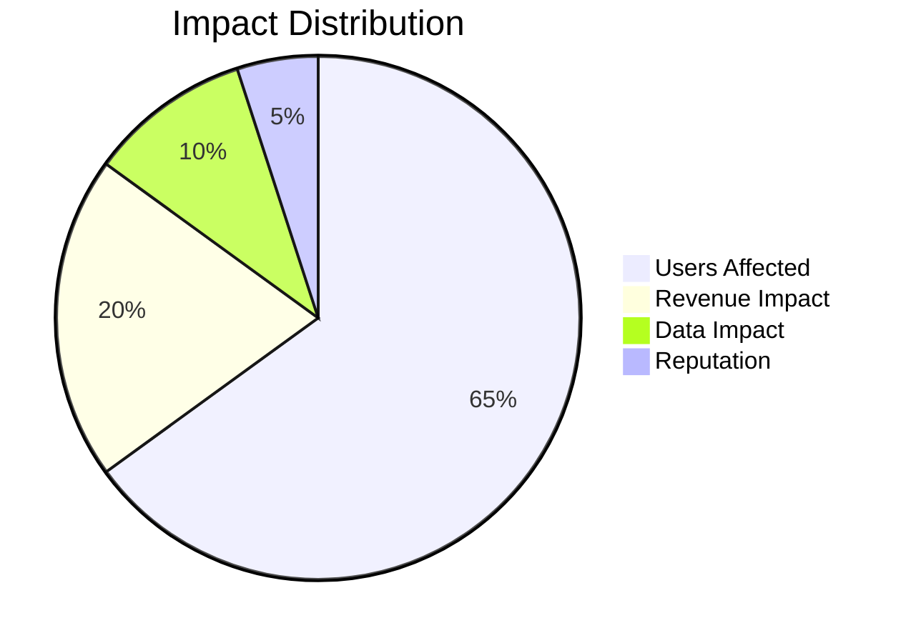
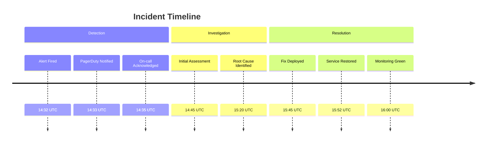
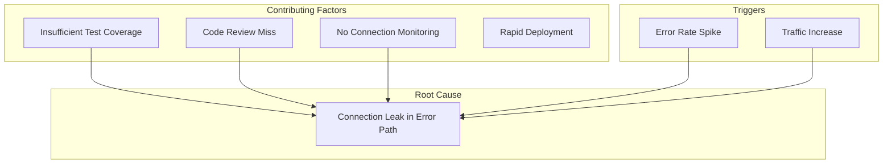
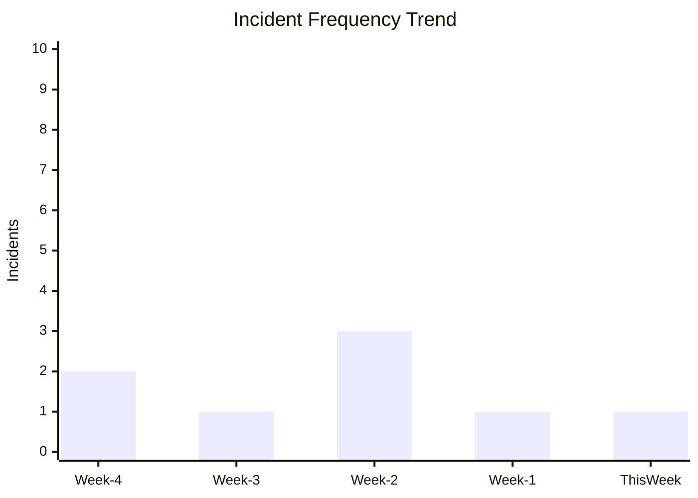

# Post-Mortem Analysis

<!-- Blameless post-mortem following SRE principles -->

---

## Document Control

| Field              | Value                         |
| ------------------ | ----------------------------- |
| **Incident ID**    | INC-[YYYY]-[NNNN]             |
| **Post-Mortem ID** | PM-[YYYY]-[NNNN]              |
| **Date**           | [YYYY-MM-DD]                  |
| **Author**         | [Name, Role]                  |
| **Incident Lead**  | [Name, Role]                  |
| **Severity**       | SEV-1 / SEV-2 / SEV-3 / SEV-4 |
| **Status**         | Draft / Review / Complete     |
| **Review Date**    | [YYYY-MM-DD]                  |

> [!IMPORTANT]
> This is a blameless post-mortem focused on system improvement, not individual fault.

---

## Executive Summary

### Incident Overview

| Attribute            | Value                                     |
| -------------------- | ----------------------------------------- |
| **Service Affected** | [Service Name]                            |
| **Start Time**       | [YYYY-MM-DD HH:MM UTC]                    |
| **Detection Time**   | [YYYY-MM-DD HH:MM UTC]                    |
| **Resolution Time**  | [YYYY-MM-DD HH:MM UTC]                    |
| **Duration**         | [X hours Y minutes]                       |
| **Impact**           | [Brief description of user/system impact] |

### Impact Assessment



- **Users Affected:** [N] users / [X]% of user base
- **Geographic Scope:** [Regions affected]
- **Feature Impact:** [Features affected]
- **Estimated Revenue Impact:** $[N]
- **Data Loss:** [Yes/No - details if applicable]

---

## Timeline

### Incident Chronology



| Time (UTC) | Event                                 | Actor      | Notes                       |
| ---------- | ------------------------------------- | ---------- | --------------------------- |
| 14:32      | Alert fired: High error rate          | Monitoring | Threshold: 5% error rate    |
| 14:33      | PagerDuty notification sent           | Automation | SEV-2 triggered             |
| 14:35      | On-call engineer acknowledged         | [Name]     | Response time: 3 min        |
| 14:40      | Initial investigation started         | [Name]     | Checked recent deployments  |
| 14:45      | Database connection errors identified | [Name]     | Connection pool exhausted   |
| 15:00      | Escalated to Database team            | [Name]     | Secondary on-call engaged   |
| 15:20      | Root cause confirmed                  | [Name]     | Connection leak in new code |
| 15:30      | Rollback initiated                    | [Name]     | Deploying previous version  |
| 15:45      | Rollback complete                     | Automation | Error rate dropping         |
| 15:52      | All systems green                     | Monitoring | Full recovery confirmed     |
| 16:00      | Incident closed                       | [Name]     | Monitoring stable for 8 min |

---

## Root Cause Analysis

### 5 Whys Analysis

**Problem:** Service experienced 20-minute outage with 100% error rate

1. **Why did the service fail?**
   - The database connection pool was exhausted

2. **Why was the connection pool exhausted?**
   - A new feature was not properly closing database connections

3. **Why were connections not being closed?**
   - The connection close call was in a conditional branch that didn't execute on error paths

4. **Why wasn't this caught in code review?**
   - The error handling path was not obvious in the diff, and tests didn't cover error scenarios

5. **Why didn't tests catch this?**
   - Integration tests use a mock database that doesn't track connection lifecycle

**Root Cause:** Inadequate error path testing and connection lifecycle management in new feature deployment.

### Contributing Factors



| Factor                | Category    | Description                                       |
| --------------------- | ----------- | ------------------------------------------------- |
| Connection leak       | Technical   | Database connections not closed in error paths    |
| Test gap              | Process     | Integration tests don't verify connection cleanup |
| Review oversight      | Human       | Error path not obvious in code review             |
| No connection metrics | Monitoring  | No alert on connection pool saturation            |
| Deployment timing     | Operational | Deployed during peak traffic period               |

---

## Technical Details

### Error Analysis

**Error Rate Over Time:**

```mermaid
xychart-beta
    title "Error Rate During Incident"
    x-axis [14:30, 14:35, 14:40, 14:45, 14:50, 14:55, 15:00, 15:05, 15:10, 15:15, 15:20, 15:25, 15:30, 15:35, 15:40, 15:45, 15:50, 15:55]
    y-axis "Error %" 0 --> 100
    line [0.1, 0.2, 5, 25, 65, 95, 100, 100, 100, 100, 100, 100, 95, 80, 50, 20, 5, 0.1]
```

**Key Log Entries:**

```
14:32:15 ERROR DatabaseConnectionPool - Pool exhausted: 50/50 connections in use
14:32:16 ERROR RequestHandler - Failed to acquire connection: timeout after 30s
14:32:17 ERROR HealthCheck - Database health check failed
```

### System State

| Metric         | Normal | During Incident | Peak |
| -------------- | ------ | --------------- | ---- |
| DB Connections | 15-20  | 50 (max)        | 50   |
| Response Time  | 45ms   | Timeout         | 30s+ |
| Error Rate     | 0.01%  | 100%            | 100% |
| CPU Usage      | 25%    | 15%             | 15%  |
| Memory         | 60%    | 58%             | 58%  |

---

## Response Assessment

### What Went Well

1. **Detection:** Alert fired within 2 minutes of issue start
2. **Response Time:** On-call acknowledged within 3 minutes
3. **Escalation:** Database team engaged appropriately
4. **Recovery:** Rollback restored service quickly
5. **Communication:** Status page updated promptly

### What Could Be Improved

1. **Detection:** Connection pool saturation should have its own alert
2. **Diagnosis:** Took 48 minutes to identify root cause
3. **Prevention:** Connection leak should have been caught pre-deployment
4. **Documentation:** Runbook for connection pool issues was outdated

### Response Time Analysis

| Phase          | Target   | Actual | Status |
| -------------- | -------- | ------ | ------ |
| Detection      | < 5 min  | 2 min  | ✅     |
| Acknowledgment | < 5 min  | 3 min  | ✅     |
| Assessment     | < 15 min | 13 min | ✅     |
| Mitigation     | < 30 min | 78 min | ❌     |
| Resolution     | < 60 min | 80 min | ❌     |

---

## Action Items

### Immediate (This Week)

| Action                               | Owner  | Priority | Due Date | Status |
| ------------------------------------ | ------ | -------- | -------- | ------ |
| Add connection pool monitoring alert | [Name] | P0       | [Date]   | ⬜     |
| Update database runbook              | [Name] | P0       | [Date]   | ⬜     |
| Review all recent DB connection code | [Name] | P0       | [Date]   | ⬜     |

### Short-term (This Month)

| Action                               | Owner  | Priority | Due Date | Status |
| ------------------------------------ | ------ | -------- | -------- | ------ |
| Implement connection lifecycle tests | [Name] | P1       | [Date]   | ⬜     |
| Add connection metrics dashboard     | [Name] | P1       | [Date]   | ⬜     |
| Create connection leak detection     | [Name] | P1       | [Date]   | ⬜     |
| Review error path testing standards  | [Name] | P1       | [Date]   | ⬜     |

### Long-term (Next Quarter)

| Action                                | Owner  | Priority | Due Date | Status |
| ------------------------------------- | ------ | -------- | -------- | ------ |
| Implement circuit breaker pattern     | [Name] | P2       | [Date]   | ⬜     |
| Add chaos engineering for DB failures | [Name] | P2       | [Date]   | ⬜     |
| Review deployment timing policies     | [Name] | P2       | [Date]   | ⬜     |
| Improve code review checklist         | [Name] | P2       | [Date]   | ⬜     |

---

## Lessons Learned

### Technical Insights

- Connection lifecycle must be explicitly tested in integration tests
- Resource exhaustion should have dedicated monitoring
- Error paths are higher risk than happy paths

### Process Improvements

- Code review checklist should include resource cleanup verification
- Deployment timing should consider traffic patterns
- Runbooks need regular review and updates

### Cultural Takeaways

- Blameless culture enabled honest assessment
- Quick escalation prevented prolonged outage
- Post-mortem participation was excellent

---

## Metrics

### MTTR (Mean Time To Recovery)

$$\text{MTTR} = \frac{\sum \text{Incident Durations}}{\text{Number of Incidents}}$$

| Metric          | This Incident | Last 30 Days | Target   |
| --------------- | ------------- | ------------ | -------- |
| Detection Time  | 2 min         | 4 min        | < 5 min  |
| Resolution Time | 80 min        | 45 min       | < 60 min |
| Total Downtime  | 20 min        | 12 min       | < 15 min |

### Incident Frequency



---

## Appendix

### Related Incidents

| Incident ID   | Date   | Similarity                | Reference |
| ------------- | ------ | ------------------------- | --------- |
| INC-2024-0892 | [Date] | Database connection issue | [Link]    |
| INC-2024-0654 | [Date] | Resource exhaustion       | [Link]    |

### References

- [Incident Response Plan](../operations/incident_response_plan.md)
- [Database Runbook](../operations/runbook.md)
- [Deployment Procedures](../devops/deployment_strategy.md)

---

_Last updated: [Date]_

---

## See Also

- [Incident Response Plan](../operations/incident_response_plan.md) — Incident handling procedures
- [Runbook Template](../operations/runbook.md) — Operational procedures
- [Chaos Engineering Plan](../operations/chaos_engineering_plan.md) — Resilience testing
