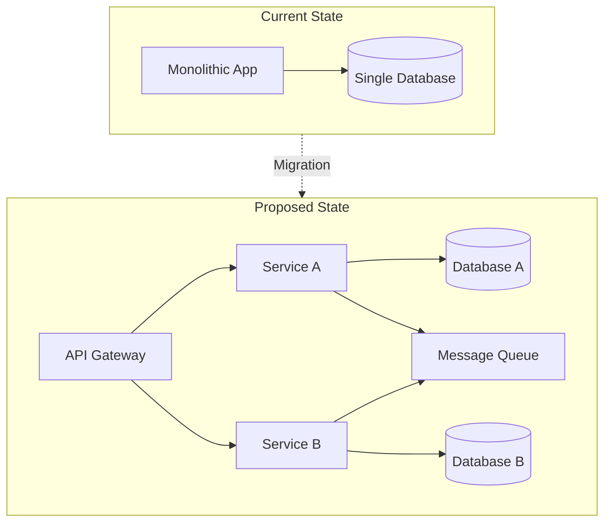
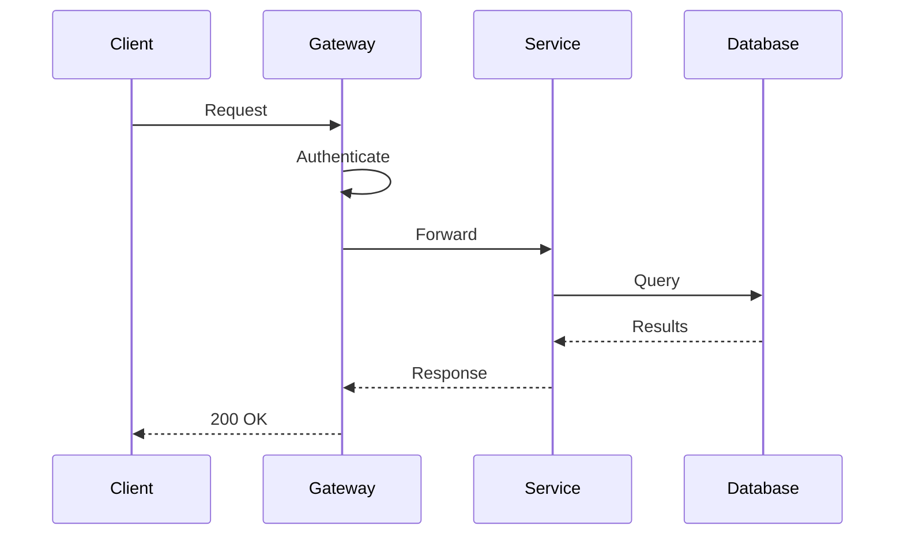
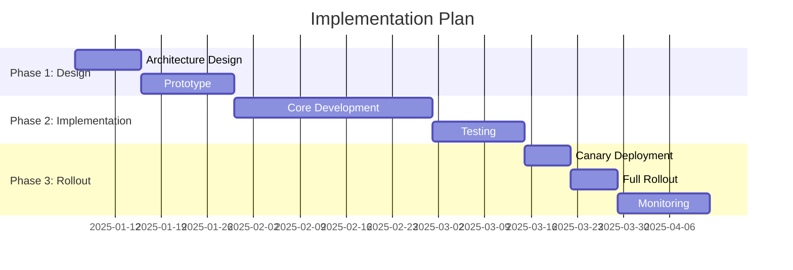

# RFC: [Title]

<!-- RFC-[NUMBER]: [Descriptive Title] -->

---

## Document Control

| Field               | Value                                               |
| ------------------- | --------------------------------------------------- |
| **RFC Number**      | RFC-[YYYY]-[NNN]                                    |
| **Status**          | Draft / Proposed / Accepted / Rejected / Superseded |
| **Author**          | [Name, Role]                                        |
| **Date**            | [YYYY-MM-DD]                                        |
| **Review Deadline** | [YYYY-MM-DD]                                        |
| **Stakeholders**    | [Team/Individual names]                             |
| **Related RFCs**    | [RFC-XXXX, RFC-YYYY]                                |
| **Supersedes**      | [RFC-ZZZZ if applicable]                            |

> [!NOTE]
> An RFC is required for changes affecting multiple teams, introducing new architectural patterns, or with significant performance/security implications.

---

## Abstract

[1-2 paragraph summary of the proposal, the problem it solves, and the expected outcome. Write for an audience that may not be familiar with the details.]

---

## Problem Statement

### Current Situation

[Describe the current state, pain points, and why change is needed. Include metrics or data demonstrating the problem.]

### Impact

| Stakeholder  | Current Pain  | Impact Level    |
| ------------ | ------------- | --------------- |
| [Users]      | [Description] | High/Medium/Low |
| [Developers] | [Description] | High/Medium/Low |
| [Operations] | [Description] | High/Medium/Low |

### Why Now

[Explain urgency, opportunity cost of not acting, and alignment with strategic goals.]

---

## Proposed Solution

### Overview

[High-level description of the proposed approach]

### Architecture

### Detailed Design

#### Component: [Name]

**Responsibility:** [What this component does]

**Interface:**

**Key Decisions:**

- [Decision 1 with rationale]
- [Decision 2 with rationale]

---

## Alternatives Considered

### Alternative 1: [Name]

**Description:** [What this approach entails]

**Pros:**

- [Benefit 1]
- [Benefit 2]

**Cons:**

- [Drawback 1]
- [Drawback 2]

**Verdict:** [Accepted / Rejected — why]

### Alternative 2: [Name]

**Description:** [What this approach entails]

**Pros:**

- [Benefit 1]
- [Benefit 2]

**Cons:**

- [Drawback 1]
- [Drawback 2]

**Verdict:** [Accepted / Rejected — why]

### Alternative 3: Do Nothing

**Description:** Maintain current state

**Pros:** No implementation cost, no risk

**Cons:** Problem continues; [specific consequences]

**Verdict:** Rejected — [reasoning]

### Comparison Matrix

| Criterion              | Weight | Proposed | Alt 1 | Alt 2 | Do Nothing |
| ---------------------- | ------ | -------- | ----- | ----- | ---------- |
| Solves Problem         | High   | ✅       | ⚠️    | ⚠️    | ❌         |
| Implementation Effort  | Medium | ⚠️       | ✅    | ⚠️    | ✅         |
| Operational Complexity | Medium | ⚠️       | ✅    | ⚠️    | ✅         |
| Performance Impact     | High   | ✅       | ⚠️    | ❌    | ✅         |
| Risk Level             | High   | ⚠️       | ✅    | ❌    | ✅         |

---

## Implementation Plan

### Phases

### Milestones

| Phase | Deliverable              | Owner  | Target Date |
| ----- | ------------------------ | ------ | ----------- |
| 1     | Design document approved | [Name] | [Date]      |
| 2     | Working prototype        | [Name] | [Date]      |
| 3     | Production deployment    | [Name] | [Date]      |
| 4     | Migration complete       | [Name] | [Date]      |

### Resource Requirements

| Role               | Effort      | Timeline   |
| ------------------ | ----------- | ---------- |
| Backend Engineers  | [N] sprints | Phase 2-3  |
| Frontend Engineers | [N] sprints | Phase 2-3  |
| DevOps             | [N] sprints | Phase 1, 3 |
| QA                 | [N] sprints | Phase 2-3  |

---

## Risk Assessment

| Risk     | Likelihood   | Impact       | Mitigation |
| -------- | ------------ | ------------ | ---------- |
| [Risk 1] | High/Med/Low | High/Med/Low | [Strategy] |
| [Risk 2] | High/Med/Low | High/Med/Low | [Strategy] |
| [Risk 3] | High/Med/Low | High/Med/Low | [Strategy] |

### Rollback Plan

[Detailed plan for reverting changes if issues arise]

1. [Step 1]
2. [Step 2]
3. [Step 3]

---

## Success Criteria

### Metrics

| Metric     | Current | Target   | Measurement    |
| ---------- | ------- | -------- | -------------- |
| [Metric 1] | [Value] | [Target] | [How measured] |
| [Metric 2] | [Value] | [Target] | [How measured] |
| [Metric 3] | [Value] | [Target] | [How measured] |

### Definition of Done

- [ ] Code deployed to production
- [ ] Monitoring and alerting in place
- [ ] Documentation updated
- [ ] Runbooks created
- [ ] Team training completed
- [ ] Success metrics achieved

---

## Open Questions

| Question     | Owner  | Due Date | Status |
| ------------ | ------ | -------- | ------ |
| [Question 1] | [Name] | [Date]   | Open   |
| [Question 2] | [Name] | [Date]   | Open   |

---

## Review Log

| Date   | Reviewer | Verdict  | Notes      |
| ------ | -------- | -------- | ---------- |
| [Date] | [Name]   | [Status] | [Feedback] |

---

## References

- [Related ADR](../software/adr.md)
- [Architecture Spec](./architecture_spec.md)
- [External Reference](https://example.com)

---

_Last updated: [Date]_

---

## See Also

- [Architecture Decision Record](../software/adr.md) — For smaller team-level decisions
- [System Design Document](./system_design_document.md) — For detailed architecture
- [API Design](./api_design.md) — For API specifications
