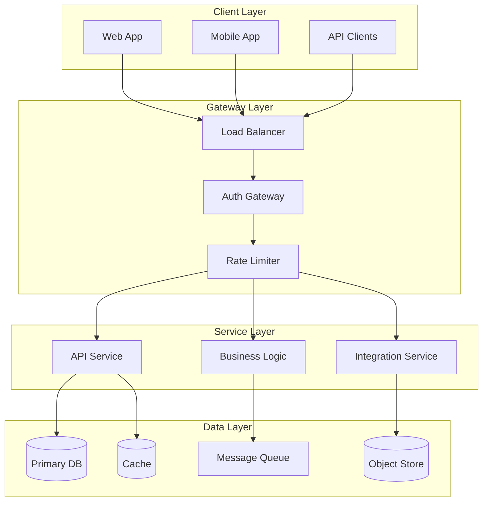
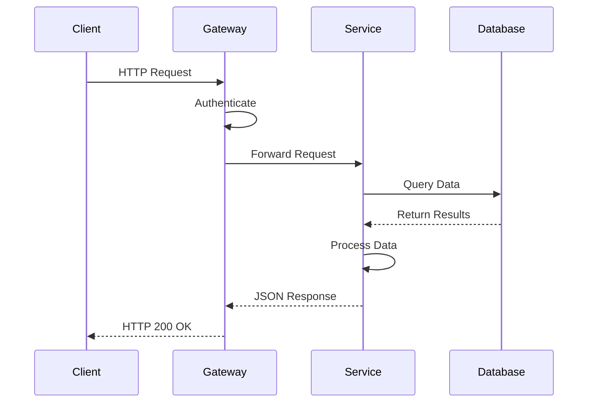
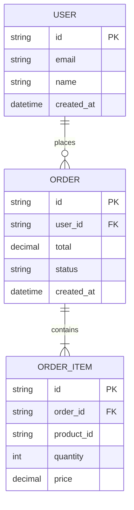
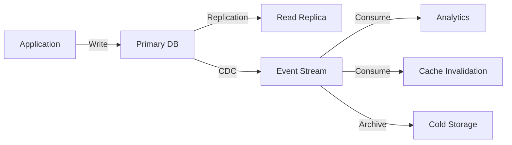
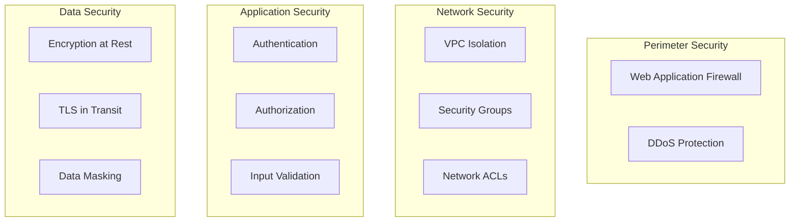
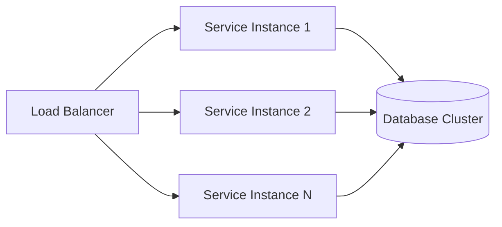
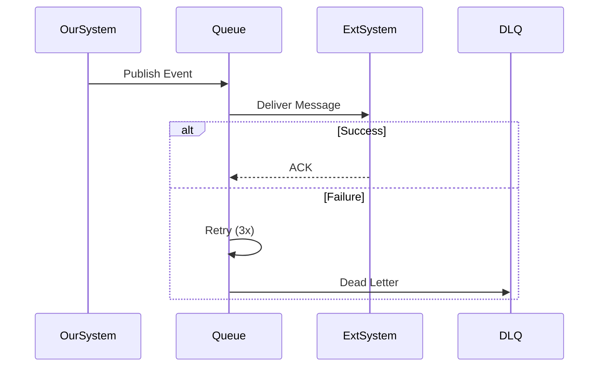
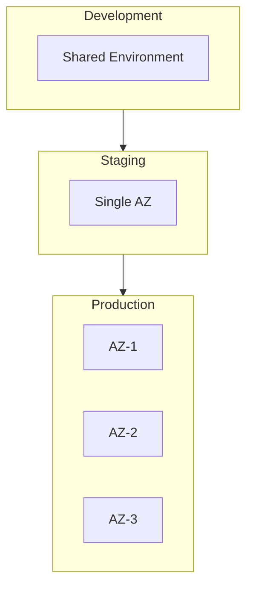
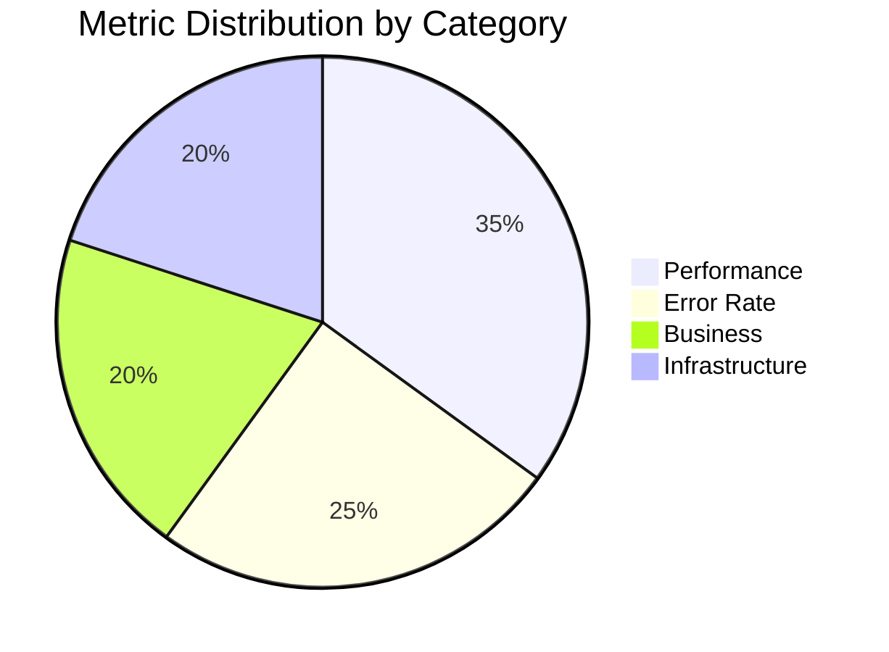

# System Design Document

<!-- Architecture documentation following ISO/IEC/IEEE 42010 -->

---

## Document Control

| Field              | Value                            |
| ------------------ | -------------------------------- |
| **Document ID**    | SDD-[PROJECT]-[VERSION]          |
| **Version**        | [X.Y.Z]                          |
| **Date**           | [YYYY-MM-DD]                     |
| **Author**         | [Name, Role]                     |
| **Reviewer**       | [Name, Role]                     |
| **Approval**       | [Name, Title]                    |
| **Status**         | Draft / Review / Approved        |
| **Classification** | Internal / Confidential / Public |

> [!IMPORTANT]
> This document describes the architectural design and must be kept current with implementation changes.

---

## Executive Summary

### Purpose

[1-2 sentences describing the purpose of this system and the problem it solves]

### Scope

**In Scope:**

- [Component/Feature 1]
- [Component/Feature 2]
- [Component/Feature 3]

**Out of Scope:**

- [Explicitly excluded item 1]
- [Explicitly excluded item 2]

### Key Stakeholders

| Role             | Name   | Responsibility               |
| ---------------- | ------ | ---------------------------- |
| System Architect | [Name] | Overall design decisions     |
| Tech Lead        | [Name] | Implementation oversight     |
| Product Owner    | [Name] | Requirements validation      |
| Security Lead    | [Name] | Security architecture review |

---

## System Overview

### High-Level Architecture

### Design Principles

1. **Scalability:** [Horizontal scaling strategy]
2. **Reliability:** [Availability targets, e.g., 99.99%]
3. **Security:** [Defense in depth approach]
4. **Maintainability:** [Code organization principles]
5. **Performance:** [Latency/throughput requirements]

---

## Component Design

### Component: [Service Name]

#### Responsibility

[Clear description of what this component does]

#### Interface

#### API Specification

| Endpoint              | Method | Description       | Auth Required |
| --------------------- | ------ | ----------------- | ------------- |
| /api/v1/resource      | GET    | Retrieve resource | Yes           |
| /api/v1/resource      | POST   | Create resource   | Yes           |
| /api/v1/resource/{id} | PUT    | Update resource   | Yes           |
| /api/v1/resource/{id} | DELETE | Delete resource   | Yes           |

#### Data Model

---

## Data Architecture

### Storage Strategy

| Data Type     | Storage    | Retention  | Backup Strategy          |
| ------------- | ---------- | ---------- | ------------------------ |
| Transactional | PostgreSQL | 7 years    | Daily snapshots          |
| Session       | Redis      | 24 hours   | None (ephemeral)         |
| Analytics     | ClickHouse | 2 years    | Weekly exports           |
| Files         | S3         | Indefinite | Cross-region replication |

### Data Flow

---

## Security Architecture

### Threat Model

### Authentication & Authorization

- **Authentication:** [OAuth 2.0 / SAML / JWT / etc.]
- **Authorization:** [RBAC / ABAC model]
- **Token Strategy:** [Access token lifetime, refresh mechanism]

---

## Scalability Design

### Capacity Planning

Current metrics:

- **Users:** [N] active
- **Requests/sec:** [N] peak
- **Data volume:** [N] GB/day

Growth projections:

- **Year 1:** [N]x current
- **Year 2:** [N]x current
- **Year 3:** [N]x current

### Scaling Strategy

---

## Integration Architecture

### External Systems

| System     | Integration Type | Protocol      | SLA   |
| ---------- | ---------------- | ------------- | ----- |
| [System A] | Sync             | REST API      | 99.9% |
| [System B] | Async            | Message Queue | 99.5% |
| [System C] | Batch            | SFTP          | Daily |

### Integration Patterns

---

## Deployment Architecture

### Infrastructure

### Deployment Strategy

- **Strategy:** [Blue-Green / Canary / Rolling]
- **Rollback:** [Automatic / Manual trigger]
- **Health Checks:** [Endpoint and criteria]

---

## Performance Requirements

### SLAs

| Metric       | Target  | Measurement       |
| ------------ | ------- | ----------------- |
| Availability | 99.99%  | Uptime monitoring |
| P50 Latency  | < 100ms | API gateway       |
| P99 Latency  | < 500ms | API gateway       |
| Error Rate   | < 0.1%  | 5xx responses     |

### Resource Requirements

| Component   | CPU     | Memory | Storage | Instances |
| ----------- | ------- | ------ | ------- | --------- |
| API Service | 2 cores | 4 GB   | 20 GB   | 3-10      |
| Worker      | 4 cores | 8 GB   | 50 GB   | 2-5       |
| Database    | 8 cores | 32 GB  | 500 GB  | 3 (HA)    |

---

## Monitoring & Observability

### Metrics

### Alerting

| Alert        | Condition | Severity | Response     |
| ------------ | --------- | -------- | ------------ |
| High Latency | P99 > 1s  | Warning  | Auto-scale   |
| Error Spike  | 5xx > 1%  | Critical | Page on-call |
| Disk Full    | > 85%     | Warning  | Cleanup job  |

---

## Risk Assessment

| Risk                    | Likelihood | Impact   | Mitigation              |
| ----------------------- | ---------- | -------- | ----------------------- |
| Database failure        | Low        | High     | Multi-AZ replication    |
| Dependency outage       | Medium     | Medium   | Circuit breaker pattern |
| Security breach         | Low        | Critical | Defense in depth        |
| Performance degradation | Medium     | Medium   | Auto-scaling, caching   |

---

## Decision Log

| Date   | Decision   | Alternatives | Rationale | Decision Maker |
| ------ | ---------- | ------------ | --------- | -------------- |
| [Date] | [Decision] | [Options]    | [Why]     | [Name]         |

---

## Appendices

### A. Glossary

| Term   | Definition   |
| ------ | ------------ |
| [Term] | [Definition] |

### B. References

- [Architecture Decision Records](./adr/)
- [API Specifications](./api/)
- [Runbooks](./runbooks/)

---

_Last updated: [Date]_

---

## See Also

- [RFC Template](../software/rfc.md) — For architectural decisions
- [API Design](./api_design.md) — For API specifications
- [Database Schema](./database_schema.md) — For data model details
