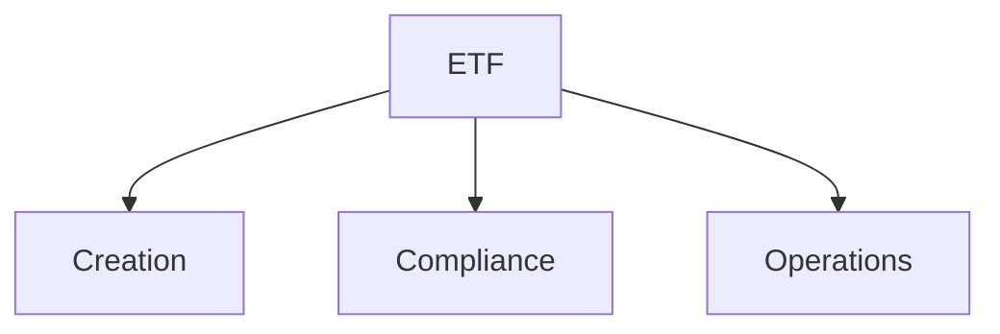

# ETF

ETF fund creation, compliance, and management templates.

## Templates

| Template                                                           | Description         |
| ------------------------------------------------------------------ | ------------------- |
| [etf_prospectus.md](etf_prospectus.md)                             | Fund prospectus     |
| [etf_creation_proposal_simple.md](etf_creation_proposal_simple.md) | Creation proposals  |
| [sai_template.md](sai_template.md)                                 | SAI documentation   |
| [sec_exemptive_order.md](sec_exemptive_order.md)                   | SEC filings         |
| [etf_compliance_checklist.md](etf_compliance_checklist.md)         | Compliance tracking |

## Structure

See [Parent](../SKILL.md) for all categories.
