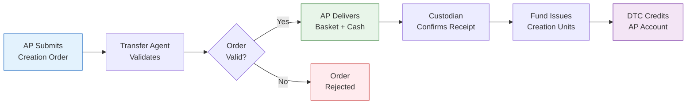

# ETF Authorized Participant Agreement

> **Template Type**: Legal / Contractual | **Audience**: Authorized Participants, Legal Counsel

---

## Document Control

| Field              | Value                   |
| ------------------ | ----------------------- |
| **Document ID**    | `ETF-LEG-APA-001`       |
| **Version**        | 1.0                     |
| **Classification** | External — Confidential |
| **Trust Name**     | `{{trust_name}}`        |
| **Fund Name**      | `{{fund_name}}`         |
| **Ticker**         | `{{ticker}}`            |
| **Date Created**   | `{{date_created}}`      |
| **Last Revised**   | `{{date_revised}}`      |
| **Status**         | Draft                   |

---

## Authorized Participant Agreement

**This Authorized Participant Agreement** (this "Agreement") is entered into as of `{{effective_date}}` (the "Effective Date") by and between:

**`{{trust_name}}`**, a `{{trust_state}}` `{{trust_type}}` (the "Trust"), on behalf of `{{fund_name}}` (the "Fund"),

and

**`{{ap_name}}`**, a `{{ap_state}}` `{{ap_type}}`, registered as a broker-dealer under the Securities Exchange Act of 1934 (the "Authorized Participant" or "AP").

---

## Article I — Definitions

**1.1** "Authorized Participant" means a registered broker-dealer or other entity that has entered into this Agreement and is authorized to purchase and redeem Creation Units directly from the Fund.

**1.2** "Business Day" means any day on which the New York Stock Exchange is open for regular trading.

**1.3** "Cash Component" means the cash amount per Creation Unit required to be paid or received in connection with a creation or redemption order, as determined by the Fund on each Business Day.

**1.4** "Creation Basket" means the portfolio of securities and cash component required to create one or more Creation Units, as published by the Fund each Business Day.

**1.5** "Creation Unit" means an aggregation of `{{cu_size}}` shares of the Fund that may be purchased from or redeemed by the Fund.

**1.6** "Custodian" means `{{custodian_name}}`, or any successor custodian appointed by the Trust.

**1.7** "DTC" means The Depository Trust Company.

**1.8** "NSCC" means the National Securities Clearing Corporation.

**1.9** "NAV" means net asset value per share of the Fund, calculated as of the close of regular trading on the NYSE on each Business Day.

**1.10** "Redemption Basket" means the portfolio of securities and cash component to be delivered upon redemption of one or more Creation Units.

**1.11** "Transfer Agent" means `{{transfer_agent_name}}`, or any successor transfer agent appointed by the Trust.

---

## Article II — Representations and Warranties

### 2.1 Representations of the Authorized Participant

The AP represents and warrants that:

(a) It is a registered broker-dealer under the Securities Exchange Act of 1934 and a member of FINRA in good standing;

(b) It is a participant in DTC and NSCC;

(c) It has adequate capital, infrastructure, and operational capacity to fulfill its obligations under this Agreement;

(d) It has adopted and maintains policies and procedures reasonably designed to comply with applicable federal securities laws, including anti-money laundering requirements;

(e) It has the power and authority to execute, deliver, and perform this Agreement;

(f) The execution and performance of this Agreement does not violate any law, regulation, or agreement to which it is a party.

### 2.2 Representations of the Trust

The Trust represents and warrants that:

(a) It is duly organized and validly existing under the laws of `{{trust_state}}`;

(b) The Fund is a duly authorized series of the Trust, registered under the Investment Company Act of 1940;

(c) It has the power and authority to execute, deliver, and perform this Agreement.

---

## Article III — Creation of Shares

### 3.1 Creation Orders

(a) The AP may place creation orders on any Business Day by contacting the Transfer Agent by `{{cutoff_time}}` ET.

(b) Each creation order must specify the number of Creation Units to be created (minimum `{{min_cu}}` Creation Unit(s)).

(c) Orders received after the cut-off time shall be deemed received on the next Business Day.

(d) The Fund reserves the right to reject any creation order for any reason, including if the order is not in proper form or acceptance would have adverse tax consequences.

### 3.2 Delivery Requirements

(a) **In-Kind**: The AP shall deliver the Creation Basket securities to the Custodian's DTC account and the Cash Component via federal funds wire, by settlement date (T+`{{settlement_days}}`).

(b) **Cash**: The Fund may, in its sole discretion, permit cash-in-lieu creations, subject to additional transaction fees.

(c) Failure to deliver by the settlement date may result in cancellation of the order and liability for any losses.

### 3.3 Transaction Fees

| Fee Type                        | Amount                                          |
| ------------------------------- | ----------------------------------------------- |
| Standard Creation Fee (in-kind) | $`{{creation_fee_inkind}}` per Creation Unit    |
| Cash Creation Fee               | $`{{creation_fee_cash}}` per Creation Unit      |
| Variable Fee (if applicable)    | Up to `{{variable_fee_bps}}` bps of order value |

---

## Article IV — Redemption of Shares

### 4.1 Redemption Orders

(a) The AP may place redemption orders on any Business Day by contacting the Transfer Agent by `{{cutoff_time}}` ET.

(b) Each redemption order must specify the number of Creation Units to be redeemed (minimum `{{min_cu}}` Creation Unit(s)).

(c) The AP must deliver the required number of ETF shares (in Creation Unit aggregations) to the Transfer Agent's DTC account.

### 4.2 Delivery of Redemption Basket

(a) Upon acceptance of a valid redemption order, the Fund shall deliver the Redemption Basket and Cash Component to the AP through DTC on the settlement date.

(b) The Fund reserves the right to deliver cash-in-lieu for any component of the Redemption Basket.

### 4.3 Redemption Fees

| Fee Type                          | Amount                                         |
| --------------------------------- | ---------------------------------------------- |
| Standard Redemption Fee (in-kind) | $`{{redemption_fee_inkind}}` per Creation Unit |
| Cash Redemption Fee               | $`{{redemption_fee_cash}}` per Creation Unit   |

---

## Article V — Covenants

### 5.1 AP Covenants

The AP covenants and agrees that it shall:

(a) Comply with all applicable federal and state securities laws in connection with the distribution and trading of Fund shares;

(b) Not make any representations concerning Fund shares other than those contained in the Fund's prospectus and SAI;

(c) Deliver to purchasers a copy of the Fund's prospectus as required by applicable law;

(d) Maintain adequate books and records relating to its creation and redemption activities;

(e) Promptly notify the Trust of any material adverse change in its business, financial condition, or regulatory status;

(f) Not engage in any activity that would cause the Fund to violate any applicable law or regulation.

---

## Article VI — Indemnification

### 6.1 AP Indemnification

The AP shall indemnify and hold harmless the Trust, the Fund, their directors, officers, and agents from and against any losses, claims, damages, or liabilities arising from:

(a) Any breach of this Agreement by the AP;
(b) Any misrepresentation by the AP;
(c) The AP's failure to comply with applicable laws.

### 6.2 Trust Indemnification

The Trust shall indemnify and hold harmless the AP from and against any losses, claims, damages, or liabilities arising from:

(a) Any breach of this Agreement by the Trust;
(b) Any material misstatement in the Fund's registration statement (except statements provided by the AP).

---

## Article VII — Term and Termination

**7.1** This Agreement shall become effective on the Effective Date and shall continue until terminated.

**7.2** Either party may terminate this Agreement upon `{{termination_notice}}` days' written notice to the other party.

**7.3** The Trust may terminate this Agreement immediately if the AP:

(a) Ceases to be a registered broker-dealer or FINRA member;
(b) Ceases to be a DTC participant;
(c) Becomes subject to bankruptcy or insolvency proceedings;
(d) Materially breaches this Agreement and fails to cure within `{{cure_period}}` days.

**7.4** Termination shall not affect any obligations accrued prior to termination.

---

## Article VIII — General Provisions

**8.1 Governing Law**: This Agreement shall be governed by the laws of `{{governing_law_state}}`.

**8.2 Entire Agreement**: This Agreement constitutes the entire agreement between the parties with respect to the subject matter hereof.

**8.3 Amendment**: This Agreement may be amended only by written instrument signed by both parties.

**8.4 Assignment**: This Agreement may not be assigned without the prior written consent of the other party.

**8.5 Notices**: All notices shall be in writing and delivered to the addresses set forth below.

**8.6 Severability**: If any provision is held invalid, the remaining provisions shall continue in full force and effect.

**8.7 Counterparts**: This Agreement may be executed in counterparts.

---

## Execution

**IN WITNESS WHEREOF**, the parties have executed this Agreement as of the date first written above.

**`{{trust_name}}`**
On behalf of `{{fund_name}}`

By: **********************\_\_\_**********************
Name: `{{trust_signatory}}`
Title: `{{trust_signatory_title}}`
Date: ******\_\_\_******

**`{{ap_name}}`**

By: **********************\_\_\_**********************
Name: `{{ap_signatory}}`
Title: `{{ap_signatory_title}}`
Date: ******\_\_\_******

---

## Notice Addresses

**Trust**:
`{{trust_address}}`
Attn: `{{trust_attn}}`
Email: `{{trust_email}}`

**Authorized Participant**:
`{{ap_address}}`
Attn: `{{ap_attn}}`
Email: `{{ap_email}}`

---

_This template is for illustrative purposes and should be reviewed by qualified legal counsel before execution._
