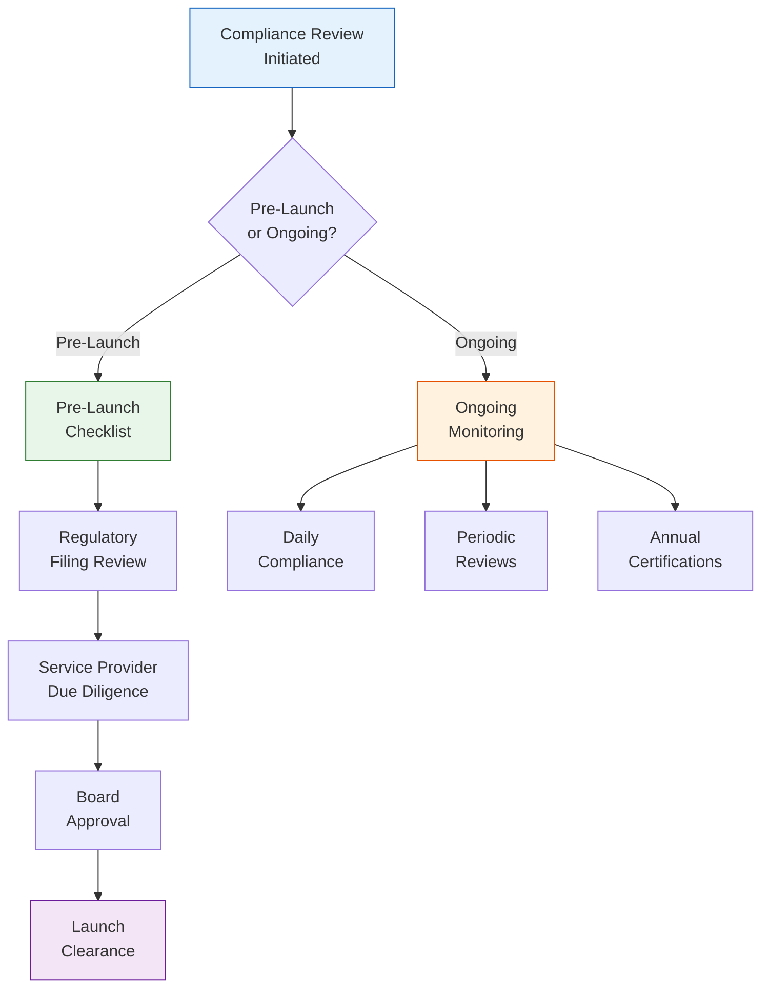
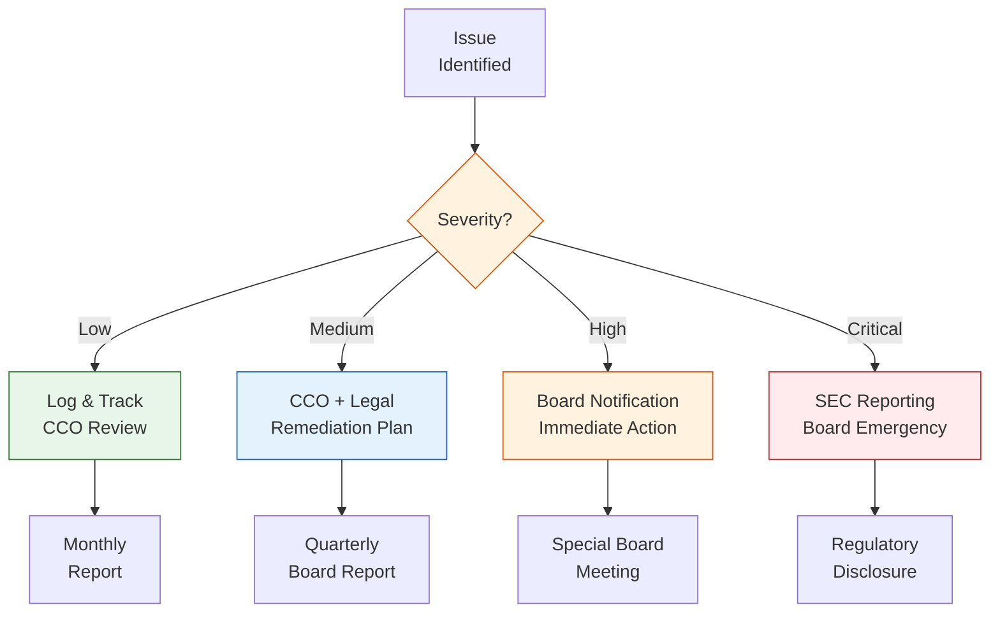

# ETF Compliance Checklist

> **Template Type**: Regulatory Compliance | **Audience**: CCO, Legal, Compliance Team

---

## Document Control

| Field              | Value                   |
| ------------------ | ----------------------- |
| **Document ID**    | `ETF-COMP-CHK-001`      |
| **Version**        | 1.0                     |
| **Classification** | Internal — Confidential |
| **Author**         | `{{author_name}}`       |
| **Fund Name**      | `{{fund_name}}`         |
| **Ticker**         | `{{ticker}}`            |
| **Date Created**   | `{{date_created}}`      |
| **Last Revised**   | `{{date_revised}}`      |
| **CCO Approval**   | `{{cco_name}}`          |
| **Status**         | Active                  |

---

## Compliance Workflow

---

## 1. Pre-Launch Compliance

### 1.1 Fund Registration & SEC Filings

| #      | Item                                 | Rule/Regulation         | Status | Date | Notes |
| ------ | ------------------------------------ | ----------------------- | ------ | ---- | ----- |
| 1.1.1  | Form N-1A drafted and reviewed       | Securities Act §5       | ☐      |      |       |
| 1.1.2  | N-1A filed with SEC                  | Securities Act §6       | ☐      |      |       |
| 1.1.3  | ETF Rule 6c-11 conditions verified   | 1940 Act Rule 6c-11     | ☐      |      |       |
| 1.1.4  | SAI completed                        | Form N-1A Part B        | ☐      |      |       |
| 1.1.5  | SEC comment letter responses         | —                       | ☐      |      |       |
| 1.1.6  | Effectiveness confirmed              | —                       | ☐      |      |       |
| 1.1.7  | Blue sky filings completed           | State securities laws   | ☐      |      |       |
| 1.1.8  | Exchange listing application (19b-4) | Exchange Act Rule 19b-4 | ☐      |      |       |
| 1.1.9  | FINRA review of marketing materials  | FINRA Rule 2210         | ☐      |      |       |
| 1.1.10 | Form N-CEN registration              | 1940 Act Rule 30a-1     | ☐      |      |       |

### 1.2 Fund Governance

| #      | Item                                        | Rule/Regulation  | Status | Date | Notes |
| ------ | ------------------------------------------- | ---------------- | ------ | ---- | ----- |
| 1.2.1  | Board of Directors approval                 | 1940 Act §15     | ☐      |      |       |
| 1.2.2  | Advisory agreement approved                 | 1940 Act §15(c)  | ☐      |      |       |
| 1.2.3  | Sub-advisory agreement (if applicable)      | 1940 Act §15(c)  | ☐      |      |       |
| 1.2.4  | Compliance program adopted                  | Rule 38a-1       | ☐      |      |       |
| 1.2.5  | CCO designated                              | Rule 38a-1(a)(4) | ☐      |      |       |
| 1.2.6  | Code of Ethics adopted                      | Rule 17j-1       | ☐      |      |       |
| 1.2.7  | Proxy voting policies adopted               | Rule 206(4)-6    | ☐      |      |       |
| 1.2.8  | Liquidity Risk Management Program           | Rule 22e-4       | ☐      |      |       |
| 1.2.9  | Derivatives Risk Management (if applicable) | Rule 18f-4       | ☐      |      |       |
| 1.2.10 | Valuation policy adopted                    | Rule 2a-5        | ☐      |      |       |

### 1.3 Service Providers

| #      | Item                                | Requirement     | Status | Date | Notes |
| ------ | ----------------------------------- | --------------- | ------ | ---- | ----- |
| 1.3.1  | Custodian agreement executed        | 1940 Act §17(f) | ☐      |      |       |
| 1.3.2  | Administrator agreement executed    | —               | ☐      |      |       |
| 1.3.3  | Transfer agent agreement executed   | —               | ☐      |      |       |
| 1.3.4  | Distributor agreement executed      | FINRA rules     | ☐      |      |       |
| 1.3.5  | AP agreements executed              | Rule 6c-11      | ☐      |      |       |
| 1.3.6  | Index license agreement executed    | —               | ☐      |      |       |
| 1.3.7  | Audit engagement letter             | —               | ☐      |      |       |
| 1.3.8  | Legal counsel engagement            | —               | ☐      |      |       |
| 1.3.9  | Market maker commitments            | —               | ☐      |      |       |
| 1.3.10 | Insurance (D&O, E&O, fidelity bond) | Rule 17g-1      | ☐      |      |       |

### 1.4 Operational Readiness

| #      | Item                                     | Requirement                | Status | Date | Notes |
| ------ | ---------------------------------------- | -------------------------- | ------ | ---- | ----- |
| 1.4.1  | NAV calculation process tested           | Rule 22c-1                 | ☐      |      |       |
| 1.4.2  | Creation/redemption process tested       | Rule 6c-11                 | ☐      |      |       |
| 1.4.3  | Portfolio holdings website configured    | Rule 6c-11(c)(1)           | ☐      |      |       |
| 1.4.4  | IOPV/IIV calculation verified            | Exchange listing standards | ☐      |      |       |
| 1.4.5  | Compliance monitoring systems configured | Rule 38a-1                 | ☐      |      |       |
| 1.4.6  | Trade execution & settlement tested      | —                          | ☐      |      |       |
| 1.4.7  | Tax lot accounting configured            | —                          | ☐      |      |       |
| 1.4.8  | Regulatory reporting systems ready       | —                          | ☐      |      |       |
| 1.4.9  | Disaster recovery / BCP tested           | —                          | ☐      |      |       |
| 1.4.10 | Seed capital funding confirmed           | —                          | ☐      |      |       |

---

## 2. Ongoing Compliance Monitoring

### 2.1 Daily Requirements

| #     | Item                                    | Rule/Regulation  | Frequency | Owner         | Status |
| ----- | --------------------------------------- | ---------------- | --------- | ------------- | ------ |
| 2.1.1 | NAV calculation and dissemination       | Rule 22c-1       | Daily     | Administrator | ☐      |
| 2.1.2 | Portfolio holdings disclosure (website) | Rule 6c-11(c)(1) | Daily     | PM/Compliance | ☐      |
| 2.1.3 | Creation/redemption basket publication  | Rule 6c-11       | Daily     | PM/TA         | ☐      |
| 2.1.4 | Investment guideline compliance         | Prospectus       | Daily     | PM/Compliance | ☐      |
| 2.1.5 | Diversification test (RIC)              | IRC §851         | Daily     | Compliance    | ☐      |
| 2.1.6 | Concentration limits                    | Prospectus       | Daily     | PM/Compliance | ☐      |
| 2.1.7 | Leverage limits (if derivatives)        | Rule 18f-4       | Daily     | PM/Compliance | ☐      |

### 2.2 Periodic Requirements

| #     | Item                        | Rule/Regulation | Frequency | Owner         | Status |
| ----- | --------------------------- | --------------- | --------- | ------------- | ------ |
| 2.2.1 | Liquidity classification    | Rule 22e-4      | Monthly   | PM/Compliance | ☐      |
| 2.2.2 | N-PORT filing               | Rule 30b1-9     | Monthly   | Administrator | ☐      |
| 2.2.3 | Tracking error monitoring   | Internal policy | Weekly    | PM            | ☐      |
| 2.2.4 | Premium/discount monitoring | Rule 6c-11      | Weekly    | Compliance    | ☐      |
| 2.2.5 | Expense ratio monitoring    | Prospectus      | Monthly   | Finance       | ☐      |
| 2.2.6 | Board meeting materials     | 1940 Act        | Quarterly | Legal         | ☐      |
| 2.2.7 | Compliance testing          | Rule 38a-1      | Quarterly | Compliance    | ☐      |

### 2.3 Annual Requirements

| #      | Item                              | Rule/Regulation       | Due Date         | Owner         | Status |
| ------ | --------------------------------- | --------------------- | ---------------- | ------------- | ------ |
| 2.3.1  | Annual report (N-CSR)             | Rule 30e-1            | `{{annual_due}}` | Admin/Audit   | ☐      |
| 2.3.2  | Semi-annual report (N-CSRS)       | Rule 30e-1            | `{{semi_due}}`   | Admin/Audit   | ☐      |
| 2.3.3  | N-CEN filing                      | Rule 30a-1            | `{{ncen_due}}`   | Administrator | ☐      |
| 2.3.4  | Prospectus update (485(b))        | Section 10(a)(3)      | `{{prosp_due}}`  | Legal         | ☐      |
| 2.3.5  | Advisory contract renewal (15(c)) | 1940 Act §15(c)       | `{{15c_due}}`    | Board/Legal   | ☐      |
| 2.3.6  | CCO annual compliance report      | Rule 38a-1(a)(4)(iii) | `{{cco_due}}`    | CCO           | ☐      |
| 2.3.7  | Code of Ethics certifications     | Rule 17j-1            | `{{coe_due}}`    | Compliance    | ☐      |
| 2.3.8  | Fidelity bond review              | Rule 17g-1            | `{{bond_due}}`   | Legal         | ☐      |
| 2.3.9  | D&O / E&O insurance renewal       | —                     | `{{ins_due}}`    | Legal         | ☐      |
| 2.3.10 | RIC qualification verification    | IRC §851, §852        | `{{ric_due}}`    | Tax/Audit     | ☐      |

---

## 3. Compliance Escalation Matrix

---

## 4. Compliance Calendar

| Month     | Key Deadlines                                                       |
| --------- | ------------------------------------------------------------------- |
| January   | Annual compliance report preparation; Code of Ethics certifications |
| February  | N-CEN filing (if FYE Dec); 15(c) process initiation                 |
| March     | Annual report distribution (if FYE Dec); Blue sky renewals          |
| April     | Q1 board meeting; N-PORT Q1 public release                          |
| May       | Prospectus annual update (if effective May)                         |
| June      | Semi-annual report (if FYE Dec)                                     |
| July      | Q2 board meeting; N-PORT Q2 public release                          |
| August    | Semi-annual report distribution (if FYE Dec)                        |
| September | Insurance renewals; Service provider reviews                        |
| October   | Q3 board meeting; N-PORT Q3 public release; 15(c) board vote        |
| November  | Budget planning; Fee analysis                                       |
| December  | Year-end RIC qualification; Annual compliance report finalization   |

---

## 5. Sign-Off

| Role                     | Name                 | Signature          | Date         |
| ------------------------ | -------------------- | ------------------ | ------------ |
| Chief Compliance Officer | `{{cco_name}}`       | ******\_\_\_****** | **\_\_\_\_** |
| General Counsel          | `{{gc_name}}`        | ******\_\_\_****** | **\_\_\_\_** |
| Fund Treasurer           | `{{treasurer_name}}` | ******\_\_\_****** | **\_\_\_\_** |

---

_Compliance is an ongoing obligation. This checklist must be reviewed and updated at least quarterly._
