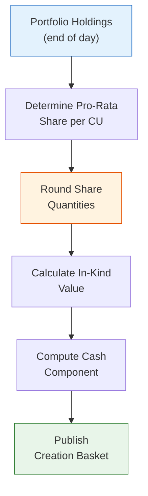

# ETF Creation Basket Calculation

> **Template Type**: Quantitative / Operations | **Audience**: Portfolio Management, Fund Accounting, Authorized Participants

---

## Document Control

| Field                  | Value                   |
| ---------------------- | ----------------------- |
| **Document ID**        | `ETF-OPS-BASKET-001`    |
| **Version**            | 1.0                     |
| **Classification**     | Internal — Confidential |
| **Fund Name**          | `{{fund_name}}`         |
| **Ticker**             | `{{ticker}}`            |
| **Creation Unit Size** | `{{cu_size}}` shares    |
| **Date Created**       | `{{date_created}}`      |
| **Last Revised**       | `{{date_revised}}`      |
| **Prepared By**        | `{{prepared_by}}`       |
| **Status**             | Active                  |

---

## 1. Net Asset Value (NAV) Calculation

### 1.1 End-of-Day NAV

The Fund's per-share NAV is calculated once daily at 4:00 PM ET:

$$\text{NAV}_{\text{share}} = \frac{\text{Total Net Assets}}{\text{Shares Outstanding}} = \frac{\displaystyle\sum_{i=1}^{N} P_i \cdot Q_i + C + A_R - L - A_P}{S}$$

Where:

- $P_i$ = closing market price of security $i$
- $Q_i$ = number of shares held of security $i$
- $N$ = total number of distinct portfolio holdings
- $C$ = cash and cash equivalents
- $A_R$ = accrued receivables (dividends, interest)
- $L$ = fund liabilities (management fees, other accrued expenses)
- $A_P$ = accrued payables
- $S$ = total fund shares outstanding

### 1.2 Total Net Assets Breakdown

| Component                    | Symbol               | Value ($)                     |
| ---------------------------- | -------------------- | ----------------------------- |
| Portfolio market value       | $\sum P_i \cdot Q_i$ | `{{portfolio_mv}}`            |
| Cash and equivalents         | $C$                  | `{{cash_value}}`              |
| Accrued dividends receivable | $A_R^{\text{div}}$   | `{{accrued_div}}`             |
| Accrued interest receivable  | $A_R^{\text{int}}$   | `{{accrued_int}}`             |
| Other receivables            | $A_R^{\text{other}}$ | `{{other_recv}}`              |
| **Total Assets**             |                      | **`{{total_assets}}`**        |
| Accrued management fee       | $L^{\text{mgmt}}$    | (`{{accrued_mgmt}}`)          |
| Accrued admin fee            | $L^{\text{admin}}$   | (`{{accrued_admin}}`)         |
| Other accrued expenses       | $L^{\text{other}}$   | (`{{accrued_other}}`)         |
| **Total Liabilities**        |                      | **(`{{total_liabilities}}`)** |
| **Total Net Assets**         |                      | **`{{total_net_assets}}`**    |
| Shares Outstanding           | $S$                  | `{{shares_outstanding}}`      |
| **NAV per Share**            |                      | **$`{{nav_per_share}}`**      |

### 1.3 Daily Accrued Expense Calculation

Management fee accrual per day:

$$L_{\text{daily}}^{\text{mgmt}} = \frac{\text{TNA} \times r_{\text{mgmt}}}{365}$$

Where $r_{\text{mgmt}}$ is the annual management fee rate (expressed as a decimal).

---

## 2. Creation Basket Construction

### 2.1 Basket Calculation Process

### 2.2 Pro-Rata Share Calculation

For each security $i$, the basket quantity is:

$$Q_i^{\text{basket}} = \left\lfloor \frac{Q_i \times \text{CU Size}}{S} \right\rfloor$$

Where:

- $Q_i$ = total shares of security $i$ in the portfolio
- $\text{CU Size}$ = number of ETF shares per Creation Unit
- $S$ = total ETF shares outstanding
- $\lfloor \cdot \rfloor$ = floor function (round down to nearest whole share)

### 2.3 Example Basket Calculation

**Fund Parameters**:

- Total Net Assets: $`{{example_tna}}`
- Shares Outstanding: `{{example_shares}}`
- NAV per Share: $`{{example_nav}}`
- Creation Unit Size: `{{cu_size}}` shares

| Security    | Fund Shares ($Q_i$) | Pro-Rata   | Basket Qty ($Q_i^{\text{basket}}$) | Price ($P_i$) | Basket Value ($)             |
| ----------- | ------------------- | ---------- | ---------------------------------- | ------------- | ---------------------------- |
| `{{sec_1}}` | `{{q_1}}`           | `{{pr_1}}` | `{{bq_1}}`                         | `{{p_1}}`     | `{{bv_1}}`                   |
| `{{sec_2}}` | `{{q_2}}`           | `{{pr_2}}` | `{{bq_2}}`                         | `{{p_2}}`     | `{{bv_2}}`                   |
| `{{sec_3}}` | `{{q_3}}`           | `{{pr_3}}` | `{{bq_3}}`                         | `{{p_3}}`     | `{{bv_3}}`                   |
| `{{sec_4}}` | `{{q_4}}`           | `{{pr_4}}` | `{{bq_4}}`                         | `{{p_4}}`     | `{{bv_4}}`                   |
| `{{sec_5}}` | `{{q_5}}`           | `{{pr_5}}` | `{{bq_5}}`                         | `{{p_5}}`     | `{{bv_5}}`                   |
| **Total**   |                     |            |                                    |               | **`{{total_basket_value}}`** |

---

## 3. Cash Component Calculation

### 3.1 Standard Cash Component

The cash component per Creation Unit compensates for the rounding difference, accrued income, and accrued liabilities:

$$\text{Cash} = \underbrace{\text{NAV} \times \text{CU Size}}_{\text{CU NAV}} - \underbrace{\sum_{i=1}^{N} P_i \cdot Q_i^{\text{basket}}}_{\text{In-Kind Value}} + \underbrace{D_{\text{accrued}}}_{\text{Accrued Dividends}} - \underbrace{E_{\text{accrued}}}_{\text{Accrued Expenses}}$$

### 3.2 Cash Component Breakdown

| Component                    | Formula                              | Value ($)                 |
| ---------------------------- | ------------------------------------ | ------------------------- |
| CU NAV Value                 | $\text{NAV} \times \text{CU Size}$   | `{{cu_nav_value}}`        |
| In-Kind Basket Value         | $\sum P_i \cdot Q_i^{\text{basket}}$ | (`{{in_kind_value}}`)     |
| Rounding Difference          | CU NAV − In-Kind                     | `{{rounding_diff}}`       |
| Accrued Dividends            | $D_{\text{accrued}}$                 | `{{accrued_div_cu}}`      |
| Accrued Expenses             | $E_{\text{accrued}}$                 | (`{{accrued_exp_cu}}`)    |
| **Estimated Cash Component** |                                      | **$`{{cash_component}}`** |

### 3.3 Transaction Fees

Creation/Redemption transaction fee charged to APs:

$$\text{Fee}_{\text{CU}} = \max\left(F_{\text{flat}}, \sum_{i=1}^{N} Q_i^{\text{basket}} \cdot P_i \cdot \tau_i \right)$$

Where:

- $F_{\text{flat}}$ = flat fee per Creation Unit ($`{{flat_fee}}`)
- $\tau_i$ = estimated transaction cost rate for security $i$

| Fee Type                      | Amount                       |
| ----------------------------- | ---------------------------- |
| Standard Creation Fee         | $`{{creation_fee}}` per CU   |
| Standard Redemption Fee       | $`{{redemption_fee}}` per CU |
| Non-Standard (cash) Surcharge | $`{{cash_surcharge}}` per CU |

---

## 4. Intraday Indicative Value (IIV)

### 4.1 IIV Calculation

The Intraday Indicative Value is disseminated every 15 seconds during market hours:

$$\text{IIV}_t = \frac{\displaystyle\sum_{i=1}^{N} P_i(t) \cdot Q_i^{\text{per share}} + C_{\text{per share}} - L_{\text{per share}}}{1}$$

Where $Q_i^{\text{per share}} = Q_i / S$ is the per-share holding of security $i$.

### 4.2 IIV vs. NAV Reconciliation

| Metric           | Value                  |
| ---------------- | ---------------------- |
| End-of-Day IIV   | $`{{eod_iiv}}`         |
| Official NAV     | $`{{official_nav}}`    |
| Difference       | $`{{iiv_nav_diff}}`    |
| Difference (bps) | `{{iiv_nav_diff_bps}}` |

---

## 5. Tracking Error from Basket Operations

### 5.1 Sources of Tracking Error in C/R Process

Basket-related tracking error components:

$$TE_{\text{basket}} = \sqrt{TE_{\text{rounding}}^2 + TE_{\text{cash}}^2 + TE_{\text{timing}}^2}$$

| Source              | Description                        | Est. Impact (bps)         |
| ------------------- | ---------------------------------- | ------------------------- |
| Rounding            | Integer share rounding in basket   | `{{te_rounding}}`         |
| Cash Drag           | Cash component investment lag      | `{{te_cash_drag}}`        |
| Timing              | Market close vs. settlement timing | `{{te_timing}}`           |
| **Total Basket TE** |                                    | **`{{te_basket_total}}`** |

### 5.2 Post-Creation Portfolio Rebalancing

After receiving creation basket:

$$\Delta_i = Q_i^{\text{target}} - Q_i^{\text{actual}} = \left(\frac{w_i^{\text{index}} \times \text{TNA}_{\text{new}}}{P_i}\right) - Q_i^{\text{post-creation}}$$

Where $w_i^{\text{index}}$ is the target index weight for security $i$ and $\text{TNA}_{\text{new}}$ is total net assets after creation.

---

## 6. Daily Basket Publication Schedule

| Time (ET)         | Activity                                         |
| ----------------- | ------------------------------------------------ |
| 6:00 AM           | Prior day's basket file finalized                |
| 6:30 AM           | Basket file transmitted to APs and NSCC          |
| 7:00 AM           | Basket file published on Fund website            |
| 9:30 AM           | Market open; creation/redemption orders accepted |
| `{{cutoff_time}}` | Order cut-off time                               |
| 4:00 PM           | Market close; NAV strike                         |
| 4:15 PM           | Final cash component calculated and published    |
| 5:00 PM           | Settlement instructions confirmed                |

---

## 7. Basket File Format (NSCC Standard)

| Field                 | Description                | Example        |
| --------------------- | -------------------------- | -------------- |
| Fund Ticker           | ETF ticker symbol          | `{{ticker}}`   |
| Trade Date            | T date                     | YYYYMMDD       |
| Component Type        | Stock, Cash, or Other      | S / C / O      |
| Ticker                | Component security ticker  | AAPL           |
| CUSIP                 | Component CUSIP            | 037833100      |
| Share Quantity        | Shares per Creation Unit   | 150            |
| Estimated Cash per CU | Cash component amount      | 1,234.56       |
| Total CU per Fund     | Fund's Creation Unit count | `{{cu_count}}` |

---

## 8. Approvals

| Role               | Name                  | Signature          | Date         |
| ------------------ | --------------------- | ------------------ | ------------ |
| Portfolio Manager  | `{{pm_name}}`         | ******\_\_\_****** | **\_\_\_\_** |
| Fund Accountant    | `{{accountant_name}}` | ******\_\_\_****** | **\_\_\_\_** |
| Operations Manager | `{{ops_manager}}`     | ******\_\_\_****** | **\_\_\_\_** |

---

_This document describes the Fund's basket calculation methodology. Actual basket composition is published daily and may vary from examples shown._
