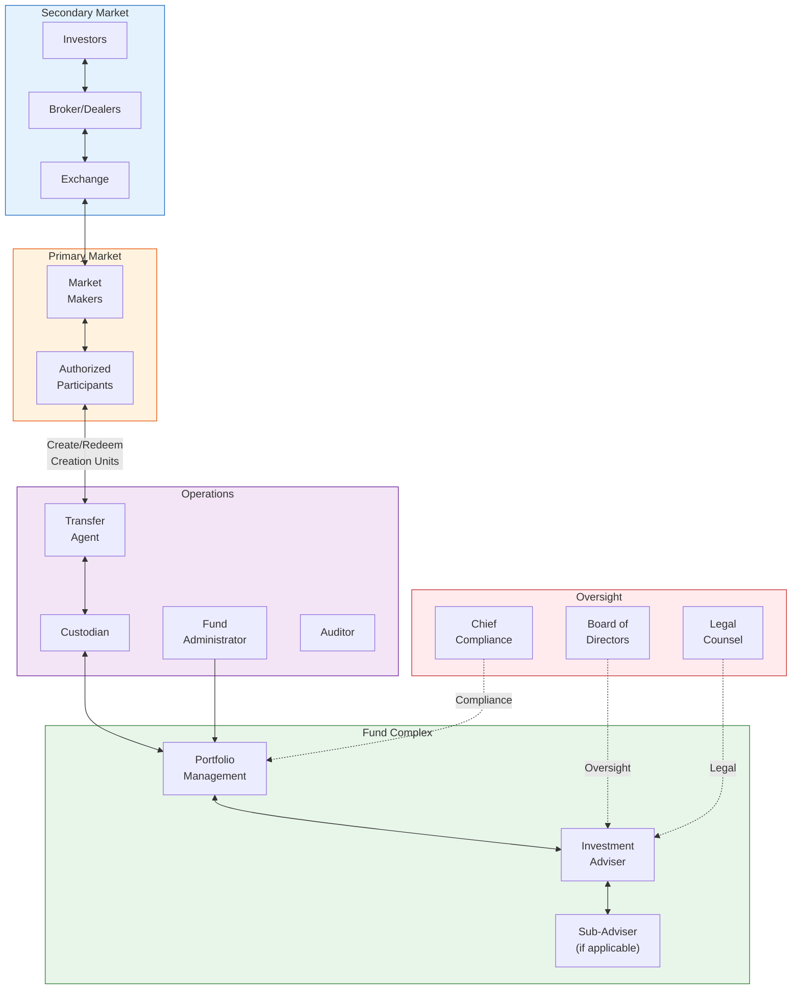
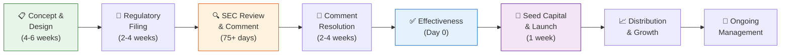
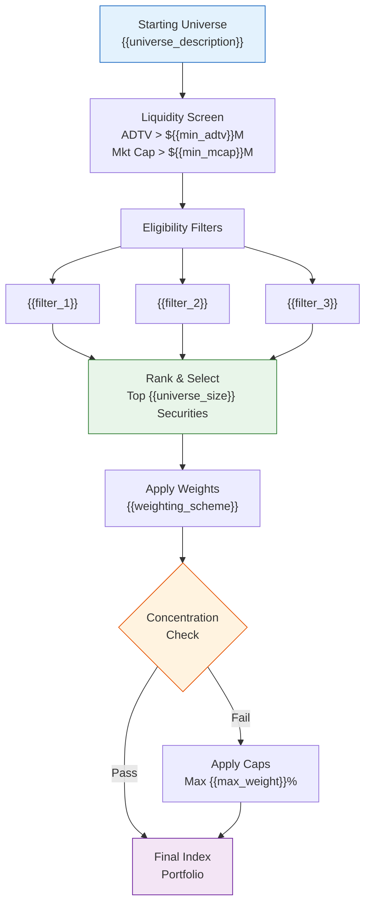
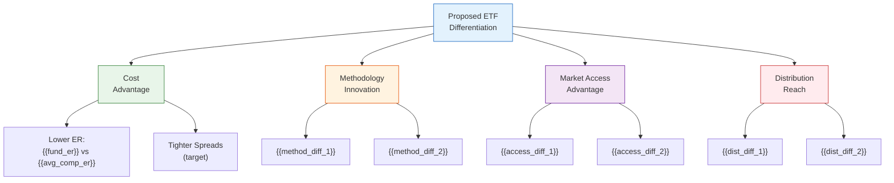
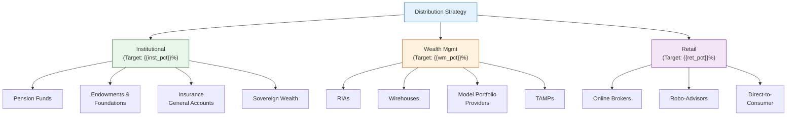
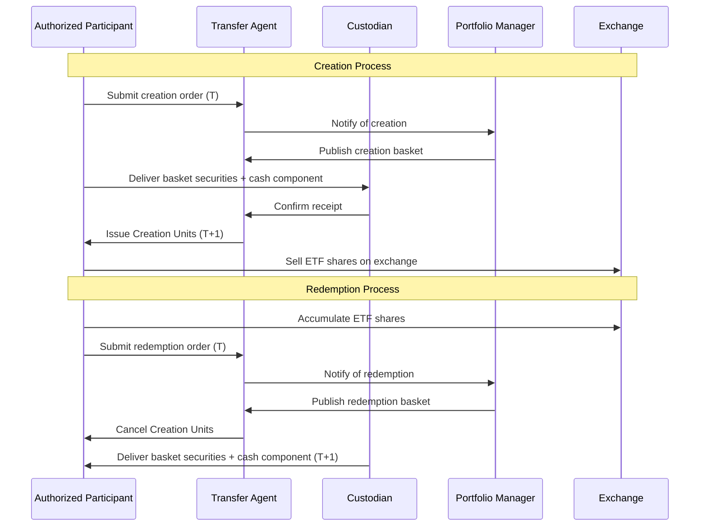
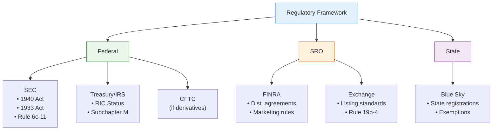

# ETF Creation Proposal — Advanced

> **Template Tier**: Advanced | **Complexity**: Comprehensive with diagrams + LaTeX math | **Audience**: Board of Directors, Regulators, Institutional Partners

---

## Document Control

| Field                 | Value                            |
| --------------------- | -------------------------------- |
| **Document ID**       | `ETF-PROP-ADV-001`               |
| **Version**           | 1.0                              |
| **Classification**    | Internal — Strictly Confidential |
| **Author**            | `{{author_name}}`                |
| **Department**        | `{{department}}`                 |
| **Date Created**      | `{{date_created}}`               |
| **Last Revised**      | `{{date_revised}}`               |
| **Approved By**       | `{{approver_name}}`              |
| **Review Cycle**      | Quarterly                        |
| **Supersedes**        | `{{previous_version}}`           |
| **Distribution List** | `{{distribution_list}}`          |
| **Status**            | Draft                            |

---

## 1. Executive Summary

`{{fund_name}}` (Ticker: `{{ticker}}`) is a proposed exchange-traded fund structured as an open-end investment company under the Investment Company Act of 1940, relying on the exemptive provisions of Rule 6c-11 (the "ETF Rule"). The fund is designed to provide investors with `{{investment_objective}}` by tracking the `{{benchmark_index}}` using a `{{replication_method}}` replication approach.

**Strategic Rationale**: `{{strategic_rationale}}`

**Key Thesis**: `{{investment_thesis}}`

### Fund Parameters Summary

| Parameter                       | Value                                  |
| ------------------------------- | -------------------------------------- |
| **Fund Name**                   | `{{fund_name}}`                        |
| **Ticker Symbol**               | `{{ticker}}`                           |
| **CUSIP**                       | `{{cusip}}`                            |
| **ISIN**                        | `{{isin}}`                             |
| **Asset Class**                 | `{{asset_class}}`                      |
| **Sub-Category**                | `{{sub_category}}`                     |
| **Benchmark Index**             | `{{benchmark_index}}`                  |
| **Index Provider**              | `{{index_provider}}`                   |
| **Target Expense Ratio**        | `{{expense_ratio_bps}}` bps            |
| **Creation Unit Size**          | `{{creation_unit_size}}` shares        |
| **Minimum Creation/Redemption** | `{{min_cu}}` Creation Units            |
| **Initial Seed Capital**        | `{{seed_capital}}`                     |
| **Proposed Launch Date**        | `{{launch_date}}`                      |
| **Legal Structure**             | Open-End Management Investment Company |
| **Tax Structure**               | Regulated Investment Company (RIC)     |
| **Primary Exchange**            | `{{exchange}}`                         |
| **Settlement Cycle**            | T+1                                    |
| **Fiscal Year End**             | `{{fiscal_year_end}}`                  |
| **Distribution Frequency**      | `{{distribution_frequency}}`           |
| **Dividend Reinvestment**       | `{{drip_policy}}`                      |

---

## 2. Product Architecture

### 2.1 Fund Ecosystem



### 2.2 Product Lifecycle



---

## 3. Investment Strategy

### 3.1 Objective

The fund seeks to provide investment results that, before fees and expenses, correspond generally to the total return performance of `{{benchmark_index}}`.

### 3.2 Index Construction Methodology



### 3.3 Replication Methodology

- **Primary Approach**: `{{replication_method}}`
- **Target Holdings**: `{{target_holdings}}` securities
- **Tracking Error Budget**: `{{tracking_error_budget}}` bps (annualized)
- **Optimization Technique**: `{{optimization_technique}}`
- **Rebalancing Frequency**: `{{rebalance_frequency}}`
- **Cash Buffer Target**: `{{cash_buffer_pct}}`%

### 3.4 Mathematical Framework

#### Net Asset Value Calculation

The fund's Net Asset Value (NAV) per share is computed at market close:

$$\text{NAV} = \frac{\sum_{i=1}^{N} (P_i \times Q_i) + C - L}{S}$$

Where:

- $P_i$ = closing price of security $i$
- $Q_i$ = quantity held of security $i$
- $N$ = number of distinct holdings
- $C$ = cash and cash equivalents
- $L$ = total fund liabilities (accrued fees, payables)
- $S$ = total shares outstanding

#### Tracking Error

Annualized ex-post tracking error measures replication fidelity:

$$TE = \sigma(R_f - R_b) \times \sqrt{252}$$

Where:

- $R_f$ = daily fund return
- $R_b$ = daily benchmark return
- $\sigma$ = standard deviation of return differences

#### Information Ratio

$$IR = \frac{\bar{R}_f - \bar{R}_b}{TE}$$

The information ratio quantifies risk-adjusted excess return relative to the benchmark. Target: $|IR| < 0.1$ for passive tracking.

#### Expense Ratio Impact

The total cost of fund ownership including tracking difference:

$$\text{Total Cost} = ER + TD + \frac{\text{Spread}}{2} \times \frac{2}{H}$$

Where:

- $ER$ = expense ratio (annualized)
- $TD$ = tracking difference (annualized)
- $\text{Spread}$ = average bid-ask spread
- $H$ = holding period in years

### 3.5 Portfolio Characteristics

| Metric               | Target              | Benchmark            |
| -------------------- | ------------------- | -------------------- |
| Number of Holdings   | `{{fund_holdings}}` | `{{bench_holdings}}` |
| Wtd. Avg. Market Cap | `{{fund_mcap}}`     | `{{bench_mcap}}`     |
| P/E Ratio (Fwd)      | `{{fund_pe}}`       | `{{bench_pe}}`       |
| P/B Ratio            | `{{fund_pb}}`       | `{{bench_pb}}`       |
| Dividend Yield       | `{{fund_yield}}`    | `{{bench_yield}}`    |
| ROE                  | `{{fund_roe}}`      | `{{bench_roe}}`      |
| Duration (FI)        | `{{fund_duration}}` | `{{bench_duration}}` |
| OAS (FI)             | `{{fund_oas}}`      | `{{bench_oas}}`      |
| Avg. Credit (FI)     | `{{fund_credit}}`   | `{{bench_credit}}`   |
| Turnover (est.)      | `{{fund_turnover}}` | `{{bench_turnover}}` |

### 3.6 Sector Allocation (Estimated)


---

## 4. Market Opportunity

### 4.1 Total Addressable Market

| Segment         | AUM ($B)            | Growth Rate            | Penetration    |
| --------------- | ------------------- | ---------------------- | -------------- |
| `{{segment_1}}` | `{{seg1_aum}}`      | `{{seg1_growth}}`      | `{{seg1_pen}}` |
| `{{segment_2}}` | `{{seg2_aum}}`      | `{{seg2_growth}}`      | `{{seg2_pen}}` |
| `{{segment_3}}` | `{{seg3_aum}}`      | `{{seg3_growth}}`      | `{{seg3_pen}}` |
| `{{segment_4}}` | `{{seg4_aum}}`      | `{{seg4_growth}}`      | `{{seg4_pen}}` |
| **Total**       | **`{{total_tam}}`** | **`{{total_growth}}`** | —              |

### 4.2 Competitive Landscape

| Fund          | Ticker        | AUM ($M)     | ER (bps)    | TE (bps)    | Spread (bps)    | Flows 12M ($M) | Inception     |
| ------------- | ------------- | ------------ | ----------- | ----------- | --------------- | -------------- | ------------- |
| `{{c1_name}}` | `{{c1_tick}}` | `{{c1_aum}}` | `{{c1_er}}` | `{{c1_te}}` | `{{c1_spread}}` | `{{c1_flows}}` | `{{c1_date}}` |
| `{{c2_name}}` | `{{c2_tick}}` | `{{c2_aum}}` | `{{c2_er}}` | `{{c2_te}}` | `{{c2_spread}}` | `{{c2_flows}}` | `{{c2_date}}` |
| `{{c3_name}}` | `{{c3_tick}}` | `{{c3_aum}}` | `{{c3_er}}` | `{{c3_te}}` | `{{c3_spread}}` | `{{c3_flows}}` | `{{c3_date}}` |
| `{{c4_name}}` | `{{c4_tick}}` | `{{c4_aum}}` | `{{c4_er}}` | `{{c4_te}}` | `{{c4_spread}}` | `{{c4_flows}}` | `{{c4_date}}` |
| `{{c5_name}}` | `{{c5_tick}}` | `{{c5_aum}}` | `{{c5_er}}` | `{{c5_te}}` | `{{c5_spread}}` | `{{c5_flows}}` | `{{c5_date}}` |

### 4.3 Differentiation Framework



### 4.4 Distribution Strategy



---

## 5. Fee Structure & Economics

### 5.1 Detailed Expense Breakdown

| Component               | Bps                | Annual ($K at $100M) | Annual ($K at $500M) | Annual ($K at $1B) |
| ----------------------- | ------------------ | -------------------- | -------------------- | ------------------ |
| Management Fee          | `{{mgmt_bps}}`     | `{{mgmt_100}}`       | `{{mgmt_500}}`       | `{{mgmt_1b}}`      |
| Administration          | `{{admin_bps}}`    | `{{admin_100}}`      | `{{admin_500}}`      | `{{admin_1b}}`     |
| Custody                 | `{{cust_bps}}`     | `{{cust_100}}`       | `{{cust_500}}`       | `{{cust_1b}}`      |
| Index License           | `{{idx_bps}}`      | `{{idx_100}}`        | `{{idx_500}}`        | `{{idx_1b}}`       |
| Legal & Compliance      | `{{leg_bps}}`      | `{{leg_100}}`        | `{{leg_500}}`        | `{{leg_1b}}`       |
| Audit & Tax             | `{{aud_bps}}`      | `{{aud_100}}`        | `{{aud_500}}`        | `{{aud_1b}}`       |
| Board Fees              | `{{brd_bps}}`      | `{{brd_100}}`        | `{{brd_500}}`        | `{{brd_1b}}`       |
| Insurance               | `{{ins_bps}}`      | `{{ins_100}}`        | `{{ins_500}}`        | `{{ins_1b}}`       |
| Printing & Postage      | `{{prt_bps}}`      | `{{prt_100}}`        | `{{prt_500}}`        | `{{prt_1b}}`       |
| Other                   | `{{oth_bps}}`      | `{{oth_100}}`        | `{{oth_500}}`        | `{{oth_1b}}`       |
| **Gross Expense Ratio** | **`{{gross_er}}`** | **`{{gross_100}}`**  | **`{{gross_500}}`**  | **`{{gross_1b}}`** |
| Less: Fee Waiver        | (`{{waiver_bps}}`) | (`{{waiver_100}}`)   | (`{{waiver_500}}`)   | (`{{waiver_1b}}`)  |
| **Net Expense Ratio**   | **`{{net_er}}`**   | **`{{net_100}}`**    | **`{{net_500}}`**    | **`{{net_1b}}`**   |

### 5.2 Breakeven Analysis

The breakeven AUM is computed as:

$$\text{AUM}_{\text{breakeven}} = \frac{\text{Fixed Costs}}{ER_{\text{net}} - \text{Variable Cost Rate}}$$

| Scenario     | Fixed Costs ($K) | Variable Rate (bps) | Net ER (bps)  | Breakeven AUM ($M) |
| ------------ | ---------------- | ------------------- | ------------- | ------------------ |
| Conservative | `{{cons_fixed}}` | `{{cons_var}}`      | `{{cons_er}}` | `{{cons_be}}`      |
| Base         | `{{base_fixed}}` | `{{base_var}}`      | `{{base_er}}` | `{{base_be}}`      |
| Aggressive   | `{{agg_fixed}}`  | `{{agg_var}}`       | `{{agg_er}}`  | `{{agg_be}}`       |

---

## 6. Service Provider Framework

| Role                    | Provider        | Fee             | Term             | SLA             | Status           |
| ----------------------- | --------------- | --------------- | ---------------- | --------------- | ---------------- |
| Custodian               | `{{custodian}}` | `{{cust_fee}}`  | `{{cust_term}}`  | `{{cust_sla}}`  | `{{cust_stat}}`  |
| Fund Administrator      | `{{admin}}`     | `{{admin_fee}}` | `{{admin_term}}` | `{{admin_sla}}` | `{{admin_stat}}` |
| Transfer Agent          | `{{ta}}`        | `{{ta_fee}}`    | `{{ta_term}}`    | `{{ta_sla}}`    | `{{ta_stat}}`    |
| Auditor                 | `{{auditor}}`   | `{{aud_fee}}`   | `{{aud_term}}`   | —               | `{{aud_stat}}`   |
| Legal Counsel           | `{{legal}}`     | `{{leg_fee}}`   | `{{leg_term}}`   | —               | `{{leg_stat}}`   |
| Index Provider          | `{{idx_prov}}`  | `{{idx_fee}}`   | `{{idx_term}}`   | `{{idx_sla}}`   | `{{idx_stat}}`   |
| Market Maker(s)         | `{{mm}}`        | N/A             | `{{mm_term}}`    | `{{mm_sla}}`    | `{{mm_stat}}`    |
| Authorized Participants | `{{aps}}`       | N/A             | `{{ap_term}}`    | —               | `{{ap_stat}}`    |
| Distributor             | `{{dist}}`      | `{{dist_fee}}`  | `{{dist_term}}`  | —               | `{{dist_stat}}`  |
| Compliance Consultant   | `{{comp_cons}}` | `{{comp_fee}}`  | `{{comp_term}}`  | —               | `{{comp_stat}}`  |

---

## 7. Creation / Redemption Mechanics

### 7.1 Process Flow



### 7.2 Creation Unit Economics

The cash component per Creation Unit is calculated as:

$$\text{Cash Component} = (\text{NAV} \times \text{CU Size}) - \sum_{i=1}^{N} (P_i \times Q_i^{\text{basket}}) + \text{Accrued Dividends}$$

Transaction fees per Creation Unit:

$$\text{CU Fee} = \max\left(\text{Flat Fee}, \sum_{i=1}^{N} (Q_i^{\text{basket}} \times P_i \times \tau_i)\right)$$

Where $\tau_i$ is the estimated transaction cost for security $i$.

---

## 8. Risk Assessment

### 8.1 Risk Matrix

| Risk Category      | Severity       | Likelihood     | Score            | Mitigation                     | Owner          |
| ------------------ | -------------- | -------------- | ---------------- | ------------------------------ | -------------- |
| Market Risk        | High           | High           | 9                | Diversification, rebalancing   | PM             |
| Tracking Error     | Medium         | Medium         | 4                | Optimization, daily monitoring | PM             |
| Liquidity Risk     | `{{liq_sev}}`  | `{{liq_lik}}`  | `{{liq_score}}`  | `{{liq_mit}}`                  | `{{liq_own}}`  |
| Counterparty Risk  | `{{cpty_sev}}` | `{{cpty_lik}}` | `{{cpty_score}}` | `{{cpty_mit}}`                 | `{{cpty_own}}` |
| Concentration Risk | `{{conc_sev}}` | `{{conc_lik}}` | `{{conc_score}}` | `{{conc_mit}}`                 | `{{conc_own}}` |
| Operational Risk   | Medium         | Low            | 2                | BCP, redundancy, testing       | COO            |
| Regulatory Risk    | Low            | Low            | 1                | Compliance monitoring          | CCO            |
| Cybersecurity Risk | High           | Low            | 3                | Security program               | CISO           |
| Reputational Risk  | `{{rep_sev}}`  | `{{rep_lik}}`  | `{{rep_score}}`  | `{{rep_mit}}`                  | `{{rep_own}}`  |

### 8.2 Stress Testing Framework

Portfolio value under stress:

$$V_{\text{stress}} = \sum_{i=1}^{N} Q_i \times P_i \times (1 + S_i)$$

Where $S_i$ is the stress scenario return for security $i$.

| Scenario          | Equity Shock  | Rate Shock      | Spread Shock      | FX Shock      | Portfolio Impact   |
| ----------------- | ------------- | --------------- | ----------------- | ------------- | ------------------ |
| 2008 GFC          | -50%          | -200bps         | +500bps           | -15%          | `{{gfc_impact}}`   |
| 2020 COVID        | -35%          | -150bps         | +300bps           | -10%          | `{{covid_impact}}` |
| Rate Spike        | -10%          | +300bps         | +100bps           | -5%           | `{{rate_impact}}`  |
| Tail Risk (99.9%) | `{{tail_eq}}` | `{{tail_rate}}` | `{{tail_spread}}` | `{{tail_fx}}` | `{{tail_impact}}`  |

---

## 9. Regulatory Framework

### 9.1 Regulatory Structure



### 9.2 Key Compliance Requirements

| Requirement              | Rule/Regulation  | Frequency                  | Owner           |
| ------------------------ | ---------------- | -------------------------- | --------------- |
| NAV Calculation          | Rule 22c-1       | Daily                      | Administrator   |
| Portfolio Disclosure     | Rule 6c-11(c)(1) | Daily                      | PM / Compliance |
| Prospectus Updates       | Section 10(a)(3) | Annual + As needed         | Legal           |
| Annual Report (N-CSR)    | Rule 30e-1       | Semi-annual                | Admin / Audit   |
| Holdings Report (N-PORT) | Rule 30b1-9      | Monthly (quarterly public) | Admin           |
| Compliance Report        | Rule 38a-1       | Annual                     | CCO             |
| Code of Ethics           | Rule 17j-1       | Annual certification       | Compliance      |
| Proxy Voting             | Rule 206(4)-6    | Per proxy                  | PM / Compliance |
| Liquidity Classification | Rule 22e-4       | Monthly (minimum)          | PM / Compliance |
| Derivatives Risk Mgmt    | Rule 18f-4       | Ongoing                    | PM / Compliance |

---

## 10. Financial Projections

### 10.1 AUM Scenarios

| Scenario | Year 1        | Year 2        | Year 3        | Year 5        | Year 10        |
| -------- | ------------- | ------------- | ------------- | ------------- | -------------- |
| **Bull** | `{{bull_y1}}` | `{{bull_y2}}` | `{{bull_y3}}` | `{{bull_y5}}` | `{{bull_y10}}` |
| **Base** | `{{base_y1}}` | `{{base_y2}}` | `{{base_y3}}` | `{{base_y5}}` | `{{base_y10}}` |
| **Bear** | `{{bear_y1}}` | `{{bear_y2}}` | `{{bear_y3}}` | `{{bear_y5}}` | `{{bear_y10}}` |

### 10.2 Detailed P&L (Base Case)

| Line Item             | Year 1 ($K)  | Year 2 ($K)  | Year 3 ($K)  | Year 5 ($K)  |
| --------------------- | ------------ | ------------ | ------------ | ------------ |
| Average AUM ($M)      | `{{aum_y1}}` | `{{aum_y2}}` | `{{aum_y3}}` | `{{aum_y5}}` |
| **Revenue**           |              |              |              |              |
| Management Fees       | `{{mf_y1}}`  | `{{mf_y2}}`  | `{{mf_y3}}`  | `{{mf_y5}}`  |
| Securities Lending    | `{{sl_y1}}`  | `{{sl_y2}}`  | `{{sl_y3}}`  | `{{sl_y5}}`  |
| **Total Revenue**     | `{{tr_y1}}`  | `{{tr_y2}}`  | `{{tr_y3}}`  | `{{tr_y5}}`  |
| **Expenses**          |              |              |              |              |
| Fund Expenses         | `{{fe_y1}}`  | `{{fe_y2}}`  | `{{fe_y3}}`  | `{{fe_y5}}`  |
| Distribution Costs    | `{{dc_y1}}`  | `{{dc_y2}}`  | `{{dc_y3}}`  | `{{dc_y5}}`  |
| Marketing             | `{{mk_y1}}`  | `{{mk_y2}}`  | `{{mk_y3}}`  | `{{mk_y5}}`  |
| Technology            | `{{tc_y1}}`  | `{{tc_y2}}`  | `{{tc_y3}}`  | `{{tc_y5}}`  |
| Fee Waiver Absorption | `{{fw_y1}}`  | `{{fw_y2}}`  | `{{fw_y3}}`  | `{{fw_y5}}`  |
| **Total Expenses**    | `{{te_y1}}`  | `{{te_y2}}`  | `{{te_y3}}`  | `{{te_y5}}`  |
| **Net Income**        | `{{ni_y1}}`  | `{{ni_y2}}`  | `{{ni_y3}}`  | `{{ni_y5}}`  |
| Cumulative P&L        | `{{cum_y1}}` | `{{cum_y2}}` | `{{cum_y3}}` | `{{cum_y5}}` |
| ROI                   | `{{roi_y1}}` | `{{roi_y2}}` | `{{roi_y3}}` | `{{roi_y5}}` |

### 10.3 NPV Analysis

Net present value of the fund product over a 10-year horizon:

$$NPV = -I_0 + \sum_{t=1}^{10} \frac{CF_t}{(1+r)^t}$$

Where:

- $I_0$ = initial investment (seed capital + launch costs)
- $CF_t$ = net cash flow in year $t$
- $r$ = discount rate (WACC)

| Parameter               | Value                |
| ----------------------- | -------------------- |
| Initial Investment ($M) | `{{initial_invest}}` |
| Discount Rate           | `{{discount_rate}}`% |
| 10-Year NPV ($M)        | `{{npv_10yr}}`       |
| IRR                     | `{{irr}}`%           |
| Payback Period          | `{{payback}}` years  |

---

## 11. Implementation Timeline

```mermaid
gantt
    title ETF Launch — Detailed Timeline
    dateFormat YYYY-MM-DD
    axisFormat %b %Y

    section Concept & Design
    Market Research              :a1, {{start_date}}, 14d
    Index Selection & Due Diligence :a2, after a1, 14d
    Product Design Finalization  :a3, after a2, 7d
    Board Presentation           :milestone, after a3, 0d

    section Regulatory
    Draft N-1A Prospectus        :b1, after a3, 21d
    Internal Legal Review        :b2, after b1, 10d
    SEC Filing                   :b3, after b2, 3d
    SEC Review (75-day)          :b4, after b3, 75d
    Comment Letter Response      :b5, after b4, 14d
    Effectiveness                :milestone, after b5, 0d

    section Service Providers
    RFPs & Evaluation            :c1, {{start_date}}, 30d
    Contract Negotiation         :c2, after c1, 21d
    Onboarding & Setup           :c3, after c2, 21d

    section Exchange & Market
    Exchange Application (19b-4) :d1, after b3, 14d
    AP Agreements                :d2, after c2, 14d
    Market Maker Agreements      :d3, after c2, 14d

    section Technology
    Systems Configuration        :e1, after c2, 30d
    UAT & Testing                :e2, after e1, 14d
    Go-Live Readiness            :milestone, after e2, 0d

    section Launch
    Seed Capital                 :f1, after b5, 5d
    Fund Launch                  :milestone, after f1, 0d
    Initial Marketing Campaign   :f2, after f1, 90d
```

---

## 12. Approvals

| Role                     | Name               | Signature          | Date         |
| ------------------------ | ------------------ | ------------------ | ------------ |
| Product Lead             | `{{product_lead}}` | ******\_\_\_****** | **\_\_\_\_** |
| Lead Portfolio Manager   | `{{pm_name}}`      | ******\_\_\_****** | **\_\_\_\_** |
| Chief Investment Officer | `{{cio_name}}`     | ******\_\_\_****** | **\_\_\_\_** |
| Chief Operating Officer  | `{{coo_name}}`     | ******\_\_\_****** | **\_\_\_\_** |
| Chief Compliance Officer | `{{cco_name}}`     | ******\_\_\_****** | **\_\_\_\_** |
| Chief Financial Officer  | `{{cfo_name}}`     | ******\_\_\_****** | **\_\_\_\_** |
| General Counsel          | `{{gc_name}}`      | ******\_\_\_****** | **\_\_\_\_** |
| CEO / Managing Director  | `{{ceo_name}}`     | ******\_\_\_****** | **\_\_\_\_** |
| Board Chair              | `{{board_chair}}`  | ******\_\_\_****** | **\_\_\_\_** |

---

## Appendices

### Appendix A: Detailed Index Methodology

`{{index_methodology_full}}`

### Appendix B: Back-tested Performance Analysis

`{{backtest_analysis}}`

### Appendix C: Competitive Intelligence Deep Dive

`{{competitive_deep_dive}}`

### Appendix D: Regulatory Correspondence Log

`{{regulatory_correspondence}}`

### Appendix E: Service Provider Due Diligence Reports

`{{sp_dd_reports}}`

### Appendix F: Tax Opinion

`{{tax_opinion_summary}}`

---

_This document is strictly confidential and intended solely for authorized internal personnel and approved external parties. Unauthorized distribution, reproduction, or disclosure is strictly prohibited and may result in legal action._
