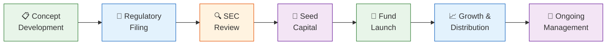
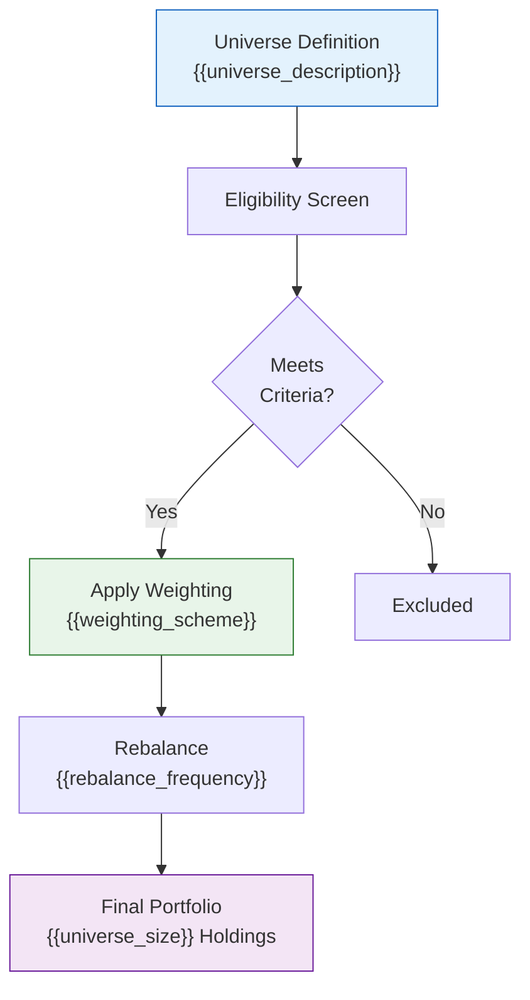
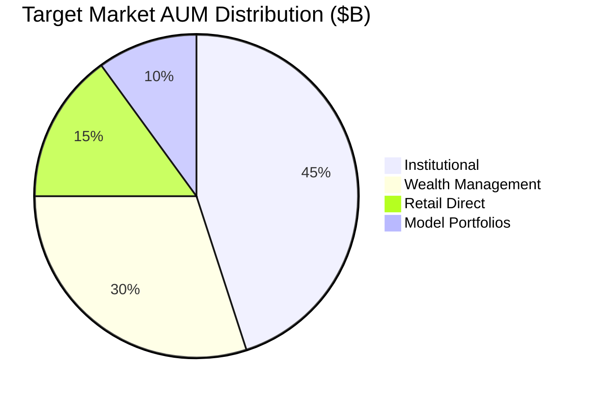
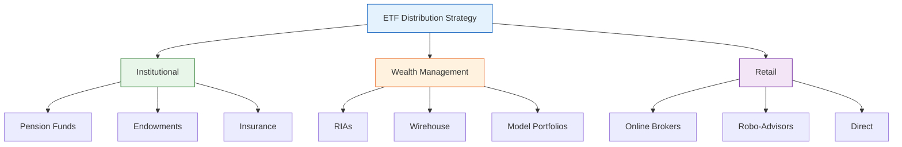
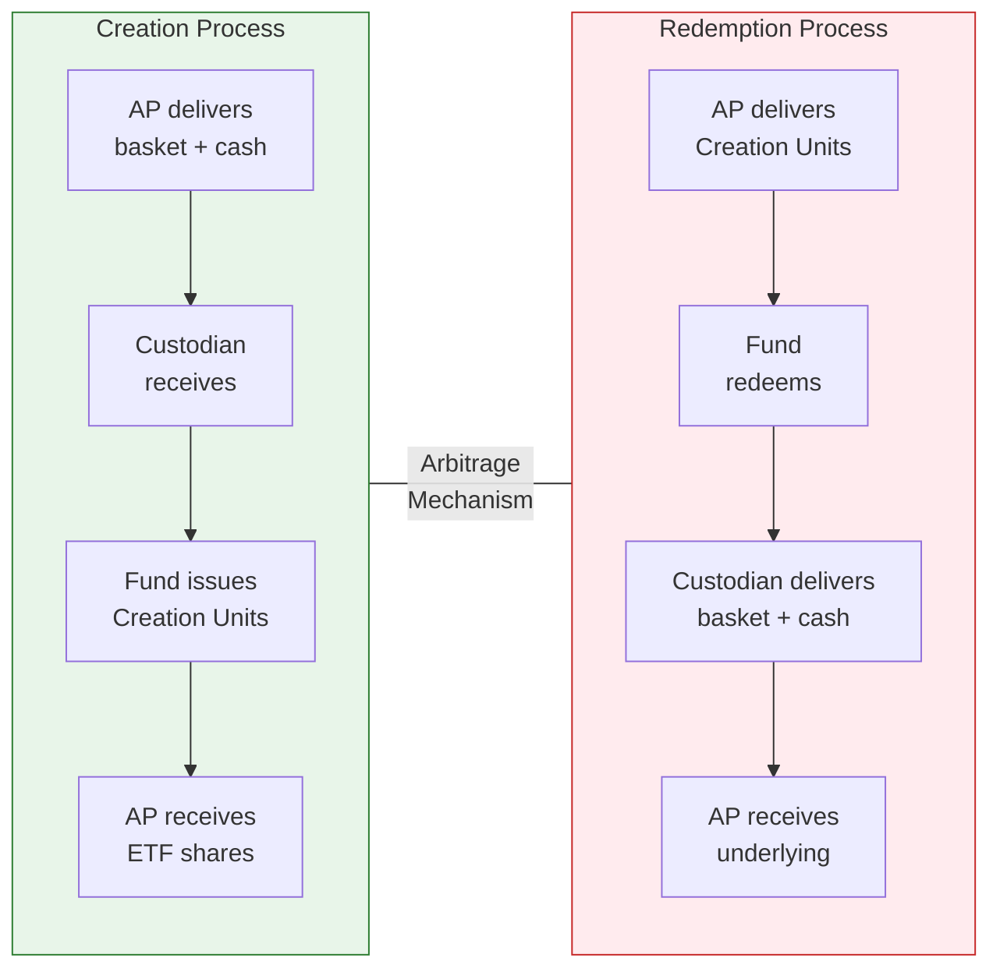

# ETF Creation Proposal — Intermediate

> **Template Tier**: Intermediate | **Complexity**: Standard with diagrams | **Audience**: Board of Directors, Senior Management

---

## Document Control

| Field              | Value                   |
| ------------------ | ----------------------- |
| **Document ID**    | `ETF-PROP-INT-001`      |
| **Version**        | 1.0                     |
| **Classification** | Internal — Confidential |
| **Author**         | `{{author_name}}`       |
| **Department**     | `{{department}}`        |
| **Date Created**   | `{{date_created}}`      |
| **Last Revised**   | `{{date_revised}}`      |
| **Approved By**    | `{{approver_name}}`     |
| **Review Cycle**   | Quarterly               |
| **Status**         | Draft                   |

---

## 1. Executive Summary

`{{fund_name}}` (Ticker: `{{ticker}}`) is a proposed exchange-traded fund structured under the Investment Company Act of 1940 to provide investors with `{{investment_objective}}`. The fund will employ a `{{replication_method}}` replication strategy tracking the `{{benchmark_index}}`, targeting an all-in expense ratio of `{{expense_ratio_bps}}` basis points.

**Strategic Rationale**: `{{strategic_rationale}}`

### Key Fund Parameters

| Parameter                | Value                                  |
| ------------------------ | -------------------------------------- |
| **Fund Name**            | `{{fund_name}}`                        |
| **Ticker Symbol**        | `{{ticker}}`                           |
| **CUSIP**                | `{{cusip}}`                            |
| **Asset Class**          | `{{asset_class}}`                      |
| **Sub-Category**         | `{{sub_category}}`                     |
| **Benchmark Index**      | `{{benchmark_index}}`                  |
| **Target Expense Ratio** | `{{expense_ratio_bps}}` bps            |
| **Creation Unit Size**   | `{{creation_unit_size}}` shares        |
| **Initial Seed Capital** | `{{seed_capital}}`                     |
| **Proposed Launch Date** | `{{launch_date}}`                      |
| **Legal Structure**      | Open-End Investment Company (1940 Act) |
| **Primary Exchange**     | `{{exchange}}`                         |
| **Fiscal Year End**      | `{{fiscal_year_end}}`                  |

---

## 2. Product Lifecycle



---

## 3. Investment Strategy

### 3.1 Objective

The fund seeks to provide investment results that, before fees and expenses, correspond generally to the total return performance of `{{benchmark_index}}`.

### 3.2 Index Methodology Overview



### 3.3 Replication Strategy

- **Method**: `{{replication_method}}` (Full / Optimized Sampling / Synthetic)
- **Target Holdings**: `{{target_holdings}}` securities
- **Tracking Error Budget**: `{{tracking_error_budget}}` bps annualized
- **Cash Drag Target**: < `{{cash_drag_target}}` bps

### 3.4 Portfolio Characteristics

| Metric                     | Target              | Benchmark            |
| -------------------------- | ------------------- | -------------------- |
| Number of Holdings         | `{{fund_holdings}}` | `{{bench_holdings}}` |
| Weighted Avg. Market Cap   | `{{fund_mcap}}`     | `{{bench_mcap}}`     |
| P/E Ratio                  | `{{fund_pe}}`       | `{{bench_pe}}`       |
| Dividend Yield             | `{{fund_yield}}`    | `{{bench_yield}}`    |
| Duration (if fixed income) | `{{fund_duration}}` | `{{bench_duration}}` |
| Credit Quality (if FI)     | `{{fund_credit}}`   | `{{bench_credit}}`   |

---

## 4. Market Opportunity

### 4.1 Market Sizing



### 4.2 Competitive Analysis

| Fund              | Ticker              | AUM ($M)         | ER (bps)        | TE (bps)        | Bid-Ask (bps)       | Inception         |
| ----------------- | ------------------- | ---------------- | --------------- | --------------- | ------------------- | ----------------- |
| `{{comp_1_name}}` | `{{comp_1_ticker}}` | `{{comp_1_aum}}` | `{{comp_1_er}}` | `{{comp_1_te}}` | `{{comp_1_spread}}` | `{{comp_1_date}}` |
| `{{comp_2_name}}` | `{{comp_2_ticker}}` | `{{comp_2_aum}}` | `{{comp_2_er}}` | `{{comp_2_te}}` | `{{comp_2_spread}}` | `{{comp_2_date}}` |
| `{{comp_3_name}}` | `{{comp_3_ticker}}` | `{{comp_3_aum}}` | `{{comp_3_er}}` | `{{comp_3_te}}` | `{{comp_3_spread}}` | `{{comp_3_date}}` |
| `{{comp_4_name}}` | `{{comp_4_ticker}}` | `{{comp_4_aum}}` | `{{comp_4_er}}` | `{{comp_4_te}}` | `{{comp_4_spread}}` | `{{comp_4_date}}` |

### 4.3 Differentiation Matrix

| Feature              | Proposed Fund | Competitor A    | Competitor B    | Competitor C    |
| -------------------- | ------------- | --------------- | --------------- | --------------- |
| Expense Ratio        | `{{fund_er}}` | `{{comp_a_er}}` | `{{comp_b_er}}` | `{{comp_c_er}}` |
| `{{diff_feature_1}}` | ✅            | ❌              | ❌              | ✅              |
| `{{diff_feature_2}}` | ✅            | ✅              | ❌              | ❌              |
| `{{diff_feature_3}}` | ✅            | ❌              | ✅              | ❌              |

### 4.4 Distribution Strategy



---

## 5. Fee Structure & Economics

### 5.1 Expense Breakdown

| Component               | Bps                    | Annual ($K at $100M AUM)  |
| ----------------------- | ---------------------- | ------------------------- |
| Management Fee          | `{{mgmt_fee_bps}}`     | `{{mgmt_fee_annual}}`     |
| Administration          | `{{admin_fee_bps}}`    | `{{admin_fee_annual}}`    |
| Custody                 | `{{custody_fee_bps}}`  | `{{custody_fee_annual}}`  |
| Index License           | `{{index_fee_bps}}`    | `{{index_fee_annual}}`    |
| Legal & Compliance      | `{{legal_fee_bps}}`    | `{{legal_fee_annual}}`    |
| Audit                   | `{{audit_fee_bps}}`    | `{{audit_fee_annual}}`    |
| Printing & Postage      | `{{print_fee_bps}}`    | `{{print_fee_annual}}`    |
| Other                   | `{{other_fee_bps}}`    | `{{other_fee_annual}}`    |
| **Total Expense Ratio** | **`{{total_er_bps}}`** | **`{{total_er_annual}}`** |

### 5.2 Fee Waivers

- **Waiver Period**: `{{waiver_period}}`
- **Waiver Amount**: `{{waiver_amount_bps}}` bps
- **Net Expense Ratio**: `{{net_er_bps}}` bps
- **Recoupment Period**: `{{recoupment_period}}`

---

## 6. Service Provider Selection

| Role                    | Provider             | Fee (bps)           | Contract Term        | Status                 |
| ----------------------- | -------------------- | ------------------- | -------------------- | ---------------------- |
| Custodian               | `{{custodian}}`      | `{{custodian_fee}}` | `{{custodian_term}}` | `{{custodian_status}}` |
| Fund Administrator      | `{{administrator}}`  | `{{admin_fee}}`     | `{{admin_term}}`     | `{{admin_status}}`     |
| Transfer Agent          | `{{transfer_agent}}` | `{{ta_fee}}`        | `{{ta_term}}`        | `{{ta_status}}`        |
| Auditor                 | `{{auditor}}`        | `{{auditor_fee}}`   | `{{auditor_term}}`   | `{{auditor_status}}`   |
| Legal Counsel           | `{{legal_counsel}}`  | `{{legal_fee}}`     | `{{legal_term}}`     | `{{legal_status}}`     |
| Index Provider          | `{{index_provider}}` | `{{index_fee}}`     | `{{index_term}}`     | `{{index_status}}`     |
| Market Maker(s)         | `{{market_makers}}`  | N/A                 | `{{mm_term}}`        | `{{mm_status}}`        |
| Authorized Participants | `{{ap_list}}`        | N/A                 | `{{ap_term}}`        | `{{ap_status}}`        |
| Distributor             | `{{distributor}}`    | `{{dist_fee}}`      | `{{dist_term}}`      | `{{dist_status}}`      |

---

## 7. Creation / Redemption Process



---

## 8. Regulatory & Compliance

### 8.1 Regulatory Framework

- **Fund Registration**: Form N-1A under Securities Act of 1933 and Investment Company Act of 1940
- **Exemptive Relief**: Rule 6c-11 (ETF Rule)
- **Exchange Listing**: `{{exchange}}` listing standards, Rule 19b-4
- **Compliance Program**: Rule 38a-1 compliance program
- **Code of Ethics**: Rule 17j-1
- **Proxy Voting**: Rule 206(4)-6

### 8.2 Key Filing Timeline

| Filing                | Target Date          | Regulatory Body      |
| --------------------- | -------------------- | -------------------- |
| Form N-1A (Initial)   | `{{n1a_date}}`       | SEC                  |
| 19b-4 (Exchange Rule) | `{{19b4_date}}`      | `{{exchange}}` / SEC |
| Blue Sky Filings      | `{{blue_sky_date}}`  | State Regulators     |
| FINRA Review          | `{{finra_date}}`     | FINRA                |
| Effectiveness         | `{{effective_date}}` | SEC                  |

---

## 9. Risk Assessment

### 9.1 Risk Summary

| Risk Category     | Severity                 | Likelihood                 | Mitigation                   |
| ----------------- | ------------------------ | -------------------------- | ---------------------------- |
| Market Risk       | High                     | High                       | Diversification, rebalancing |
| Tracking Error    | Medium                   | Medium                     | Optimization, monitoring     |
| Liquidity Risk    | `{{liquidity_severity}}` | `{{liquidity_likelihood}}` | `{{liquidity_mitigation}}`   |
| Counterparty Risk | `{{cpty_severity}}`      | `{{cpty_likelihood}}`      | `{{cpty_mitigation}}`        |
| Operational Risk  | Medium                   | Low                        | Redundancy, BCP              |
| Regulatory Risk   | Low                      | Low                        | Compliance monitoring        |

---

## 10. Financial Projections

### 10.1 AUM Growth Scenarios

| Scenario | Year 1        | Year 2        | Year 3        | Year 5        |
| -------- | ------------- | ------------- | ------------- | ------------- |
| **Bull** | `{{bull_y1}}` | `{{bull_y2}}` | `{{bull_y3}}` | `{{bull_y5}}` |
| **Base** | `{{base_y1}}` | `{{base_y2}}` | `{{base_y3}}` | `{{base_y5}}` |
| **Bear** | `{{bear_y1}}` | `{{bear_y2}}` | `{{bear_y3}}` | `{{bear_y5}}` |

### 10.2 P&L Projections (Base Case)

| Item                | Year 1           | Year 2           | Year 3           |
| ------------------- | ---------------- | ---------------- | ---------------- |
| Average AUM ($M)    | `{{avg_aum_y1}}` | `{{avg_aum_y2}}` | `{{avg_aum_y3}}` |
| Revenue ($K)        | `{{rev_y1}}`     | `{{rev_y2}}`     | `{{rev_y3}}`     |
| Total Expenses ($K) | `{{exp_y1}}`     | `{{exp_y2}}`     | `{{exp_y3}}`     |
| Net Income ($K)     | `{{ni_y1}}`      | `{{ni_y2}}`      | `{{ni_y3}}`      |
| Breakeven AUM ($M)  | `{{be_aum}}`     | —                | —                |

---

## 11. Implementation Timeline

```mermaid
gantt
    title ETF Launch Timeline
    dateFormat YYYY-MM-DD
    axisFormat %b %Y

    section Regulatory
    Draft N-1A               :a1, {{start_date}}, 30d
    SEC Filing               :a2, after a1, 5d
    SEC Review Period        :a3, after a2, 75d
    Comment Resolution       :a4, after a3, 15d
    Effectiveness            :milestone, after a4, 0d

    section Operations
    Service Provider Contracts :b1, {{start_date}}, 45d
    Exchange Application       :b2, after a2, 30d
    AP Agreements              :b3, after b1, 20d
    Systems Setup              :b4, after b1, 30d

    section Launch
    Seed Capital Funding      :c1, after a4, 5d
    Fund Launch               :milestone, after c1, 0d
    Initial Marketing Push    :c2, after c1, 60d
```

---

## 12. Approvals

| Role                     | Name               | Signature          | Date         |
| ------------------------ | ------------------ | ------------------ | ------------ |
| Product Lead             | `{{product_lead}}` | ******\_\_\_****** | **\_\_\_\_** |
| Portfolio Manager        | `{{pm_name}}`      | ******\_\_\_****** | **\_\_\_\_** |
| Chief Investment Officer | `{{cio_name}}`     | ******\_\_\_****** | **\_\_\_\_** |
| Chief Compliance Officer | `{{cco_name}}`     | ******\_\_\_****** | **\_\_\_\_** |
| Chief Financial Officer  | `{{cfo_name}}`     | ******\_\_\_****** | **\_\_\_\_** |
| General Counsel          | `{{gc_name}}`      | ******\_\_\_****** | **\_\_\_\_** |

---

## Appendices

### Appendix A: Detailed Index Methodology

`{{index_methodology_details}}`

### Appendix B: Back-tested Performance

`{{backtest_summary}}`

### Appendix C: Regulatory Correspondence

`{{regulatory_notes}}`

---

_This document is confidential and intended solely for internal use by authorized personnel. Unauthorized distribution, reproduction, or disclosure is strictly prohibited._
