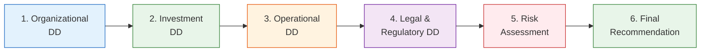

# ETF Due Diligence Questionnaire

> **Template Type**: Due Diligence | **Audience**: Institutional Investors, Allocators, Consultants

---

## Document Control

| Field              | Value                   |
| ------------------ | ----------------------- |
| **Document ID**    | `ETF-DD-QST-001`        |
| **Version**        | 1.0                     |
| **Classification** | External — Confidential |
| **Fund Name**      | `{{fund_name}}`         |
| **Ticker**         | `{{ticker}}`            |
| **Date Created**   | `{{date_created}}`      |
| **Completed By**   | `{{completed_by}}`      |
| **Date Completed** | `{{date_completed}}`    |
| **Status**         | Draft                   |

---

## Due Diligence Process

---

## Section 1: Organizational Information

### 1.1 Firm Overview

| #      | Question                                                 | Response |
| ------ | -------------------------------------------------------- | -------- |
| 1.1.1  | Legal name of the investment adviser                     |          |
| 1.1.2  | Date of incorporation / organization                     |          |
| 1.1.3  | Jurisdiction of organization                             |          |
| 1.1.4  | SEC registration number (CRD/IARD)                       |          |
| 1.1.5  | Total firm AUM (as of latest date)                       |          |
| 1.1.6  | Total ETF AUM                                            |          |
| 1.1.7  | Number of ETFs managed                                   |          |
| 1.1.8  | Number of employees (total)                              |          |
| 1.1.9  | Number of investment professionals                       |          |
| 1.1.10 | Ownership structure (public/private, major shareholders) |          |

### 1.2 Key Personnel

| #     | Question                                        | Response |
| ----- | ----------------------------------------------- | -------- |
| 1.2.1 | Name and biography of CEO/CIO                   |          |
| 1.2.2 | Name and biography of Lead PM for this Fund     |          |
| 1.2.3 | PM tenure on this strategy (years)              |          |
| 1.2.4 | PM total industry experience (years)            |          |
| 1.2.5 | Key person risk — backup PM identified?         |          |
| 1.2.6 | Staff turnover rate (last 3 years)              |          |
| 1.2.7 | CCO name and qualifications                     |          |
| 1.2.8 | Compensation structure for PMs (fixed/variable) |          |

### 1.3 Regulatory & Compliance

| #     | Question                                          | Response |
| ----- | ------------------------------------------------- | -------- |
| 1.3.1 | Any SEC examination findings (last 5 years)?      |          |
| 1.3.2 | Any regulatory sanctions or enforcement actions?  |          |
| 1.3.3 | Pending litigation or investigations?             |          |
| 1.3.4 | Describe compliance program and resources         |          |
| 1.3.5 | Frequency of compliance testing                   |          |
| 1.3.6 | Errors & breaches in last 3 years (count, nature) |          |

---

## Section 2: Investment Due Diligence

### 2.1 Strategy & Process

| #      | Question                                              | Response |
| ------ | ----------------------------------------------------- | -------- |
| 2.1.1  | Describe the Fund's investment objective              |          |
| 2.1.2  | What benchmark index does the Fund track?             |          |
| 2.1.3  | Replication methodology (full/optimized/synthetic)    |          |
| 2.1.4  | If optimized sampling, describe optimization approach |          |
| 2.1.5  | Number of holdings (Fund vs. index)                   |          |
| 2.1.6  | Rebalancing frequency and process                     |          |
| 2.1.7  | How are corporate actions handled?                    |          |
| 2.1.8  | Securities lending program? If yes, describe          |          |
| 2.1.9  | Derivatives usage policy                              |          |
| 2.1.10 | Cash management approach                              |          |

### 2.2 Performance

| #     | Question                                       | Response |
| ----- | ---------------------------------------------- | -------- |
| 2.2.1 | Provide 1, 3, 5, 10-year returns vs. benchmark |          |
| 2.2.2 | Annualized tracking error (ex-post, 3-year)    |          |
| 2.2.3 | Tracking difference (annualized, 3-year)       |          |
| 2.2.4 | Maximum single-day tracking deviation          |          |
| 2.2.5 | Performance during stress periods (2020, 2022) |          |
| 2.2.6 | Sources of tracking error (breakdown)          |          |
| 2.2.7 | Securities lending revenue contribution        |          |

### 2.3 Portfolio Construction

| #     | Question                                            | Response |
| ----- | --------------------------------------------------- | -------- |
| 2.3.1 | Top 10 holdings and weights                         |          |
| 2.3.2 | Sector allocation vs. benchmark                     |          |
| 2.3.3 | Geographic allocation (if international)            |          |
| 2.3.4 | Concentration limits (single name, sector)          |          |
| 2.3.5 | Turnover rate (annual)                              |          |
| 2.3.6 | Average daily trading volume of underlying holdings |          |

---

## Section 3: Operational Due Diligence

### 3.1 Service Providers

| #     | Question                                      | Response |
| ----- | --------------------------------------------- | -------- |
| 3.1.1 | Custodian name and tenure                     |          |
| 3.1.2 | Fund administrator name and tenure            |          |
| 3.1.3 | Transfer agent name and tenure                |          |
| 3.1.4 | Auditor name and tenure                       |          |
| 3.1.5 | Distributor name                              |          |
| 3.1.6 | Number of Authorized Participants             |          |
| 3.1.7 | Number of active market makers                |          |
| 3.1.8 | Index provider and license terms              |          |
| 3.1.9 | Any service provider changes in last 3 years? |          |

### 3.2 Operations

| #      | Question                                       | Response |
| ------ | ---------------------------------------------- | -------- |
| 3.2.1  | NAV calculation process and controls           |          |
| 3.2.2  | NAV error history (last 3 years)               |          |
| 3.2.3  | Creation/redemption process description        |          |
| 3.2.4  | Settlement cycle                               |          |
| 3.2.5  | Basket publication time and method             |          |
| 3.2.6  | Trade execution and best execution policy      |          |
| 3.2.7  | Reconciliation process (frequency, automation) |          |
| 3.2.8  | Business continuity / disaster recovery plan   |          |
| 3.2.9  | Cybersecurity program description              |          |
| 3.2.10 | Insurance coverage (D&O, E&O, fidelity bond)   |          |

### 3.3 Market Quality

| #     | Question                                | Response |
| ----- | --------------------------------------- | -------- |
| 3.3.1 | Average bid-ask spread (30-day, 90-day) |          |
| 3.3.2 | Average daily trading volume (30-day)   |          |
| 3.3.3 | Average premium/discount to NAV         |          |
| 3.3.4 | Days trading at >50bps premium/discount |          |
| 3.3.5 | Trading halt history                    |          |

---

## Section 4: Legal & Regulatory

| #    | Question                                                  | Response |
| ---- | --------------------------------------------------------- | -------- |
| 4.1  | Legal structure of the Fund                               |          |
| 4.2  | Registration status (1940 Act, 1933 Act)                  |          |
| 4.3  | ETF Rule relied upon (6c-11 or exemptive order)           |          |
| 4.4  | Board composition (independent vs. interested)            |          |
| 4.5  | Board meeting frequency                                   |          |
| 4.6  | Code of Ethics summary                                    |          |
| 4.7  | Proxy voting policy summary                               |          |
| 4.8  | RIC qualification history (any failures?)                 |          |
| 4.9  | Material contracts (advisory, sub-advisory, distribution) |          |
| 4.10 | Derivatives risk management program (Rule 18f-4)          |          |

---

## Section 5: Fees & Expenses

| #   | Question                                      | Response |
| --- | --------------------------------------------- | -------- |
| 5.1 | Gross expense ratio                           |          |
| 5.2 | Net expense ratio (after waivers)             |          |
| 5.3 | Fee waiver details (amount, term, recoupment) |          |
| 5.4 | Management fee                                |          |
| 5.5 | Creation/redemption transaction fees          |          |
| 5.6 | Securities lending revenue split              |          |
| 5.7 | Soft dollar arrangements?                     |          |
| 5.8 | 12b-1 fees?                                   |          |
| 5.9 | Fee comparison vs. peer group                 |          |

---

## Section 6: Risk Management

| #   | Question                                       | Response |
| --- | ---------------------------------------------- | -------- |
| 6.1 | Describe risk management framework             |          |
| 6.2 | Key risk metrics monitored (list)              |          |
| 6.3 | Risk reporting frequency and recipients        |          |
| 6.4 | Liquidity risk management program (Rule 22e-4) |          |
| 6.5 | Stress testing methodology and frequency       |          |
| 6.6 | Counterparty risk management                   |          |
| 6.7 | Valuation policy for illiquid holdings         |          |
| 6.8 | Escalation procedures for limit breaches       |          |

---

## Section 7: ESG & Stewardship (if applicable)

| #   | Question                            | Response |
| --- | ----------------------------------- | -------- |
| 7.1 | ESG integration approach            |          |
| 7.2 | ESG data providers used             |          |
| 7.3 | Engagement policy                   |          |
| 7.4 | Proxy voting on ESG resolutions     |          |
| 7.5 | UN PRI signatory?                   |          |
| 7.6 | SFDR classification (if applicable) |          |

---

## Section 8: Summary Assessment

| Dimension          | Rating (1-5) | Key Findings | Concerns |
| ------------------ | ------------ | ------------ | -------- |
| Organization       |              |              |          |
| Investment Process |              |              |          |
| Performance        |              |              |          |
| Operations         |              |              |          |
| Compliance & Legal |              |              |          |
| Risk Management    |              |              |          |
| Fees & Value       |              |              |          |
| **Overall**        |              |              |          |

---

## Recommendation

☐ **Approved** — No material concerns identified
☐ **Approved with Conditions** — Conditions: **********\_\_**********
☐ **Deferred** — Additional information required: **********\_\_**********
☐ **Declined** — Reason: **********\_\_**********

---

## Sign-Off

| Role               | Name               | Signature          | Date         |
| ------------------ | ------------------ | ------------------ | ------------ |
| Analyst            | `{{analyst_name}}` | ******\_\_\_****** | **\_\_\_\_** |
| DD Committee Chair | `{{dd_chair}}`     | ******\_\_\_****** | **\_\_\_\_** |
| CIO / Approver     | `{{approver}}`     | ******\_\_\_****** | **\_\_\_\_** |

---

_This questionnaire is for informational and due diligence purposes only. Responses should be verified independently._
