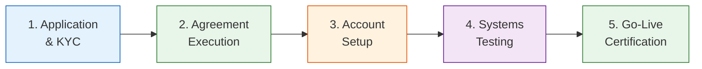
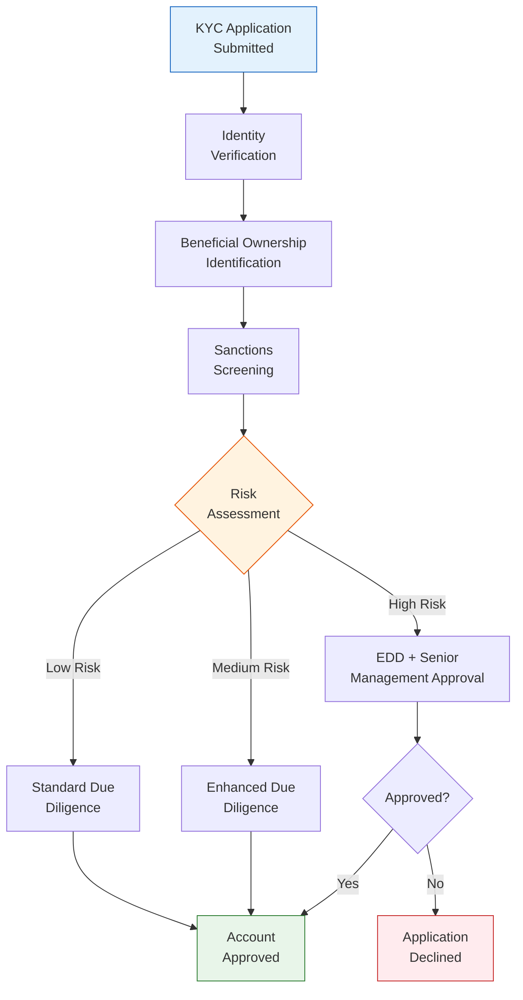

# ETF Investor Onboarding Guide

> **Template Type**: Investor Setup | **Audience**: Authorized Participants, Institutional Investors, Distribution Partners

---

## Document Control

| Field              | Value                   |
| ------------------ | ----------------------- |
| **Document ID**    | `ETF-INV-ONB-001`       |
| **Version**        | 1.0                     |
| **Classification** | External — Confidential |
| **Author**         | `{{author_name}}`       |
| **Fund Name**      | `{{fund_name}}`         |
| **Ticker**         | `{{ticker}}`            |
| **Date Created**   | `{{date_created}}`      |
| **Last Revised**   | `{{date_revised}}`      |
| **Status**         | Active                  |

---

## Onboarding Overview

---

## 1. Participant Types

### 1.1 Authorized Participants (APs)

APs are the only entities authorized to create and redeem ETF shares directly with the Fund.

**Eligibility Requirements**:

- Registered broker-dealer with the SEC
- FINRA member in good standing
- DTC participant
- Adequate capital and operational capacity
- Executed Authorized Participant Agreement

### 1.2 Market Makers

Market makers provide liquidity on the listing exchange.

**Requirements**:

- Exchange-registered market maker on `{{exchange}}`
- Demonstrated ETF market-making capability
- Adequate risk management systems
- Executed market-making commitment (if applicable)

### 1.3 Institutional Investors

Institutions purchasing on the secondary market.

**Requirements**:

- Completed account documentation with broker-dealer
- Qualified Institutional Buyer (QIB) or Accredited Investor status (for certain products)
- KYC/AML documentation

---

## 2. Application Process

### 2.1 Required Documentation

| Document                             | AP  | Market Maker | Institutional |
| ------------------------------------ | --- | ------------ | ------------- |
| Application Form                     | ✅  | ✅           | ✅            |
| Corporate Resolution / Authorization | ✅  | ✅           | ✅            |
| W-9 / W-8BEN-E                       | ✅  | ✅           | ✅            |
| KYC/AML Documentation                | ✅  | ✅           | ✅            |
| FINRA Registration Proof             | ✅  | ✅           | —             |
| DTC Participant Confirmation         | ✅  | —            | —             |
| AP Agreement                         | ✅  | —            | —             |
| Market Maker Agreement               | —   | ✅           | —             |
| Financial Statements (2 years)       | ✅  | ✅           | On request    |
| Insurance Certificates               | ✅  | ✅           | —             |
| Compliance Manual (summary)          | ✅  | ✅           | —             |

### 2.2 KYC/AML Requirements

**Required KYC Information**:

1. Legal entity name and structure
2. Jurisdiction of incorporation/organization
3. Principal place of business
4. Tax identification number (TIN/EIN)
5. Beneficial owners (25%+ ownership)
6. Controlling persons
7. Source of funds (for large transactions)
8. Purpose of account / nature of business

---

## 3. Agreement Execution

### 3.1 AP Agreement Key Terms

| Term                   | Description                                     |
| ---------------------- | ----------------------------------------------- |
| **Parties**            | Trust on behalf of Fund; Authorized Participant |
| **Creation Unit Size** | `{{creation_unit_size}}` shares                 |
| **Transaction Fee**    | $`{{transaction_fee}}` per Creation Unit        |
| **Cut-off Time**       | `{{cutoff_time}}` ET                            |
| **Settlement**         | T+`{{settlement_days}}`                         |
| **Basket Delivery**    | In-kind (standard) or Cash (as permitted)       |
| **Termination**        | `{{termination_notice}}` days written notice    |
| **Governing Law**      | `{{governing_law}}`                             |
| **Indemnification**    | Mutual indemnification                          |

### 3.2 Execution Process

1. Legal review of agreement (both parties)
2. Negotiate any non-standard terms
3. Execution by authorized signatories
4. Countersigned copy returned
5. Original filed with Corporate Secretary

---

## 4. Account Setup

### 4.1 DTC Configuration

| Item                   | Detail                   |
| ---------------------- | ------------------------ |
| DTC Participant Number | `{{dtc_number}}`         |
| NSCC Member ID         | `{{nscc_id}}`            |
| Settlement Account     | `{{settlement_account}}` |
| DTC Agent (Fund)       | `{{dtc_agent}}`          |
| Transfer Agent         | `{{transfer_agent}}`     |

### 4.2 Communication Setup

| Channel                    | Purpose                  | Contact                               |
| -------------------------- | ------------------------ | ------------------------------------- |
| Creation/Redemption Orders | Order submission         | `{{order_email}}` / `{{order_phone}}` |
| Basket Information         | Daily basket publication | `{{basket_url}}`                      |
| NAV Notification           | Daily NAV                | `{{nav_url}}`                         |
| Corporate Actions          | Distributions, splits    | `{{ca_contact}}`                      |
| Operations Inquiries       | General operations       | `{{ops_email}}`                       |
| Emergency Contact          | After-hours              | `{{emergency_phone}}`                 |

---

## 5. Creation / Redemption Procedures

### 5.1 Daily Timeline

| Time (ET)         | Activity                               |
| ----------------- | -------------------------------------- |
| 7:00 AM           | Creation/redemption basket published   |
| 9:30 AM           | Market open; secondary trading begins  |
| `{{cutoff_time}}` | Order cut-off for same-day processing  |
| 4:00 PM           | Market close; NAV strike               |
| 4:15 PM           | Final NAV and cash component published |
| T+1               | Settlement: securities/cash delivery   |

### 5.2 Order Submission

**Creation Order**:

1. Contact Transfer Agent at `{{order_phone}}` or via `{{order_platform}}`
2. Specify: Fund name, ticker, number of Creation Units, in-kind or cash
3. Receive order confirmation number
4. Deliver basket securities to Custodian's DTC account
5. Deliver cash component via wire transfer
6. Receive ETF shares at DTC on settlement date

**Redemption Order**:

1. Contact Transfer Agent at `{{order_phone}}` or via `{{order_platform}}`
2. Specify: Fund name, ticker, number of Creation Units to redeem
3. Receive order confirmation number
4. Deliver ETF shares to Transfer Agent's DTC account
5. Receive basket securities and cash component on settlement date

---

## 6. Systems Testing

### 6.1 Pre-Go-Live Checklist

| #     | Test Item                          | Status | Date |
| ----- | ---------------------------------- | ------ | ---- |
| 6.1.1 | DTC connectivity confirmed         | ☐      |      |
| 6.1.2 | Order submission test (creation)   | ☐      |      |
| 6.1.3 | Order submission test (redemption) | ☐      |      |
| 6.1.4 | Basket file receipt confirmed      | ☐      |      |
| 6.1.5 | Cash component wire test           | ☐      |      |
| 6.1.6 | Settlement process test            | ☐      |      |
| 6.1.7 | Communication channels verified    | ☐      |      |
| 6.1.8 | Emergency procedures reviewed      | ☐      |      |

---

## 7. Go-Live Certification

I, the undersigned, certify that `{{participant_name}}` has completed all onboarding requirements and is operationally ready to participate in the creation and redemption process for `{{fund_name}}` (`{{ticker}}`).

| Role                             | Name                     | Signature          | Date         |
| -------------------------------- | ------------------------ | ------------------ | ------------ |
| Participant Authorized Signatory | `{{participant_signer}}` | ******\_\_\_****** | **\_\_\_\_** |
| Fund Operations Manager          | `{{ops_manager}}`        | ******\_\_\_****** | **\_\_\_\_** |
| Transfer Agent Representative    | `{{ta_rep}}`             | ******\_\_\_****** | **\_\_\_\_** |

---

## 8. Key Contacts

| Role                 | Name                  | Phone               | Email               |
| -------------------- | --------------------- | ------------------- | ------------------- |
| Fund Sponsor Contact | `{{sponsor_contact}}` | `{{sponsor_phone}}` | `{{sponsor_email}}` |
| Transfer Agent       | `{{ta_contact}}`      | `{{ta_phone}}`      | `{{ta_email}}`      |
| Custodian            | `{{cust_contact}}`    | `{{cust_phone}}`    | `{{cust_email}}`    |
| Compliance           | `{{comp_contact}}`    | `{{comp_phone}}`    | `{{comp_email}}`    |

---

_This document contains confidential information. Distribution is restricted to authorized parties who have executed appropriate agreements._
