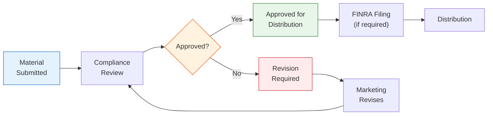

# ETF Marketing Materials Review

> **Template Type**: Marketing Compliance | **Audience**: Marketing, Compliance, Legal

---

## Document Control

| Field              | Value                   |
| ------------------ | ----------------------- |
| **Document ID**    | `ETF-MKT-REV-001`       |
| **Version**        | 1.0                     |
| **Classification** | Internal — Confidential |
| **Fund Name**      | `{{fund_name}}`         |
| **Ticker**         | `{{ticker}}`            |
| **Date Created**   | `{{date_created}}`      |
| **Reviewer**       | `{{reviewer_name}}`     |
| **Review Date**    | `{{review_date}}`       |
| **Status**         | Under Review            |

---

## Review Workflow

---

## 1. Material Information

| Field                       | Detail                |
| --------------------------- | --------------------- |
| **Material Title**          | `{{material_title}}`  |
| **Material Type**           | `{{material_type}}`   |
| **Author / Creator**        | `{{creator_name}}`    |
| **Department**              | `{{department}}`      |
| **Target Audience**         | `{{target_audience}}` |
| **Distribution Channel(s)** | `{{channels}}`        |
| **Intended Use Date**       | `{{use_date}}`        |
| **Expiration Date**         | `{{expiration_date}}` |
| **Prospectus Supplement**   | ☐ Yes ☐ No            |

### Material Type Classification

| Type                        | FINRA Filing Required     | Filing Timing                        |
| --------------------------- | ------------------------- | ------------------------------------ |
| Retail Communication        | Yes                       | Within 10 business days of first use |
| Institutional Communication | File upon request         | N/A                                  |
| Correspondence              | No (supervision required) | N/A                                  |
| Advertisement               | Yes                       | Within 10 business days              |
| Sales Literature            | Yes                       | Within 10 business days              |
| Social Media (static)       | Yes                       | Within 10 business days              |
| Social Media (interactive)  | No (supervision required) | N/A                                  |

**This material is classified as**: `{{classification}}`

---

## 2. Regulatory Compliance Checklist

### 2.1 General Requirements (FINRA Rule 2210)

| #     | Requirement                                  | Pass | Fail | N/A | Notes |
| ----- | -------------------------------------------- | ---- | ---- | --- | ----- |
| 2.1.1 | Fair and balanced presentation               | ☐    | ☐    | ☐   |       |
| 2.1.2 | No misleading statements or omissions        | ☐    | ☐    | ☐   |       |
| 2.1.3 | Material facts not omitted                   | ☐    | ☐    | ☐   |       |
| 2.1.4 | No exaggerated or unwarranted claims         | ☐    | ☐    | ☐   |       |
| 2.1.5 | No predictions or projections of performance | ☐    | ☐    | ☐   |       |
| 2.1.6 | No guarantees of future performance          | ☐    | ☐    | ☐   |       |
| 2.1.7 | Prominent risk disclosure included           | ☐    | ☐    | ☐   |       |
| 2.1.8 | Name of member firm displayed                | ☐    | ☐    | ☐   |       |

### 2.2 Performance Presentation (SEC Rule 482 / FINRA)

| #      | Requirement                                                      | Pass | Fail | N/A | Notes |
| ------ | ---------------------------------------------------------------- | ---- | ---- | --- | ----- |
| 2.2.1  | Standardized performance periods (1, 5, 10yr or since inception) | ☐    | ☐    | ☐   |       |
| 2.2.2  | Performance as of most recent quarter-end                        | ☐    | ☐    | ☐   |       |
| 2.2.3  | Total return (not just price return)                             | ☐    | ☐    | ☐   |       |
| 2.2.4  | Both NAV and market price returns shown                          | ☐    | ☐    | ☐   |       |
| 2.2.5  | Benchmark performance included                                   | ☐    | ☐    | ☐   |       |
| 2.2.6  | "Past performance does not guarantee..." disclosure              | ☐    | ☐    | ☐   |       |
| 2.2.7  | Current performance may differ disclosure                        | ☐    | ☐    | ☐   |       |
| 2.2.8  | Fee/expense impact disclosed                                     | ☐    | ☐    | ☐   |       |
| 2.2.9  | Inception date stated                                            | ☐    | ☐    | ☐   |       |
| 2.2.10 | Performance periods > 1 year annualized                          | ☐    | ☐    | ☐   |       |

### 2.3 ETF-Specific Requirements

| #     | Requirement                                            | Pass | Fail | N/A | Notes |
| ----- | ------------------------------------------------------ | ---- | ---- | --- | ----- |
| 2.3.1 | "Shares are bought and sold at market price (not NAV)" | ☐    | ☐    | ☐   |       |
| 2.3.2 | "Brokerage commissions will reduce returns"            | ☐    | ☐    | ☐   |       |
| 2.3.3 | Premium/discount risk disclosed                        | ☐    | ☐    | ☐   |       |
| 2.3.4 | "Not individually redeemable from the Fund"            | ☐    | ☐    | ☐   |       |
| 2.3.5 | Prospectus reference included                          | ☐    | ☐    | ☐   |       |
| 2.3.6 | "Before investing, consider..." language               | ☐    | ☐    | ☐   |       |
| 2.3.7 | Expense ratio clearly stated                           | ☐    | ☐    | ☐   |       |
| 2.3.8 | Net vs. gross expense ratio distinction                | ☐    | ☐    | ☐   |       |

### 2.4 Index / Benchmark References

| #     | Requirement                                     | Pass | Fail | N/A | Notes |
| ----- | ----------------------------------------------- | ---- | ---- | --- | ----- |
| 2.4.1 | Index name used correctly and consistently      | ☐    | ☐    | ☐   |       |
| 2.4.2 | Index provider attribution / trademark notice   | ☐    | ☐    | ☐   |       |
| 2.4.3 | Index disclaimer included                       | ☐    | ☐    | ☐   |       |
| 2.4.4 | "The Fund is not sponsored by [index provider]" | ☐    | ☐    | ☐   |       |
| 2.4.5 | No implied endorsement by index provider        | ☐    | ☐    | ☐   |       |

### 2.5 Required Disclaimers & Disclosures

| #     | Disclaimer                                                               | Included | Notes |
| ----- | ------------------------------------------------------------------------ | -------- | ----- |
| 2.5.1 | "Carefully consider investment objectives, risks, charges, and expenses" | ☐        |       |
| 2.5.2 | "Read the prospectus carefully before investing"                         | ☐        |       |
| 2.5.3 | Prospectus availability (URL/phone)                                      | ☐        |       |
| 2.5.4 | Distributor name                                                         | ☐        |       |
| 2.5.5 | "Not FDIC insured. May lose value. No bank guarantee." (if applicable)   | ☐        |       |
| 2.5.6 | "For [institutional/retail] use only" (if restricted)                    | ☐        |       |
| 2.5.7 | Date of material                                                         | ☐        |       |
| 2.5.8 | Source attribution for third-party data                                  | ☐        |       |

---

## 3. Content Accuracy Review

| #    | Item                                                       | Verified | Notes |
| ---- | ---------------------------------------------------------- | -------- | ----- |
| 3.1  | Fund name and ticker correct                               | ☐        |       |
| 3.2  | Expense ratio matches prospectus                           | ☐        |       |
| 3.3  | Performance data accurate and current                      | ☐        |       |
| 3.4  | Holdings data accurate and current                         | ☐        |       |
| 3.5  | AUM figure current                                         | ☐        |       |
| 3.6  | Yield figures accurate                                     | ☐        |       |
| 3.7  | Investment strategy description consistent with prospectus | ☐        |       |
| 3.8  | Risk factors consistent with prospectus                    | ☐        |       |
| 3.9  | All statistics have as-of dates                            | ☐        |       |
| 3.10 | Charts and graphs accurately represent data                | ☐        |       |

---

## 4. Review Decision

### 4.1 Decision

☐ **Approved** — No changes required
☐ **Approved with Minor Changes** — Changes noted below
☐ **Revision Required** — Material changes required before approval
☐ **Rejected** — Fundamental issues; significant rework needed

### 4.2 Required Changes

| #   | Page/Section | Issue Description | Required Change | Priority |
| --- | ------------ | ----------------- | --------------- | -------- |
| 1   |              |                   |                 |          |
| 2   |              |                   |                 |          |
| 3   |              |                   |                 |          |
| 4   |              |                   |                 |          |
| 5   |              |                   |                 |          |

### 4.3 FINRA Filing Determination

| Item             | Detail                |
| ---------------- | --------------------- |
| Filing Required  | ☐ Yes ☐ No            |
| Filing Category  | `{{filing_category}}` |
| Filing Deadline  | `{{filing_deadline}}` |
| FINRA CRD Number | `{{crd_number}}`      |

---

## 5. Sign-Off

| Role                | Name                 | Signature          | Date         |
| ------------------- | -------------------- | ------------------ | ------------ |
| Compliance Reviewer | `{{comp_reviewer}}`  | ******\_\_\_****** | **\_\_\_\_** |
| Legal Reviewer      | `{{legal_reviewer}}` | ******\_\_\_****** | **\_\_\_\_** |
| CCO Final Approval  | `{{cco_name}}`       | ******\_\_\_****** | **\_\_\_\_** |

---

_All marketing materials must be reviewed and approved prior to use. Approved materials must be retained for a minimum of 3 years (6 years for certain materials per Rule 17a-4)._
