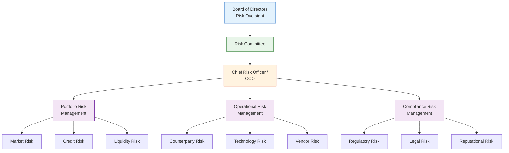
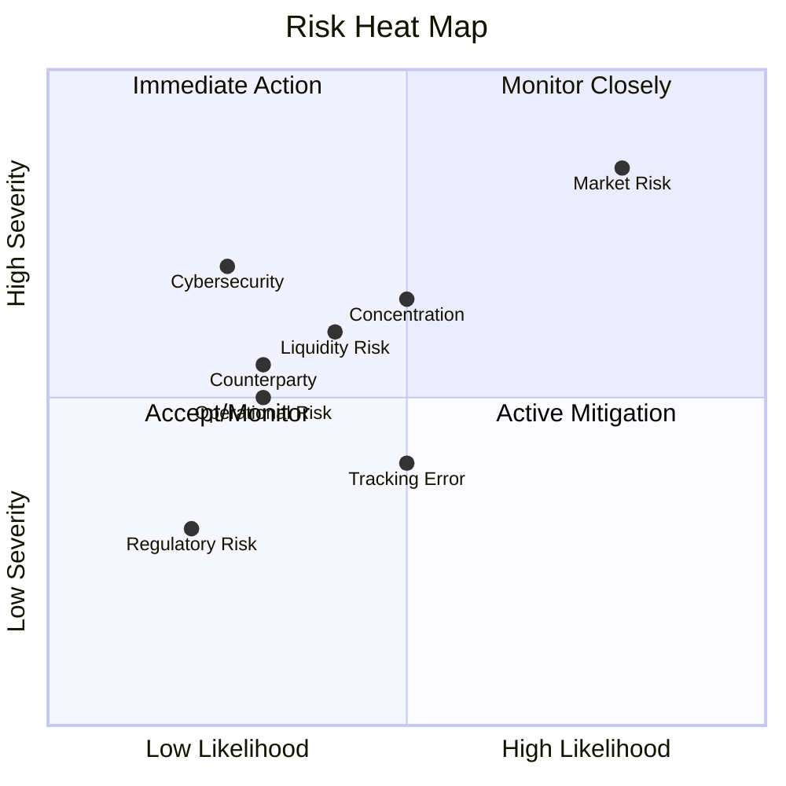
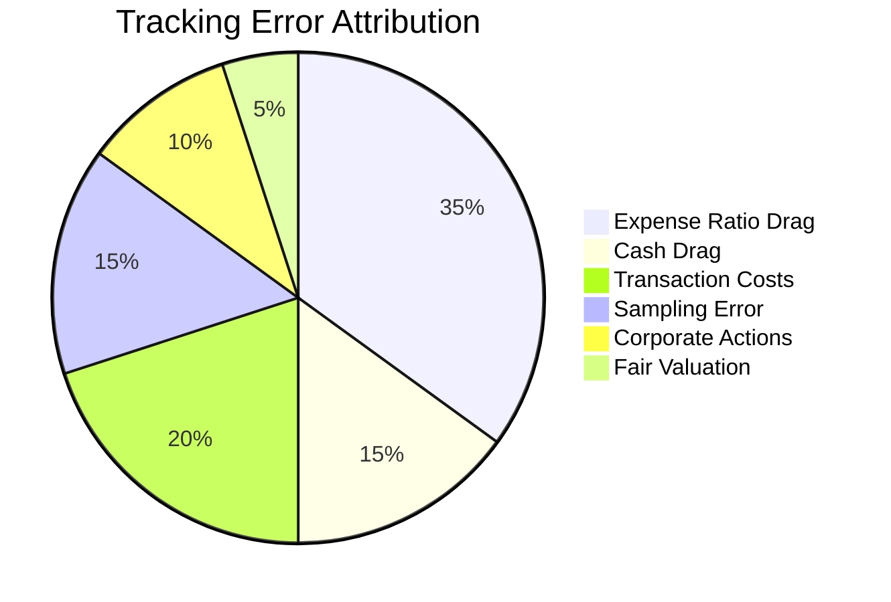
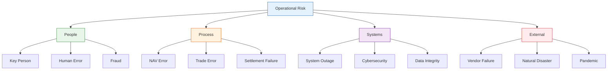

# ETF Risk Disclosure — Advanced

> **Template Tier**: Advanced | **Complexity**: Detailed risk matrix with diagrams | **Audience**: Institutional Investors, Risk Committees, Regulators

---

## Document Control

| Field              | Value                   |
| ------------------ | ----------------------- |
| **Document ID**    | `ETF-RISK-ADV-001`      |
| **Version**        | 1.0                     |
| **Classification** | External — Confidential |
| **Fund Name**      | `{{fund_name}}`         |
| **Ticker**         | `{{ticker}}`            |
| **CUSIP**          | `{{cusip}}`             |
| **Date Created**   | `{{date_created}}`      |
| **Last Revised**   | `{{date_revised}}`      |
| **Approved By**    | `{{cco_name}}`          |
| **Review Cycle**   | Semi-Annual             |
| **Status**         | Active                  |

---

## Risk Governance Framework

---

## 1. Risk Classification Matrix

### 1.1 Comprehensive Risk Assessment

| Risk Category     | Sub-Risk      | Severity (1-5) | Likelihood (1-5) | Risk Score      | Trend           | Mitigation              |
| ----------------- | ------------- | -------------- | ---------------- | --------------- | --------------- | ----------------------- |
| **Market Risk**   | Equity/Price  | `{{mkt_sev}}`  | `{{mkt_lik}}`    | `{{mkt_score}}` | `{{mkt_trend}}` | Diversification, limits |
|                   | Volatility    | `{{vol_sev}}`  | `{{vol_lik}}`    | `{{vol_score}}` | `{{vol_trend}}` | Monitoring, buffers     |
|                   | Correlation   | `{{cor_sev}}`  | `{{cor_lik}}`    | `{{cor_score}}` | `{{cor_trend}}` | Stress testing          |
| **Interest Rate** | Duration      | `{{dur_sev}}`  | `{{dur_lik}}`    | `{{dur_score}}` | `{{dur_trend}}` | Duration matching       |
|                   | Curve         | `{{crv_sev}}`  | `{{crv_lik}}`    | `{{crv_score}}` | `{{crv_trend}}` | Key rate monitoring     |
| **Credit Risk**   | Default       | `{{def_sev}}`  | `{{def_lik}}`    | `{{def_score}}` | `{{def_trend}}` | Credit limits           |
|                   | Spread        | `{{spd_sev}}`  | `{{spd_lik}}`    | `{{spd_score}}` | `{{spd_trend}}` | Diversification         |
|                   | Downgrade     | `{{dgr_sev}}`  | `{{dgr_lik}}`    | `{{dgr_score}}` | `{{dgr_trend}}` | Monitoring              |
| **Liquidity**     | Funding       | `{{fnd_sev}}`  | `{{fnd_lik}}`    | `{{fnd_score}}` | `{{fnd_trend}}` | Cash buffers            |
|                   | Market        | `{{mlq_sev}}`  | `{{mlq_lik}}`    | `{{mlq_score}}` | `{{mlq_trend}}` | Position limits         |
| **Tracking**      | Error         | `{{te_sev}}`   | `{{te_lik}}`     | `{{te_score}}`  | `{{te_trend}}`  | Optimization            |
|                   | Difference    | `{{td_sev}}`   | `{{td_lik}}`     | `{{td_score}}`  | `{{td_trend}}`  | Cost control            |
| **Operational**   | Systems       | `{{sys_sev}}`  | `{{sys_lik}}`    | `{{sys_score}}` | `{{sys_trend}}` | Redundancy, BCP         |
|                   | Vendor        | `{{ven_sev}}`  | `{{ven_lik}}`    | `{{ven_score}}` | `{{ven_trend}}` | SLA monitoring          |
|                   | Cybersecurity | `{{cyb_sev}}`  | `{{cyb_lik}}`    | `{{cyb_score}}` | `{{cyb_trend}}` | Security program        |
| **Regulatory**    | Compliance    | `{{reg_sev}}`  | `{{reg_lik}}`    | `{{reg_score}}` | `{{reg_trend}}` | Monitoring              |
|                   | Tax           | `{{tax_sev}}`  | `{{tax_lik}}`    | `{{tax_score}}` | `{{tax_trend}}` | Tax counsel             |

### 1.2 Risk Heat Map

---

## 2. Market Risk Analysis

### 2.1 Value at Risk (VaR)

The portfolio's Value at Risk at a 95% confidence level over a 1-day horizon:

$$\text{VaR}_{95\%} = \mu_p - z_{0.05} \cdot \sigma_p \cdot \sqrt{\Delta t}$$

Where:

- $\mu_p$ = expected portfolio return
- $z_{0.05} = 1.645$ (95th percentile of standard normal)
- $\sigma_p$ = portfolio standard deviation
- $\Delta t$ = holding period

For a portfolio value $V$:

$$\text{VaR}_{\$} = V \times \text{VaR}_{95\%}$$

### 2.2 Conditional Value at Risk (CVaR)

Expected Shortfall beyond VaR:

$$\text{CVaR}_{\alpha} = -\frac{1}{\alpha} \int_0^{\alpha} \text{VaR}_u \, du$$

### 2.3 Maximum Drawdown

$$\text{MDD} = \max_{t \in [0,T]} \left( \max_{s \in [0,t]} V_s - V_t \right) / \max_{s \in [0,t]} V_s$$

### 2.4 Historical Stress Scenarios

| Scenario             | Period            | Equity | Rates   | Credit  | FX     | Portfolio Impact   |
| -------------------- | ----------------- | ------ | ------- | ------- | ------ | ------------------ |
| 2008 GFC             | Sep 2008–Mar 2009 | -50.9% | -200bps | +500bps | Varied | `{{gfc_impact}}`   |
| 2011 Euro Crisis     | Jul–Oct 2011      | -19.4% | -100bps | +200bps | -10%   | `{{euro_impact}}`  |
| 2015 China Shock     | Aug 2015          | -12.4% | -50bps  | +100bps | -3%    | `{{china_impact}}` |
| 2018 Vol Spike       | Feb 2018          | -10.2% | +50bps  | +50bps  | -2%    | `{{vol_impact}}`   |
| 2020 COVID           | Feb–Mar 2020      | -33.9% | -150bps | +300bps | -5%    | `{{covid_impact}}` |
| 2022 Rate Tightening | Jan–Oct 2022      | -25.4% | +400bps | +100bps | +15%   | `{{rate_impact}}`  |

---

## 3. Tracking Risk

### 3.1 Sources of Tracking Error

### 3.2 Tracking Error Decomposition

Total tracking error is decomposed as:

$$TE^2 = TE_{\text{expense}}^2 + TE_{\text{cash}}^2 + TE_{\text{txn}}^2 + TE_{\text{sampling}}^2 + TE_{\text{other}}^2$$

| Component                  | Estimated TE (bps, annualized) |
| -------------------------- | ------------------------------ |
| Expense Ratio              | `{{te_expense}}`               |
| Cash Drag                  | `{{te_cash}}`                  |
| Transaction Costs          | `{{te_txn}}`                   |
| Sampling / Optimization    | `{{te_sampling}}`              |
| Corporate Actions & Timing | `{{te_other}}`                 |
| **Total Estimated TE**     | **`{{te_total}}`**             |

### 3.3 Tracking Difference

Annualized tracking difference (expected return shortfall):

$$TD = \bar{R}_f - \bar{R}_b \approx -ER - \text{Transaction Costs} + \text{Securities Lending Revenue}$$

---

## 4. Liquidity Risk Assessment

### 4.1 Liquidity Classification (Rule 22e-4)

| Classification        | Definition                                                                           | Portfolio %         |
| --------------------- | ------------------------------------------------------------------------------------ | ------------------- |
| **Highly Liquid**     | Convertible to cash in ≤ 3 business days without significantly changing market value | `{{liq_highly}}%`   |
| **Moderately Liquid** | Convertible to cash in 3–7 calendar days without significantly changing market value | `{{liq_moderate}}%` |
| **Less Liquid**       | Can be sold or disposed of in ≤ 7 calendar days but may change market value          | `{{liq_less}}%`     |
| **Illiquid**          | Cannot reasonably be sold or disposed of in ≤ 7 calendar days                        | `{{liq_illiquid}}%` |

### 4.2 Liquidity Metrics

| Metric                           | Current                  | Threshold                  | Status              |
| -------------------------------- | ------------------------ | -------------------------- | ------------------- |
| Highly Liquid Investment Minimum | `{{hlim_current}}%`      | `{{hlim_threshold}}%`      | `{{hlim_status}}`   |
| Illiquid Investment Maximum      | `{{iliq_current}}%`      | 15% (regulatory)           | `{{iliq_status}}`   |
| Days to Liquidate 10%            | `{{d10_current}}` days   | `{{d10_threshold}}` days   | `{{d10_status}}`    |
| Days to Liquidate 25%            | `{{d25_current}}` days   | `{{d25_threshold}}` days   | `{{d25_status}}`    |
| Bid-Ask Spread (median)          | `{{spread_current}}` bps | `{{spread_threshold}}` bps | `{{spread_status}}` |

### 4.3 Redemption Stress Testing

Under a stressed scenario where `{{stress_pct}}`% of AUM is redeemed:

$$\text{Liquidation Cost} = \sum_{i=1}^{N} Q_i^{\text{redeem}} \times P_i \times \text{Impact}_i$$

$$\text{Impact}_i = \frac{Q_i^{\text{redeem}}}{ADV_i} \times \beta_i$$

Where $ADV_i$ is average daily volume and $\beta_i$ is the market impact coefficient.

---

## 5. Operational Risk

### 5.1 Operational Risk Categories

### 5.2 Business Continuity

| Scenario              | Recovery Time Objective | Recovery Point Objective | Tested                |
| --------------------- | ----------------------- | ------------------------ | --------------------- |
| Primary site failure  | `{{rto_primary}}`       | `{{rpo_primary}}`        | `{{tested_primary}}`  |
| Technology failure    | `{{rto_tech}}`          | `{{rpo_tech}}`           | `{{tested_tech}}`     |
| Key vendor failure    | `{{rto_vendor}}`        | `{{rpo_vendor}}`         | `{{tested_vendor}}`   |
| Pandemic / remote ops | `{{rto_pandemic}}`      | `{{rpo_pandemic}}`       | `{{tested_pandemic}}` |

---

## 6. Risk Monitoring & Reporting

### 6.1 Monitoring Framework

| Risk Metric              | Frequency | Threshold              | Escalation           |
| ------------------------ | --------- | ---------------------- | -------------------- |
| Tracking Error (rolling) | Daily     | `{{te_threshold}}` bps | PM → CIO             |
| Premium/Discount         | Daily     | `{{pd_threshold}}` bps | Operations → CCO     |
| Liquidity Classification | Monthly   | HLIM breach            | PM → Board           |
| VaR                      | Daily     | `{{var_threshold}}`    | CRO → Risk Committee |
| Concentration Limits     | Daily     | Prospectus limits      | PM → CCO             |
| Cash Position            | Daily     | `{{cash_threshold}}`%  | PM → Operations      |
| Counterparty Exposure    | Daily     | `{{cpty_threshold}}`   | PM → CRO             |

### 6.2 Reporting Schedule

| Report                      | Frequency | Recipients         |
| --------------------------- | --------- | ------------------ |
| Daily Risk Dashboard        | Daily     | PM, CRO, CCO       |
| Weekly Risk Summary         | Weekly    | CIO, COO           |
| Monthly Risk Report         | Monthly   | Risk Committee     |
| Quarterly Board Risk Report | Quarterly | Board of Directors |
| Annual Risk Assessment      | Annual    | Board, Regulators  |

---

## 7. Risk Limits

| Limit                       | Value                      | Basis                 |
| --------------------------- | -------------------------- | --------------------- |
| Max Single Position         | `{{max_position}}`%        | Prospectus / RIC      |
| Max Sector Concentration    | `{{max_sector}}`%          | Investment guidelines |
| Max Country Concentration   | `{{max_country}}`%         | Investment guidelines |
| Tracking Error (annualized) | `{{max_te}}` bps           | Internal policy       |
| Cash Holdings (max)         | `{{max_cash}}`%            | Internal policy       |
| Illiquid Holdings (max)     | 15%                        | Rule 22e-4            |
| Derivatives Notional (max)  | `{{max_deriv}}`% of NAV    | Rule 18f-4            |
| Counterparty Exposure       | `{{max_cpty}}`% per entity | Internal policy       |

---

## 8. Approvals

| Role                       | Name             | Signature          | Date         |
| -------------------------- | ---------------- | ------------------ | ------------ |
| Chief Risk Officer         | `{{cro_name}}`   | ******\_\_\_****** | **\_\_\_\_** |
| Chief Compliance Officer   | `{{cco_name}}`   | ******\_\_\_****** | **\_\_\_\_** |
| Chief Investment Officer   | `{{cio_name}}`   | ******\_\_\_****** | **\_\_\_\_** |
| Board Risk Committee Chair | `{{risk_chair}}` | ******\_\_\_****** | **\_\_\_\_** |

---

_This risk disclosure is updated semi-annually or more frequently as market conditions warrant. It supplements the Fund's prospectus and SAI._
