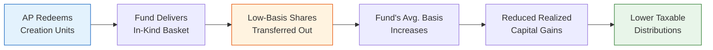

# ETF Tax Reporting Template

> **Template Type**: Tax Documentation | **Audience**: Tax Advisors, Fund Accountants, Investors

---

## Document Control

| Field               | Value                   |
| ------------------- | ----------------------- |
| **Document ID**     | `ETF-TAX-RPT-001`       |
| **Version**         | 1.0                     |
| **Classification**  | Internal — Confidential |
| **Fund Name**       | `{{fund_name}}`         |
| **Ticker**          | `{{ticker}}`            |
| **CUSIP**           | `{{cusip}}`             |
| **Tax Year**        | `{{tax_year}}`          |
| **Fiscal Year End** | `{{fiscal_year_end}}`   |
| **Prepared By**     | `{{prepared_by}}`       |
| **Reviewed By**     | `{{reviewed_by}}`       |
| **Status**          | Draft                   |

---

## 1. RIC Qualification Testing

### 1.1 Subchapter M Requirements (IRC §851)

The Fund must meet both the **Gross Income Test** and the **Asset Diversification Test** to qualify as a Regulated Investment Company (RIC).

#### Gross Income Test (IRC §851(b)(2))

At least 90% of gross income must be derived from qualifying sources:

$$\text{Qualifying Income Ratio} = \frac{\text{Dividends} + \text{Interest} + \text{Gains from Securities} + \text{Other Qualifying Income}}{\text{Total Gross Income}} \geq 90\%$$

| Income Type                    | Amount ($)                  | Qualifying?     |
| ------------------------------ | --------------------------- | --------------- |
| Dividends (domestic)           | `{{div_domestic}}`          | ✅              |
| Dividends (foreign, qualified) | `{{div_foreign}}`           | ✅              |
| Interest income                | `{{interest_income}}`       | ✅              |
| Net short-term capital gains   | `{{st_gains}}`              | ✅              |
| Net long-term capital gains    | `{{lt_gains}}`              | ✅              |
| Securities lending income      | `{{sec_lending}}`           | ✅              |
| Other qualifying income        | `{{other_qualifying}}`      | ✅              |
| **Total Qualifying Income**    | **`{{total_qualifying}}`**  |                 |
| Non-qualifying income          | `{{non_qualifying}}`        | ❌              |
| **Total Gross Income**         | **`{{total_gross}}`**       |                 |
| **Qualifying Ratio**           | **`{{qualifying_ratio}}`%** | `{{qi_status}}` |

#### Asset Diversification Test (IRC §851(b)(3))

Tested at the close of each quarter:

**50% Test**: At least 50% of assets must be in:

- Cash and cash equivalents
- Government securities
- Securities of other RICs
- Other securities (no single issuer > 5% of assets or > 10% of voting securities)

**25% Test**: No more than 25% of assets may be invested in:

- Securities of any one issuer (other than government/RIC)
- Securities of two or more issuers in same or related trades/businesses
- Securities of one or more QCPs

| Quarter            | 50% Test        | 25% Test        | Pass          |
| ------------------ | --------------- | --------------- | ------------- |
| Q1 (`{{q1_date}}`) | `{{q1_50pct}}`% | `{{q1_25pct}}`% | `{{q1_pass}}` |
| Q2 (`{{q2_date}}`) | `{{q2_50pct}}`% | `{{q2_25pct}}`% | `{{q2_pass}}` |
| Q3 (`{{q3_date}}`) | `{{q3_50pct}}`% | `{{q3_25pct}}`% | `{{q3_pass}}` |
| Q4 (`{{q4_date}}`) | `{{q4_50pct}}`% | `{{q4_25pct}}`% | `{{q4_pass}}` |

### 1.2 Distribution Requirements (IRC §4982)

To avoid the 4% excise tax, the Fund must distribute by December 31:

$$\text{Required Distribution} = 98\% \times OI + 98.2\% \times CG + \text{Undistributed Prior Year}$$

Where:

- $OI$ = ordinary income for the calendar year
- $CG$ = capital gain net income for the 1-year period ending October 31

| Component                                  | Amount ($)               |
| ------------------------------------------ | ------------------------ |
| Calendar year ordinary income              | `{{cal_oi}}`             |
| Required ordinary distribution (98%)       | `{{req_oi_dist}}`        |
| Capital gain net income (Nov 1 – Oct 31)   | `{{cap_gain_net}}`       |
| Required capital gain distribution (98.2%) | `{{req_cg_dist}}`        |
| Prior year undistributed                   | `{{prior_undist}}`       |
| **Total Required Distribution**            | **`{{total_req_dist}}`** |
| Actual distributions paid                  | `{{actual_dist}}`        |
| **Excess / (Shortfall)**                   | **`{{dist_excess}}`**    |
| Excise tax due (if shortfall)              | `{{excise_tax}}`         |

---

## 2. Distribution Summary

### 2.1 Distributions Declared

| Ex-Date     | Record Date  | Pay Date     | Type          | Per Share ($) | Total ($)      |
| ----------- | ------------ | ------------ | ------------- | ------------- | -------------- |
| `{{d1_ex}}` | `{{d1_rec}}` | `{{d1_pay}}` | `{{d1_type}}` | `{{d1_ps}}`   | `{{d1_total}}` |
| `{{d2_ex}}` | `{{d2_rec}}` | `{{d2_pay}}` | `{{d2_type}}` | `{{d2_ps}}`   | `{{d2_total}}` |
| `{{d3_ex}}` | `{{d3_rec}}` | `{{d3_pay}}` | `{{d3_type}}` | `{{d3_ps}}`   | `{{d3_total}}` |
| `{{d4_ex}}` | `{{d4_rec}}` | `{{d4_pay}}` | `{{d4_type}}` | `{{d4_ps}}`   | `{{d4_total}}` |

### 2.2 Tax Character of Distributions (per share)

| Component                | Per Share ($)           | Total ($)            | % of Total       |
| ------------------------ | ----------------------- | -------------------- | ---------------- |
| Ordinary Income          | `{{oi_ps}}`             | `{{oi_total}}`       | `{{oi_pct}}`%    |
| — Qualified Dividends    | `{{qd_ps}}`             | `{{qd_total}}`       | `{{qd_pct}}`%    |
| Short-Term Capital Gains | `{{stcg_ps}}`           | `{{stcg_total}}`     | `{{stcg_pct}}`%  |
| Long-Term Capital Gains  | `{{ltcg_ps}}`           | `{{ltcg_total}}`     | `{{ltcg_pct}}`%  |
| Return of Capital        | `{{roc_ps}}`            | `{{roc_total}}`      | `{{roc_pct}}`%   |
| Section 199A Dividends   | `{{s199a_ps}}`          | `{{s199a_total}}`    | `{{s199a_pct}}`% |
| **Total Distributions**  | **`{{total_dist_ps}}`** | **`{{total_dist}}`** | **100%**         |

---

## 3. In-Kind Tax Efficiency

### 3.1 Creation / Redemption Tax Impact

ETF in-kind redemption mechanism and tax efficiency:

### 3.2 Tax Efficiency Metrics

| Metric                        | Current Year          | Prior Year                  |
| ----------------------------- | --------------------- | --------------------------- |
| Unrealized Gains ($)          | `{{unreal_gains}}`    | `{{prior_unreal_gains}}`    |
| Unrealized Losses ($)         | `{{unreal_losses}}`   | `{{prior_unreal_losses}}`   |
| Net Unrealized Gain/Loss ($)  | `{{net_unreal}}`      | `{{prior_net_unreal}}`      |
| Capital Gains Distributed ($) | `{{cg_distributed}}`  | `{{prior_cg_distributed}}`  |
| Tax Cost Ratio                | `{{tax_cost_ratio}}`% | `{{prior_tax_cost}}`%       |
| Tax-Adjusted Return           | `{{tax_adj_return}}`% | `{{prior_tax_adj}}`%        |
| Gains embedded (% of NAV)     | `{{gains_embedded}}`% | `{{prior_gains_embedded}}`% |

The tax cost ratio is:

$$\text{Tax Cost Ratio} = 1 - \frac{1 + R_{\text{after-tax}}}{1 + R_{\text{pre-tax}}}$$

---

## 4. Form 1099-DIV Preparation

### 4.1 Reporting Boxes

| Box | Description                              | Per Share ($) | Total ($)      |
| --- | ---------------------------------------- | ------------- | -------------- |
| 1a  | Total Ordinary Dividends                 | `{{1a_ps}}`   | `{{1a_total}}` |
| 1b  | Qualified Dividends                      | `{{1b_ps}}`   | `{{1b_total}}` |
| 2a  | Total Capital Gain Distributions         | `{{2a_ps}}`   | `{{2a_total}}` |
| 2b  | Unrecaptured Section 1250 Gain           | `{{2b_ps}}`   | `{{2b_total}}` |
| 2c  | Section 1202 Gain                        | `{{2c_ps}}`   | `{{2c_total}}` |
| 2d  | Collectibles (28%) Gain                  | `{{2d_ps}}`   | `{{2d_total}}` |
| 3   | Nondividend Distributions (ROC)          | `{{3_ps}}`    | `{{3_total}}`  |
| 5   | Section 199A Dividends                   | `{{5_ps}}`    | `{{5_total}}`  |
| 7   | Foreign Tax Paid                         | `{{7_ps}}`    | `{{7_total}}`  |
| 11  | Exempt-Interest Dividends                | `{{11_ps}}`   | `{{11_total}}` |
| 13  | Specified Private Activity Bond Interest | `{{13_ps}}`   | `{{13_total}}` |

### 4.2 Key Dates

| Activity                                  | Date                           |
| ----------------------------------------- | ------------------------------ |
| Year-end tax lot reconciliation           | `{{reconciliation_date}}`      |
| 1099-DIV data to transfer agent           | `{{data_delivery_date}}`       |
| 1099-DIV mailing to shareholders          | `{{mailing_date}}` (by Jan 31) |
| Corrected 1099 deadline (if needed)       | `{{correction_deadline}}`      |
| Form 8937 filing (organizational actions) | `{{form_8937_date}}`           |

---

## 5. Foreign Tax Credit Information

_Applicable only if the Fund paid foreign taxes._

| Country         | Tax Paid ($)         | Income Sourced ($)   | Credit Eligible |
| --------------- | -------------------- | -------------------- | --------------- |
| `{{country_1}}` | `{{ftax_1}}`         | `{{finc_1}}`         | `{{fcred_1}}`   |
| `{{country_2}}` | `{{ftax_2}}`         | `{{finc_2}}`         | `{{fcred_2}}`   |
| `{{country_3}}` | `{{ftax_3}}`         | `{{finc_3}}`         | `{{fcred_3}}`   |
| **Total**       | **`{{ftax_total}}`** | **`{{finc_total}}`** |                 |

Foreign tax credit per share: $`{{ftc_per_share}}`

---

## 6. State Tax Information

### 6.1 U.S. Government Obligations Percentage

Percentage of income derived from U.S. Government obligations (for state tax exemption):

$$\text{Gov't Obligation \%} = \frac{\text{Interest from U.S. Gov't Securities}}{\text{Total Net Investment Income}} \times 100$$

| Item                        | Amount ($)              | Percentage                |
| --------------------------- | ----------------------- | ------------------------- |
| U.S. Treasury interest      | `{{treasury_interest}}` | `{{treasury_pct}}`%       |
| Agency obligations (exempt) | `{{agency_interest}}`   | `{{agency_pct}}`%         |
| **Total Government %**      |                         | **`{{total_govt_pct}}`%** |

---

## 7. Approvals

| Role                 | Name              | Signature          | Date         |
| -------------------- | ----------------- | ------------------ | ------------ |
| Fund Tax Manager     | `{{tax_manager}}` | ******\_\_\_****** | **\_\_\_\_** |
| External Tax Advisor | `{{tax_advisor}}` | ******\_\_\_****** | **\_\_\_\_** |
| Fund Treasurer       | `{{treasurer}}`   | ******\_\_\_****** | **\_\_\_\_** |

---

_Tax information is provided for informational purposes. Shareholders should consult their own tax advisors regarding the tax consequences of their investment._
