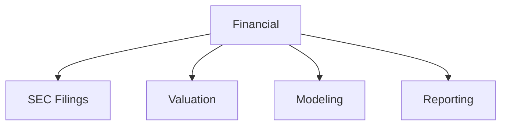

# Financial

Financial modeling, analysis, and SEC filing templates.

## Templates

| Template                                               | Description           |
| ------------------------------------------------------ | --------------------- |
| [sec_10k.md](sec_10k.md)                               | Annual SEC filings    |
| [sec_10q.md](sec_10q.md)                               | Quarterly SEC filings |
| [dcf_valuation.md](dcf_valuation.md)                   | DCF models            |
| [financial_model_simple.md](financial_model_simple.md) | Financial modeling    |
| [annual_report.md](annual_report.md)                   | Annual reports        |

## Structure

See [Parent](../SKILL.md) for all categories.
