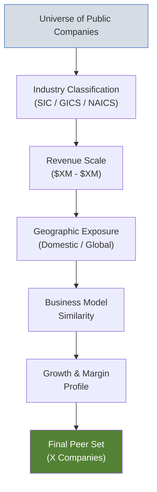

# Comparable Company Analysis (Trading Comps)

| Field              | Value           |
| ------------------ | --------------- |
| **Template ID**    | `FIN-VAL-002`   |
| **Category**       | Valuation       |
| **Complexity**     | Intermediate    |
| **Version**        | 1.0             |
| **Last Updated**   | YYYY-MM-DD      |
| **Author**         | [Analyst Name]  |
| **Reviewed By**    | [Reviewer Name] |
| **Classification** | Confidential    |

---

## Document Control

| Version | Date       | Author | Changes       |
| ------- | ---------- | ------ | ------------- |
| 1.0     | YYYY-MM-DD | [Name] | Initial draft |
|         |            |        |               |

---

## Executive Summary

This comparable company analysis benchmarks [Target Company] against a peer set of [X] publicly traded companies. Based on the selected trading multiples, the implied valuation range for [Target Company] is:

| Metric       | Multiple Range | Implied EV ($M) | Implied Price ($) |
| ------------ | -------------- | --------------- | ----------------- |
| EV / Revenue | x - x          |                 |                   |
| EV / EBITDA  | x - x          |                 |                   |
| P / E        | x - x          |                 |                   |

---

## Peer Selection Criteria

### Selection Rationale

| Criterion        | Requirement               | Rationale                        |
| ---------------- | ------------------------- | -------------------------------- |
| Industry         | [GICS code / description] | [Why this industry]              |
| Revenue Size     | $[X]M - $[X]M             | [Scale comparability]            |
| Geography        | [Region]                  | [Market similarity]              |
| Business Model   | [Description]             | [Operating model match]          |
| Growth Profile   | [Range]                   | [Lifecycle stage]                |
| Public / Private | Public only               | [Trading multiples availability] |

---

## Peer Company Profiles

### Peer 1: [Company Name] ([Ticker])

| Metric                | Value           |
| --------------------- | --------------- |
| Market Cap ($M)       |                 |
| Enterprise Value ($M) |                 |
| Revenue (LTM, $M)     |                 |
| EBITDA (LTM, $M)      |                 |
| Business Description  | [1-2 sentences] |

### Peer 2: [Company Name] ([Ticker])

| Metric                | Value           |
| --------------------- | --------------- |
| Market Cap ($M)       |                 |
| Enterprise Value ($M) |                 |
| Revenue (LTM, $M)     |                 |
| EBITDA (LTM, $M)      |                 |
| Business Description  | [1-2 sentences] |

_[Repeat for each peer company]_

---

## Market Data Summary

_As of [Date]_

| Company    | Ticker | Share Price ($) | Shares Out (M) | Market Cap ($M) | Net Debt ($M) | Enterprise Value ($M) |
| ---------- | ------ | --------------- | -------------- | --------------- | ------------- | --------------------- |
| Peer 1     |        |                 |                |                 |               |                       |
| Peer 2     |        |                 |                |                 |               |                       |
| Peer 3     |        |                 |                |                 |               |                       |
| Peer 4     |        |                 |                |                 |               |                       |
| Peer 5     |        |                 |                |                 |               |                       |
| Peer 6     |        |                 |                |                 |               |                       |
| Peer 7     |        |                 |                |                 |               |                       |
| **Mean**   |        |                 |                |                 |               |                       |
| **Median** |        |                 |                |                 |               |                       |

Enterprise Value:

$$\text{EV} = \text{Market Cap} + \text{Total Debt} + \text{Minority Interest} + \text{Preferred Stock} - \text{Cash \& Equivalents}$$

---

## Operating Metrics Comparison

### Growth Metrics

| Company         | Rev Growth LTM (%) | Rev Growth NTM (%) | Rev CAGR 3Y (%) | EPS Growth NTM (%) |
| --------------- | ------------------ | ------------------ | --------------- | ------------------ |
| **[Target]**    |                    |                    |                 |                    |
| Peer 1          |                    |                    |                 |                    |
| Peer 2          |                    |                    |                 |                    |
| Peer 3          |                    |                    |                 |                    |
| Peer 4          |                    |                    |                 |                    |
| Peer 5          |                    |                    |                 |                    |
| Peer 6          |                    |                    |                 |                    |
| Peer 7          |                    |                    |                 |                    |
| **Peer Mean**   |                    |                    |                 |                    |
| **Peer Median** |                    |                    |                 |                    |

### Profitability Metrics

| Company         | Gross Margin (%) | EBITDA Margin (%) | EBIT Margin (%) | Net Margin (%) | ROE (%) | ROIC (%) |
| --------------- | ---------------- | ----------------- | --------------- | -------------- | ------- | -------- |
| **[Target]**    |                  |                   |                 |                |         |          |
| Peer 1          |                  |                   |                 |                |         |          |
| Peer 2          |                  |                   |                 |                |         |          |
| Peer 3          |                  |                   |                 |                |         |          |
| Peer 4          |                  |                   |                 |                |         |          |
| Peer 5          |                  |                   |                 |                |         |          |
| Peer 6          |                  |                   |                 |                |         |          |
| Peer 7          |                  |                   |                 |                |         |          |
| **Peer Mean**   |                  |                   |                 |                |         |          |
| **Peer Median** |                  |                   |                 |                |         |          |

### Leverage & Returns

| Company         | Net Debt / EBITDA (x) | Interest Coverage (x) | FCF Yield (%) | Dividend Yield (%) |
| --------------- | --------------------- | --------------------- | ------------- | ------------------ |
| **[Target]**    |                       |                       |               |                    |
| Peer 1          |                       |                       |               |                    |
| Peer 2          |                       |                       |               |                    |
| Peer 3          |                       |                       |               |                    |
| Peer 4          |                       |                       |               |                    |
| Peer 5          |                       |                       |               |                    |
| Peer 6          |                       |                       |               |                    |
| Peer 7          |                       |                       |               |                    |
| **Peer Mean**   |                       |                       |               |                    |
| **Peer Median** |                       |                       |               |                    |

---

## Trading Multiples

### Enterprise Value Multiples

| Company       | EV/Rev LTM | EV/Rev NTM | EV/EBITDA LTM | EV/EBITDA NTM | EV/EBIT LTM | EV/EBIT NTM |
| ------------- | ---------- | ---------- | ------------- | ------------- | ----------- | ----------- |
| **[Target]**  |            |            |               |               |             |             |
| Peer 1        |            |            |               |               |             |             |
| Peer 2        |            |            |               |               |             |             |
| Peer 3        |            |            |               |               |             |             |
| Peer 4        |            |            |               |               |             |             |
| Peer 5        |            |            |               |               |             |             |
| Peer 6        |            |            |               |               |             |             |
| Peer 7        |            |            |               |               |             |             |
| **Mean**      |            |            |               |               |             |             |
| **Median**    |            |            |               |               |             |             |
| **25th Pctl** |            |            |               |               |             |             |
| **75th Pctl** |            |            |               |               |             |             |

### Equity Value Multiples

| Company       | P/E LTM | P/E NTM | P/B | PEG Ratio |
| ------------- | ------- | ------- | --- | --------- |
| **[Target]**  |         |         |     |           |
| Peer 1        |         |         |     |           |
| Peer 2        |         |         |     |           |
| Peer 3        |         |         |     |           |
| Peer 4        |         |         |     |           |
| Peer 5        |         |         |     |           |
| Peer 6        |         |         |     |           |
| Peer 7        |         |         |     |           |
| **Mean**      |         |         |     |           |
| **Median**    |         |         |     |           |
| **25th Pctl** |         |         |     |           |
| **75th Pctl** |         |         |     |           |

Key multiple formulas:

$$\text{EV/EBITDA} = \frac{\text{Enterprise Value}}{\text{EBITDA}}$$

$$\text{P/E} = \frac{\text{Share Price}}{\text{Earnings Per Share}}$$

$$\text{PEG} = \frac{\text{P/E}}{\text{EPS Growth Rate (\%)}}$$

---

## Implied Valuation

### Applying Multiples to Target

| Multiple               | Target Metric ($M) | Low (25th Pctl) | Median | High (75th Pctl) |
| ---------------------- | ------------------ | --------------- | ------ | ---------------- |
| **EV / Revenue (LTM)** |                    |                 |        |                  |
| Implied EV             |                    |                 |        |                  |
| **EV / Revenue (NTM)** |                    |                 |        |                  |
| Implied EV             |                    |                 |        |                  |
| **EV / EBITDA (LTM)**  |                    |                 |        |                  |
| Implied EV             |                    |                 |        |                  |
| **EV / EBITDA (NTM)**  |                    |                 |        |                  |
| Implied EV             |                    |                 |        |                  |
| **P / E (NTM)**        |                    |                 |        |                  |
| Implied Equity Value   |                    |                 |        |                  |

### Equity Bridge (from EV multiples)

$$\text{Equity Value} = \text{Implied EV} - \text{Net Debt} - \text{Minority Interest} - \text{Preferred}$$

$$\text{Implied Price} = \frac{\text{Equity Value}}{\text{Diluted Shares Outstanding}}$$

|                             | Low | Mid | High |
| --------------------------- | --- | --- | ---- |
| Implied EV ($M)             |     |     |      |
| (-) Net Debt ($M)           |     |     |      |
| (-) Minority Interest ($M)  |     |     |      |
| Implied Equity Value ($M)   |     |     |      |
| Diluted Shares (M)          |     |     |      |
| **Implied Share Price ($)** |     |     |      |

---

## Growth-Adjusted Multiples

To normalize for differing growth rates:

$$\text{EV/EBITDA/Growth} = \frac{\text{EV/EBITDA NTM}}{\text{EBITDA Growth Rate (\%)}}$$

| Company      | EV/EBITDA NTM | EBITDA Growth (%) | EV/EBITDA/G |
| ------------ | ------------- | ----------------- | ----------- |
| **[Target]** |               |                   |             |
| Peer 1       |               |                   |             |
| Peer 2       |               |                   |             |
| Peer 3       |               |                   |             |
| **Mean**     |               |                   |             |
| **Median**   |               |                   |             |

---

## Relative Positioning

### Target vs. Peer Median

| Metric             | Target | Peer Median | Premium / (Discount) |
| ------------------ | ------ | ----------- | -------------------- |
| Revenue Growth (%) |        |             |                      |
| EBITDA Margin (%)  |        |             |                      |
| ROIC (%)           |        |             |                      |
| Net Leverage (x)   |        |             |                      |
| EV/EBITDA NTM      |        |             |                      |
| P/E NTM            |        |             |                      |

### Justified Multiple Assessment

Given the target's [superior/inferior] growth and margin profile relative to peers, a [premium/discount] to the peer median multiple is [warranted/not warranted].

**Selected multiple range**: [X.Xx] - [X.Xx] EV/EBITDA (NTM)

---

## Notes & Disclaimers

- All market data as of [Date]
- Financial data sourced from [CapIQ / Bloomberg / Public Filings]
- LTM = Last Twelve Months; NTM = Next Twelve Months (consensus estimates)
- Calendarized fiscal years where necessary
- Outlier multiples (>3 standard deviations) excluded from summary statistics
- Analysis is for discussion purposes only

---

_This template follows investment banking comparable company analysis standards. Update market data and peer set regularly to ensure relevance._
