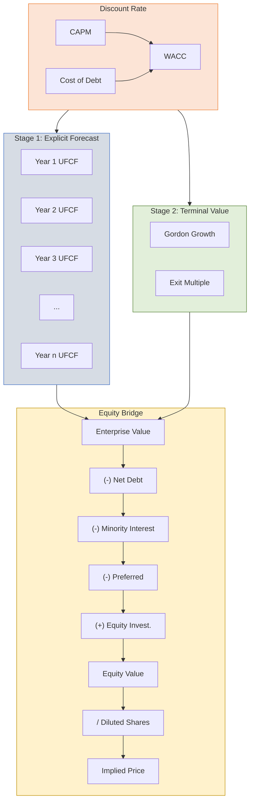

# Discounted Cash Flow Valuation

| Field              | Value           |
| ------------------ | --------------- |
| **Template ID**    | `FIN-VAL-001`   |
| **Category**       | Valuation       |
| **Complexity**     | Intermediate    |
| **Version**        | 1.0             |
| **Last Updated**   | YYYY-MM-DD      |
| **Author**         | [Analyst Name]  |
| **Reviewed By**    | [Reviewer Name] |
| **Classification** | Confidential    |

---

## Document Control

| Version | Date       | Author | Changes       |
| ------- | ---------- | ------ | ------------- |
| 1.0     | YYYY-MM-DD | [Name] | Initial draft |
|         |            |        |               |

---

## Executive Summary

[Company name] is valued using a two-stage Discounted Cash Flow analysis. The model discounts projected unlevered free cash flows over a [5/7/10]-year explicit forecast period, with a terminal value capturing value beyond the projection period. The analysis yields an implied enterprise value range of $[X]M to $[X]M, corresponding to an equity value per share of $[X] to $[X].

---

## DCF Framework

---

## Cost of Capital

### Capital Asset Pricing Model (CAPM)

$$r_e = r_f + \beta_L \cdot \text{ERP} + \text{Size Premium} + \text{Company-Specific Risk Premium}$$

| Parameter                     | Value | Source / Rationale                                            |
| ----------------------------- | ----- | ------------------------------------------------------------- |
| Risk-Free Rate ($r_f$)        | %     | U.S. 10-Year Treasury yield as of [Date]                      |
| Equity Risk Premium (ERP)     | %     | [Duff & Phelps / Damodaran supply-side]                       |
| Raw Beta (2Y weekly)          | x     | [Bloomberg / CapIQ regression]                                |
| Adjusted Beta                 | x     | Blume adjustment: $\beta_{adj} = 0.67\beta_{raw} + 0.33(1.0)$ |
| Unlevered Beta                | x     | Hamada equation (see below)                                   |
| Relevered Beta ($\beta_L$)    | x     | Target capital structure                                      |
| Size Premium                  | %     | [Duff & Phelps decile]                                        |
| Company-Specific Risk Premium | %     | [If applicable]                                               |
| **Cost of Equity ($r_e$)**    | **%** |                                                               |

#### Beta Analysis

**Unlevering Beta (Hamada):**

$$\beta_U = \frac{\beta_L}{1 + (1-t) \cdot \frac{D}{E}}$$

**Relevering Beta:**

$$\beta_L = \beta_U \cdot \left[1 + (1-t) \cdot \frac{D}{E}\right]$$

**Peer Betas:**

| Peer Company | Levered Beta | D/E | Tax Rate | Unlevered Beta |
| ------------ | ------------ | --- | -------- | -------------- |
| Peer 1       |              |     |          |                |
| Peer 2       |              |     |          |                |
| Peer 3       |              |     |          |                |
| Peer 4       |              |     |          |                |
| Peer 5       |              |     |          |                |
| **Median**   |              |     |          |                |
| **Mean**     |              |     |          |                |

### Cost of Debt

$$r_d = \text{Yield to Maturity on existing / comparable debt}$$

| Parameter                    | Value |
| ---------------------------- | ----- |
| Pre-Tax Cost of Debt ($r_d$) | %     |
| Marginal Tax Rate ($t$)      | %     |
| **After-Tax Cost of Debt**   | **%** |

### Weighted Average Cost of Capital

$$\text{WACC} = w_e \cdot r_e + w_d \cdot r_d \cdot (1 - t)$$

| Component | Market Value ($M) | Weight (%) | Cost (%) | Weighted Cost (%) |
| --------- | ----------------- | ---------- | -------- | ----------------- |
| Equity    |                   |            |          |                   |
| Debt      |                   |            |          |                   |
| **Total** |                   | **100%**   |          |                   |
| **WACC**  |                   |            |          | **%**             |

### Alternative: Build-Up Method

$$r_e = r_f + \text{ERP} + \text{Size Premium} + \text{Industry Premium} + \text{Company-Specific Premium}$$

_[Use for private companies without observable betas]_

---

## Unlevered Free Cash Flow Projections

### Projection Methodology

$$\text{UFCF}_t = \text{EBIT}_t \times (1 - t) + \text{D\&A}_t - \text{CapEx}_t - \Delta\text{NWC}_t$$

Alternatively:

$$\text{UFCF}_t = \text{EBITDA}_t - \text{Cash Taxes on EBIT}_t - \text{CapEx}_t - \Delta\text{NWC}_t$$

### Projected UFCFs

| ($M)                         | Year 1 | Year 2 | Year 3 | Year 4 | Year 5 |
| ---------------------------- | ------ | ------ | ------ | ------ | ------ |
| Revenue                      |        |        |        |        |        |
| Growth (%)                   |        |        |        |        |        |
| EBITDA                       |        |        |        |        |        |
| EBITDA Margin (%)            |        |        |        |        |        |
| (-) D&A                      |        |        |        |        |        |
| EBIT                         |        |        |        |        |        |
| (-) Taxes on EBIT            |        |        |        |        |        |
| NOPAT                        |        |        |        |        |        |
| (+) D&A                      |        |        |        |        |        |
| (-) CapEx                    |        |        |        |        |        |
| (-) $\Delta$NWC              |        |        |        |        |        |
| **Unlevered Free Cash Flow** |        |        |        |        |        |

---

## Terminal Value

### Method 1: Gordon Growth Model (Perpetuity Growth)

$$\text{TV}_{\text{GGM}} = \frac{\text{UFCF}_{n} \times (1 + g)}{(\text{WACC} - g)}$$

| Parameter                   | Value | Rationale                      |
| --------------------------- | ----- | ------------------------------ |
| Final Year UFCF ($M)        |       |                                |
| Long-Term Growth Rate ($g$) | %     | [GDP growth / inflation proxy] |
| WACC                        | %     |                                |
| **Terminal Value ($M)**     |       |                                |

**Implied terminal exit multiple:**

$$\text{Implied Multiple} = \frac{\text{TV}_{\text{GGM}}}{\text{EBITDA}_n}$$

### Method 2: Exit Multiple

$$\text{TV}_{\text{EM}} = \text{EBITDA}_n \times \text{Exit EV/EBITDA Multiple}$$

| Parameter               | Value | Rationale                             |
| ----------------------- | ----- | ------------------------------------- |
| Final Year EBITDA ($M)  |       |                                       |
| Exit EV/EBITDA Multiple | x     | [Based on trading comps / historical] |
| **Terminal Value ($M)** |       |                                       |

**Implied perpetuity growth rate:**

$$g_{\text{implied}} = \text{WACC} - \frac{\text{UFCF}_{n} \times (1 + g)}{\text{TV}_{\text{EM}}}$$

### Terminal Value Cross-Check

| Method        | Terminal Value ($M) | % of EV | Implied Multiple | Implied Growth |
| ------------- | ------------------- | ------- | ---------------- | -------------- |
| Gordon Growth |                     | %       | x                | %              |
| Exit Multiple |                     | %       | x                | %              |
| **Selected**  |                     | **%**   |                  |                |

> **Note:** Terminal value typically represents 60-80% of total enterprise value. Values outside this range warrant additional scrutiny.

---

## Enterprise Value Calculation

$$\text{EV} = \sum_{t=1}^{n} \frac{\text{UFCF}_t}{(1 + \text{WACC})^t} + \frac{\text{TV}}{(1 + \text{WACC})^n}$$

### Mid-Year Convention Adjustment

$$\text{EV} = \sum_{t=1}^{n} \frac{\text{UFCF}_t}{(1 + \text{WACC})^{t-0.5}} + \frac{\text{TV}}{(1 + \text{WACC})^{n-0.5}}$$

### Present Value Build-Up

| ($M)                 | UFCF | Discount Factor | Present Value |
| -------------------- | ---- | --------------- | ------------- |
| Year 1               |      |                 |               |
| Year 2               |      |                 |               |
| Year 3               |      |                 |               |
| Year 4               |      |                 |               |
| Year 5               |      |                 |               |
| Terminal Value       |      |                 |               |
| **Enterprise Value** |      |                 |               |

### Discount Factor

$$\text{DF}_t = \frac{1}{(1 + \text{WACC})^t}$$

With mid-year convention:

$$\text{DF}_t = \frac{1}{(1 + \text{WACC})^{t - 0.5}}$$

---

## Equity Value Bridge

| Component ($M)                   | Value |
| -------------------------------- | ----- |
| Enterprise Value                 |       |
| (-) Total Debt                   |       |
| (+) Cash & Equivalents           |       |
| (-) Minority Interest            |       |
| (-) Preferred Stock              |       |
| (+) Equity Method Investments    |       |
| (-) Unfunded Pension Obligations |       |
| (-) Contingent Liabilities       |       |
| **Equity Value**                 |       |
| Diluted Shares Outstanding (M)   |       |
| **Implied Share Price**          |       |

### Diluted Share Count (Treasury Stock Method)

$$\text{Diluted Shares} = \text{Basic Shares} + \sum \text{ITM Options} \times \left(1 - \frac{\text{Exercise Price}}{\text{Share Price}}\right)$$

---

## Sensitivity Analysis

### WACC vs. Perpetuity Growth Rate

| Implied Price ($) | **g = 1.0%** | **g = 1.5%** | **g = 2.0%** | **g = 2.5%** | **g = 3.0%** |
| ----------------- | ------------ | ------------ | ------------ | ------------ | ------------ |
| **WACC 7.5%**     |              |              |              |              |              |
| **WACC 8.0%**     |              |              |              |              |              |
| **WACC 8.5%**     |              |              |              |              |              |
| **WACC 9.0%**     |              |              |              |              |              |
| **WACC 9.5%**     |              |              |              |              |              |
| **WACC 10.0%**    |              |              |              |              |              |
| **WACC 10.5%**    |              |              |              |              |              |

### WACC vs. Exit Multiple

| Implied Price ($) | **7.0x** | **8.0x** | **9.0x** | **10.0x** | **11.0x** | **12.0x** |
| ----------------- | -------- | -------- | -------- | --------- | --------- | --------- |
| **WACC 7.5%**     |          |          |          |           |           |           |
| **WACC 8.0%**     |          |          |          |           |           |           |
| **WACC 8.5%**     |          |          |          |           |           |           |
| **WACC 9.0%**     |          |          |          |           |           |           |
| **WACC 9.5%**     |          |          |          |           |           |           |
| **WACC 10.0%**    |          |          |          |           |           |           |

### EBITDA Margin vs. Revenue Growth

| Implied Price ($) | **Growth 3%** | **Growth 5%** | **Growth 7%** | **Growth 9%** | **Growth 11%** |
| ----------------- | ------------- | ------------- | ------------- | ------------- | -------------- |
| **Margin 18%**    |               |               |               |               |                |
| **Margin 20%**    |               |               |               |               |                |
| **Margin 22%**    |               |               |               |               |                |
| **Margin 24%**    |               |               |               |               |                |
| **Margin 26%**    |               |               |               |               |                |

---

## Key Assumptions & Limitations

### Critical Assumptions

1. **Growth trajectory**: [Describe revenue growth path and drivers]
2. **Margin evolution**: [Describe margin expansion/compression thesis]
3. **Capital intensity**: [CapEx as % of revenue trend]
4. **Working capital**: [NWC assumptions and drivers]
5. **Terminal value**: [Justify growth rate or exit multiple]

### Limitations

- DCF highly sensitive to terminal value assumptions
- WACC assumes constant capital structure over projection period
- Model does not capture optionality or strategic value
- Cash flow projections assume no material M&A activity
- Tax rate assumed constant; does not model NOL utilization

---

## Notes & Disclaimers

- All figures in USD millions unless otherwise stated
- Market data as of [Date]
- Analysis based on [public filings / management projections / consensus estimates]
- This analysis is for discussion purposes only

---

_This template follows standard DCF methodology used in investment banking and equity research. Adjust WACC methodology and projection period based on company stage, industry, and transaction context._
