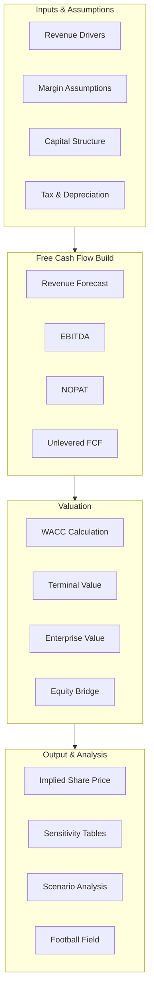

# DCF Valuation — Intermediate

## Overview

This intermediate DCF template extends the simple model with multi-scenario analysis, detailed WACC computation, working capital schedules, and comprehensive sensitivity tables. It provides a robust framework suitable for equity research and corporate finance applications.

## Model Structure

## Core Formulas

### Net Present Value

$$NPV = \sum_{t=0}^{n} \frac{CF_t}{(1+r)^t}$$

### Weighted Average Cost of Capital

$$WACC = \frac{E}{E+D} \times r_e + \frac{D}{E+D} \times r_d \times (1 - T)$$

### Cost of Equity (CAPM)

$$r_e = r_f + \beta \times (r_m - r_f)$$

### Terminal Value (Gordon Growth)

$$TV = \frac{FCF_{n+1}}{WACC - g} = \frac{FCF_n \times (1+g)}{WACC - g}$$

### Terminal Value (Exit Multiple)

$$TV = EBITDA_n \times EV/EBITDA_{multiple}$$

## WACC Calculation

| Component                         | Value      | Source                   |
| --------------------------------- | ---------- | ------------------------ |
| Risk-Free Rate ($r_f$)            | 4.25%      | 10-Year Treasury         |
| Equity Risk Premium ($r_m - r_f$) | 5.50%      | Damodaran ERP            |
| Levered Beta ($\beta$)            | 1.15       | Peer median, relevered   |
| Cost of Equity ($r_e$)            | **10.58%** | CAPM                     |
| Pre-Tax Cost of Debt ($r_d$)      | 6.00%      | Weighted avg. coupon     |
| Tax Rate ($T$)                    | 25.0%      | Statutory                |
| After-Tax Cost of Debt            | **4.50%**  | $r_d \times (1-T)$       |
| Equity Weight ($E/(E+D)$)         | 70.0%      | Target capital structure |
| Debt Weight ($D/(E+D)$)           | 30.0%      | Target capital structure |
| **WACC**                          | **8.75%**  | Blended                  |

## Key Assumptions by Scenario

| Assumption                   | Bear  | Base  | Bull  |
| ---------------------------- | ----- | ----- | ----- |
| Revenue Growth (Yr 1–3)      | 5.0%  | 8.0%  | 12.0% |
| Revenue Growth (Yr 4–5)      | 3.0%  | 6.0%  | 9.0%  |
| EBITDA Margin (steady state) | 20.0% | 25.0% | 30.0% |
| Terminal Growth Rate         | 1.5%  | 2.5%  | 3.5%  |
| WACC                         | 9.75% | 8.75% | 7.75% |
| Capex (% Revenue)            | 6.0%  | 5.0%  | 4.5%  |
| Probability Weight           | 25%   | 50%   | 25%   |

## Detailed Revenue Build

|                   | Year 1      | Year 2      | Year 3      | Year 4      | Year 5      |
| ----------------- | ----------- | ----------- | ----------- | ----------- | ----------- |
| **Base Case**     |             |             |             |             |             |
| Segment A (60%)   | $64.8M      | $70.0M      | $75.6M      | $80.1M      | $84.9M      |
| Segment B (30%)   | $32.4M      | $35.0M      | $37.8M      | $40.1M      | $42.5M      |
| Segment C (10%)   | $10.8M      | $11.7M      | $12.6M      | $13.4M      | $14.2M      |
| **Total Revenue** | **$108.0M** | **$116.6M** | **$126.0M** | **$133.6M** | **$141.6M** |
| YoY Growth        | 8.0%        | 8.0%        | 8.0%        | 6.0%        | 6.0%        |

## Free Cash Flow Build — Base Case

| Line Item         | Year 1     | Year 2     | Year 3     | Year 4     | Year 5     |
| ----------------- | ---------- | ---------- | ---------- | ---------- | ---------- |
| Revenue           | $108.0M    | $116.6M    | $126.0M    | $133.6M    | $141.6M    |
| COGS (55%)        | ($59.4M)   | ($64.2M)   | ($69.3M)   | ($73.5M)   | ($77.9M)   |
| **Gross Profit**  | **$48.6M** | **$52.5M** | **$56.7M** | **$60.1M** | **$63.7M** |
| Gross Margin      | 45.0%      | 45.0%      | 45.0%      | 45.0%      | 45.0%      |
| SG&A (15%)        | ($16.2M)   | ($17.5M)   | ($18.9M)   | ($20.0M)   | ($21.2M)   |
| R&D (5%)          | ($5.4M)    | ($5.8M)    | ($6.3M)    | ($6.7M)    | ($7.1M)    |
| **EBITDA**        | **$27.0M** | **$29.2M** | **$31.5M** | **$33.4M** | **$35.4M** |
| EBITDA Margin     | 25.0%      | 25.0%      | 25.0%      | 25.0%      | 25.0%      |
| D&A (3%)          | ($3.2M)    | ($3.5M)    | ($3.8M)    | ($4.0M)    | ($4.2M)    |
| **EBIT**          | **$23.8M** | **$25.7M** | **$27.7M** | **$29.4M** | **$31.1M** |
| Taxes (25%)       | ($5.9M)    | ($6.4M)    | ($6.9M)    | ($7.3M)    | ($7.8M)    |
| **NOPAT**         | **$17.8M** | **$19.2M** | **$20.8M** | **$22.0M** | **$23.3M** |
| Plus: D&A         | $3.2M      | $3.5M      | $3.8M      | $4.0M      | $4.2M      |
| Less: Capex       | ($5.4M)    | ($5.8M)    | ($6.3M)    | ($6.7M)    | ($7.1M)    |
| Less: Chg NWC     | ($1.1M)    | ($1.2M)    | ($1.3M)    | ($1.0M)    | ($1.1M)    |
| **Unlevered FCF** | **$14.6M** | **$15.7M** | **$17.0M** | **$18.4M** | **$19.4M** |

## Working Capital Schedule

| Component                  | Year 0     | Year 1     | Year 2     | Year 3     | Year 4     | Year 5     |
| -------------------------- | ---------- | ---------- | ---------- | ---------- | ---------- | ---------- |
| Accounts Receivable        | $12.0M     | $13.0M     | $14.0M     | $15.1M     | $16.0M     | $17.0M     |
| Days Sales Outstanding     | 44         | 44         | 44         | 44         | 44         | 44         |
| Inventory                  | $8.0M      | $8.6M      | $9.3M      | $10.1M     | $10.7M     | $11.3M     |
| Days Inventory Outstanding | 49         | 49         | 49         | 49         | 49         | 49         |
| Accounts Payable           | ($7.5M)    | ($8.1M)    | ($8.7M)    | ($9.4M)    | ($10.0M)   | ($10.6M)   |
| Days Payable Outstanding   | 46         | 46         | 46         | 46         | 46         | 46         |
| **Net Working Capital**    | **$12.5M** | **$13.5M** | **$14.6M** | **$15.8M** | **$16.7M** | **$17.7M** |
| Change in NWC              | —          | ($1.0M)    | ($1.1M)    | ($1.2M)    | ($0.9M)    | ($1.0M)    |

## Terminal Value — Dual Method

### Gordon Growth Model

$$TV_{GGM} = \frac{\$19.4M \times 1.025}{0.0875 - 0.025} = \$318.2M$$

### Exit Multiple Method

$$TV_{Exit} = \$35.4M \times 9.0x = \$318.6M$$

| Method               | Terminal Value | PV of TV    | % of EV   |
| -------------------- | -------------- | ----------- | --------- |
| Gordon Growth        | $318.2M        | $208.3M     | 76.2%     |
| Exit Multiple (9.0x) | $318.6M        | $208.5M     | 76.3%     |
| **Blended (50/50)**  | **$318.4M**    | **$208.4M** | **76.2%** |

## Present Value Summary — Base Case

| Year      | FCF     | Discount Factor | PV          |
| --------- | ------- | --------------- | ----------- |
| 1         | $14.6M  | 0.920           | $13.4M      |
| 2         | $15.7M  | 0.845           | $13.3M      |
| 3         | $17.0M  | 0.777           | $13.2M      |
| 4         | $18.4M  | 0.714           | $13.1M      |
| 5         | $19.4M  | 0.657           | $12.7M      |
| Terminal  | $318.4M | 0.657           | $209.2M     |
| **Total** |         |                 | **$275.0M** |

## Enterprise-to-Equity Bridge

| Component                  | Value       |
| -------------------------- | ----------- |
| Enterprise Value           | $275.0M     |
| Less: Total Debt           | ($50.0M)    |
| Less: Minority Interest    | ($5.0M)     |
| Less: Preferred Stock      | $0.0M       |
| Plus: Cash & Equivalents   | $20.0M      |
| Plus: Equity Investments   | $3.0M       |
| **Equity Value**           | **$243.0M** |
| Diluted Shares Outstanding | 10.5M       |
| **Implied Share Price**    | **$23.14**  |

## Scenario-Weighted Valuation

| Scenario                       | Probability | Share Price | Weighted   |
| ------------------------------ | ----------- | ----------- | ---------- |
| Bear                           | 25%         | $15.80      | $3.95      |
| Base                           | 50%         | $23.14      | $11.57     |
| Bull                           | 25%         | $33.50      | $8.38      |
| **Probability-Weighted Price** |             |             | **$23.90** |

## Sensitivity Tables

### Share Price vs. WACC and Terminal Growth

| WACC \ g  | 1.5%   | 2.0%   | 2.5%       | 3.0%   | 3.5%   |
| --------- | ------ | ------ | ---------- | ------ | ------ |
| 7.75%     | $28.90 | $31.40 | $34.60     | $38.80 | $44.60 |
| 8.25%     | $25.20 | $27.10 | $29.50     | $32.50 | $36.60 |
| **8.75%** | $22.20 | $23.70 | **$23.14** | $27.50 | $30.30 |
| 9.25%     | $19.70 | $20.90 | $22.30     | $24.00 | $26.00 |
| 9.75%     | $17.60 | $18.60 | $19.70     | $21.00 | $22.60 |

### Share Price vs. EBITDA Margin and Revenue Growth

| Margin \ Growth | 5.0%   | 6.5%   | 8.0%       | 9.5%   | 11.0%  |
| --------------- | ------ | ------ | ---------- | ------ | ------ |
| 20.0%           | $15.30 | $16.80 | $18.50     | $20.40 | $22.50 |
| 22.5%           | $17.60 | $19.40 | $21.30     | $23.50 | $25.90 |
| **25.0%**       | $19.90 | $21.90 | **$23.14** | $26.60 | $29.40 |
| 27.5%           | $22.20 | $24.40 | $26.90     | $29.70 | $32.80 |
| 30.0%           | $24.50 | $27.00 | $29.70     | $32.80 | $36.20 |

## Implied Multiples

| Multiple              | Implied Value |
| --------------------- | ------------- |
| EV / Revenue (Year 1) | 2.5x          |
| EV / EBITDA (Year 1)  | 10.2x         |
| EV / EBIT (Year 1)    | 11.6x         |
| P/E (Year 1)          | 16.8x         |
| FCF Yield             | 5.3%          |

## Key Risks & Considerations

1. **Terminal value dominance** — TV represents ~76% of enterprise value
2. **WACC sensitivity** — 100bps change in WACC shifts price by ~$4
3. **Margin sustainability** — Assumes constant 25% EBITDA margins
4. **Working capital** — DSO/DIO/DPO held constant (may not reflect reality)
5. **Capital structure** — Target weights may diverge from actual

## Next Steps

- **Upgrade to Advanced**: See `dcf_valuation_advanced.md` for Monte Carlo simulation, regression-based betas, and full LaTeX derivations
- **Complement with**: `merger_model_intermediate.md` for acquisition context

---

_Template: DCF Valuation — Intermediate | Tier 2 of 3_
