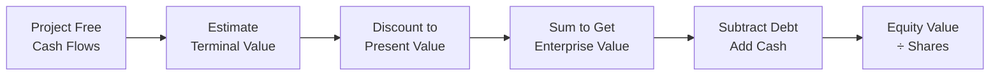

# DCF Valuation — Simple

## Overview

A Discounted Cash Flow (DCF) valuation estimates the intrinsic value of a business by projecting future free cash flows and discounting them back to present value. This simple template covers a 5-year projection with a terminal value.

## Key Assumptions

| Assumption                   | Value   |
| ---------------------------- | ------- |
| Projection Period            | 5 years |
| Discount Rate (WACC)         | 10.0%   |
| Terminal Growth Rate         | 2.5%    |
| Revenue Growth Rate          | 8.0%    |
| EBITDA Margin                | 25.0%   |
| Tax Rate                     | 25.0%   |
| Capex (% of Revenue)         | 5.0%    |
| D&A (% of Revenue)           | 3.0%    |
| Change in NWC (% of Revenue) | 1.0%    |

## DCF Process

## Core Formula

The net present value of all future cash flows:

$$NPV = \sum_{t=0}^{n} \frac{CF_t}{(1+r)^t}$$

Where:

- $CF_t$ = Free cash flow in period $t$
- $r$ = Discount rate (WACC)
- $n$ = Number of projection periods

## Revenue Projection

| Year    | Year 1  | Year 2  | Year 3  | Year 4  | Year 5  |
| ------- | ------- | ------- | ------- | ------- | ------- |
| Revenue | $108.0M | $116.6M | $126.0M | $136.1M | $147.0M |
| Growth  | 8.0%    | 8.0%    | 8.0%    | 8.0%    | 8.0%    |

_Base revenue: $100.0M_

## Free Cash Flow Build

| Component          | Year 1     | Year 2     | Year 3     | Year 4     | Year 5     |
| ------------------ | ---------- | ---------- | ---------- | ---------- | ---------- |
| Revenue            | $108.0M    | $116.6M    | $126.0M    | $136.1M    | $147.0M    |
| EBITDA (25%)       | $27.0M     | $29.2M     | $31.5M     | $34.0M     | $36.7M     |
| Less: D&A (3%)     | ($3.2M)    | ($3.5M)    | ($3.8M)    | ($4.1M)    | ($4.4M)    |
| EBIT               | $23.8M     | $25.7M     | $27.7M     | $29.9M     | $32.3M     |
| Less: Taxes (25%)  | ($5.9M)    | ($6.4M)    | ($6.9M)    | ($7.5M)    | ($8.1M)    |
| NOPAT              | $17.8M     | $19.2M     | $20.8M     | $22.5M     | $24.3M     |
| Plus: D&A          | $3.2M      | $3.5M      | $3.8M      | $4.1M      | $4.4M      |
| Less: Capex (5%)   | ($5.4M)    | ($5.8M)    | ($6.3M)    | ($6.8M)    | ($7.3M)    |
| Less: Chg NWC (1%) | ($1.1M)    | ($1.2M)    | ($1.3M)    | ($1.4M)    | ($1.5M)    |
| **Free Cash Flow** | **$14.6M** | **$15.7M** | **$17.0M** | **$18.4M** | **$19.9M** |

## Terminal Value

$$TV = \frac{FCF_n \times (1 + g)}{WACC - g}$$

$$TV = \frac{\$19.9M \times 1.025}{0.10 - 0.025} = \$271.8M$$

## Present Value Calculation

| Year     | FCF     | Discount Factor | PV of FCF |
| -------- | ------- | --------------- | --------- |
| 1        | $14.6M  | 0.909           | $13.3M    |
| 2        | $15.7M  | 0.826           | $13.0M    |
| 3        | $17.0M  | 0.751           | $12.8M    |
| 4        | $18.4M  | 0.683           | $12.6M    |
| 5        | $19.9M  | 0.621           | $12.3M    |
| Terminal | $271.8M | 0.621           | $168.7M   |

## Valuation Summary

| Metric                  | Value       |
| ----------------------- | ----------- |
| PV of FCFs (Years 1–5)  | $63.9M      |
| PV of Terminal Value    | $168.7M     |
| **Enterprise Value**    | **$232.7M** |
| Less: Net Debt          | ($30.0M)    |
| **Equity Value**        | **$202.7M** |
| Shares Outstanding      | 10.0M       |
| **Implied Share Price** | **$20.27**  |

## Sensitivity Analysis

**Share Price vs. WACC and Terminal Growth Rate:**

| WACC \ Growth | 1.5%   | 2.0%   | 2.5%       | 3.0%   | 3.5%   |
| ------------- | ------ | ------ | ---------- | ------ | ------ |
| 8.0%          | $27.10 | $29.50 | $32.40     | $36.10 | $40.90 |
| 9.0%          | $22.80 | $24.50 | $26.50     | $28.90 | $31.90 |
| **10.0%**     | $19.50 | $20.70 | **$20.27** | $23.60 | $25.50 |
| 11.0%         | $16.90 | $17.80 | $18.80     | $20.00 | $21.40 |
| 12.0%         | $14.80 | $15.50 | $16.30     | $17.10 | $18.10 |

## Limitations

- Assumes constant growth and margins across all projection years
- Single discount rate applied uniformly
- Terminal value represents a large portion of total value
- Does not incorporate scenario or Monte Carlo analysis

## Quick Reference

- **Use when**: Valuing stable businesses with predictable cash flows
- **Strengths**: Focuses on intrinsic value, forward-looking
- **Weaknesses**: Highly sensitive to terminal assumptions
- **Next tier**: See `dcf_valuation_intermediate.md` for scenario analysis and detailed tables

---

_Template: DCF Valuation — Simple | Tier 1 of 3_
