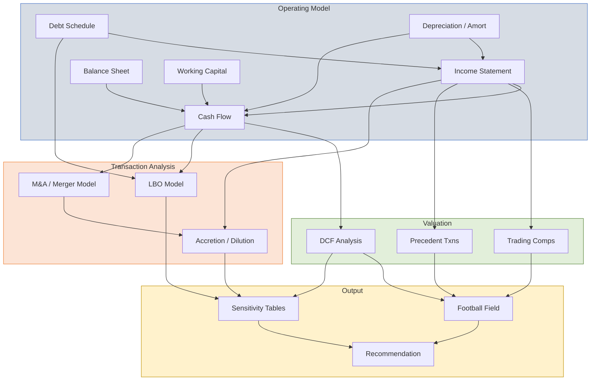
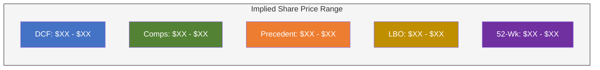

# Advanced Financial Model: DCF, M&A, and LBO Integration

| Field              | Value                 |
| ------------------ | --------------------- |
| **Template ID**    | `FIN-MOD-003`         |
| **Category**       | Financial Modeling    |
| **Complexity**     | Advanced              |
| **Version**        | 1.0                   |
| **Last Updated**   | YYYY-MM-DD            |
| **Author**         | [Analyst Name]        |
| **Reviewed By**    | [Senior Banker / MD]  |
| **Classification** | Strictly Confidential |

---

## Document Control

| Version | Date       | Author | Changes       |
| ------- | ---------- | ------ | ------------- |
| 1.0     | YYYY-MM-DD | [Name] | Initial draft |
|         |            |        |               |

---

## Executive Summary

[Comprehensive overview: company description, strategic rationale, valuation conclusion, and recommended transaction structure. 1 paragraph.]

### Valuation Summary

| Methodology               | Low | Mid | High |
| ------------------------- | --- | --- | ---- |
| DCF (WACC-based)          |     |     |      |
| DCF (APV)                 |     |     |      |
| Trading Comps (EV/EBITDA) |     |     |      |
| Trading Comps (P/E)       |     |     |      |
| Precedent Transactions    |     |     |      |
| LBO (Floor Valuation)     |     |     |      |
| 52-Week Range             |     |     |      |
| **Blended Valuation**     |     |     |      |

---

## Integrated Model Architecture

---

## Operating Model

_[Include full three-statement model per `financial_model_intermediate.md` template]_

### Key Operating Metrics

| Metric              | Year 1 | Year 2 | Year 3 | Year 4 | Year 5 |
| ------------------- | ------ | ------ | ------ | ------ | ------ |
| Revenue ($M)        |        |        |        |        |        |
| Revenue Growth (%)  |        |        |        |        |        |
| Gross Margin (%)    |        |        |        |        |        |
| EBITDA ($M)         |        |        |        |        |        |
| EBITDA Margin (%)   |        |        |        |        |        |
| Unlevered FCF ($M)  |        |        |        |        |        |
| CapEx / Revenue (%) |        |        |        |        |        |
| ROIC (%)            |        |        |        |        |        |

---

## DCF Valuation

### Weighted Average Cost of Capital (WACC)

$$\text{WACC} = \frac{E}{E+D} \cdot r_e + \frac{D}{E+D} \cdot r_d \cdot (1 - t)$$

#### Cost of Equity (CAPM)

$$r_e = r_f + \beta_L \cdot (\text{ERP}) + \alpha$$

| Component                  | Value | Source                      |
| -------------------------- | ----- | --------------------------- |
| Risk-Free Rate ($r_f$)     | %     | [10Y Treasury]              |
| Equity Risk Premium (ERP)  | %     | [Duff & Phelps / Damodaran] |
| Levered Beta ($\beta_L$)   | x     | [Bloomberg / Regression]    |
| Size Premium ($\alpha$)    | %     | [Duff & Phelps]             |
| **Cost of Equity ($r_e$)** | **%** |                             |

Beta unlevering/relevering:

$$\beta_U = \frac{\beta_L}{1 + (1 - t) \cdot \frac{D}{E}}$$

$$\beta_L = \beta_U \cdot \left[1 + (1 - t) \cdot \frac{D}{E}\right]$$

#### Cost of Debt

$$r_d = \text{YTM on comparable bonds or weighted average coupon}$$

$$r_d(1 - t) = \text{After-tax cost of debt}$$

| Component               | Value |
| ----------------------- | ----- |
| Pre-Tax Cost of Debt    | %     |
| Marginal Tax Rate ($t$) | %     |
| After-Tax Cost of Debt  | %     |

#### WACC Calculation

| Component | Weight   | Cost | Weighted Cost |
| --------- | -------- | ---- | ------------- |
| Equity    | %        | %    | %             |
| Debt      | %        | %    | %             |
| **WACC**  | **100%** |      | **%**         |

### Unlevered Free Cash Flow Projections

| ($M)              | Year 1 | Year 2 | Year 3 | Year 4 | Year 5 |
| ----------------- | ------ | ------ | ------ | ------ | ------ |
| EBIT              |        |        |        |        |        |
| (-) Taxes on EBIT |        |        |        |        |        |
| NOPAT             |        |        |        |        |        |
| (+) D&A           |        |        |        |        |        |
| (-) CapEx         |        |        |        |        |        |
| (-) $\Delta$NWC   |        |        |        |        |        |
| **Unlevered FCF** |        |        |        |        |        |

$$\text{UFCF}_t = \text{EBIT}_t(1-t) + \text{D\&A}_t - \text{CapEx}_t - \Delta\text{NWC}_t$$

### Terminal Value

**Gordon Growth Model:**

$$\text{TV} = \frac{\text{UFCF}_{n} \times (1 + g)}{(\text{WACC} - g)}$$

**Exit Multiple Method:**

$$\text{TV} = \text{EBITDA}_{n} \times \text{Exit Multiple}$$

| Terminal Value Method       | Value ($M) |
| --------------------------- | ---------- |
| Gordon Growth (g = %)       |            |
| Exit Multiple (x EBITDA)    |            |
| **Selected Terminal Value** |            |

### Enterprise Value Calculation

$$\text{EV} = \sum_{t=1}^{n} \frac{\text{UFCF}_t}{(1 + \text{WACC})^t} + \frac{\text{TV}}{(1 + \text{WACC})^n}$$

| Component ($M)             | Value |
| -------------------------- | ----- |
| PV of Projected FCFs       |       |
| PV of Terminal Value       |       |
| **Enterprise Value**       |       |
| (-) Net Debt               |       |
| (-) Minority Interest      |       |
| (-) Preferred Stock        |       |
| (+) Equity Investments     |       |
| **Equity Value**           |       |
| Diluted Shares Outstanding |       |
| **Implied Share Price**    |       |

### DCF Sensitivity: WACC vs. Terminal Growth Rate

| Share Price ($) | **g = 1.5%** | **g = 2.0%** | **g = 2.5%** | **g = 3.0%** | **g = 3.5%** |
| --------------- | ------------ | ------------ | ------------ | ------------ | ------------ |
| **WACC 8.0%**   |              |              |              |              |              |
| **WACC 8.5%**   |              |              |              |              |              |
| **WACC 9.0%**   |              |              |              |              |              |
| **WACC 9.5%**   |              |              |              |              |              |
| **WACC 10.0%**  |              |              |              |              |              |

### DCF Sensitivity: WACC vs. Exit Multiple

| Share Price ($) | **8.0x** | **9.0x** | **10.0x** | **11.0x** | **12.0x** |
| --------------- | -------- | -------- | --------- | --------- | --------- |
| **WACC 8.0%**   |          |          |           |           |           |
| **WACC 8.5%**   |          |          |           |           |           |
| **WACC 9.0%**   |          |          |           |           |           |
| **WACC 9.5%**   |          |          |           |           |           |
| **WACC 10.0%**  |          |          |           |           |           |

---

## Adjusted Present Value (APV)

$$\text{APV} = \text{NPV}_{\text{unlevered}} + \text{PV(Tax Shields)} - \text{PV(Distress Costs)}$$

$$\text{NPV}_{\text{unlevered}} = \sum_{t=1}^{n} \frac{\text{UFCF}_t}{(1+r_u)^t} + \frac{\text{TV}_{\text{unlevered}}}{(1+r_u)^n}$$

$$\text{PV(Tax Shields)} = \sum_{t=1}^{n} \frac{t \cdot r_d \cdot D_t}{(1+r_d)^t}$$

| APV Component ($M)         | Value |
| -------------------------- | ----- |
| PV of Unlevered Cash Flows |       |
| PV of Tax Shields          |       |
| (-) PV of Distress Costs   |       |
| **Adjusted Present Value** |       |

---

## LBO Analysis

### Sources & Uses

| Sources ($M)              | Amount | %    |
| ------------------------- | ------ | ---- |
| Revolving Credit Facility |        |      |
| Term Loan A               |        |      |
| Term Loan B               |        |      |
| Senior Unsecured Notes    |        |      |
| Subordinated Notes        |        |      |
| Sponsor Equity            |        |      |
| Management Rollover       |        |      |
| **Total Sources**         |        | 100% |

| Uses ($M)               | Amount | %    |
| ----------------------- | ------ | ---- |
| Enterprise Value        |        |      |
| Refinance Existing Debt |        |      |
| Transaction Fees        |        |      |
| Financing Fees          |        |      |
| Cash to Balance Sheet   |        |      |
| **Total Uses**          |        | 100% |

### Transaction Summary

| Metric                  | Value |
| ----------------------- | ----- |
| Entry EV / EBITDA       | x     |
| Entry Equity            | $M    |
| Total Debt at Close     | $M    |
| Total Leverage at Close | x     |
| Senior Leverage         | x     |
| Equity Contribution (%) | %     |

### LBO Debt Schedule

| ($M)               | Close | Year 1 | Year 2 | Year 3 | Year 4 | Year 5 |
| ------------------ | ----- | ------ | ------ | ------ | ------ | ------ |
| **Revolver**       |       |        |        |        |        |        |
| **Term Loan A**    |       |        |        |        |        |        |
| **Term Loan B**    |       |        |        |        |        |        |
| **Senior Notes**   |       |        |        |        |        |        |
| **Sub Notes**      |       |        |        |        |        |        |
| **Total Debt**     |       |        |        |        |        |        |
| **Total Leverage** | x     | x      | x      | x      | x      | x      |

### LBO Returns Analysis

$$\text{IRR}: \quad 0 = -\text{Equity}_0 + \sum_{t=1}^{n} \frac{\text{CF}_t}{(1+\text{IRR})^t} + \frac{\text{Exit Equity}_n}{(1+\text{IRR})^n}$$

$$\text{MOIC} = \frac{\text{Exit Equity Value}}{\text{Initial Equity Investment}}$$

| Exit Year         | Year 3 | Year 4 | Year 5 | Year 6 | Year 7 |
| ----------------- | ------ | ------ | ------ | ------ | ------ |
| Exit EBITDA ($M)  |        |        |        |        |        |
| Exit EV ($M)      |        |        |        |        |        |
| (-) Net Debt ($M) |        |        |        |        |        |
| Exit Equity ($M)  |        |        |        |        |        |
| **MOIC (x)**      |        |        |        |        |        |
| **IRR (%)**       |        |        |        |        |        |

### LBO Returns Sensitivity: Entry Multiple vs. Exit Multiple

| IRR (%)         | **Exit 8.0x** | **Exit 9.0x** | **Exit 10.0x** | **Exit 11.0x** | **Exit 12.0x** |
| --------------- | ------------- | ------------- | -------------- | -------------- | -------------- |
| **Entry 7.0x**  |               |               |                |                |                |
| **Entry 8.0x**  |               |               |                |                |                |
| **Entry 9.0x**  |               |               |                |                |                |
| **Entry 10.0x** |               |               |                |                |                |

### LBO Value Creation Bridge

---

## M&A / Merger Model

### Transaction Overview

| Parameter                | Value                |
| ------------------------ | -------------------- |
| Acquirer                 | [Company A]          |
| Target                   | [Company B]          |
| Offer Price per Share    | $                    |
| Premium to Current Price | %                    |
| Implied Enterprise Value | $M                   |
| Implied EV / EBITDA      | x                    |
| Consideration            | [Cash / Stock / Mix] |

### Pro Forma Combination

| ($M)               | Acquirer | Target | Adjustments | Pro Forma |
| ------------------ | -------- | ------ | ----------- | --------- |
| Revenue            |          |        |             |           |
| EBITDA             |          |        |             |           |
| Net Income         |          |        |             |           |
| Total Debt         |          |        |             |           |
| Cash               |          |        |             |           |
| Shares Outstanding |          |        |             |           |
| EPS                |          |        |             |           |

### Accretion / Dilution Analysis

$$\text{Accretion/Dilution} = \frac{\text{Pro Forma EPS} - \text{Standalone EPS}}{\text{Standalone EPS}}$$

| Metric                       | Year 1 | Year 2 | Year 3 |
| ---------------------------- | ------ | ------ | ------ |
| Acquirer Standalone EPS      |        |        |        |
| Pro Forma EPS                |        |        |        |
| **Accretion / (Dilution)**   |        |        |        |
| **Accretion / (Dilution) %** |        |        |        |

### Synergy Analysis

| Synergy Type ($M)     | Year 1 | Year 2 | Year 3 (Run-Rate) |
| --------------------- | ------ | ------ | ----------------- |
| Revenue Synergies     |        |        |                   |
| Cost Synergies (COGS) |        |        |                   |
| Cost Synergies (SG&A) |        |        |                   |
| **Total Synergies**   |        |        |                   |
| (-) Integration Costs |        |        |                   |
| **Net Synergies**     |        |        |                   |

### Accretion/Dilution Sensitivity: Synergies vs. Offer Premium

| Accretion %     | **Syn $25M** | **Syn $50M** | **Syn $75M** | **Syn $100M** |
| --------------- | ------------ | ------------ | ------------ | ------------- |
| **Premium 15%** |              |              |              |               |
| **Premium 20%** |              |              |              |               |
| **Premium 25%** |              |              |              |               |
| **Premium 30%** |              |              |              |               |
| **Premium 35%** |              |              |              |               |

---

## Valuation Football Field

---

## Key Risks & Mitigants

| Risk                | Probability | Impact | Mitigant |
| ------------------- | ----------- | ------ | -------- |
| Revenue miss        |             |        |          |
| Margin compression  |             |        |          |
| Integration failure |             |        |          |
| Financing risk      |             |        |          |
| Regulatory          |             |        |          |

---

## Notes & Disclaimers

- All figures in USD millions unless otherwise stated
- WACC and cost of capital based on market data as of [Date]
- LBO assumes [X]-year hold period with [X]x exit multiple
- M&A analysis assumes [cash/stock/mixed] consideration
- Synergies are management estimates and subject to integration risk
- This analysis is for discussion purposes only and does not constitute a recommendation

---

_This template integrates DCF, LBO, and M&A frameworks per investment banking standards. All modules should be dynamically linked to the operating model._
