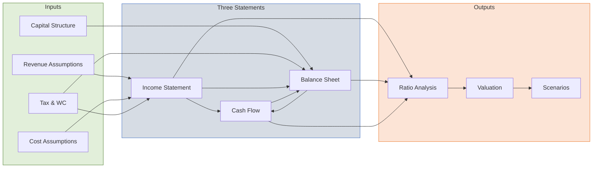
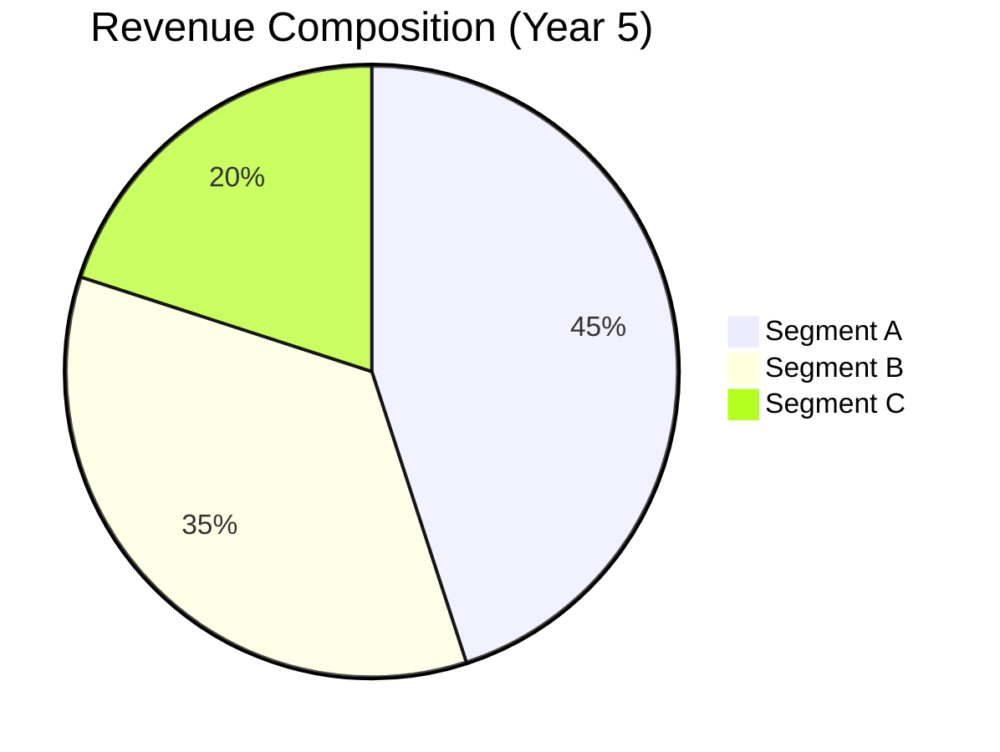
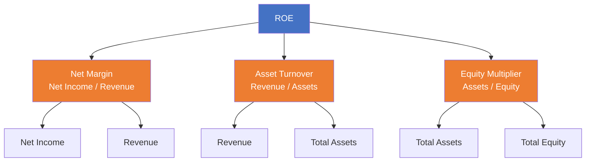
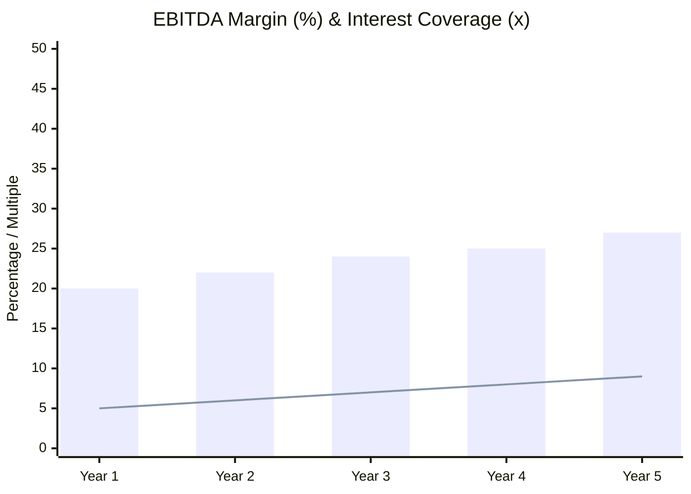

# Intermediate Three-Statement Financial Model with Ratios & Charts

| Field              | Value              |
| ------------------ | ------------------ |
| **Template ID**    | `FIN-MOD-002`      |
| **Category**       | Financial Modeling |
| **Complexity**     | Intermediate       |
| **Version**        | 1.0                |
| **Last Updated**   | YYYY-MM-DD         |
| **Author**         | [Analyst Name]     |
| **Reviewed By**    | [Reviewer Name]    |
| **Classification** | Confidential       |

---

## Document Control

| Version | Date       | Author | Changes       |
| ------- | ---------- | ------ | ------------- |
| 1.0     | YYYY-MM-DD | [Name] | Initial draft |
|         |            |        |               |

---

## Executive Summary

[Company overview, model purpose, key conclusions. Include valuation range and recommendation.]

---

## Model Architecture

---

## Revenue Build

### Segment Revenue

| Segment ($M)           | Year 1 | Year 2 | Year 3 | Year 4 | Year 5 |
| ---------------------- | ------ | ------ | ------ | ------ | ------ |
| **Segment A**          |        |        |        |        |        |
| - Volume               |        |        |        |        |        |
| - Price                |        |        |        |        |        |
| - Revenue              |        |        |        |        |        |
| - Growth (%)           |        |        |        |        |        |
| **Segment B**          |        |        |        |        |        |
| - Volume               |        |        |        |        |        |
| - Price                |        |        |        |        |        |
| - Revenue              |        |        |        |        |        |
| - Growth (%)           |        |        |        |        |        |
| **Segment C**          |        |        |        |        |        |
| - Revenue              |        |        |        |        |        |
| - Growth (%)           |        |        |        |        |        |
| **Total Revenue**      |        |        |        |        |        |
| **Blended Growth (%)** |        |        |        |        |        |

Compound Annual Growth Rate:

$$\text{CAGR} = \left(\frac{\text{Revenue}_{T}}{\text{Revenue}_{0}}\right)^{\frac{1}{T}} - 1$$

### Revenue Mix

---

## Income Statement (Detailed)

| Line Item ($M)               | Year 1 | Year 2 | Year 3 | Year 4 | Year 5 |
| ---------------------------- | ------ | ------ | ------ | ------ | ------ |
| **Revenue**                  |        |        |        |        |        |
| Cost of Goods Sold           |        |        |        |        |        |
| **Gross Profit**             |        |        |        |        |        |
| _Gross Margin (%)_           |        |        |        |        |        |
|                              |        |        |        |        |        |
| Sales & Marketing            |        |        |        |        |        |
| General & Administrative     |        |        |        |        |        |
| Research & Development       |        |        |        |        |        |
| Depreciation & Amortization  |        |        |        |        |        |
| Stock-Based Compensation     |        |        |        |        |        |
| Restructuring Charges        |        |        |        |        |        |
| **Total Operating Expenses** |        |        |        |        |        |
|                              |        |        |        |        |        |
| **EBITDA**                   |        |        |        |        |        |
| _EBITDA Margin (%)_          |        |        |        |        |        |
| **EBIT**                     |        |        |        |        |        |
| _EBIT Margin (%)_            |        |        |        |        |        |
|                              |        |        |        |        |        |
| Interest Expense             |        |        |        |        |        |
| Interest Income              |        |        |        |        |        |
| Other Income / (Expense)     |        |        |        |        |        |
| **Pre-Tax Income**           |        |        |        |        |        |
| Income Tax Expense           |        |        |        |        |        |
| _Effective Tax Rate (%)_     |        |        |        |        |        |
|                              |        |        |        |        |        |
| **Net Income**               |        |        |        |        |        |
| _Net Margin (%)_             |        |        |        |        |        |
|                              |        |        |        |        |        |
| **EPS (Basic)**              |        |        |        |        |        |
| **EPS (Diluted)**            |        |        |        |        |        |

EBITDA calculation:

$$\text{EBITDA} = \text{Net Income} + \text{Interest} + \text{Taxes} + \text{D\&A}$$

$$\text{EBITDA} = \text{EBIT} + \text{D\&A}$$

---

## Balance Sheet (Detailed)

| Line Item ($M)                 | Year 1 | Year 2 | Year 3 | Year 4 | Year 5 |
| ------------------------------ | ------ | ------ | ------ | ------ | ------ |
| **Current Assets**             |        |        |        |        |        |
| Cash & Equivalents             |        |        |        |        |        |
| Short-Term Investments         |        |        |        |        |        |
| Accounts Receivable            |        |        |        |        |        |
| Inventory                      |        |        |        |        |        |
| Prepaid & Other Current        |        |        |        |        |        |
| **Total Current Assets**       |        |        |        |        |        |
|                                |        |        |        |        |        |
| **Non-Current Assets**         |        |        |        |        |        |
| PP&E (Gross)                   |        |        |        |        |        |
| Less: Accumulated Depreciation |        |        |        |        |        |
| PP&E (Net)                     |        |        |        |        |        |
| Goodwill                       |        |        |        |        |        |
| Intangible Assets (Net)        |        |        |        |        |        |
| Other Non-Current Assets       |        |        |        |        |        |
| **Total Assets**               |        |        |        |        |        |
|                                |        |        |        |        |        |
| **Current Liabilities**        |        |        |        |        |        |
| Accounts Payable               |        |        |        |        |        |
| Accrued Expenses               |        |        |        |        |        |
| Deferred Revenue (Current)     |        |        |        |        |        |
| Current Portion of LTD         |        |        |        |        |        |
| **Total Current Liabilities**  |        |        |        |        |        |
|                                |        |        |        |        |        |
| **Non-Current Liabilities**    |        |        |        |        |        |
| Long-Term Debt                 |        |        |        |        |        |
| Deferred Revenue (Non-Current) |        |        |        |        |        |
| Deferred Tax Liabilities       |        |        |        |        |        |
| Other Non-Current Liabilities  |        |        |        |        |        |
| **Total Liabilities**          |        |        |        |        |        |
|                                |        |        |        |        |        |
| **Shareholders' Equity**       |        |        |        |        |        |
| Common Stock & APIC            |        |        |        |        |        |
| Retained Earnings              |        |        |        |        |        |
| Treasury Stock                 |        |        |        |        |        |
| AOCI                           |        |        |        |        |        |
| **Total Equity**               |        |        |        |        |        |
| **Total Liabilities & Equity** |        |        |        |        |        |
| **Balance Check**              | 0      | 0      | 0      | 0      | 0      |

---

## Cash Flow Statement (Detailed)

| Line Item ($M)                       | Year 1 | Year 2 | Year 3 | Year 4 | Year 5 |
| ------------------------------------ | ------ | ------ | ------ | ------ | ------ |
| **Operating Activities**             |        |        |        |        |        |
| Net Income                           |        |        |        |        |        |
| _Non-Cash Adjustments:_              |        |        |        |        |        |
| Depreciation & Amortization          |        |        |        |        |        |
| Stock-Based Compensation             |        |        |        |        |        |
| Deferred Taxes                       |        |        |        |        |        |
| Amortization of Debt Issuance Costs  |        |        |        |        |        |
| _Working Capital Changes:_           |        |        |        |        |        |
| (Increase)/Decrease in A/R           |        |        |        |        |        |
| (Increase)/Decrease in Inventory     |        |        |        |        |        |
| (Increase)/Decrease in Prepaid       |        |        |        |        |        |
| Increase/(Decrease) in A/P           |        |        |        |        |        |
| Increase/(Decrease) in Accrued       |        |        |        |        |        |
| Increase/(Decrease) in Deferred Rev. |        |        |        |        |        |
| **Cash from Operations**             |        |        |        |        |        |
|                                      |        |        |        |        |        |
| **Investing Activities**             |        |        |        |        |        |
| Capital Expenditures                 |        |        |        |        |        |
| Acquisitions, net of cash            |        |        |        |        |        |
| Purchases of Investments             |        |        |        |        |        |
| Sales / Maturities of Investments    |        |        |        |        |        |
| **Cash from Investing**              |        |        |        |        |        |
|                                      |        |        |        |        |        |
| **Financing Activities**             |        |        |        |        |        |
| Proceeds from Debt                   |        |        |        |        |        |
| Repayments of Debt                   |        |        |        |        |        |
| Proceeds from Equity Issuance        |        |        |        |        |        |
| Share Repurchases                    |        |        |        |        |        |
| Dividends Paid                       |        |        |        |        |        |
| **Cash from Financing**              |        |        |        |        |        |
|                                      |        |        |        |        |        |
| Effect of Exchange Rates             |        |        |        |        |        |
| **Net Change in Cash**               |        |        |        |        |        |
| Beginning Cash                       |        |        |        |        |        |
| **Ending Cash**                      |        |        |        |        |        |

---

## Debt Schedule

| ($M)                       | Year 1 | Year 2 | Year 3 | Year 4 | Year 5 |
| -------------------------- | ------ | ------ | ------ | ------ | ------ |
| **Revolver**               |        |        |        |        |        |
| Beginning Balance          |        |        |        |        |        |
| Draws / (Repayments)       |        |        |        |        |        |
| Ending Balance             |        |        |        |        |        |
| Interest Rate (%)          |        |        |        |        |        |
| Interest Expense           |        |        |        |        |        |
|                            |        |        |        |        |        |
| **Term Loan A**            |        |        |        |        |        |
| Beginning Balance          |        |        |        |        |        |
| Mandatory Amortization     |        |        |        |        |        |
| Optional Prepayment        |        |        |        |        |        |
| Ending Balance             |        |        |        |        |        |
| Interest Rate (%)          |        |        |        |        |        |
| Interest Expense           |        |        |        |        |        |
|                            |        |        |        |        |        |
| **Senior Notes**           |        |        |        |        |        |
| Beginning Balance          |        |        |        |        |        |
| Repayment                  |        |        |        |        |        |
| Ending Balance             |        |        |        |        |        |
| Coupon Rate (%)            |        |        |        |        |        |
| Interest Expense           |        |        |        |        |        |
|                            |        |        |        |        |        |
| **Total Debt**             |        |        |        |        |        |
| **Total Interest Expense** |        |        |        |        |        |
| **Net Debt**               |        |        |        |        |        |

---

## Depreciation Schedule

| ($M)                          | Year 1 | Year 2 | Year 3 | Year 4 | Year 5 |
| ----------------------------- | ------ | ------ | ------ | ------ | ------ |
| Beginning PP&E (Gross)        |        |        |        |        |        |
| + Capital Expenditures        |        |        |        |        |        |
| - Disposals                   |        |        |        |        |        |
| Ending PP&E (Gross)           |        |        |        |        |        |
|                               |        |        |        |        |        |
| Beginning Accum. Depreciation |        |        |        |        |        |
| + Depreciation Expense        |        |        |        |        |        |
| - Disposals                   |        |        |        |        |        |
| Ending Accum. Depreciation    |        |        |        |        |        |
|                               |        |        |        |        |        |
| **Net PP&E**                  |        |        |        |        |        |

Straight-line depreciation:

$$\text{Depreciation} = \frac{\text{Cost} - \text{Salvage Value}}{\text{Useful Life}}$$

---

## Financial Ratio Analysis

### Profitability Ratios

| Ratio                          | Year 1 | Year 2 | Year 3 | Year 4 | Year 5 |
| ------------------------------ | ------ | ------ | ------ | ------ | ------ |
| Gross Margin (%)               |        |        |        |        |        |
| EBITDA Margin (%)              |        |        |        |        |        |
| EBIT Margin (%)                |        |        |        |        |        |
| Net Margin (%)                 |        |        |        |        |        |
| Return on Equity (%)           |        |        |        |        |        |
| Return on Assets (%)           |        |        |        |        |        |
| Return on Invested Capital (%) |        |        |        |        |        |

$$\text{ROE} = \frac{\text{Net Income}}{\text{Average Equity}}$$

$$\text{ROA} = \frac{\text{Net Income}}{\text{Average Total Assets}}$$

$$\text{ROIC} = \frac{\text{NOPAT}}{\text{Invested Capital}} = \frac{\text{EBIT} \times (1 - t)}{\text{Total Debt} + \text{Equity} - \text{Cash}}$$

### DuPont Analysis

$$\text{ROE} = \underbrace{\frac{\text{Net Income}}{\text{Revenue}}}_{\text{Net Margin}} \times \underbrace{\frac{\text{Revenue}}{\text{Total Assets}}}_{\text{Asset Turnover}} \times \underbrace{\frac{\text{Total Assets}}{\text{Equity}}}_{\text{Equity Multiplier}}$$

### Liquidity Ratios

| Ratio         | Year 1 | Year 2 | Year 3 | Year 4 | Year 5 |
| ------------- | ------ | ------ | ------ | ------ | ------ |
| Current Ratio |        |        |        |        |        |
| Quick Ratio   |        |        |        |        |        |
| Cash Ratio    |        |        |        |        |        |

$$\text{Current Ratio} = \frac{\text{Current Assets}}{\text{Current Liabilities}}$$

$$\text{Quick Ratio} = \frac{\text{Cash} + \text{Receivables} + \text{Short-Term Investments}}{\text{Current Liabilities}}$$

### Efficiency Ratios

| Ratio                        | Year 1 | Year 2 | Year 3 | Year 4 | Year 5 |
| ---------------------------- | ------ | ------ | ------ | ------ | ------ |
| DSO (days)                   |        |        |        |        |        |
| DIO (days)                   |        |        |        |        |        |
| DPO (days)                   |        |        |        |        |        |
| Cash Conversion Cycle (days) |        |        |        |        |        |
| Asset Turnover (x)           |        |        |        |        |        |
| Inventory Turnover (x)       |        |        |        |        |        |

$$\text{DSO} = \frac{\text{Accounts Receivable}}{\text{Revenue}} \times 365$$

$$\text{DIO} = \frac{\text{Inventory}}{\text{COGS}} \times 365$$

$$\text{DPO} = \frac{\text{Accounts Payable}}{\text{COGS}} \times 365$$

$$\text{Cash Conversion Cycle} = \text{DSO} + \text{DIO} - \text{DPO}$$

### Leverage Ratios

| Ratio                     | Year 1 | Year 2 | Year 3 | Year 4 | Year 5 |
| ------------------------- | ------ | ------ | ------ | ------ | ------ |
| Debt / Equity (x)         |        |        |        |        |        |
| Debt / EBITDA (x)         |        |        |        |        |        |
| Net Debt / EBITDA (x)     |        |        |        |        |        |
| Interest Coverage (x)     |        |        |        |        |        |
| Fixed Charge Coverage (x) |        |        |        |        |        |

$$\text{Interest Coverage} = \frac{\text{EBIT}}{\text{Interest Expense}}$$

$$\text{Net Leverage} = \frac{\text{Total Debt} - \text{Cash}}{\text{EBITDA}}$$

### Coverage Margin Chart

---

## Free Cash Flow Analysis

| ($M)                             | Year 1 | Year 2 | Year 3 | Year 4 | Year 5 |
| -------------------------------- | ------ | ------ | ------ | ------ | ------ |
| EBITDA                           |        |        |        |        |        |
| (-) Cash Taxes                   |        |        |        |        |        |
| (-) Change in NWC                |        |        |        |        |        |
| (-) Capital Expenditures         |        |        |        |        |        |
| **Unlevered Free Cash Flow**     |        |        |        |        |        |
|                                  |        |        |        |        |        |
| (+) Net Borrowing                |        |        |        |        |        |
| (-) Interest Expense (after tax) |        |        |        |        |        |
| **Levered Free Cash Flow**       |        |        |        |        |        |
|                                  |        |        |        |        |        |
| **FCF Yield (%)**                |        |        |        |        |        |
| **FCF Conversion (%)**           |        |        |        |        |        |

$$\text{UFCF} = \text{EBITDA} - \text{Cash Taxes} - \Delta\text{NWC} - \text{CapEx}$$

$$\text{LFCF} = \text{UFCF} - \text{Interest}(1-t) + \text{Net Borrowing}$$

$$\text{FCF Conversion} = \frac{\text{FCF}}{\text{Net Income}} \times 100\%$$

---

## Scenario Analysis

### Scenario Parameters

| Parameter                  | Bear | Base | Bull |
| -------------------------- | ---- | ---- | ---- |
| Revenue CAGR (%)           |      |      |      |
| Terminal EBITDA Margin (%) |      |      |      |
| CapEx (% of Revenue)       |      |      |      |
| Working Capital (days)     |      |      |      |

### Scenario Outcomes (Year 5)

| Metric                | Bear | Base | Bull |
| --------------------- | ---- | ---- | ---- |
| Revenue ($M)          |      |      |      |
| EBITDA ($M)           |      |      |      |
| Net Income ($M)       |      |      |      |
| FCF ($M)              |      |      |      |
| EPS ($)               |      |      |      |
| Net Debt / EBITDA (x) |      |      |      |

---

## Sensitivity Tables

### EBITDA Sensitivity: Revenue Growth vs. EBITDA Margin

| EBITDA ($M)    | **Margin 18%** | **Margin 20%** | **Margin 22%** | **Margin 24%** | **Margin 26%** |
| -------------- | -------------- | -------------- | -------------- | -------------- | -------------- |
| **Growth 3%**  |                |                |                |                |                |
| **Growth 5%**  |                |                |                |                |                |
| **Growth 7%**  |                |                |                |                |                |
| **Growth 9%**  |                |                |                |                |                |
| **Growth 11%** |                |                |                |                |                |

### EPS Sensitivity: Tax Rate vs. Share Count

| EPS ($)     | **Shares -5%** | **Shares -2.5%** | **Base Shares** | **Shares +2.5%** | **Shares +5%** |
| ----------- | -------------- | ---------------- | --------------- | ---------------- | -------------- |
| **Tax 20%** |                |                  |                 |                  |                |
| **Tax 22%** |                |                  |                 |                  |                |
| **Tax 25%** |                |                  |                 |                  |                |
| **Tax 28%** |                |                  |                 |                  |                |
| **Tax 30%** |                |                  |                 |                  |                |

---

## Notes & Disclaimers

- All figures in USD millions unless otherwise stated
- Fiscal year ending December 31
- Ratios calculated using period-end balances (use averages where indicated)
- Model assumes no material acquisitions or divestitures
- [Additional assumptions and limitations]

---

_This template follows investment banking standard formatting conventions. Ratios and charts should be updated dynamically based on model inputs._
