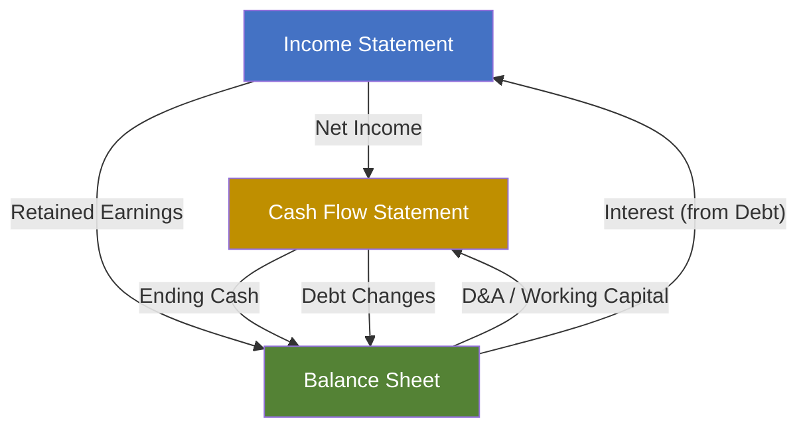

# Basic Three-Statement Financial Model

| Field              | Value              |
| ------------------ | ------------------ |
| **Template ID**    | `FIN-MOD-001`      |
| **Category**       | Financial Modeling |
| **Complexity**     | Basic              |
| **Version**        | 1.0                |
| **Last Updated**   | YYYY-MM-DD         |
| **Author**         | [Analyst Name]     |
| **Reviewed By**    | [Reviewer Name]    |
| **Classification** | Confidential       |

---

## Document Control

| Version | Date       | Author | Changes       |
| ------- | ---------- | ------ | ------------- |
| 1.0     | YYYY-MM-DD | [Name] | Initial draft |
|         |            |        |               |

---

## Executive Summary

[Brief description of the company, model purpose, and key findings. 2-3 sentences maximum.]

---

## Assumptions

### Revenue Assumptions

| Assumption                | Year 1 | Year 2 | Year 3 | Year 4 | Year 5 |
| ------------------------- | ------ | ------ | ------ | ------ | ------ |
| Revenue Growth Rate (%)   |        |        |        |        |        |
| Units Sold                |        |        |        |        |        |
| Average Selling Price ($) |        |        |        |        |        |
| Price Growth (%)          |        |        |        |        |        |

Revenue is calculated as:

$$\text{Revenue}_t = \text{Units}_t \times \text{ASP}_t$$

where:

$$\text{Units}_t = \text{Units}_{t-1} \times (1 + g_{\text{units}})$$

$$\text{ASP}_t = \text{ASP}_{t-1} \times (1 + g_{\text{price}})$$

### Cost Assumptions

| Assumption          | Year 1 | Year 2 | Year 3 | Year 4 | Year 5 |
| ------------------- | ------ | ------ | ------ | ------ | ------ |
| COGS (% of Revenue) |        |        |        |        |        |
| SG&A (% of Revenue) |        |        |        |        |        |
| R&D (% of Revenue)  |        |        |        |        |        |
| D&A (% of Revenue)  |        |        |        |        |        |

### Working Capital Assumptions

| Assumption                 | Year 1 | Year 2 | Year 3 | Year 4 | Year 5 |
| -------------------------- | ------ | ------ | ------ | ------ | ------ |
| Days Sales Outstanding     |        |        |        |        |        |
| Days Inventory Outstanding |        |        |        |        |        |
| Days Payable Outstanding   |        |        |        |        |        |

Net Working Capital:

$$\text{NWC} = \text{Current Assets} - \text{Current Liabilities}$$

$$\Delta\text{NWC}_t = \text{NWC}_t - \text{NWC}_{t-1}$$

### Capital Expenditure Assumptions

| Assumption           | Year 1 | Year 2 | Year 3 | Year 4 | Year 5 |
| -------------------- | ------ | ------ | ------ | ------ | ------ |
| CapEx (% of Revenue) |        |        |        |        |        |
| Maintenance CapEx    |        |        |        |        |        |
| Growth CapEx         |        |        |        |        |        |

---

## Income Statement

| Line Item ($M)                    | Year 1 | Year 2 | Year 3 | Year 4 | Year 5 |
| --------------------------------- | ------ | ------ | ------ | ------ | ------ |
| **Revenue**                       |        |        |        |        |        |
| Cost of Goods Sold                |        |        |        |        |        |
| **Gross Profit**                  |        |        |        |        |        |
| _Gross Margin (%)_                |        |        |        |        |        |
|                                   |        |        |        |        |        |
| Selling, General & Administrative |        |        |        |        |        |
| Research & Development            |        |        |        |        |        |
| Depreciation & Amortization       |        |        |        |        |        |
| **Total Operating Expenses**      |        |        |        |        |        |
|                                   |        |        |        |        |        |
| **Operating Income (EBIT)**       |        |        |        |        |        |
| _Operating Margin (%)_            |        |        |        |        |        |
|                                   |        |        |        |        |        |
| Interest Expense                  |        |        |        |        |        |
| Interest Income                   |        |        |        |        |        |
| Other Income / (Expense)          |        |        |        |        |        |
| **Pre-Tax Income (EBT)**          |        |        |        |        |        |
|                                   |        |        |        |        |        |
| Income Tax Expense                |        |        |        |        |        |
| _Effective Tax Rate (%)_          |        |        |        |        |        |
| **Net Income**                    |        |        |        |        |        |
| _Net Margin (%)_                  |        |        |        |        |        |
|                                   |        |        |        |        |        |
| **Earnings Per Share (Basic)**    |        |        |        |        |        |
| **Earnings Per Share (Diluted)**  |        |        |        |        |        |
| Shares Outstanding (Basic)        |        |        |        |        |        |
| Shares Outstanding (Diluted)      |        |        |        |        |        |

Key relationships:

$$\text{EBIT} = \text{Revenue} - \text{COGS} - \text{OpEx}$$

$$\text{Net Income} = \text{EBT} \times (1 - t)$$

$$\text{EPS} = \frac{\text{Net Income}}{\text{Shares Outstanding}}$$

---

## Balance Sheet

| Line Item ($M)                    | Year 1 | Year 2 | Year 3 | Year 4 | Year 5 |
| --------------------------------- | ------ | ------ | ------ | ------ | ------ |
| **ASSETS**                        |        |        |        |        |        |
| Cash & Cash Equivalents           |        |        |        |        |        |
| Accounts Receivable               |        |        |        |        |        |
| Inventory                         |        |        |        |        |        |
| Prepaid Expenses                  |        |        |        |        |        |
| **Total Current Assets**          |        |        |        |        |        |
|                                   |        |        |        |        |        |
| Property, Plant & Equipment (net) |        |        |        |        |        |
| Intangible Assets                 |        |        |        |        |        |
| Goodwill                          |        |        |        |        |        |
| Other Long-Term Assets            |        |        |        |        |        |
| **Total Assets**                  |        |        |        |        |        |
|                                   |        |        |        |        |        |
| **LIABILITIES**                   |        |        |        |        |        |
| Accounts Payable                  |        |        |        |        |        |
| Accrued Liabilities               |        |        |        |        |        |
| Current Portion of Debt           |        |        |        |        |        |
| **Total Current Liabilities**     |        |        |        |        |        |
|                                   |        |        |        |        |        |
| Long-Term Debt                    |        |        |        |        |        |
| Deferred Tax Liabilities          |        |        |        |        |        |
| Other Long-Term Liabilities       |        |        |        |        |        |
| **Total Liabilities**             |        |        |        |        |        |
|                                   |        |        |        |        |        |
| **EQUITY**                        |        |        |        |        |        |
| Common Stock                      |        |        |        |        |        |
| Retained Earnings                 |        |        |        |        |        |
| Additional Paid-In Capital        |        |        |        |        |        |
| Treasury Stock                    |        |        |        |        |        |
| **Total Equity**                  |        |        |        |        |        |
|                                   |        |        |        |        |        |
| **Total Liabilities & Equity**    |        |        |        |        |        |

Balance sheet identity:

$$\text{Assets} = \text{Liabilities} + \text{Equity}$$

$$\text{Retained Earnings}_t = \text{Retained Earnings}_{t-1} + \text{Net Income}_t - \text{Dividends}_t$$

### Balance Sheet Check

$$\text{Check} = \text{Total Assets} - (\text{Total Liabilities} + \text{Total Equity}) = 0$$

---

## Cash Flow Statement

| Line Item ($M)                     | Year 1 | Year 2 | Year 3 | Year 4 | Year 5 |
| ---------------------------------- | ------ | ------ | ------ | ------ | ------ |
| **Operating Activities**           |        |        |        |        |        |
| Net Income                         |        |        |        |        |        |
| Depreciation & Amortization        |        |        |        |        |        |
| Stock-Based Compensation           |        |        |        |        |        |
| Changes in Working Capital         |        |        |        |        |        |
| - (Increase)/Decrease in A/R       |        |        |        |        |        |
| - (Increase)/Decrease in Inventory |        |        |        |        |        |
| - Increase/(Decrease) in A/P       |        |        |        |        |        |
| **Cash from Operations**           |        |        |        |        |        |
|                                    |        |        |        |        |        |
| **Investing Activities**           |        |        |        |        |        |
| Capital Expenditures               |        |        |        |        |        |
| Acquisitions                       |        |        |        |        |        |
| Asset Sales                        |        |        |        |        |        |
| **Cash from Investing**            |        |        |        |        |        |
|                                    |        |        |        |        |        |
| **Financing Activities**           |        |        |        |        |        |
| Debt Issuance / (Repayment)        |        |        |        |        |        |
| Equity Issuance / (Buybacks)       |        |        |        |        |        |
| Dividends Paid                     |        |        |        |        |        |
| **Cash from Financing**            |        |        |        |        |        |
|                                    |        |        |        |        |        |
| **Net Change in Cash**             |        |        |        |        |        |
| Beginning Cash                     |        |        |        |        |        |
| **Ending Cash**                    |        |        |        |        |        |

Free Cash Flow:

$$\text{FCF} = \text{Cash from Operations} - \text{CapEx}$$

$$\text{FCFE} = \text{FCF} + \text{Net Borrowing}$$

---

## Three-Statement Linkage

---

## Sensitivity Analysis

### Revenue Growth Sensitivity

|                 | **-2%** | **-1%** | **Base** | **+1%** | **+2%** |
| --------------- | ------- | ------- | -------- | ------- | ------- |
| Net Income ($M) |         |         |          |         |         |
| EPS ($)         |         |         |          |         |         |
| FCF ($M)        |         |         |          |         |         |

---

## Notes & Disclaimers

- All figures in USD millions unless otherwise stated
- Fiscal year ending December 31
- Tax rate assumed at [X]%
- Model does not account for extraordinary items
- [Additional assumptions and limitations]

---

_This template follows investment banking standard formatting conventions. All projections are illustrative and should be adjusted based on company-specific data and market conditions._
