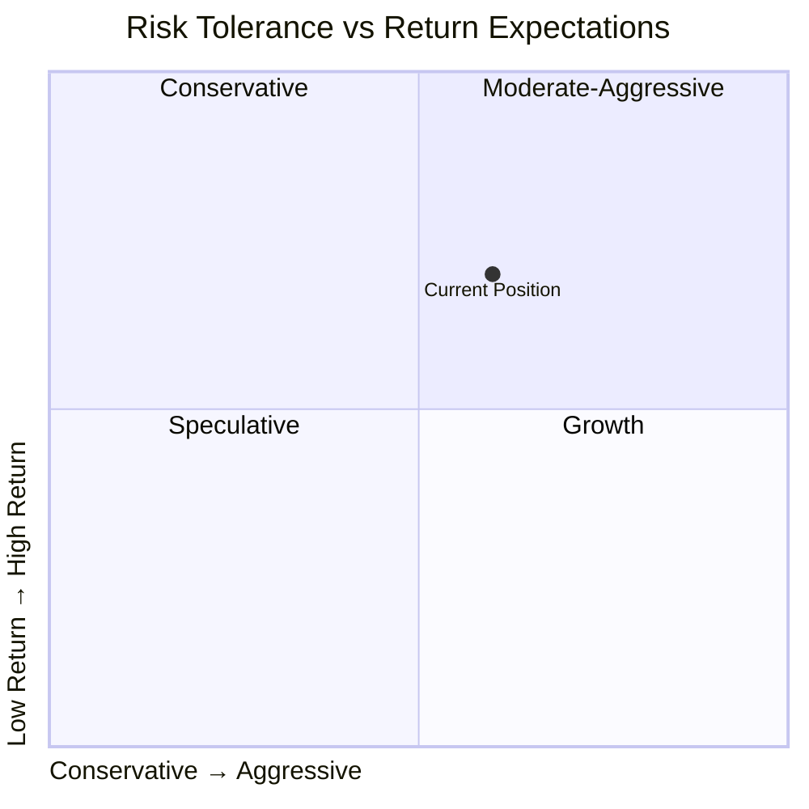
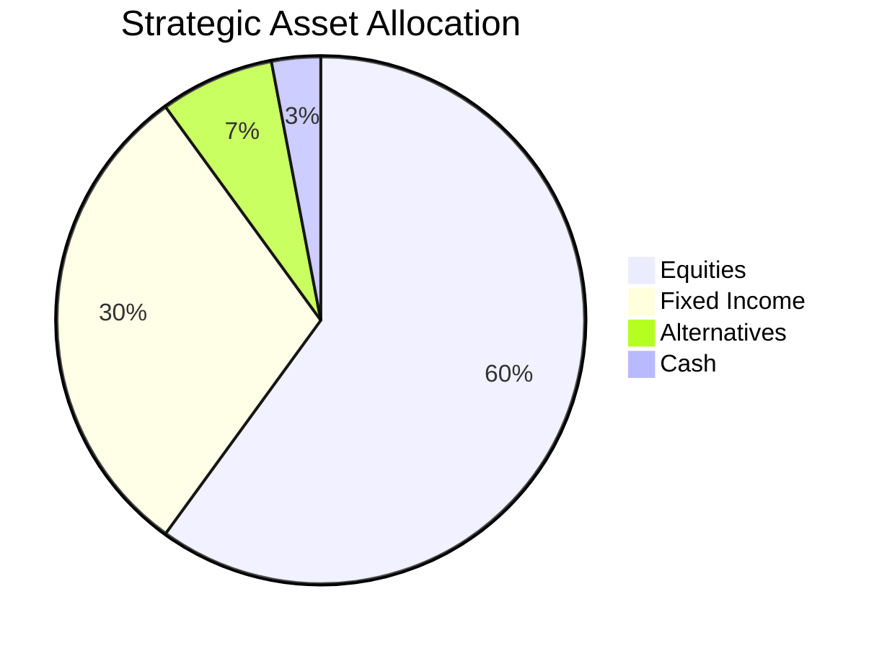

# Investment Policy Statement (IPS)

<!-- Governance document defining investment objectives and constraints -->

---

## Document Control

| Field                | Value                |
| -------------------- | -------------------- |
| **Client**           | [Client Name]        |
| **IPS Version**      | [X.X]                |
| **Effective Date**   | [DD-MMM-YYYY]        |
| **Prepared By**      | [Investment Advisor] |
| **Review Frequency** | [Annual/Semi-annual] |

---

## Investment Objectives

### Primary Objective

$$\text{Total Return} = \text{Capital Appreciation} + \text{Income} \geq \text{Inflation} + [X]\%$$

### Return Expectations

| Time Horizon           | Target Return | Benchmark |
| ---------------------- | ------------- | --------- |
| 1 Year                 | [X]%          | [Index]   |
| 3 Years (annualized)   | [X]%          | [Index]   |
| 5 Years (annualized)   | [X]%          | [Index]   |
| 10+ Years (annualized) | [X]%          | [Index]   |

### Risk Tolerance

---

## Investment Constraints

### Time Horizon

| Phase          | Duration  | Liquidity Needs |
| -------------- | --------- | --------------- |
| Accumulation   | [X] years | Low             |
| Pre-retirement | [X] years | Medium          |
| Retirement     | [X] years | High            |

### Liquidity Requirements

$$\text{Liquid Reserves} \geq \text{[X]} \times \text{Monthly Expenses}$$

Emergency fund: $[X] ([X] months expenses)

### Tax Considerations

- Taxable vs. Tax-advantaged accounts
- Tax-loss harvesting strategy
- Asset location optimization

---

## Asset Allocation

### Strategic Asset Allocation

| Asset Class            | Target | Min  | Max  | Expected Return | Volatility |
| ---------------------- | ------ | ---- | ---- | --------------- | ---------- |
| Domestic Equities      | [X]%   | [X]% | [X]% | [X]%            | [X]%       |
| International Equities | [X]%   | [X]% | [X]% | [X]%            | [X]%       |
| Fixed Income           | [X]%   | [X]% | [X]% | [X]%            | [X]%       |
| Real Estate            | [X]%   | [X]% | [X]% | [X]%            | [X]%       |
| Commodities            | [X]%   | [X]% | [X]% | [X]%            | [X]%       |
| Cash                   | [X]%   | [X]% | [X]% | [X]%            | [X]%       |

### Rebalancing Policy

$$\text{Rebalance Trigger} = \text{Asset Class} \geq \text{Target} \pm [X]\%$$

- Frequency: [Quarterly/Annually]
- Method: [Sell high/Buy low]
- Transaction costs: Minimize

---

## Investment Guidelines

### Security Selection Criteria

| Criterion             | Requirement           |
| --------------------- | --------------------- |
| Minimum Market Cap    | $[X]B                 |
| Credit Rating (Bonds) | [BBB-/Baa3] or higher |
| Dividend History      | [X]+ years            |
| ESG Screening         | [ ] Yes [ ] No        |

### Restrictions

- [ ] No individual securities > [X]% of portfolio
- [ ] No sector concentration > [X]%
- [ ] No illiquid investments
- [ ] No [specific exclusions]

---

## Performance Monitoring

### Reporting Schedule

| Report                  | Frequency | Content               |
| ----------------------- | --------- | --------------------- |
| Performance Summary     | Monthly   | Returns vs. benchmark |
| Asset Allocation Review | Quarterly | Drift analysis        |
| Comprehensive Review    | Annual    | Full IPS review       |

### Benchmark Construction

$$\text{Custom Benchmark} = \sum_{i=1}^{n} w_i \times \text{Index}_i$$

Where $w_i$ = strategic allocation weight

### Performance Metrics

| Metric               | Target             | Monitoring |
| -------------------- | ------------------ | ---------- |
| Return vs. Benchmark | Outperform by [X]% | Monthly    |
| Sharpe Ratio         | > [X.X]            | Quarterly  |
| Maximum Drawdown     | < [X]%             | Quarterly  |
| Tracking Error       | < [X]%             | Annually   |

---

## Risk Management

### Risk Metrics

$$\text{Portfolio VaR}_{95\%} = \mu - 1.65 \times \sigma$$

| Risk Measure        | Limit  | Current |
| ------------------- | ------ | ------- |
| Volatility (annual) | < [X]% | [X]%    |
| VaR (95%, monthly)  | < $[X] | $[X]    |
| Beta to S&P 500     | [X.XX] | [X.XX]  |

### Stress Testing

| Scenario                 | Expected Impact | Mitigation |
| ------------------------ | --------------- | ---------- |
| Market correction (-20%) | -[X]%           | [Strategy] |
| Interest rate spike      | -[X]%           | [Strategy] |
| Inflation surge          | -[X]%           | [Strategy] |

---

## Responsibilities

### Investment Committee

| Role               | Name   | Responsibility |
| ------------------ | ------ | -------------- |
| Chair              | [Name] | Oversight      |
| Investment Advisor | [Name] | Implementation |
| Client             | [Name] | Approval       |

### Decision Authority

| Decision            | Authority            | Approval Required |
| ------------------- | -------------------- | ----------------- |
| IPS Changes         | Investment Committee | Unanimous         |
| Rebalancing         | Advisor              | None              |
| Security Selection  | Advisor              | None              |
| Tactical Allocation | Advisor              | [X]% limit        |

---

## Appendices

### Appendix A: Approved Investments

### Appendix B: Excluded Investments

### Appendix C: Benchmark Descriptions

### Appendix D: Risk Assessment Details

---

**Client Acknowledgment:**

I have read and understood this Investment Policy Statement:

Client: ********\_******** Date: ****\_****

Advisor: ********\_******** Date: ****\_****
