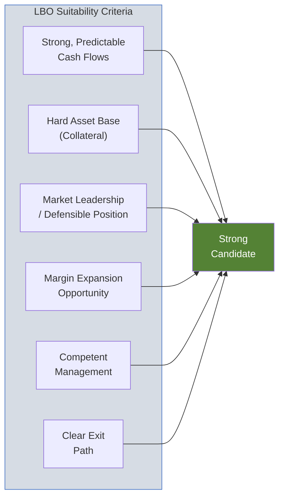

# Leveraged Buyout (LBO) Model

| Field              | Value                 |
| ------------------ | --------------------- |
| **Template ID**    | `FIN-TXN-001`         |
| **Category**       | Transaction Analysis  |
| **Complexity**     | Advanced              |
| **Version**        | 1.0                   |
| **Last Updated**   | YYYY-MM-DD            |
| **Author**         | [Analyst Name]        |
| **Reviewed By**    | [Senior Banker / MD]  |
| **Classification** | Strictly Confidential |

---

## Document Control

| Version | Date       | Author | Changes       |
| ------- | ---------- | ------ | ------------- |
| 1.0     | YYYY-MM-DD | [Name] | Initial draft |
|         |            |        |               |

---

## Executive Summary

[Target Company] is evaluated as an LBO candidate for [Sponsor Name]. The analysis assumes an entry valuation of [X.Xx] EV/EBITDA, a [X]-year hold period, and an exit at [X.Xx] EV/EBITDA. Based on the base case, the transaction generates a [X.X]% IRR and [X.Xx] MOIC to the sponsor.

---

## LBO Candidacy Assessment

| Criterion               | Assessment   | Rating                     |
| ----------------------- | ------------ | -------------------------- |
| Cash Flow Stability     | [Commentary] | [Strong / Moderate / Weak] |
| Asset Base              | [Commentary] | [Strong / Moderate / Weak] |
| Market Position         | [Commentary] | [Strong / Moderate / Weak] |
| Operational Improvement | [Commentary] | [Strong / Moderate / Weak] |
| Management Quality      | [Commentary] | [Strong / Moderate / Weak] |
| Exit Optionality        | [Commentary] | [Strong / Moderate / Weak] |

---

## Transaction Assumptions

### Purchase Price

| Metric                         | Value |
| ------------------------------ | ----- |
| LTM EBITDA ($M)                |       |
| Entry EV / EBITDA Multiple     | x     |
| **Enterprise Value ($M)**      |       |
| (-) Existing Debt Refinanced   |       |
| (+) Cash Acquired              |       |
| **Equity Purchase Price ($M)** |       |

### Transaction Fees

| Fee Type                     | Amount ($M) | % of EV |
| ---------------------------- | ----------- | ------- |
| Advisory Fee (M&A)           |             |         |
| Financing Fees (Arrangement) |             |         |
| Legal & Accounting           |             |         |
| Other Transaction Costs      |             |         |
| **Total Transaction Fees**   |             |         |

### Financing Fees (OID / Upfront)

| Tranche                  | Fee (%) | Amount ($M) | Amortization Period |
| ------------------------ | ------- | ----------- | ------------------- |
| Revolver                 |         |             |                     |
| Term Loan A              |         |             |                     |
| Term Loan B              |         |             |                     |
| Senior Notes             |         |             |                     |
| Sub / Mezz               |         |             |                     |
| **Total Financing Fees** |         |             |                     |

---

## Sources & Uses

| Sources ($M)              | Amount | % of Total |     | Uses ($M)               | Amount | % of Total |
| ------------------------- | ------ | ---------- | --- | ----------------------- | ------ | ---------- |
| Revolving Credit Facility |        |            |     | Enterprise Value        |        |            |
| Term Loan A               |        |            |     | Refinance Existing Debt |        |            |
| Term Loan B               |        |            |     | Transaction Fees        |        |            |
| Senior Unsecured Notes    |        |            |     | Financing Fees          |        |            |
| Subordinated / Mezzanine  |        |            |     | Cash to Balance Sheet   |        |            |
| Sponsor Equity            |        |            |     |                         |        |            |
| Management Rollover       |        |            |     |                         |        |            |
| **Total Sources**         |        | **100%**   |     | **Total Uses**          |        | **100%**   |

**Sources = Uses Check:**

$$\sum \text{Sources} - \sum \text{Uses} = 0 \quad \checkmark$$

### Capital Structure at Close

| Tranche                   | Amount ($M) | Multiple (x EBITDA) | Rate (%) | Maturity |
| ------------------------- | ----------- | ------------------- | -------- | -------- |
| Revolving Credit Facility |             | x                   | L + bps  |          |
| Term Loan A               |             | x                   | L + bps  |          |
| Term Loan B               |             | x                   | L + bps  |          |
| Senior Unsecured Notes    |             | x                   | %        |          |
| Subordinated Notes        |             | x                   | %        |          |
| **Total Debt**            |             | **x**               |          |          |
| **Senior Leverage**       |             | **x**               |          |          |
| Sponsor Equity            |             |                     |          |          |
| Management Rollover       |             |                     |          |          |
| **Total Capitalization**  |             |                     |          |          |

---

## Operating Model Projections

| ($M)               | LTM | Year 1 | Year 2 | Year 3 | Year 4 | Year 5 |
| ------------------ | --- | ------ | ------ | ------ | ------ | ------ |
| **Revenue**        |     |        |        |        |        |        |
| Growth (%)         |     |        |        |        |        |        |
| **EBITDA**         |     |        |        |        |        |        |
| Margin (%)         |     |        |        |        |        |        |
| (-) D&A            |     |        |        |        |        |        |
| **EBIT**           |     |        |        |        |        |        |
| (-) Cash Interest  |     |        |        |        |        |        |
| (-) Cash Taxes     |     |        |        |        |        |        |
| **Net Income**     |     |        |        |        |        |        |
|                    |     |        |        |        |        |        |
| (+) D&A            |     |        |        |        |        |        |
| (-) CapEx          |     |        |        |        |        |        |
| (-) $\Delta$NWC    |     |        |        |        |        |        |
| **Free Cash Flow** |     |        |        |        |        |        |
| FCF / Revenue (%)  |     |        |        |        |        |        |

### Cash Flow Available for Debt Service

$$\text{CFADS} = \text{EBITDA} - \text{Cash Taxes} - \text{CapEx} - \Delta\text{NWC} - \text{Mandatory Amortization}$$

---

## Debt Schedule

### Mandatory Amortization

| ($M)                       | Year 1 | Year 2 | Year 3 | Year 4 | Year 5 |
| -------------------------- | ------ | ------ | ------ | ------ | ------ |
| Term Loan A (scheduled)    |        |        |        |        |        |
| Term Loan B (1% p.a.)      |        |        |        |        |        |
| **Total Mandatory Amort.** |        |        |        |        |        |

### Cash Sweep Mechanism

$$\text{Excess Cash Flow} = \text{FCF} - \text{Mandatory Amortization} - \text{Min Cash Balance}$$

$$\text{Cash Sweep} = \text{Excess Cash Flow} \times \text{Sweep Percentage}$$

| Leverage Level | Sweep % |
| -------------- | ------- |
| > 4.0x         | 75%     |
| 3.0x - 4.0x    | 50%     |
| < 3.0x         | 25%     |

### Detailed Debt Schedule

| ($M)                      | Close | Year 1 | Year 2 | Year 3 | Year 4 | Year 5 |
| ------------------------- | ----- | ------ | ------ | ------ | ------ | ------ |
| **Revolver**              |       |        |        |        |        |        |
| Beginning Balance         |       |        |        |        |        |        |
| Draws / (Paydowns)        |       |        |        |        |        |        |
| Ending Balance            |       |        |        |        |        |        |
| Interest Expense          |       |        |        |        |        |        |
|                           |       |        |        |        |        |        |
| **Term Loan A**           |       |        |        |        |        |        |
| Beginning Balance         |       |        |        |        |        |        |
| Mandatory Amortization    |       |        |        |        |        |        |
| Cash Sweep                |       |        |        |        |        |        |
| Ending Balance            |       |        |        |        |        |        |
| Interest Expense          |       |        |        |        |        |        |
|                           |       |        |        |        |        |        |
| **Term Loan B**           |       |        |        |        |        |        |
| Beginning Balance         |       |        |        |        |        |        |
| Mandatory Amortization    |       |        |        |        |        |        |
| Cash Sweep                |       |        |        |        |        |        |
| Ending Balance            |       |        |        |        |        |        |
| Interest Expense          |       |        |        |        |        |        |
|                           |       |        |        |        |        |        |
| **Senior Notes**          |       |        |        |        |        |        |
| Beginning Balance         |       |        |        |        |        |        |
| Repayment                 |       |        |        |        |        |        |
| Ending Balance            |       |        |        |        |        |        |
| Interest Expense          |       |        |        |        |        |        |
|                           |       |        |        |        |        |        |
| **Sub / Mezz**            |       |        |        |        |        |        |
| Beginning Balance         |       |        |        |        |        |        |
| PIK Interest              |       |        |        |        |        |        |
| Repayment                 |       |        |        |        |        |        |
| Ending Balance            |       |        |        |        |        |        |
| Cash Interest Expense     |       |        |        |        |        |        |
| PIK Interest Expense      |       |        |        |        |        |        |
|                           |       |        |        |        |        |        |
| **Total Debt**            |       |        |        |        |        |        |
| **Total Cash Interest**   |       |        |        |        |        |        |
| **Total Leverage (x)**    |       |        |        |        |        |        |
| **Senior Leverage (x)**   |       |        |        |        |        |        |
| **Interest Coverage (x)** |       |        |        |        |        |        |

---

## Credit Statistics

| Metric                      | Close | Year 1 | Year 2 | Year 3 | Year 4 | Year 5 |
| --------------------------- | ----- | ------ | ------ | ------ | ------ | ------ |
| Total Debt / EBITDA         | x     |        |        |        |        |        |
| Senior Debt / EBITDA        | x     |        |        |        |        |        |
| Net Debt / EBITDA           | x     |        |        |        |        |        |
| EBITDA / Interest           | x     |        |        |        |        |        |
| (EBITDA - CapEx) / Interest | x     |        |        |        |        |        |
| CFADS / Total Debt Service  | x     |        |        |        |        |        |
| FCF / Total Debt (%)        |       |        |        |        |        |        |

---

## Returns Analysis

### Exit Assumptions

| Assumption                 | Base Case |
| -------------------------- | --------- |
| Hold Period (years)        |           |
| Exit EV / EBITDA Multiple  | x         |
| Exit Year EBITDA ($M)      |           |
| Exit Enterprise Value ($M) |           |
| (-) Net Debt at Exit ($M)  |           |
| Exit Equity Value ($M)     |           |

### IRR Calculation

$$\text{IRR}: \quad 0 = -E_0 + \frac{E_n}{(1 + \text{IRR})^n}$$

For interim cash flows:

$$0 = -E_0 + \sum_{t=1}^{n-1}\frac{D_t}{(1+\text{IRR})^t} + \frac{E_n}{(1+\text{IRR})^n}$$

where $E_0$ is initial equity, $D_t$ is interim dividends/recaps, and $E_n$ is exit equity.

### MOIC Calculation

$$\text{MOIC} = \frac{\text{Total Cash Received}}{\text{Total Cash Invested}} = \frac{E_n + \sum D_t}{E_0}$$

### Returns by Exit Year

|                   | Year 3 | Year 4 | Year 5 | Year 6 | Year 7 |
| ----------------- | ------ | ------ | ------ | ------ | ------ |
| Exit EBITDA ($M)  |        |        |        |        |        |
| Exit EV ($M)      |        |        |        |        |        |
| (-) Net Debt ($M) |        |        |        |        |        |
| Exit Equity ($M)  |        |        |        |        |        |
| **MOIC (x)**      |        |        |        |        |        |
| **IRR (%)**       |        |        |        |        |        |

### Value Creation Analysis

| Value Driver ($M)                  | Amount | % of Total |
| ---------------------------------- | ------ | ---------- |
| EBITDA Growth                      |        |            |
| Multiple Expansion / (Contraction) |        |            |
| Debt Paydown                       |        |            |
| Dividends / Recapitalizations      |        |            |
| **Total Value Created**            |        | **100%**   |

$$\Delta\text{Equity}_{\text{EBITDA Growth}} = (\text{Exit EBITDA} - \text{Entry EBITDA}) \times \text{Entry Multiple}$$

$$\Delta\text{Equity}_{\text{Multiple}} = (\text{Exit Multiple} - \text{Entry Multiple}) \times \text{Entry EBITDA}$$

$$\Delta\text{Equity}_{\text{Deleveraging}} = \text{Debt}_{\text{Entry}} - \text{Debt}_{\text{Exit}}$$

---

## Sensitivity Analysis

### IRR Sensitivity: Entry Multiple vs. Exit Multiple (5-Year Hold)

| IRR (%)         | **Exit 7.0x** | **Exit 8.0x** | **Exit 9.0x** | **Exit 10.0x** | **Exit 11.0x** |
| --------------- | ------------- | ------------- | ------------- | -------------- | -------------- |
| **Entry 7.0x**  |               |               |               |                |                |
| **Entry 8.0x**  |               |               |               |                |                |
| **Entry 9.0x**  |               |               |               |                |                |
| **Entry 10.0x** |               |               |               |                |                |

### IRR Sensitivity: Revenue Growth vs. EBITDA Margin

| IRR (%)       | **Margin 18%** | **Margin 20%** | **Margin 22%** | **Margin 24%** | **Margin 26%** |
| ------------- | -------------- | -------------- | -------------- | -------------- | -------------- |
| **Growth 3%** |                |                |                |                |                |
| **Growth 5%** |                |                |                |                |                |
| **Growth 7%** |                |                |                |                |                |
| **Growth 9%** |                |                |                |                |                |

### MOIC Sensitivity: Leverage vs. Exit Multiple

| MOIC (x)          | **Exit 7.0x** | **Exit 8.0x** | **Exit 9.0x** | **Exit 10.0x** | **Exit 11.0x** |
| ----------------- | ------------- | ------------- | ------------- | -------------- | -------------- |
| **4.0x Leverage** |               |               |               |                |                |
| **4.5x Leverage** |               |               |               |                |                |
| **5.0x Leverage** |               |               |               |                |                |
| **5.5x Leverage** |               |               |               |                |                |
| **6.0x Leverage** |               |               |               |                |                |

---

## Downside / Covenant Analysis

### Financial Covenants

| Covenant                  | Threshold | Year 1 | Year 2 | Year 3 | Year 4 | Year 5 | Headroom |
| ------------------------- | --------- | ------ | ------ | ------ | ------ | ------ | -------- |
| Max Total Leverage        | x         |        |        |        |        |        |          |
| Max Senior Leverage       | x         |        |        |        |        |        |          |
| Min Interest Coverage     | x         |        |        |        |        |        |          |
| Min Fixed Charge Coverage | x         |        |        |        |        |        |          |
| Max CapEx ($M)            |           |        |        |        |        |        |          |

### Downside Scenario

| ($M)                      | Year 1 | Year 2 | Year 3 | Year 4 | Year 5 |
| ------------------------- | ------ | ------ | ------ | ------ | ------ |
| Revenue (Base)            |        |        |        |        |        |
| Revenue (Downside, -X%)   |        |        |        |        |        |
| EBITDA (Downside)         |        |        |        |        |        |
| FCF (Downside)            |        |        |        |        |        |
| Total Leverage (Downside) |        |        |        |        |        |
| **Covenant Breach?**      |        |        |        |        |        |

---

## Notes & Disclaimers

- All figures in USD millions unless otherwise stated
- Interest rates assumed as [fixed/floating]; SOFR base rate of [X]%
- Tax rate assumed at [X]% (federal + state)
- PIK interest compounds annually and is paid at maturity/refinancing
- No dividend recapitalizations assumed in base case
- Management equity participation: [X]% of fully diluted equity
- Analysis is for discussion purposes only

---

_This template follows standard private equity LBO modeling conventions. All tranches, covenants, and cash sweep mechanics should be adjusted to reflect actual term sheet provisions._
