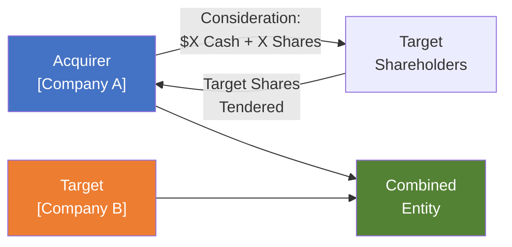

# Merger Model: Accretion / Dilution Analysis

| Field              | Value                 |
| ------------------ | --------------------- |
| **Template ID**    | `FIN-TXN-002`         |
| **Category**       | Transaction Analysis  |
| **Complexity**     | Advanced              |
| **Version**        | 1.0                   |
| **Last Updated**   | YYYY-MM-DD            |
| **Author**         | [Analyst Name]        |
| **Reviewed By**    | [Senior Banker / MD]  |
| **Classification** | Strictly Confidential |

---

## Document Control

| Version | Date       | Author | Changes       |
| ------- | ---------- | ------ | ------------- |
| 1.0     | YYYY-MM-DD | [Name] | Initial draft |
|         |            |        |               |

---

## Executive Summary

This analysis evaluates the proposed acquisition of [Target Company] by [Acquirer Company] at an offer price of $[X] per share, representing a [X]% premium to the unaffected stock price. The transaction is expected to be [accretive/dilutive] to Acquirer EPS by [X]% in Year 1 and [accretive] by Year [X] including run-rate synergies.

---

## Transaction Structure

### Transaction Summary

| Parameter                         | Value                                    |
| --------------------------------- | ---------------------------------------- |
| **Acquirer**                      | [Company A]                              |
| **Target**                        | [Company B]                              |
| **Transaction Type**              | [Merger / Tender Offer / Asset Purchase] |
| **Consideration**                 | [All Cash / All Stock / Mixed]           |
| Offer Price per Share ($)         |                                          |
| Target Unaffected Price ($)       |                                          |
| **Premium to Unaffected (%)**     |                                          |
| Premium to 30-Day VWAP (%)        |                                          |
| Premium to 52-Week High (%)       |                                          |
| Target Diluted Shares (M)         |                                          |
| **Equity Value ($M)**             |                                          |
| (+) Target Net Debt ($M)          |                                          |
| (+) Target Minority Interest ($M) |                                          |
| **Enterprise Value ($M)**         |                                          |
| **Implied EV / EBITDA (x)**       |                                          |
| **Implied EV / Revenue (x)**      |                                          |
| **Implied P / E (x)**             |                                          |

---

## Consideration Mix Analysis

### All-Cash Scenario

| Component ($M)          | Amount |
| ----------------------- | ------ |
| Cash Consideration      |        |
| Transaction Fees        |        |
| Financing Fees          |        |
| **Total Cash Required** |        |
|                         |        |
| Cash on Hand (Acquirer) |        |
| New Debt Issuance       |        |
| **Total Funding**       |        |

### All-Stock Scenario

Exchange ratio:

$$\text{Exchange Ratio} = \frac{\text{Offer Price per Target Share}}{\text{Acquirer Share Price}}$$

| Component                      | Value |
| ------------------------------ | ----- |
| Exchange Ratio                 | x     |
| Target Diluted Shares (M)      |       |
| New Acquirer Shares Issued (M) |       |
| Pro Forma Acquirer Shares (M)  |       |
| Acquirer Ownership (%)         |       |
| Target Ownership (%)           |       |

### Mixed Consideration

| Component               | Amount | % of Total |
| ----------------------- | ------ | ---------- |
| Cash                    | $M     | %          |
| Stock                   | $M     | %          |
| **Total Consideration** | $M     | 100%       |

---

## Purchase Price Allocation (PPA)

| ($M)                          | Book Value | Fair Value Adj. | Fair Value |
| ----------------------------- | ---------- | --------------- | ---------- |
| **Target Assets**             |            |                 |            |
| Cash & Equivalents            |            |                 |            |
| Accounts Receivable           |            |                 |            |
| Inventory                     |            |                 |            |
| PP&E                          |            |                 |            |
| Identified Intangibles        |            |                 |            |
| - Customer Relationships      |            |                 |            |
| - Technology / IP             |            |                 |            |
| - Trade Names                 |            |                 |            |
| Other Assets                  |            |                 |            |
| **Total Assets**              |            |                 |            |
|                               |            |                 |            |
| **Target Liabilities**        |            |                 |            |
| Accounts Payable              |            |                 |            |
| Deferred Revenue              |            |                 |            |
| Debt (at FV)                  |            |                 |            |
| Deferred Tax Liabilities      |            |                 |            |
| Other Liabilities             |            |                 |            |
| **Total Liabilities**         |            |                 |            |
|                               |            |                 |            |
| **Net Assets Acquired**       |            |                 |            |
| Purchase Price (Equity Value) |            |                 |            |
| **Goodwill**                  |            |                 |            |

$$\text{Goodwill} = \text{Purchase Price} - \text{Fair Value of Net Assets Acquired}$$

### Intangible Amortization Schedule

| Intangible ($M)        | Fair Value | Useful Life | Annual Amort. |
| ---------------------- | ---------- | ----------- | ------------- |
| Customer Relationships |            | years       |               |
| Technology / IP        |            | years       |               |
| Trade Names            |            | years       |               |
| Non-Compete Agreements |            | years       |               |
| **Total**              |            |             |               |

---

## Synergy Analysis

### Revenue Synergies

| Synergy Source ($M)               | Year 1 | Year 2 | Year 3 (Run-Rate) |
| --------------------------------- | ------ | ------ | ----------------- |
| Cross-Selling                     |        |        |                   |
| Geographic Expansion              |        |        |                   |
| New Product Bundling              |        |        |                   |
| Pricing Power                     |        |        |                   |
| **Total Revenue Synergies**       |        |        |                   |
| Margin on Incremental Revenue (%) |        |        |                   |
| **Revenue Synergy EBITDA Impact** |        |        |                   |

### Cost Synergies

| Synergy Source ($M)        | Year 1 | Year 2 | Year 3 (Run-Rate) |
| -------------------------- | ------ | ------ | ----------------- |
| Headcount Reduction (SG&A) |        |        |                   |
| Facility Consolidation     |        |        |                   |
| Procurement / Supply Chain |        |        |                   |
| Technology / Systems       |        |        |                   |
| Overlapping Functions      |        |        |                   |
| **Total Cost Synergies**   |        |        |                   |

### Integration Costs (One-Time)

| Cost Item ($M)                | Year 1 | Year 2 | Total |
| ----------------------------- | ------ | ------ | ----- |
| Severance & Retention         |        |        |       |
| Facility Closure / Relocation |        |        |       |
| IT Systems Integration        |        |        |       |
| Rebranding                    |        |        |       |
| Advisory / Consulting         |        |        |       |
| **Total Integration Costs**   |        |        |       |

### Net Synergy Contribution

$$\text{Net Synergies (after-tax)} = (\text{Cost Synergies} + \text{Revenue Synergy EBITDA}) \times (1 - t) - \text{Amortization of Integration Costs}$$

---

## Pro Forma Income Statement

| ($M)                   | Acquirer | Target | Adjustments | Pro Forma |
| ---------------------- | -------- | ------ | ----------- | --------- |
| **Revenue**            |          |        |             |           |
| COGS                   |          |        |             |           |
| **Gross Profit**       |          |        |             |           |
| Operating Expenses     |          |        |             |           |
| (-) Synergies          |          |        | (+)         |           |
| D&A (incl. PPA amort.) |          |        | (+)         |           |
| **EBIT**               |          |        |             |           |
| Interest Expense       |          |        | (+)         |           |
| **Pre-Tax Income**     |          |        |             |           |
| Tax Expense            |          |        |             |           |
| **Net Income**         |          |        |             |           |
| Diluted Shares (M)     |          |        | (+)         |           |
| **EPS**                |          |        |             |           |

### Pro Forma Adjustments Detail

| Adjustment                              | Impact on Net Income ($M) | Rationale                    |
| --------------------------------------- | ------------------------- | ---------------------------- |
| (+) Cost Synergies (after-tax)          |                           | Estimated run-rate savings   |
| (-) Intangible Amortization (after-tax) |                           | PPA step-up                  |
| (-) Incremental Interest (after-tax)    |                           | New debt to fund deal        |
| (+) Lost Interest Income (after-tax)    |                           | Cash used for deal           |
| (-) Transaction Fees                    |                           | One-time (Year 1 only)       |
| (+) Foregone Target Net Income          |                           | Eliminated standalone income |

---

## Accretion / Dilution Analysis

### Core Calculation

$$\text{Accretion/Dilution (\%)} = \frac{\text{Pro Forma EPS} - \text{Acquirer Standalone EPS}}{\text{Acquirer Standalone EPS}} \times 100\%$$

### Year-by-Year Analysis

| Metric                                 | Year 1 | Year 2 | Year 3 |
| -------------------------------------- | ------ | ------ | ------ |
| **Acquirer Standalone EPS ($)**        |        |        |        |
|                                        |        |        |        |
| **Pro Forma EPS (No Synergies) ($)**   |        |        |        |
| Accretion / (Dilution) ($)             |        |        |        |
| Accretion / (Dilution) (%)             |        |        |        |
|                                        |        |        |        |
| **Pro Forma EPS (With Synergies) ($)** |        |        |        |
| Accretion / (Dilution) ($)             |        |        |        |
| Accretion / (Dilution) (%)             |        |        |        |
|                                        |        |        |        |
| **Pro Forma EPS (Full Synergies) ($)** |        |        |        |
| Accretion / (Dilution) ($)             |        |        |        |
| Accretion / (Dilution) (%)             |        |        |        |
| **Breakeven Year**                     |        |        |        |

### Breakeven Synergies

$$\text{Breakeven Synergies (pre-tax)} = \frac{\text{Dilution without Synergies (after-tax)}}{1 - t}$$

---

## Contribution Analysis

| Metric                  | Acquirer (%) | Target (%) |
| ----------------------- | ------------ | ---------- |
| Revenue                 |              |            |
| EBITDA                  |              |            |
| EBIT                    |              |            |
| Net Income              |              |            |
| Total Assets            |              |            |
| **Pro Forma Ownership** |              |            |

$$\text{Contribution \%} = \frac{\text{Entity Metric}}{\text{Acquirer Metric} + \text{Target Metric}} \times 100\%$$

---

## Sensitivity Analysis

### Accretion/Dilution Sensitivity: Offer Premium vs. Synergies

| A/D (%) Year 1  | **Syn $0M** | **Syn $25M** | **Syn $50M** | **Syn $75M** | **Syn $100M** |
| --------------- | ----------- | ------------ | ------------ | ------------ | ------------- |
| **Premium 15%** |             |              |              |              |               |
| **Premium 20%** |             |              |              |              |               |
| **Premium 25%** |             |              |              |              |               |
| **Premium 30%** |             |              |              |              |               |
| **Premium 35%** |             |              |              |              |               |

### Accretion/Dilution Sensitivity: Cash vs. Stock Mix

| A/D (%) Year 1 | **100% Cash** | **75% Cash** | **50/50** | **75% Stock** | **100% Stock** |
| -------------- | ------------- | ------------ | --------- | ------------- | -------------- |
| No Synergies   |               |              |           |               |                |
| 50% Synergies  |               |              |           |               |                |
| Full Synergies |               |              |           |               |                |

### Accretion/Dilution Sensitivity: Interest Rate on New Debt

| A/D (%) Year 1 | **Rate 4%** | **Rate 5%** | **Rate 6%** | **Rate 7%** | **Rate 8%** |
| -------------- | ----------- | ----------- | ----------- | ----------- | ----------- |
| No Synergies   |             |             |             |             |             |
| Full Synergies |             |             |             |             |             |

---

## Pro Forma Credit Profile

| Metric                   | Acquirer Standalone | Pro Forma (at Close) | Year 1 | Year 2 | Year 3 |
| ------------------------ | ------------------- | -------------------- | ------ | ------ | ------ |
| Total Debt ($M)          |                     |                      |        |        |        |
| Net Debt ($M)            |                     |                      |        |        |        |
| EBITDA ($M)              |                     |                      |        |        |        |
| Total Leverage (x)       |                     |                      |        |        |        |
| Net Leverage (x)         |                     |                      |        |        |        |
| Interest Coverage (x)    |                     |                      |        |        |        |
| **Credit Rating Impact** |                     | [Expected]           |        |        |        |

---

## Key Risks & Considerations

| Risk                   | Impact | Likelihood | Mitigation |
| ---------------------- | ------ | ---------- | ---------- |
| Synergy shortfall      |        |            |            |
| Integration complexity |        |            |            |
| Customer attrition     |        |            |            |
| Key employee retention |        |            |            |
| Regulatory approval    |        |            |            |
| Financing market risk  |        |            |            |
| Cultural integration   |        |            |            |

---

## Notes & Disclaimers

- All figures in USD millions unless otherwise stated
- Acquirer and Target projections based on [consensus estimates / management guidance]
- Synergy estimates are management's preliminary assessment
- PPA allocation is illustrative; final allocation subject to independent appraisal
- Tax rate assumed at [X]% for combined entity
- Analysis does not reflect potential regulatory divestitures
- This analysis is for discussion purposes only

---

_This template follows investment banking merger model standards. Consideration mix, synergy phasing, and PPA assumptions should be calibrated to the specific transaction._
