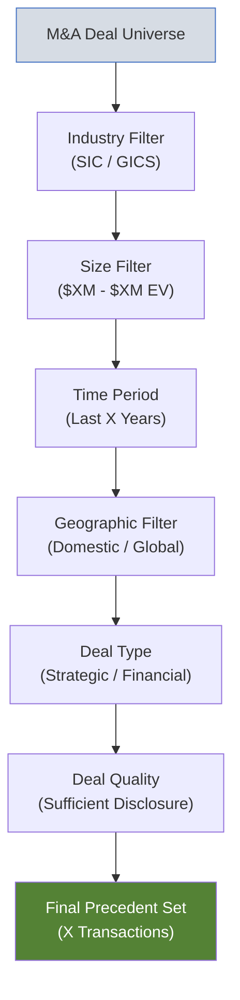
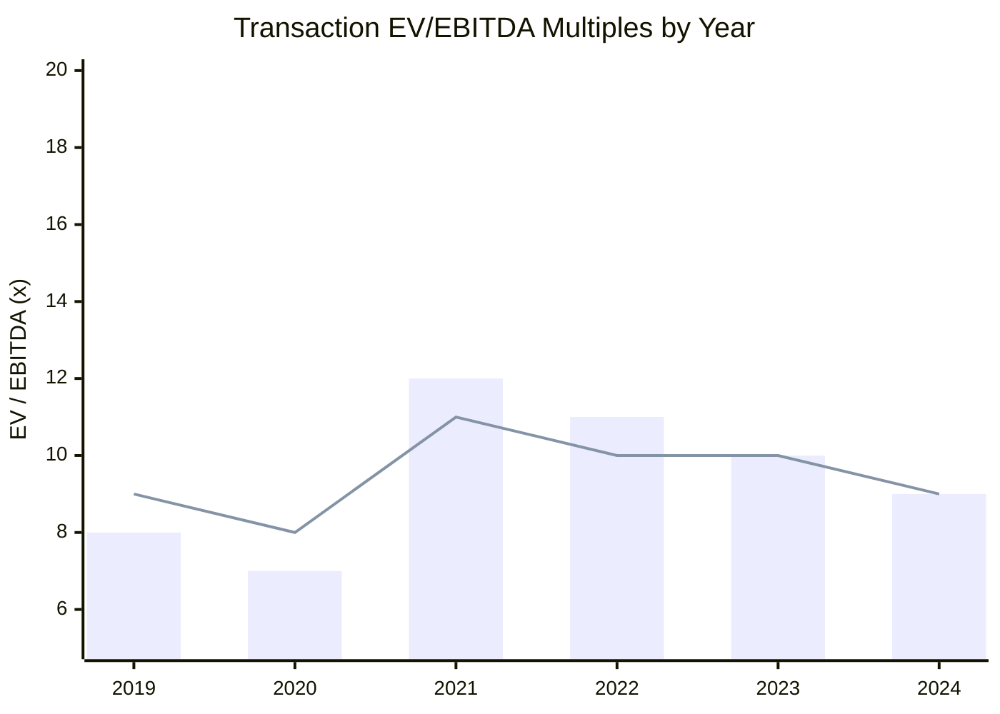

# Precedent Transaction Analysis (Deal Comps)

| Field              | Value           |
| ------------------ | --------------- |
| **Template ID**    | `FIN-VAL-003`   |
| **Category**       | Valuation       |
| **Complexity**     | Intermediate    |
| **Version**        | 1.0             |
| **Last Updated**   | YYYY-MM-DD      |
| **Author**         | [Analyst Name]  |
| **Reviewed By**    | [Reviewer Name] |
| **Classification** | Confidential    |

---

## Document Control

| Version | Date       | Author | Changes       |
| ------- | ---------- | ------ | ------------- |
| 1.0     | YYYY-MM-DD | [Name] | Initial draft |
|         |            |        |               |

---

## Executive Summary

This analysis examines [X] precedent M&A transactions in the [industry/sector] to derive implied valuation multiples for [Target Company]. Based on transaction multiples paid in comparable deals, the implied enterprise value for [Target Company] ranges from $[X]M to $[X]M.

---

## Transaction Selection Methodology

### Selection Criteria

| Criterion         | Requirement                    | Rationale                   |
| ----------------- | ------------------------------ | --------------------------- |
| Industry          | [GICS / SIC code range]        | [Business model similarity] |
| Deal Size (EV)    | $[X]M - $[X]M                  | [Scale relevance]           |
| Date Range        | [Start] - [End]                | [Market cycle relevance]    |
| Geography         | [Region(s)]                    | [Market comparability]      |
| Deal Type         | [Strategic / Financial / Both] | [Buyer type relevance]      |
| Deal Status       | Completed                      | [Announced-only excluded]   |
| Control Premium   | >50% stake acquired            | [Control transaction only]  |
| Data Availability | Sufficient public disclosure   | [Financial data required]   |

---

## Transaction Summary

### Transaction Overview Table

| #   | Date Ann. | Date Closed | Acquirer | Target | EV ($M) | Equity ($M) | % Acquired |
| --- | --------- | ----------- | -------- | ------ | ------- | ----------- | ---------- |
| 1   |           |             |          |        |         |             |            |
| 2   |           |             |          |        |         |             |            |
| 3   |           |             |          |        |         |             |            |
| 4   |           |             |          |        |         |             |            |
| 5   |           |             |          |        |         |             |            |
| 6   |           |             |          |        |         |             |            |
| 7   |           |             |          |        |         |             |            |
| 8   |           |             |          |        |         |             |            |

### Transaction Details

#### Transaction 1: [Acquirer] / [Target]

| Field                     | Detail                 |
| ------------------------- | ---------------------- |
| **Announcement Date**     |                        |
| **Close Date**            |                        |
| **Enterprise Value**      | $M                     |
| **Equity Value**          | $M                     |
| **Consideration**         | [Cash / Stock / Mixed] |
| **Premium to Unaffected** | %                      |
| **Strategic Rationale**   | [1-2 sentences]        |
| **Target LTM Revenue**    | $M                     |
| **Target LTM EBITDA**     | $M                     |

_[Repeat for each transaction]_

---

## Transaction Multiples

### Enterprise Value Multiples

| #   | Acquirer / Target | EV/Rev LTM | EV/Rev NTM | EV/EBITDA LTM | EV/EBITDA NTM | EV/EBIT LTM |
| --- | ----------------- | ---------- | ---------- | ------------- | ------------- | ----------- |
| 1   |                   |            |            |               |               |             |
| 2   |                   |            |            |               |               |             |
| 3   |                   |            |            |               |               |             |
| 4   |                   |            |            |               |               |             |
| 5   |                   |            |            |               |               |             |
| 6   |                   |            |            |               |               |             |
| 7   |                   |            |            |               |               |             |
| 8   |                   |            |            |               |               |             |
|     | **Mean**          |            |            |               |               |             |
|     | **Median**        |            |            |               |               |             |
|     | **25th Pctl**     |            |            |               |               |             |
|     | **75th Pctl**     |            |            |               |               |             |
|     | **Min**           |            |            |               |               |             |
|     | **Max**           |            |            |               |               |             |

### Equity Value Multiples

| #   | Acquirer / Target | P/E LTM | P/E NTM | P/BV |
| --- | ----------------- | ------- | ------- | ---- |
| 1   |                   |         |         |      |
| 2   |                   |         |         |      |
| 3   |                   |         |         |      |
| 4   |                   |         |         |      |
| 5   |                   |         |         |      |
|     | **Mean**          |         |         |      |
|     | **Median**        |         |         |      |

### Premium Analysis

| #   | Acquirer / Target | 1-Day Premium (%) | 1-Week Premium (%) | 1-Month Premium (%) | 52-Week High Premium (%) |
| --- | ----------------- | ----------------- | ------------------ | ------------------- | ------------------------ |
| 1   |                   |                   |                    |                     |                          |
| 2   |                   |                   |                    |                     |                          |
| 3   |                   |                   |                    |                     |                          |
| 4   |                   |                   |                    |                     |                          |
| 5   |                   |                   |                    |                     |                          |
|     | **Mean**          |                   |                    |                     |                          |
|     | **Median**        |                   |                    |                     |                          |

Control premium:

$$\text{Control Premium} = \frac{\text{Offer Price} - \text{Unaffected Price}}{\text{Unaffected Price}} \times 100\%$$

---

## Transaction Multiple Trends

---

## Implied Valuation

### Applying Transaction Multiples to Target

| Multiple               | Target Metric ($M) | 25th Pctl | Median | Mean | 75th Pctl |
| ---------------------- | ------------------ | --------- | ------ | ---- | --------- |
| **EV / Revenue (LTM)** |                    |           |        |      |           |
| Implied EV ($M)        |                    |           |        |      |           |
| **EV / EBITDA (LTM)**  |                    |           |        |      |           |
| Implied EV ($M)        |                    |           |        |      |           |
| **EV / EBIT (LTM)**    |                    |           |        |      |           |
| Implied EV ($M)        |                    |           |        |      |           |

### Equity Bridge

| Component ($M)              | Low (25th Pctl) | Mid (Median) | High (75th Pctl) |
| --------------------------- | --------------- | ------------ | ---------------- |
| Implied EV                  |                 |              |                  |
| (-) Net Debt                |                 |              |                  |
| (-) Minority Interest       |                 |              |                  |
| (-) Preferred Stock         |                 |              |                  |
| **Implied Equity Value**    |                 |              |                  |
| Diluted Shares (M)          |                 |              |                  |
| **Implied Share Price ($)** |                 |              |                  |

---

## Adjustments & Considerations

### Multiple Adjustments

Precedent transaction multiples typically include a control premium. When comparing to trading comps, consider:

$$\text{Trading Multiple} + \text{Control Premium} \approx \text{Transaction Multiple}$$

$$\text{Implied Control Premium} = \frac{\text{Transaction Multiple}}{\text{Trading Multiple}} - 1$$

### Factors Affecting Comparability

| Factor                             | Impact on Multiple              | Relevance to Target |
| ---------------------------------- | ------------------------------- | ------------------- |
| Strategic vs. Financial Buyer      | Strategic typically higher      |                     |
| Market Cycle / Timing              | Cycle peaks = higher multiples  |                     |
| Competitive Auction vs. Negotiated | Auction = higher premium        |                     |
| Synergy Expectations               | Higher synergies = higher price |                     |
| Target Growth Profile              | Higher growth = higher multiple |                     |
| Leverage / Cash Flow               | Stronger CF = higher multiple   |                     |
| Size                               | Larger = slight premium         |                     |

---

## Comparison: Trading Comps vs. Precedent Transactions

| Methodology                     | EV/EBITDA Range | Commentary                            |
| ------------------------------- | --------------- | ------------------------------------- |
| Trading Comps (Median)          | x               | Reflects current market valuation     |
| Precedent Transactions (Median) | x               | Includes control premium              |
| **Implied Control Premium**     | %               | Transaction median vs. trading median |

---

## Notes & Disclaimers

- Transaction data sourced from [CapIQ / Bloomberg / MergerMarket / Public filings]
- All multiples based on LTM financials at time of announcement unless noted
- Premiums calculated relative to unaffected share price (1 day prior to leak/announcement)
- Incomplete data points excluded from statistical summaries
- Market conditions at time of each transaction may differ materially from current conditions
- Analysis is for discussion purposes only

---

_This template follows investment banking precedent transaction analysis standards. Transaction multiples should be adjusted for market timing and strategic context when drawing valuation conclusions._
