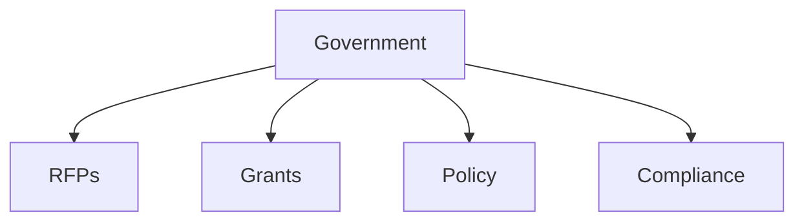

# Government

Government, policy, and regulatory document templates.

## Templates

| Template                                       | Description         |
| ---------------------------------------------- | ------------------- |
| [rfp_response.md](rfp_response.md)             | RFP responses       |
| [grant_application.md](grant_application.md)   | Grant applications  |
| [policy_memo.md](policy_memo.md)               | Policy memos        |
| [foia_response.md](foia_response.md)           | FOIA responses      |
| [regulatory_comment.md](regulatory_comment.md) | Regulatory comments |

## Structure

See [Parent](../SKILL.md) for all categories.
